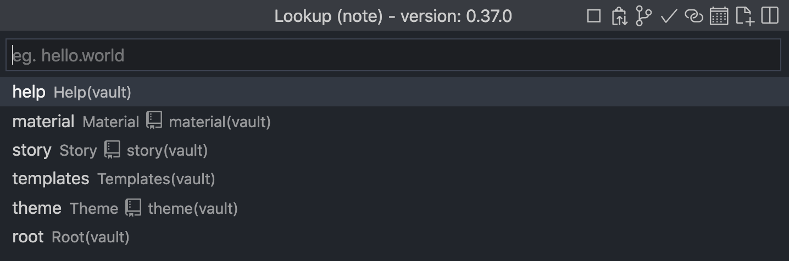
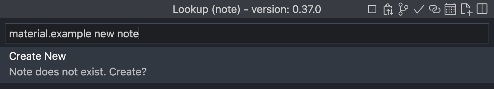
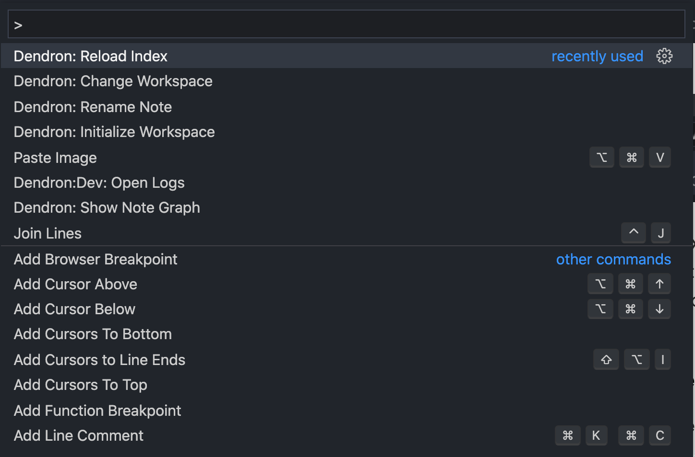

## The Lookup Bar
To work with notes, Dendron uses lookups. Lookups help you create, find, and organize your notes.

To open the Lookup bar:

On Mac, press `⌘ + L`
On Windows, press `Ctrl + L`

#### Creating notes
To create a new note, open the lookup bar and type the name for your new note.

Lets create an example note under the `material` type. To do so, type `material` and then a `dot` to indicate you want to be in the `material` section. Then type out the name of your new note as you wish, then hit `Enter`.

#### Linking notes

To link to another note, simply type `[[` to open a small lookup. Type in any part of the name of the note you want to link, and hit `Enter`. It should look like this afterwards: `[[help.get started]]`

## The Command Palette

To run some application-level commands, you need to open the Command Palette. This is similar to the Lookup bar.

To open the Command Palette:

On Mac, press `⌘ + Shift + P`
On Windows, press `Ctrl + Shift + P`

#### Reloading the index

After you sync the files with the Git, you will need to reload the index. You do this by opening the command palette and typing `Dendron: Reload Index`. This tells Dendron to update the Tree view, and subsequent links, with any new or renamed files.

#### Renaming notes

With the note you want to rename open, open the Command Palette and type `Dendron: Rename Note`. Type the new name and press `Enter`.

#### Extras for experts.

[If you want to go deeper, you can read more in the official Dendron documentation.](https://wiki.dendron.so/notes/e86ac3ab-dbe1-47a1-bcd7-9df0d0490b40.html)