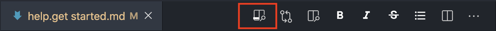
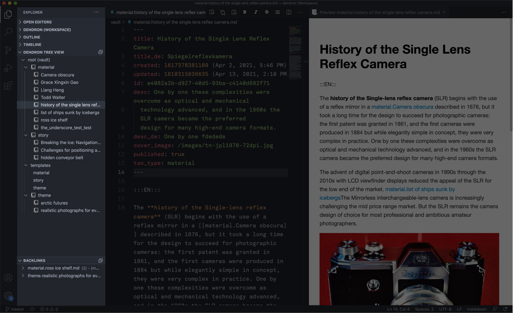

The VSCode interface can be overwhelming at first. We can break it down into two main sections: the editor view and the sidebar.

## Editor view

This is the editor view, where you will be writing content. Here you will see the whole contents of the text file, including content in both languages, and meta information at the top. You can learn more about the structure of files in Dendron in the [[help.style guide]]

#### Writing in Markdown

Content in Dendron is written with a special syntax called **Markdown**. In an application like Microsoft Word, you click buttons to format words and phrases, and the changes are visible immediately. Markdown is different, in that you add _special_ **syntax** to the text to indicate which parts should look and behave differently. You can read more about Markdown here in the [[help.markdown guide]]

#### Previewing Markdown

Understanding Markdown can be made much easier in Dendron by opening the Preview tab. You can do this by clicking the preview button here:

You cannot edit content inside of the preview window.

## Sidebar

The sidebar is made up of several sections. We will focus only on the ones relevant to us. For a fully comprehensive overview of the VSCode interface, check out their [official documentation.](https://code.visualstudio.com/docs/getstarted/userinterface)

#### Tree view

This is the sidebar showing the Dendron tree view under the `↓ DENDRON TREE VIEW` heading. This will show the documents in a heirarchy. For instance, `material.example` will appear under the `material` folder. Click on an item to open it in a new editor tab.

#### File view

Another way to view the content of the Dendron vault is the File view (under the `↓ DENDRON (WORKSPACE)` heading). It shows all of the files as they exist in the directory. Importantly, you can view image assets in this view.

#### Backlinks
You can also see what files link to the currently opened file under the `↓ BACKLINKS` section.

#### Version control

Read more about version control here: [[help.version control]]