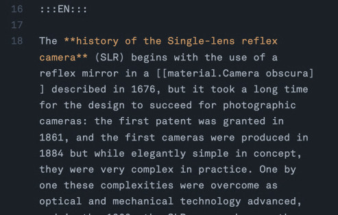

At the beginning of the file, we have a collection of fields that contain meta-information about our file. The most important fields are `title`, `title_de`, `desc`, `desc_de` and `published`.



This is where we will write the content.

```
:::EN:::

English content lives here!

:::DE:::

German content lives here!
```