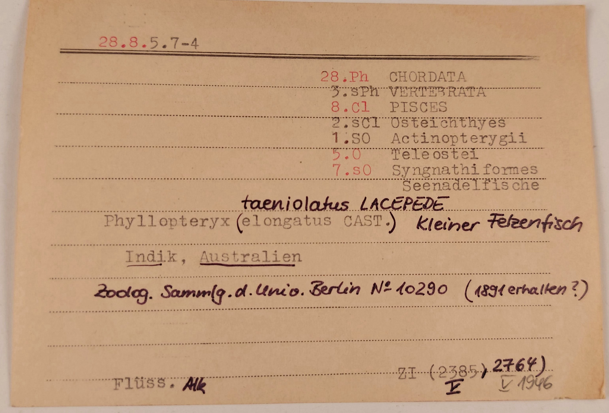

:::EN:::

EN content

:::DE:::

<figure>

<figcaption>

_Verzeichnis eines Nasspräparats des kleinen Fetzenfisches in der Zoologischen Lehrsammlung der Humboldt-Universität Berlin. (Zoologische Lehrsammlung. Alle Rechte vorbehalten.)_

</figcaption>

</figure>

"28.8.5.7-4" – Diese und andere, ähnlich aufgebaute Zahlenkombinationen begegnen einem in der Zoologischen Lehrsammlung der Humboldt-Universität. Es handelt sich um numerische Codes, mit deren Hilfe die Objekte der Sammlung bis heute identifiziert und organisiert werden können. Die Nummern sind Teil eines institutsinternen Ordnungssystems, das von Hans-Georg Herbst reformiert wurde, als er von 1968 bis 1995 die [[Lehrsammlung|story.history-of-the-zoological-teaching-collection]] verwaltete. Er traf vermutlich auch die Entscheidung, sich eines [[Zettelkastens|material.verzettelung]] als Organisationsinstruments zu bedienen anstelle von [[Inventarbüchern|story.inventory-books]], die seine Vorgänger bis dato für diesen Zweck genutzt hatten. Jedes Objekt der Sammlung wird durch einen spezifischen Zahlencode und eine begleitende Karteikarte repräsentiert. Und die Ziffern sind nicht zufällig zusammengestellt: Sie klassifizieren die Präparate und Modelle gemäß der [[zoologischen Taxonomie|theme.taxonomical-orders]], ein artifizielles Ordnungssystem, das Lebewesen in hierarchisch abgestufte Kategorien gruppiert und einordnet, jeweils basierend auf gemeinsamen Merkmalen und Verwandschaftsbeziehungen.

Die Nummer "28.8.5.7-4" für das Präparat eines Kleinen Fetzenfisches (_Phyllopteryx taeniolatus LACEPEDE_), auch Seedrache genannt, setzt sich zusammen aus der Bestimmung der taxonomischen Ränge Stamm, Klasse, Ordnung und Art, die dieses präparierte Tier damit als "Seenadelfisch" identifizieren. Die abgebildete Zettelkarte zeigt eine Legende, die diese Ableitung nachvollzieht. Von der größten Einheit, des Stamms (28), der hier die Gruppe der Chordatiere (Chordata) bestimmt bis zur kleinsten Kategorie, der Art (4), die in diesem Fall einen Kleinen Fetzenfisch beschreibt. Tiere, die dieser Art zugeordnet werden können, sind demzufolge Wirbeltiere (Vertebrata – ein Unterstamm der Chordatiere), gehören der Klasse (8) der Fische (Pisces) mit der Teilklasse (5) der Echten Knochenfische (Teleostei) an und sind seenadelartig (Syngnathiformes) entsprechend der Rangstufe der Ordnung (7).

**Das Prinzip der Zahlencodes in der Lehrsammlung ist komplex und dennoch instabil, vor allem wenn es darum geht, die stetige Entwicklung des taxonomischen Systems nachzuvollziehen. Neue Spezies werden entdeckt, Abgrenzungen bestimmter Rangstufen werden aufgelöst oder neue Zwischenkategorien setzen sich durch.** Hinzu kommt, dass in der Lehrsammlung einige Objekte eine zusätzliche Ziffer erhalten und zusammen gruppiert bzw. aufgestellt werden, aufgrund ihrer Objektart. Grund dafür ist die zweckmäßig geprägte Aufbewahrung für den Lehrbetrieb. Es ist dann Aufgabe der [[Sammlungsmitarbeiter\*innen|story.interview-ines-drescher]] die Nummerierungen anzupassen, Etiketten umzukleben und die Karteikarten sowie Objekte neu zu ordnen.

## Transkript

>28.8.5.7-4
>
>28.Ph CHORDATA / 3.sPh VERTEBRATA / 8.C1 PISCES / 2.sC1 Osteichthyes / 1.S0 Actinopterygii / 5.0 Teleostei / 7.s0 Syngnathiformes / Seenadelfische
>
>Phyllopteryx (elongatus CAST.) [handschriftlich über den Klammern:] taeniolatus LACEPEDE / kleiner Fetzenfisch
>
>Indik, Australien
>
>\[handschriftlich:] Zoolog. Sammlg. d. Univ. Berlin No 10290 (1891 erhalten?)
>
>Flüss. \[handschriftlich:] Alk
>
>ZI (2385, \[handschriftlich:] 2764) / V / V 1946
