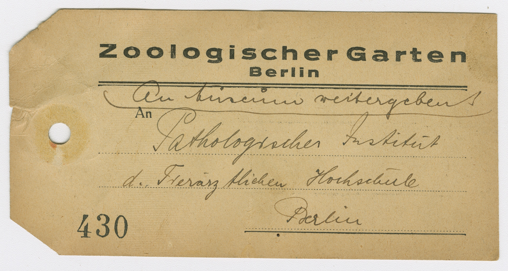

:::EN:::

<figure>

<figcaption>

_A mobile thing of knowledge: In the 1920s and 1930s, labels like this were attached to the bodies of animals that were sent on by the zoo after their deaths. They note where the animal carcass was to be sent. (MfN, HBSB, S004-02-05 Nr. 96, Bl. 020 recto. All rights reserved.)_

</figcaption>

</figure>

A discovery: a pile of old tags from Berlin Zoological Garden, most of them from the 1920s and 1930s, that had been filed in a folder in the archive of the Berlin Museum of Natural History containing letters that had been sent between the Zoological Museum and the Zoological Garden back then. These labels, which were attached to the animals as "accompanying documents" when they left the zoo after their deaths, are material traces of the relationship between the zoo and the museum at the time. What can they tell us? 

<figure>

<figcaption>

_Historical labels from the Zoological Garden in an archive folder in the Museum of Natural History: material traces of the history of the relationship between the zoo and the museum in Berlin. (MfN, HBSB, S004-02-05 Nr. 96, photo Sarina Schirmer. All rights reserved.)_

</figcaption>

</figure>

They indicate that it was not just the odd animal being sent from the museum to the zoo every now and then. However, if we take a closer look, we see more addressees noted on the documents, to be precise, the institutions that formed the stations on the animal's journey to the museum. Together with the destination, the labels thus also mark the paths the animal bodies took through Berlin.

<figure>

<figcaption>

_Animal logistics on paper. The instructions on the labels reveal the paths that zoo animals took through a network of local institutions. (MfN, HBSB, S004-02-05 Nr. 96, Bl. 057 verso; MfN, HBSB, S004-02-05 Nr. 96, Bl. 140 recto. All rights reserved.)_

</figcaption>

</figure>

These notes, which were once mobile, also helped these different actors to make internal logistical arrangements. They often provide instructions for further use – "With a request for examination and transfer to the Zoolog. Museum on Invalidenstraße," says one, for example **The first journey that an animal took after its death usually led from the zoo to the Pathological Institute at the Veterinary University (Tierärztliche Hochschule) of Berlin, where it was dissected in order to ascertain its cause of death.[^1] After that, the Pathological Institute sent what remained of the carcass back to the zoo or forwarded it on at the zoo's behest – to private taxidermists and preparators, or to scientific institutions such as the Anatomical Institute, the Zoological Institute of the Agricultural University, or the Zoological Museum at the university in Berlin.**[^2] This kind of information can be put together like the pieces of a puzzle to map out a local network of relationships. Even though gaps remain, the tags help to identify the important actors who were involved in the further utilisation or disposal of zoo animals in Berlin in the early twentieth century.

The back of a label could be used to convey information about the animal's species, origin, and cause of death so that the museum could [[create a record of the animal|story.keeping records of animals]]. Abyssinia, Ceylon, and South America frequently appear. The notes therefore do not just make a local network visible, but also point back to the global trade in animals and animal catching, and names like Abyssinia and Ceylon make it clear that this was a colonial network.

Almost just as crucial as the information that appears on the labels is that which is not recorded. Detailed information like the kind noted on this label was the exception:

<figure>

<figcaption>

_Knowledge thing: Label with detailed information about an animal delivery. (MfN, HBSB, S004-02-05 Nr. 96, Bl. 142 recto. All rights reserved.)_

</figcaption>

</figure>

Entries were frequently left empty, or the information provided was very general.

<figure>

<figcaption>

_A knowledge thing with gaps: Label with missing entries and general information about the animal delivery. (MfN, HBSB, S004-02-05 Nr. 96, Bl. 024 recto; MfN, HBSB, S004-02-05 Nr. 96, Bl. 105 recto. All rights reserved.)_

</figcaption>

</figure>

These labels thus allow us to read not just the information that was sent to the museum but also the gaps in knowledge.[3] These gaps point not least to the differences between zoos and museums – the data collected by zoos was not necessarily as extensive or as precise as the data gathered by natural history collections (see also [[Keeping Records of Animals|story.keeping records of animals]]). However, labels often provided additional instructions (for use).
 
<figure>

<figcaption>

Labels as directions for use: these instructions show which body parts of an animal became collection items after its death. (MfN, HBSB, S004-02-05 Nr. 96, Bl. 125 recto. All rights reserved.)_

</figcaption>

</figure>

Instructions like "Please transfer hide and skull to museum" provide clues about how objects were handled and what they were used for, i.e., about practices of use as they also appear in the [logbooks of the Zoological Museum|material.tagebuecher-des-zoologischen-museums]], for instance. Here, too, there were delays, accidents, and misunderstandings. [[story.Die Ungezählten]] It is precisely incidents like these that tell us about the challenges that sometimes arose when an animal was being transferred from the zoo to the museum or being transformed from a live zoo animal into a museum specimen; about where knowledge was successfully transferred but also where information flows got bogged down.
 
[^1]: After the founding of the Free University of Berlin in 1960, the Veterinary Medicine Faculty of the university and the Leibniz Institute for Zoo and Wildlife Research (IZW) took over the task of performing necropsies.

[^2]: Cf. MfN, HBSB, S004-02-05, no. 97.

[^3]: Of course, it could be that this information was delivered in the accompanying item lists or in correspondence (see for example MfN, HBSB, S004-02-05, no. 97); however, the fact that detailed information is entered on some labels seems to suggest that it was not provided in other cases.

:::DE:::

<figure>

<figcaption>

_Mobiles Wissensding: Solche Etiketten wurden in den 1920er oder 30er-Jahren Zootieren beigefügt, die der Zoo nach ihrem Tod weiterversandte. Es ist vermerkt, wohin der Tierkadaver geschickt werden sollte. (MfN, HBSB, S004-02-05-96, Bl. 020 verso. Alle Rechte vorbehalten.)_

</figcaption>

</figure>

Fund: Ein Stapel alter Anhänger aus dem Zoologischen Garten Berlin, die meisten aus den 1920er und 30er-Jahren, eingeheftet in einen Ordner im Archiv des Naturkundemuseums, in dem Briefe zwischen dem Zoologischen Museum und dem Zoologischen Garten aus dieser Zeit abgeheftet sind. Die Etiketten, die den Tieren als "Begleitzettel" mitgegeben wurden, wenn sie den Zoo nach ihrem Tod verließen, sind materielle Spuren der damaligen Beziehungen zwischen Zoo und Museum. Was können sie erzählen? 

<figure>

<figcaption>

_Historische Etiketten des Zoologischen Gartens in einem Archivordner des Naturkundemuseums: materielle Spuren der Beziehungsgeschichte zwischen Zoo und Museum in Berlin. (HBSB MfN, HBSB, S004-02-05 Nr. 96, Foto Sarina Schirmer. Alle Rechte vorbehalten.)_

</figcaption>

</figure>

Sie deuten darauf hin, dass damals nicht nur vereinzelt Tiere vom Zoo ins Museum kamen. Bei genauerem Hinsehen fällt aber auf: Auf den Zetteln sind noch weitere Adressaten vermerkt, genauer gesagt Institutionen, die Stationen auf dem Weg der Tiere ins Museum bilden. Die Etiketten markieren also neben dem Ziel ebenso die Wege der Tierkadaver quer durch Berlin.

<figure>

<figcaption>

_Tierlogistik auf Papier. Die Instruktionen auf den Etiketten machen die Wege toter Zootiere innerhalb eines lokalen Netzwerks von Institutionen sichtbar. ((MfN, HBSB, S004-02-05 Nr. 96, Bl. 057 verso; MfN, HBSB, S004-02-05 Nr. 96, Bl. 140 recto.  Alle Rechte vorbehalten.)_

</figcaption>

</figure>

Die einstmals mobilen Zettel dienten außerdem zu internen logistischen Absprachen zwischen diesen verschiedenen Akteuren. Häufig sind Instruktionen zur weiteren Verwendung vermerkt – "Mit der Bitte um Untersuchung und Überweisung an das Zoolog. Museum in der Invalidenstraße", heißt es etwa. **Der erste Weg eines Tieres nach seinem Tod führte meistens vom Zoo zum Pathologischen Institut der Tierärztlichen Hochschule, wo es seziert wurde, um die Todesursache festzustellen.[^1] Anschließend sandte das Pathologische Institut das, was vom Kadaver nach der Sektion übrig war, zurück an den Zoo oder in dessen Auftrag weiter – an private Präparatoren oder wissenschaftliche Institutionen wie das Anatomische Institut, das Zoologische Institut der Landwirtschaftlichen Hochschule Berlin oder eben das Zoologische Museum der Berliner Universität.**[^2] Wie bei einem Puzzle lassen sich die Informationen zu einem Bild zusammenfügen, das ein lokales Beziehungsnetz abbildet. Auch wenn es lückenhaft bleibt, werden hier wichtige Akteure sichtbar, die im frühen 20. Jahrhundert in die Weiterverwertung oder Entsorgung von Zootieren in Berlin eingebunden waren.

Auf der Rückseite der Etiketten konnten Informationen über Gattung, Herkunft und Todesursache der Tiere eingetragen und übermittelt werden, damit das Museum seine [[Tiere verzeichnen|story.keeping records of animals]] konnte. Abessinien, Ceylon, Südamerika sind häufig zu lesen. Die Zettel machen damit nicht nur ein lokales Netzwerk sichtbar; sie verweisen zugleich zurück auf den globalen Tierhandel und Tierfang, und Bezeichnungen wie Abessinien und Ceylon machen klar, dass es sich um ein koloniales Netzwerk handelte.

Mindestens genauso entscheidend wie die Informationen, die auf den Etiketten vermerkt sind, ist aber auch, was nicht verzeichnet ist. So detaillierte Angaben wie auf diesem Etikett hier waren eher die Ausnahme.

<figure>

<figcaption>

_Wissensding: Etikett mit detaillierten Informationen zum verschickten Tier. (MfN, HBSB, S004-02-05 Nr. 96, Bl. 142 recto. Alle Rechte vorbehalten.)_

</figcaption>

</figure>

Häufig blieben Zeilen leer oder die Informationen sehr allgemein.

<figure>

<figcaption>

_Lückenhaftes Wissensding: Etikett mit Leerstellen und allgemeinen Angaben zum verschickten Tier. (MfN, HBSB, S004-02-05 Nr. 96, Bl. 024 recto; MfN, HBSB, S004-02-05 Nr. 96, Bl. 105 recto. Alle Rechte vorbehalten.)_

</figcaption>

</figure>

An den Zetteln lässt sich so nicht nur das Wissen ablesen, das an das Museum übermittelt wurde, sondern auch die Wissenslücken.[3] Diese verweisen nicht zuletzt auf die Unterschiede zwischen Zoos und Museen – in Zoos wurden nicht zwangsläufig so viele und nicht so genaue Daten über ein Tier gesammelt wie in naturkundlichen Sammlungen (siehe auch [[Tiere verzeichnen|story.record-keeping-of-animals]]). Dafür waren auf den Etiketten häufig zusätzliche (Gebrauchs)Anweisungen vermerkt.
 
<figure>

<figcaption>

_Etikett als Gebrauchsanweisung: Die Instruktionen zeigen, welche Körperteile eines Zootieres nach dessen Tod zu Sammlungsobjekten wurden. (MfN, HBSB, S004-02-05 Nr. 96, Bl. 125 recto. Alle Rechte vorbehalten.)_

</figcaption>

</figure>

Instruktionen wie "Bitte Decke und Schädel dem Museum überweisen" geben Hinweise darauf, wie mit den Objekten verfahren wurde und wofür sie verwendet wurden, also auf die Gebrauchspraktiken wie sie etwa auch in den [[Tagebüchern des Zoologischen Museums|material.logbooks-of-the-zoological-museum]] vorkommen. Auch hier gab es Verzögerungen, Unfälle und Missverständnisse. [[story.Die Ungezählten]] Gerade sie verraten uns etwas über die Herausforderungen, die damals beim Transfer vom Zoo ins Museum und bei der Transformation von einem lebenden Zootier in ein präpartiertes Museumsobjekt auftreten konnten; an welchen Stellen Wissenstransfers funktionierten oder aber Informationsflüsse stockten.

[^1]: Seit Gründung der Freien Universität Berlin 1960 übernahm die Veterinärmedizinische Fakultät der Universität die Sektion oder das Leibniz-Institut für Zoo- und Wildtierforschung (IZW).

[^2]: Vgl. MfN, HBSB, S004-02-05, Nr. 97.

[^3]: Es kann natürlich sein, dass diese Informationen in mitgelieferten Objektlisten oder in Korrespondenzen geliefert wurden (vgl. etwa MfN, HBSB, S004-02-05, Nr. 97); dennoch scheint die Tatsache, dass auf manchen Etiketten detaillierte Informationen eingetragen sind, darauf hinzudeuten, dass sie in den anderen Fällen nicht vorlagen.
