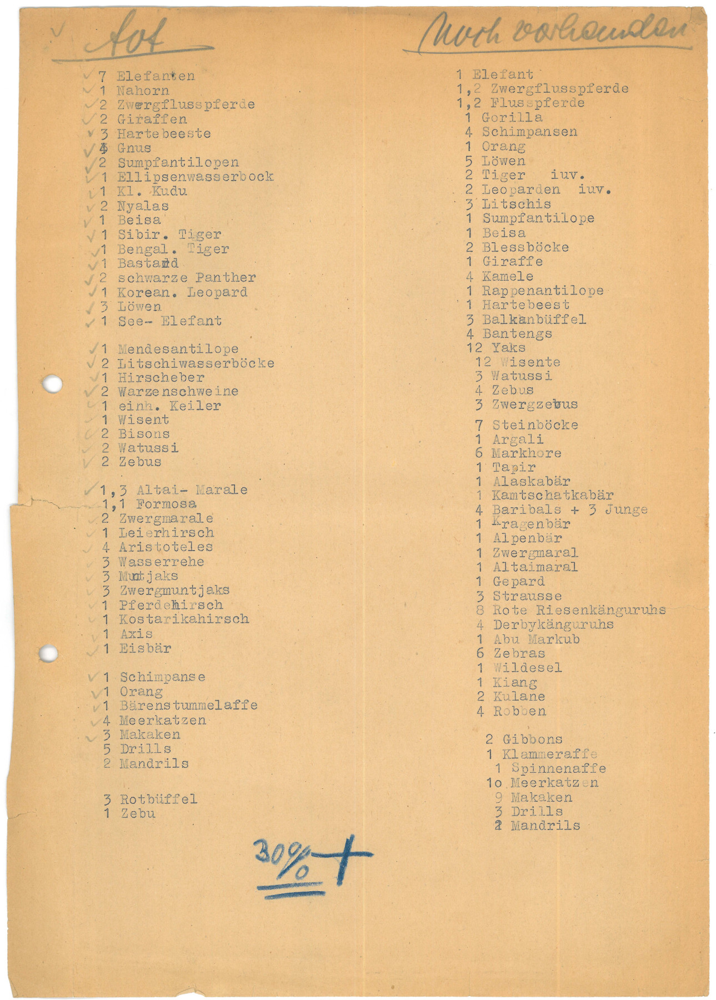

:::EN:::

EN content goes here

:::DE:::

<figure>

<figcaption>

_ Liste der im November 1943 im Berliner Zoo getöteten Tiere. (AZGB. Alle Rechte vorbehalten.)_

</figcaption>

</figure>

Text suggestions from Therese:
- repeat info about bomb attacks from Clemens' [[story.the-zoo-and-national-socialism]]
-Dead animals - rarely learn about animals _leaving_ the zoo. Raises questions about waste management, not just during war. Link zu Mareikes story abt waste management
- Surviving animals - zoo still operating during war, maintenance still a big undertaking
- in general: document is example for recording and managing stock. questions of logistical natures. Link to recording worlds.
- Link to the material on animals stolen by Wehrmacht, brought to Berlin
- Link to material where Clemens explains 1,3 notation style for zoo animals
- Link to Mareike's [[story.futternot]]: that 1 surviving elephant is "Siam"
- (use this in the route on war)

## Transkript

>[Linke Spalte] **tot**
>
>7 Elefanten / 1 Nahorn (sic) / 2 Zwergflusspferde / 2 Giraffen / 3 Hartebeeste / 4 Gnus / 2 Sumpfantilopen / 1 Ellipsenwasserbock / 1 Kl. Kudu / 2 Nyalas / 1 Beisa / 1 Sibir. Tiger / 1 Bengal. Tiger / 1 Bastard / 2 schwarze Panther / 1 Korean. Leopard / 3 Löwen / 1 See-Elefant
>
>1 Mendesantilope / 2 Litschiwasserböcke / 1 Hirscheber / 2 Warzenschweine / 1 einh. Keiler / 1 Wisent / 2 Bisons / 2 Watussi / 2 Zebus 
>
>1,3 Altai-Marale / 1,1 Formosa / 2 Zwergmarale / 1 Leierhirsch / 4 Aristoteles / 3 Wasserrehe / 3 Muntjaks / 3 Zwergmuntjaks / 1 Pferdehirsch / 1 Kostarikahirsch / 1 Axis / 1 Eisbär
>
>1 Schimpanse / 1 Orang / 1 Bärenstummelaffe / 4 Meerkatzen / 3 Makaken / 5 Drills / 2 Mandrils
>
>3 Rotbüffel / 1 Zebu
>
>**30%+**
>
>[Rechte Spalte] **noch vorhanden**
>
>1 Elefant / 1,2 Zwergflusspferde / 1,2 Flusspferde / 1 Gorilla / 4 Schimpansen / 1 Orang / 5 Löwen / 2 Tiger iuv. / 2 Leoparden iuv. / 3 Litschis / 1 Sumpfantilope / 1 Beisa / 2 Blessböcke / 1 Giraffe / 4 Kamele / 1 Rappenantilope / 1 Hartebeest / 3 Balkanbüffel / 4 Bantengs / 12 Yaks / 12 Wisente / 3 Watussi / 4 Zebus / 3 Zwergzebus / 7 Steinböcke / 1 Argali / 6 Markhore / 1 Tapir / 1 Alaskabär / 1 Kamtschatkabär / 4 Baribals + 3 Junge / 1 Kragenbär / 1 Alpenbär / 1 Zwergmaral / 1 Altaimaral / 1 Gepard / 3 Strausse / 8 Rote Riesenkänguruhs / 4 Derbykänguruhs / 1 Abu Markub / 6 Zebras / 1 Wildesel / 1 Kiang / 2 Kulane / 4 Robben 
>
>2 Gibbons / 1 Klammeraffe / 1 Spinnenaffe / 10 Meerkatzen / 9 Makaken / 3 Drills / 2 Mandrils
>
