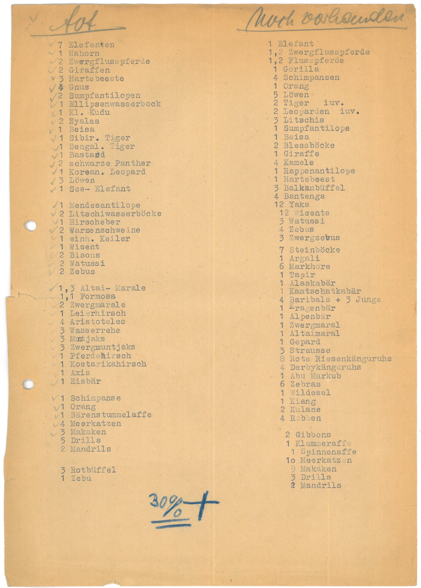

:::EN:::

EN content goes here

:::DE:::

<figure>

<figcaption>

_Liste der im November 1943 im Berliner Zoo getöteten Tiere. (AZGB. Alle Rechte vorbehalten.)_

</figcaption>

</figure>

Sowohl in den Verzeichnungssystemen der Sammlung des [[Zoologischen Museums|material.logbooks-of-the-zoological-museum]], das Teil des Museums für Naturkunde war, als auch in den Inventarbüchern der [[Zoologischen Lehrsammlung|story.history-of-the-zoological-teaching-collection]] der Humboldt-Universität lässt sich der Verlust vieler Tier-Objekte durch die Bombardierung Berlins in der Nacht zum 23. November 1943 ablesen. Doch was war mit dem Zoo? Eine Liste des Zoologischen Gartens hielt den Verlust lebender Tiere fest: 30% des noch vorhandenen Tierbestands wurden durch Bomben, Einstürze und Brände getötet oder wurden nachdem sie ihren Gehegen entwichen waren durch Mitarbeitende getötet, siehe auch [[story.the-zoo-and-national-socialism]]. Das Dokument ist ein Beispiel für die Praktiken der [[Erfassung und Verwaltung|theme.recording-worlds]] von Beständen, Eingängen und Ausgängen bzw. Verlusten.

Der eine noch überlebende Elefant, den die Liste verzeichnete, war [["Siam"|story.the-afterlife-of-zoo-animals]]. Die Komma-Zahlen, wie z.B. "1,3" für die Edelhirsche Altai-Marale, notieren genau wie in der [[material.steinmetz-index]] das Geschlecht: ein männlicher Altai-Maral und drei weibliche starben.

## Transkript

>[Linke Spalte] **tot**
>
>7 Elefanten / 1 Nahorn (sic) / 2 Zwergflusspferde / 2 Giraffen / 3 Hartebeeste / 4 Gnus / 2 Sumpfantilopen / 1 Ellipsenwasserbock / 1 Kl. Kudu / 2 Nyalas / 1 Beisa / 1 Sibir. Tiger / 1 Bengal. Tiger / 1 Bastard / 2 schwarze Panther / 1 Korean. Leopard / 3 Löwen / 1 See-Elefant
>
>1 Mendesantilope / 2 Litschiwasserböcke / 1 Hirscheber / 2 Warzenschweine / 1 einh. Keiler / 1 Wisent / 2 Bisons / 2 Watussi / 2 Zebus
>
>1,3 Altai-Marale / 1,1 Formosa / 2 Zwergmarale / 1 Leierhirsch / 4 Aristoteles / 3 Wasserrehe / 3 Muntjaks / 3 Zwergmuntjaks / 1 Pferdehirsch / 1 Kostarikahirsch / 1 Axis / 1 Eisbär
>
>1 Schimpanse / 1 Orang / 1 Bärenstummelaffe / 4 Meerkatzen / 3 Makaken / 5 Drills / 2 Mandrils
>
>3 Rotbüffel / 1 Zebu
>
>**30%+**
>
>[Rechte Spalte] **noch vorhanden**
>
>1 Elefant / 1,2 Zwergflusspferde / 1,2 Flusspferde / 1 Gorilla / 4 Schimpansen / 1 Orang / 5 Löwen / 2 Tiger iuv. / 2 Leoparden iuv. / 3 Litschis / 1 Sumpfantilope / 1 Beisa / 2 Blessböcke / 1 Giraffe / 4 Kamele / 1 Rappenantilope / 1 Hartebeest / 3 Balkanbüffel / 4 Bantengs / 12 Yaks / 12 Wisente / 3 Watussi / 4 Zebus / 3 Zwergzebus / 7 Steinböcke / 1 Argali / 6 Markhore / 1 Tapir / 1 Alaskabär / 1 Kamtschatkabär / 4 Baribals + 3 Junge / 1 Kragenbär / 1 Alpenbär / 1 Zwergmaral / 1 Altaimaral / 1 Gepard / 3 Strausse / 8 Rote Riesenkänguruhs / 4 Derbykänguruhs / 1 Abu Markub / 6 Zebras / 1 Wildesel / 1 Kiang / 2 Kulane / 4 Robben
>
>2 Gibbons / 1 Klammeraffe / 1 Spinnenaffe / 10 Meerkatzen / 9 Makaken / 3 Drills / 2 Mandrils
