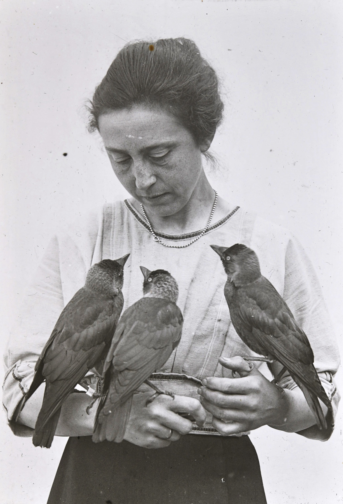

:::EN:::

:::DE:::

*Magdalena Heinroth mit drei Dohlen, die sie in ihrer Wohnung groß zog, 1919. (AZGB, Foto O. Heinroth)*

**Magdalena Heinroth** (1883-1932) interessierte sich bereits in ihrer Kindheit und Jugend für Tiere und deren Präparation. Da ihre Eltern ihr eine höhere Schulbildung und ein Studium versagten, bildete sie sich selbst weiter. Sie **lernte unter anderem am Berliner Naturkundemuseums** [[story.Short History MfN]] Präparation. Dort lernte sie ihren späteren Ehemann [[material.oskar-heinroth]] kennen. Zusammen mit ihm forschte sie bis zu ihrem frühen Tod an Vögeln, deren Mauser und Zucht. Das Ehepaar zog Hunderte einheimischer Vögel in der gemeinsamen Wohnung im Berliner Aquarium auf. Die Autodidaktin publizierte vielfach zu diesen Themen unter anderem in der weltweit ältesten Vogelzeitschrift „Die gefiederte Welt“. Im Bewusstsein der Öffentlichkeit ist sie dennoch vor allem als wichtigste Mitarbeiterin ihres Mannes bekannt. 
