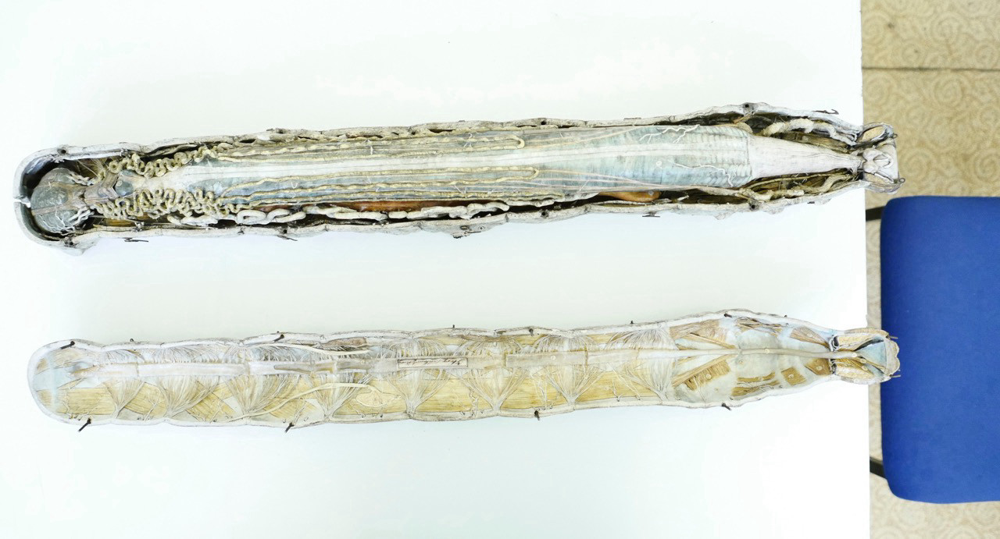
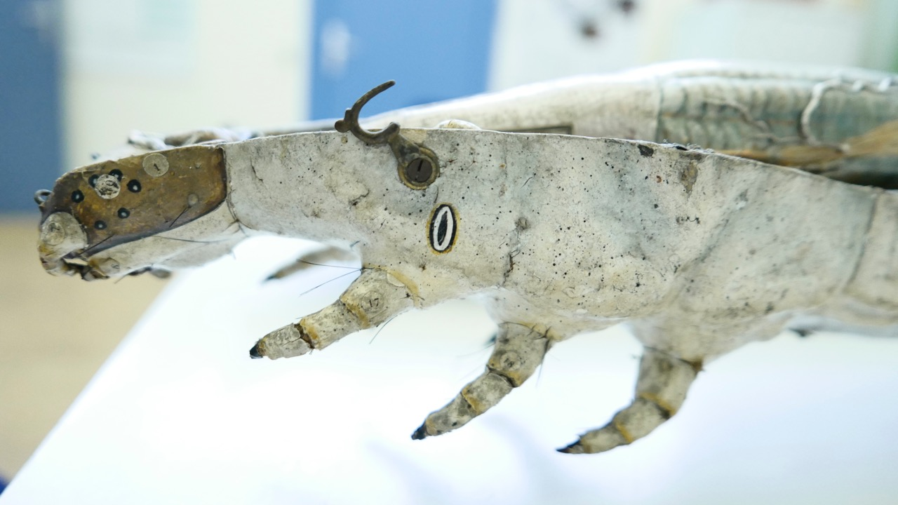
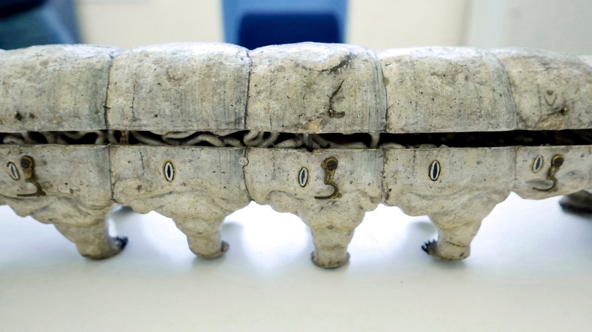

:::EN:::

<figure>

<figcaption>

_Papier-mâché_ Bombyx mori _by Louis Auzoux in the Zoological Teaching Collection of the Humboldt University of Berlin. (Zoological Teaching Collection, photo Kerstin Stoll 2020. All rights reserved.)_

</figcaption>

</figure>

In the 19th and 20th centuries, a wide range of materials were used to make both scientific and mainstream animal models. The selection of materials influenced not just their malleability but also their potential colouring, weight, and durability, as well as how many copies could be produced and how they would be circulated. These factors therefore had an impact on practical questions of utilisation, on aesthetic issues, and on the knowledge that a model should or could convey.

While the studio of Adolf Ziegler (1820-1889) and his son Friedrich (1860-1936) produced models of animal and human anatomy in wax[^1] in order to emphasise their translucent fleshiness, the anatomist Louis Auzoux (1792-1880) chose papier-mâché to make his animal and plant models.[^2] This technique had already been utilised in China to make helmets and in Europe at the beginning of the 19th century to construct anatomical models, but Auzoux developed a new formula, which he carefully guarded. The lightness of the dried mass made from paper, various other ingredients, and adhesive agents allowed, for example, for a small, approximately five-centimetre-long silkworm to be enlarged to a length of 75 centimetres and for its body parts to be presented naturalistically.[^3]

<figure>

<figcaption>

_Even with the lid closed, the insides of the silkworm can be seen in the papier-mâché model. (Zoological Teaching Collection, photo Kerstin Stoll 2020. All rights reserved.)_

</figcaption>

</figure>

The functional, collapsible anatomical model (which Auzoux also referred to as an "anatomie clastique") of the _Bombyx mori_, the silkworm, shows its skin and extremities, its inner organs, and its silk glands considerably enlarged and in great detail. This carefully painted artefact, which was probably produced in the 1860s and is still housed in the [[Zoological Teaching Collection|story.history-of-the-zoological-teaching-collection]] of the Humboldt University in Berlin[^4], can be opened or closed using metal hooks and, alongside some numbering, also displays text that has been written directly onto the individual body parts (see also [[Keeping Records of Animals|story.keeping-records-of-animals]]). This writing does not just make reference to the body parts like a legend; rather, it is inscribed onto the model in ink and letters and simultaneously describes it in scientific jargon. The silkworm appears here as a 'working animal' that turns out a product – silk thread. At the same time, the model represents one stage of a complete metamorphosis, whose imago (the sexually mature insect after its final transformation) Auzoux has immortalised in papier-mâché. He also had models of female and male silk moths on offer for teaching purposes.

[^1]: Cf. Hopwood, Nick. _Embryos in Wax: Models from the Ziegler Studio_. Cambridge: Whipple Museum of the History of Science, 2002.

[^2]: On Auzoux' models, see Grob, Bart. _The World of Auzoux: Models of Man and Beast in Papier-Mâché_. Leiden: Museum Boerhaave, 2000; Cocks, Margret Maria. "Dr Louis Auzoux and His Collection of Papier-Mâché Flowers, Fruits and Seeds". _Journal of the History of Collections_ 26, no. 2 (2014): 229-248; Olszewski, Margret Maria. "Dr. Auzoux' Botanical Teaching Models and Medical Education at the Universities of Glasgow and Aberdeen". _Studies in History and Philosophy of Science. Part C_ 42, no. 3 (2011): 285-296.

[^3]: Cf. "Modell, Raupe, Seidenspinner". Humboldt University database entry, no date, https://www.sammlungen.hu-berlin.de/objekte/zoologische-lehrsammlung/8322/ (24.08.2021).

[^4]: Vgl. Dr. L. Wittmack: _Allgemeiner Katalog des königlichen landwirthschaftlichen Museums zu Berlin_, Berlin: Verlagsbuchhandlung Wiegandt und Hempel, 1869, pp. 108f. (no. 43). The model was purchased from Auzoux for 66 talers, and it is highly likely that it then moved to Invalidenstraße 42 when the United Agricultural Teaching Institute and Museum (Vereinigtes landwirthschaftliches Lehr-Institut und Museum) was built in 1880. 

:::DE:::

<figure>

<figcaption>

_Clastique-Modell_ Bombyx mori _von Louis Auzoux in der Zoologischen Lehrsammlung der Humboldt-Universität zu Berlin. (Zoologische Lehrsammlung, Foto Kerstin Stoll 2020. Alle Rechte vorbehalten.)_

</figcaption>

</figure>

Für wissenschaftliche wie populäre Tiermodelle verwendete man während des 19. und 20. Jahrhunderts vielfältige Materialien. Die Wahl der Materialien bestimmte nicht nur ihre Formbarkeit, mögliche Farbgebung, Gewicht und Haltbarkeit, sondern auch, wie viele Exemplare hergestellt werden und wie sie zirkulieren konnten. Sie hatte somit Auswirkungen auf praktische Fragen der Nutzung, auf ästhetische Fragen und auf das Wissen, das ein Modell vermitteln sollte bzw. konnte.

Während das Atelier von Adolf Ziegler (1820-1889) und seinem Sohn Friedrich (1860-1936) in Freiburg Modelle von tierischen und menschlichen Anatomien in Wachs herstellte[^1], um die durchscheinende Fleischlichkeit zu betonen, wählte der französische Modelleur und Anatom Louis Auzoux (1792-1880) für seine Tier- und Pflanzenmodelle das Material Papiermaché.[^2] Die Technik wurde bereits im alten China für Helme benutzt und Anfang des 19. Jahrhunderts in Europa für anatomische Modelle eingeführt, doch Auzoux entwickelte eine neue Rezeptur, die er sorgfältig hütete. Die Leichtigkeit der getrockneten Masse aus Papier und verschiedenen weiteren Ingredienzien sowie Klebemitteln erlaubte es etwa, eine ca. fünf Zentimeter kleine Seidenraupe auf eine Modelllänge von 75 Zentimetern zu vergrößern und ihre Körperteile naturalistisch darzustellen.[^3]

<figure>

<figcaption>

_Auch mit geschlossenem Deckel sind die Innereien des Maulbeerspinners seitlich am Clastique-Modell zu erkennen. (Zoologische Lehrsammlung, Foto Kerstin Stoll 2020. Alle Rechte vorbehalten.)_

</figcaption>

</figure>

Das aufklappbare anatomische Funktionsmodell (auch Clastique-Modell genannt) von _Bombyx mori_, dem Maulbeerspinner, zeigt in starker Vergrößerung und großer Detailgenauigkeit die Haut und Extremitäten, die inneren Organe und die Spinndrüsen des Tiers. [Das sorgfältig bemalte Artefakt, das vermutlich in den 1860er-Jahren hergestellt wurde und sich heute in der [[Zoologischen Lehrsammlung|story.history-of-the-zoological-teaching-collection]] der Humboldt-Universität zu Berlin befindet[^4], lässt sich an Metallhäkchen aufklappen und weist neben Nummerierungen auch direkte Beschriftungen auf den einzelnen Körperteilen auf (siehe auch [[Tiere verzeichnen|story.keeping-records-of-animals]]). Diese Beschriftungen verweisen damit nicht nur auf die Körperteile wie in einer Legende, sondern das Papiermaché selbst ist beschrieben, und zwar im doppelten Sinne: einerseits mit Tinte und Buchstaben, andererseits mit wissenschaftlichen Fachausdrücken. Der Seidenspinner erscheint hier als Nutztier, das ein Produkt – den Seidenfaden – herstellt. Zugleich bildet er ein Stadium einer kompletten Metamorphose ab, deren Imago (das geschlechtsreife Insekt nach der letzten Verwandlung) Auzoux wiederum in Papiermaché festgehalten hat: Die weibliche und die männliche Seidenmotte bot er ebenfalls als Modell für den Lehrbetrieb an.

[^1]: Vgl. Hopwood, Nick. _Embryos in Wax: Models from the Ziegler Studio_. Cambridge: Whipple Museum of the History of Science, 2002.

[^2]: Zu Auzoux' Modellen vgl. Grob, Bart. _The World of Auzoux: Models of Man and Beast in Papier-Mâché_. Leiden: Museum Boerhaave, 2000; Cocks, Margret Maria. "Dr Louis Auzoux and His Collection of Papier-Mâché Flowers, Fruits and Seeds". _Journal of the History of Collections_ 26, Nr. 2 (2014): 229-248; Olszewski, Margret Maria. "Dr. Auzoux' Botanical Teaching Models and Medical Education at the Universities of Glasgow and Aberdeen". _Studies in History and Philosophy of Science. Part C_ 42, Nr. 3 (2011): 285-296.

[^3]: Vgl. "Modell, Raupe, Seidenspinner". Datenbankeintrag der HU, ohne Datum, https://www.sammlungen.hu-berlin.de/objekte/zoologische-lehrsammlung/8322/ (24.08.2021).

[^4]: Vgl. Dr. L. Wittmack: _Allgemeiner Katalog des königlichen landwirthschaftlichen Museums zu Berlin_, Berlin: Verlagsbuchhandlung Wiegandt und Hempel, 1869, S. 108f. (Nr. 43). Das Modell von Auzoux wurde für gut 66 Taler erworben und dann höchstwahrscheinlich mit dem Neubau des Vereinigten landwirthschaftlichen Lehr-Institut und Museum in Berlin 1880 in die Invalidenstraße 42 transferiert. 