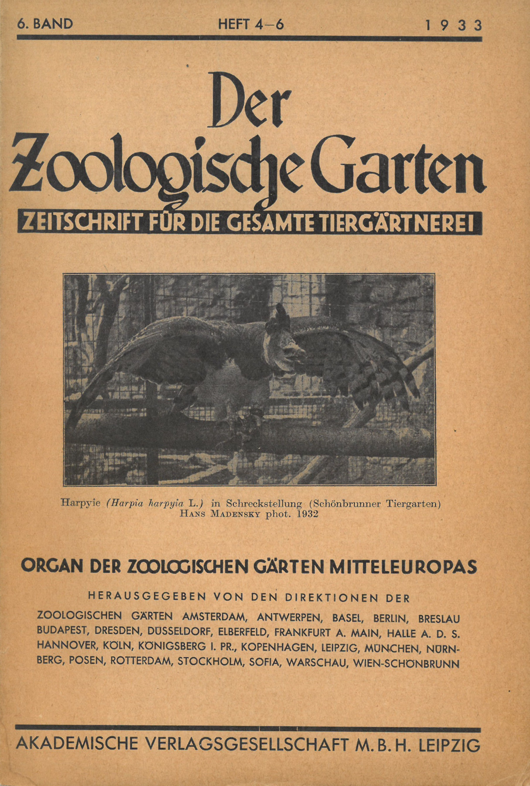
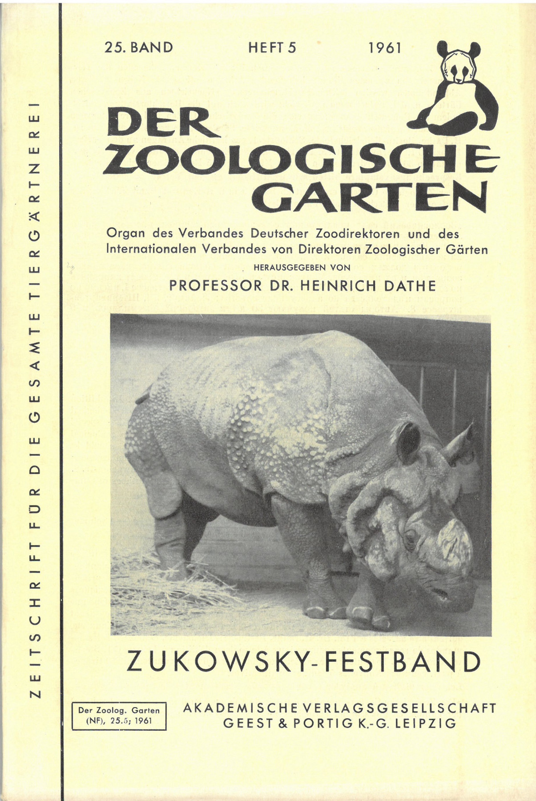
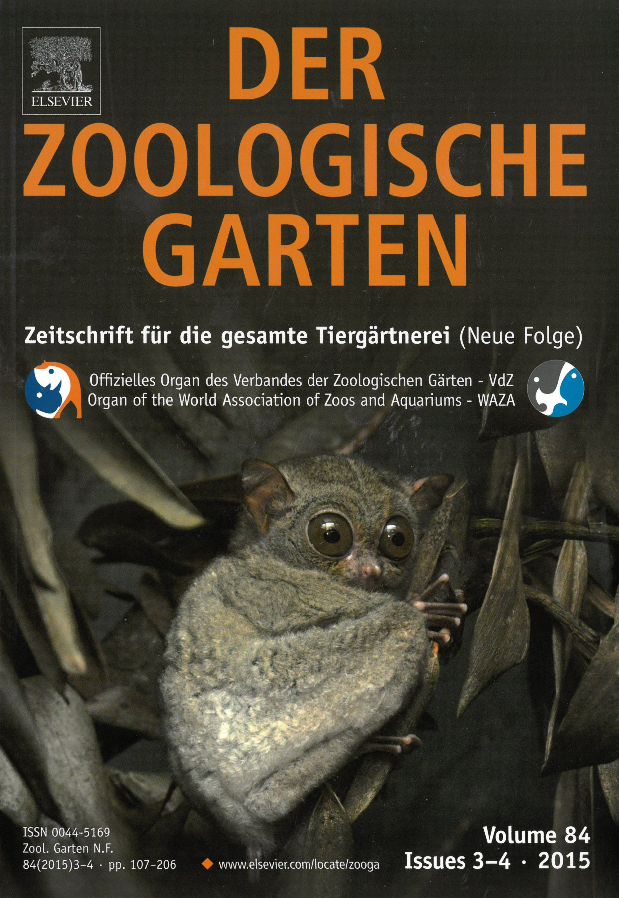

:::EN:::

EN content

:::DE:::

<figure>

<figcaption>

_Clastique-Modell_ Bombyx mori _von Louis Auzoux in der Zoologischen Lehrsammlung der Humboldt-Universität zu Berlin. (Foto Kerstin Stoll, 2020)_

</figcaption>

</figure>

Für wissenschaftliche wie populäre Tiermodelle verwendete man während des 19. und 20. Jahrhunderts vielfältige Materialien. Die Wahl der Materialien bestimmte nicht nur ihre Formbarkeit, mögliche Farbgebung, Gewicht und Haltbarkeit, sondern auch, wie viele Exemplare hergestellt werden und wie sie zirkulieren konnten. Sie hatte somit Auswirkungen auf praktische Fragen der Nutzung, auf ästhetische Fragen und auf das Wissen, das ein Modell vermitteln sollte bzw. konnte.

Während das Atelier von Adolf Ziegler (1820-1889) und seinem Sohn Friedrich (1860-1936) in Freiburg Modelle von tierischen und menschlichen Anatomien in Wachs herstellte[^1], um die durchscheinende Fleischlichkeit zu betonen, wählte der französische Modelleur und Anatom Louis Auzoux (1792-1880) für seine Tier- und Pflanzenmodelle das Material Papiermaché.[^2] Die Technik wurde bereits im alten China für Helme benutzt und Anfang des 19. Jahrhunderts in Europa für anatomische Modelle eingeführt, doch Auzoux entwickelte eine neue Rezeptur, die er sorgfältig hütete. Die Leichtigkeit der getrockneten Masse aus Papier und verschiedenen weiteren Ingredienzien sowie Klebemitteln erlaubte es etwa, eine ca. fünf Zentimeter kleine Seidenraupe auf eine Modelllänge von 75 Zentimetern zu vergrößern und ihre Körperteile naturalistisch darzustellen.[^3]

Das aufklappbare anatomische Funktionsmodell (auch Clastique-Modell genannt) von _Bombyx mori_, dem Maulbeerspinner, zeigt in starker Vergrößerung und großer Detailgenauigkeit die Haut und Extremitäten, die inneren Organe und die Spinndrüsen des Tiers. Das sorgfältig bemalte Artefakt, das vermutlich in den 1860er-Jahren hergestellt wurde und sich heute in der [[Zoologischen Lehrsammlung|story.history-of-the-zoological-teaching-collection]] der Humboldt-Universität zu Berlin befindet, lässt sich an Metallhäkchen aufklappen und weist neben Nummerierungen auch direkte Beschriftungen auf den einzelnen Körperteilen auf, siehe auch [[story.recording-animals]]. Diese Beschriftungen verweisen damit nicht nur auf die Körperteile wie in einer Legende, sondern das Papiermaché selbst ist beschrieben, und zwar im doppelten Sinne: einerseits mit Tinte und Buchstaben, andererseits mit einem wissenschaftlichen Fachausdruck. Der Seidenspinner erscheint hier als Nutztier, das ein Produkt – den Seidenfaden – herstellt. Zugleich bildet er ein Stadium einer kompletten Metamorphose ab, deren imago (geschlechtsreifes Insekt nach der letzten Verwandlung) Auzoux ebenfalls in Papiermaché festgehalten hat: Die weibliche und die männliche Seidenmotte bot er ebenfalls als Modell für den Lehrbetrieb an.

[^1]: Vgl. Hopwood, Nick. _Embryos in Wax. Models from the Ziegler Studio_. Cambridge: Whipple Museum of the History of Science, 2002.

[^2]: Zu Auzoux' Modellen vgl. Grob, Bart. _The World of Auzoux: Models of Man and Beast in Papier-Maché_. Leiden: Museum Boerhaave, 2000; Cocks, Margret Maria: "Dr Louis Auzoux and His Collection of Papier-Mâché Flowers, Fruits and Seeds". _Journal of the History of Collections_ 26, Nr. 2 (2014): 229-248; Olszewski, Margret Maria: "Dr. Auzoux' Botanical Teaching Models and Medical Education at the Universities of Glasgow and Aberdeen". _Studies in History and Philosophy of Science. Part C_ 42, Nr. 3 (2011): 285-296.

[^3]: Vgl. "Modell, Raupe, Seidenspinner". Datenbankeintrag der HU, ohne Datum, https://www.sammlungen.hu-berlin.de/objekte/zoologische-lehrsammlung/8322/ (24.08.2021).
