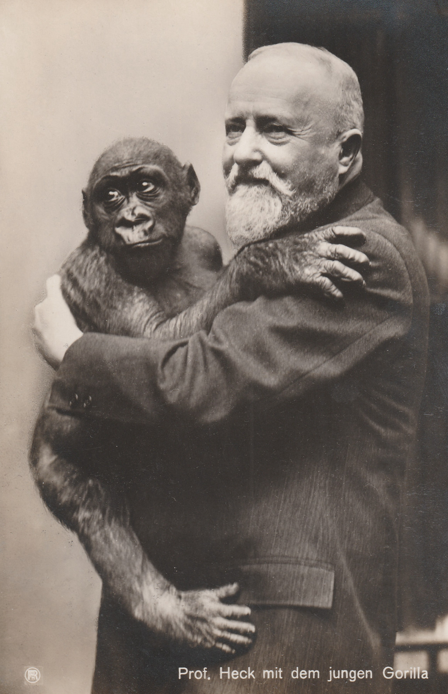
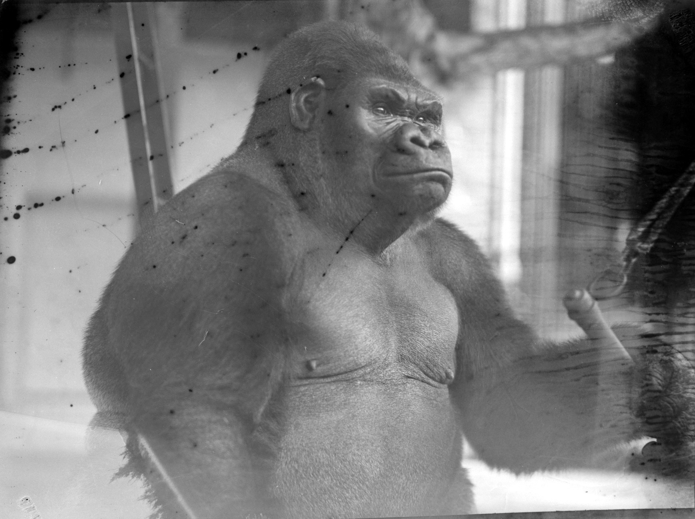

:::EN:::

:::DE:::

## Leben und Reise des Gorilla "Bobby"

<!-- Bild des toten Gorilla >

-	Von Kamerun über Marseille nach Berlin
    Quellen: Bericht der Zugfahrt??
    - die Akklimatisationsstation von Ruhe bei Marseille
	Themen: Kolonialimus, Gorillas ausstellen (Umlauff, Naturkundemuseen, Zoos), Evolutionstheorie
-	Care im Zoo 
	Gewicht
- Bild der Gewichtstafel am Gehege - immer wieder die Erwähnung, dass er der erste Gorilla war, der in einem Zoo erwachsen wurde
	…
-	Tod
    - Geschäftsberichte zeigen den Verlust - Extraerwähnung - Zeitungsarchiv checken
	Quellen: Fotografien im Zoo
-	Obduktion
	Quellen: Bericht + Fotografien
-	Spreading: 
-	Dermoplastik MfN
	Quellen: Bericht?? Fotos Präparation
	Ausstellung im Säugetiersaal des MfN über die Zeit
-	Sammlungen MfN
	Schädel in Säugetiersammlung
	Hand- und Fuß in Naßsammlung
-	Abgüsse
	Anatomische Sammlung Charité
	Totenmasken > wo überall?? (in meinem Büro ;-)
-	Statuen, Logos…

-	Nachkriegszeit bis heute

---
## Footnotes
