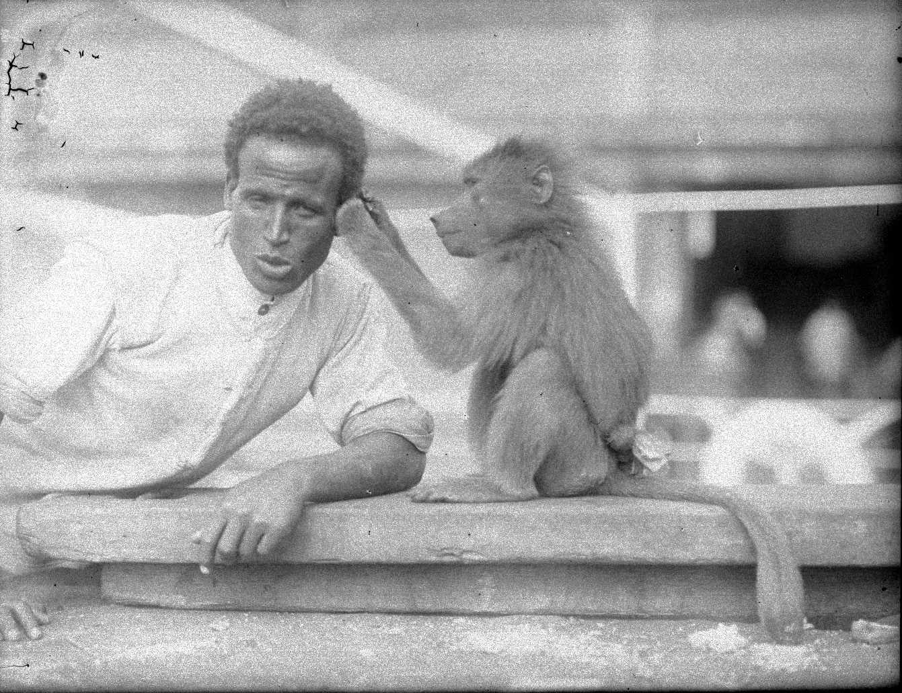

:::EN:::

:::DE:::

# Koloniale Bildwelten

*Mantelpavian mit einem der einheimischen Betreuer, 1927. (AZGB)*

Dieses ist eines der wenigen Bilder aus der Überlieferung von [[material.Lutz Heck]] im Archiv der Zoologischen Gärten Berlin, die einen der vielen Fänger, Träger oder Tierpfleger zeigen, die vor Ort bei seinen Fangreisen fast alle körperliche Arbeit verrichteten. Die später veröffentlichten Bilder zeigen fast ausnahmslos die europäischen Mitglieder der 
Bilder mit den Fängern und Betreuern sind selten. 

*Eva MacLean an Bord eines Schiffs mit einem jungen Schimpansen und einem jungen Gorilla, 1936. (AZGB)*

Der Transport von lebenden Wildtieren auf Schiffen aus ihren Herkunftsgebieten nach Europa bedeutete große Herausforderungen für die Transportunternehmer, die Handelsunternehmen und die Tiere. Das Bild der beiden Menschenaffen, links auf dem Arm der späteren Frau des Berliner Zoodirektors ein Schimpansenjunges, rechts ein junges Gorillaweibchen, zeigt, dass diese wohl vorher in Gefangenschaft an Menschen gewöhnt worden waren. Das sollte die Eingewöhnung in den Zoo erleichtern und war hier beim Transport wichtig, da die beiden Affen an deck gelasen werden konnten. Manche Affen waren vorher bereits als 'Haustiere' gehalten worden, was den gleichen Effekt hatte und bei "Bobby" der Fall war.
