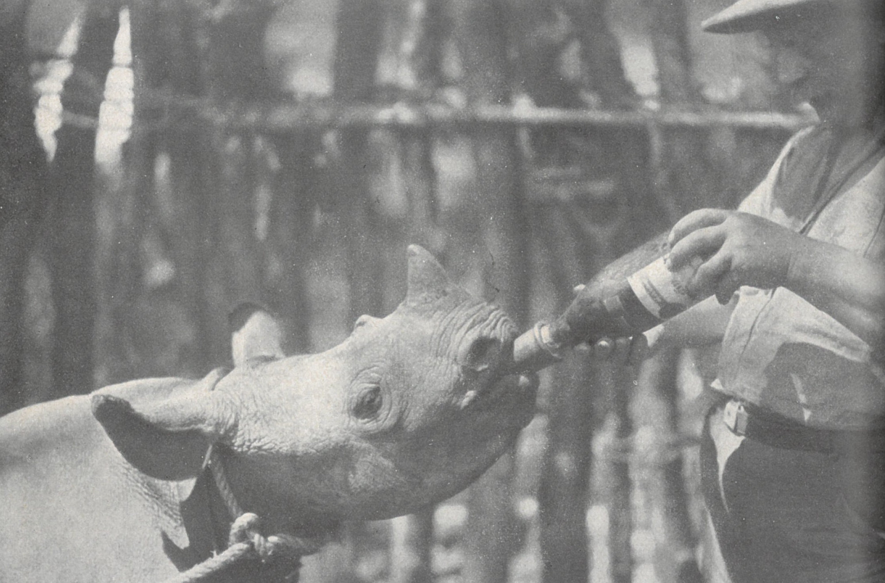
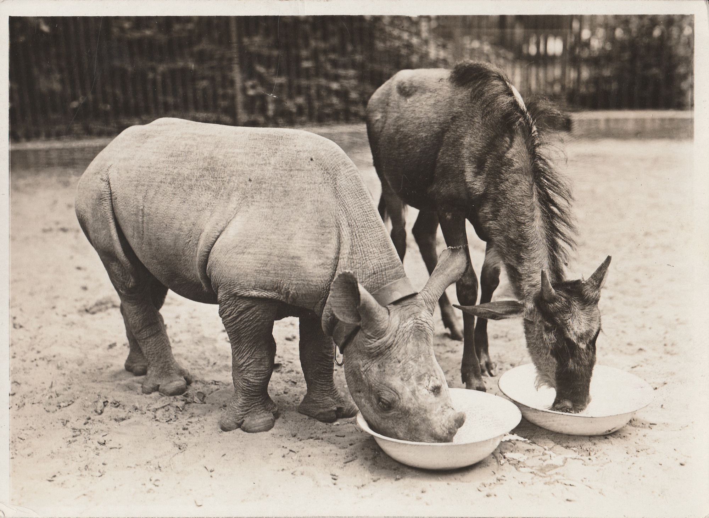
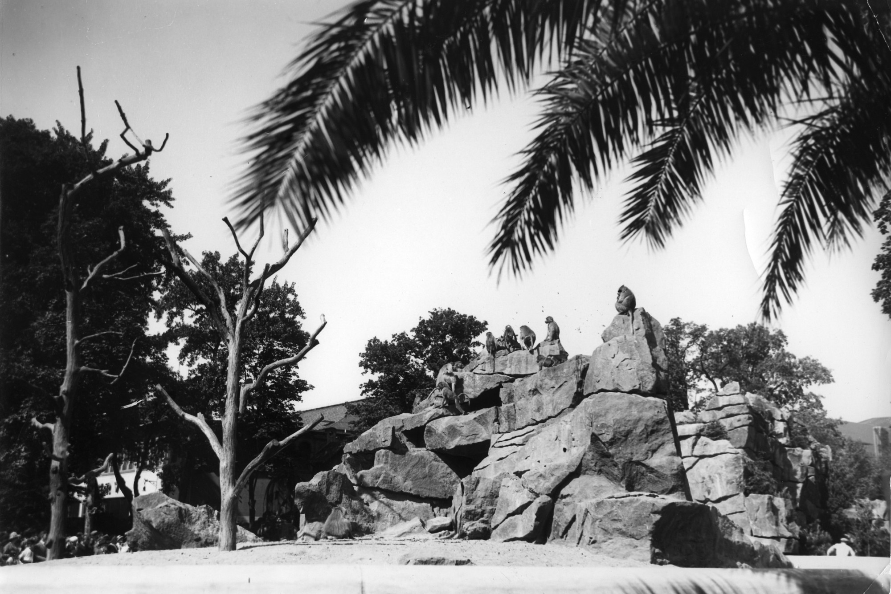

:::EN:::

English content goes here.

:::DE:::

**Clemens Maier-Wolthausen**

Der spätere Direktor des Zoologischen Gartens Berlin [[material.Lutz Heck]] (1892-1983) war seit 1924 bei seinem Vater, dem Berliner Zoodirektor [[material.Ludwig Heck]] als Assistent angestellt. Auf seine Initiative sind die größeren Freigehege zurückzuführen. Um diese mit den bei den Besucher\*innen beliebten exotischen Wildtieren zu füllen unternahm er mehrfach Tierfangexpeditionen. Vorbilder für eine solche Reise fand er in den Erzählungen amerikanischer Kollegen, wie William Beebe oder William Mann, die für die Zoos in New York und Washington erfolgreich auf Tierfang gingen und diesen vor  allem sehr gut anschließend vermarkteten. Denn es ist wahrscheinlich, dass es Heck insbesondere darum ging, auch wenn er stets den eigentlichn Fangertrag und die Möglichkeit in der Wildbahn Beobachtungen machen zu können, die die Haltung zuhause fördern würden, als Gründe für die Reisen angab.
Aber auch in Deutschland gab es literarische Vorbilder. Insbesondere der Jäger und Fotograf Carl Schillings, der auch schon für den Berliner Zoo Tiere gefangen hatte, war mit Lutz Heck persönlich bekannt und hatte mit seinen Reiserzählungen viel Erfolg.
Nun ist es aber so, dass Heck durchaus auch Vorbilder in den eigenen Reihen hatte. [[material.Oskar Heinroth]], der Leiter des Aquariums [[story.Short History Aquarium]] hatte vor seiner Beschäftigung im Zoo als Naturforscher und Arzt an der 'Ersten Deutschen Südsee-Expedition' – der Mencke-Expedition – teilgenommen. Regelmäßig fuhr Heinroth zum Forschen und Sammeln von Tieren an die Adria in die Zoologische Station Rovigno in Istrien. Auch hatten dieser, wie auch viele Zoodirektoren schon Reisen gemacht und sich so Tiere besorgt. Zudem kamen ja, wie zu sehen war viele der kolonialen Tiere als Ausbeute Reisender Majestäten in den Zoo.
[[material.Petrus Olesen]], der erfahrene Tierpfleger und spätere Begleiter Hecks auf der Reise hatte auch schon Tierfänger begleitet. Vielleicht war auch persönlicher Eifer oder Geltungssucht gegenüber den Kollegen hier im Spiel.

_Frontseite des Buchs von Carl Schillings 'Mit Blitzlich und Büchse' von 1905._

Finanziell waren solche Reisen nämlich eher fragwürdig. Seit den 1880er jahren existierte ein großes Netz professioneller Tierhändler. [[story.Trading Animals]] Im deutschsprachigen Raum dominierten insbesondere die handelshäuser Hagenbeck, Reiche und Ruhe. Mit ihren Fangstationen und Agenten vor Ort konnten sie größere Gruppen zusammenstellen, die den Stückpreis nach dem langen und kostenintensiven Transport verringerten.

## Affenfang in Abessinien

Die erste internationale Tierfang-Expedition des Zoologischen Gartens Berlin startete 1925 in Richtung Abessinien [[material.Abyssinia]]. Nach wochenlangen Vorbereitungen, in denen die Schiffskarten und Erlaubnisse beschafft werden mussten und Ausrüstungsgegenstände gesammelt werden mussten war es endlich soweit. Alles war verpackt nicht nur Zelte Waffen fotomaterial, auch das Material zum Bau von transportkisten, also drahtgitter und Scharniere sowie die Schnuller von Milchflaschen und die notwendige Konservenmilch waren verpackt. Es scheint als ging man davon aus, nichts vor Ort bekommen zu können und alles aus Europa mitnehmen zu müssen. Mitte Januar kreuzte der Dampfer das Mittelmeer und Ende des Monats lag man auf Reede vor Dschibuti.  Mit an Bord und Teil der Expedition waren nicht nur Lutz Heck und der 'Oberwärter' [[material.Petrus Olesen]] sondern auch zwei Kameramänner der Ufa. Paul Lieberenz und Ernst Garden sollten die Erlebnisse Film festhalten. Angeblich wurden über 10000 m Film aufgenommen. Lutz Heck schrieb später, dass er sich Abessinien als Reiseziel ausgesucht hatte, zum einen weil es dort gute Transportmöglichkeiten ins Inland gab und zum anderen weil das Land den Deutschen nicht feindlich gesonnen sei. Abessinien war ein unabhängiges Königreich und nicht Teil des englischen Kolonialreiches, dass es umgab. Sicher spielte auch eine Rolle, das über Abessinien auch von deutschen Forschern eine Menge Informationen bereits gesammelt worden waren und damit eine gewisse Vorkenntnis über das Gebiet vorhanden war. Von Dschibuti aus führte der Weg über mit der Eisenbahn nach Diredaua.
Diredaua war auch das Basislager für die von hier aus starten den ersten Expeditionen ins Landesinnere. Das Basislager fungierte insbesondere als Sammelstation für die eingesammelten, ernähren oder geschenkte und gekauften Tiere. und schon bald sollten das viele werden. Noch bevor sich die Mannschaft auf die erste Expedition begab hatten bereits die Menschen der Umgebung angefangen Tiere zu fangen und vorbeizubringen. Diese wurden höchstwahrscheinlich dann von Lutz Heck gekauft. Zu diesen Käufen gehörten bereits so exotische und begehrte Tiere wie Leoparden und Geparden oder auch Hyänen. Hinzukamen Nager, Kriechtiere und Vögel. Selbst ging Heck in diesen Tagen nur auf Jagd nach Wildbret. Das erste große Unternehmen war eine Reise zu einer heißen Quelle in der Nähe. Hier ließ er seine Fotoausrüstung von einheimischen Trägern tragen. Er hatte einen eigenen Gewehrträger sowie einen 'Boy', der ihn bediente. Die Beschreibungen seiner einheimischen Gefährten in späteren Veröffentlichungen sind abfällig. Zwar zieht er die christlichen Amharen und einzelne Stämme den muslimischen Somaliern vor, aber alle sind bestenfalls 'edle Wilde'. Seinen Gewehrträger beschreibt er später als eitel und dumm, der 'Boy' bekommt nicht einmal einen Namen in seinen Erinnerungen. Auch das Christentum der Abessinier wird als übertrieben und fast schon schädlich dargestellt.

Die erste große Fangreise war den Mantelpavianen, den Hamadryas gewidmet. An mehreren Tagen fing die Expedition mittels der einheimischen Helfer eine große Gruppe. Besonderes Augenmaß lag dabei auf den Menschen, die mit dem Pelzmantel beeindruckender aussahen. das für eine langfristige Zucht eine höhere Zahl von Weibchen wichtiger gewesen wäre spielte für Lutz Heck augenscheinlich keine Rolle. 

*Mantelpaviane der Expedition, vermutlich auf dem Transport, 1925. (AZGB)*

Die Tiere wurden an die Küste verbracht, woraufhin sie auf einen Dampfer verladen wurden, der durch den Suezkanal nach Europa fuhr. Laut Lutz heck war die Überfahrt starken Seegangs wegen sehr beschwehrlich und es kam zu verlusten unter den Tieren. Brecher kamen über die Bordwand und schwemmten Ausrüstungsgegenstände, wvor allem aber auch Tiere ins Meer. Täglich wurde eines der für diesen Zweck mitgebrachten Rinder an Bord geschlachtet, um anderen Tieren als Nahrung zu dienen. 
Nach der Überfahrt nach Marseille wurden die Tiere sechs Tage lang mit der Bahn nach Berlin transportiert, wo sie von mehreren Zehntausend Menschen in der Sonderschau "Abessinische Tiereinfuhr" gezeigt wurden.[^abess1]

Die Tiere wurden in Berlin später auf einem großen 'Affenfelsen' angesiedelt. Noch heute sind Nachkommen der Expeditionsbeute dort untergebracht.

*Der Pavianfelsen im Berliner Zoo, um 1930. (AZGB, Foto Heck)*

## Giraffenfang und 'Völkerschau'

Vom Erfolg seiner ersten Reise inspiriert, plante Lutz Heck bereits zwei jahre später eine erneute Reise. Dieses Mal wollte er in die ehemalige deutsche Kolonie 'Deutsch-Ostafrika' [[material.German East Afrika]] fahren. Diese wurde seit dem Ende des Ersten Weltkriegs als Tanganjika-Territory von den Briten verwaltet. De facto, hatte nur der Kolonialherr gewechselt. Es ist mehr als wahrscheinlich, dass sich Lutz Heck einen zusätzlichen Werbeeffekt davon versprach, dass er ehemalige 'Kolonialtiere' fangen würde. Bereits 1904 hatte das "erste deutsch-ostafrikanische Nashorn" im Zoo Aufmerksamkeit erregt.

_Illustration aus einer Zeitschrift, 1904. (AZGB)_

Allerdings musste der Zoo, vertreten durch seinen Kaufmännischen Direktor Clemens Freyer, mit einem wirtschaftlichen Verlust in dem Geschäftsjahr rechnen. Freyer trug die Angelegenheit an den Aufsichtsrat heran. Die von Lutz Heck kalkulierte Summe war sehr hoch für einige Tiere, die zumal im handel zu kriegen waren.Allein der Rücktransport konnte wohl leicht 40 000 Reichsmark kosten und ein "Menschentransport und andere Unkosten" standen ja auch zur Diskussion.[^exp3]  Was war hiermit gemeint? Eine Durchsicht der Korrespondenz zu dieser Expedition zeigt, dass Lutz Heck plante, eine eigenen 'Völkerschau' mit Menschen, die er zusammen mit den zu fangenden Tieren nach Berlin bringen wollte. Freyer schlug angesichts der hohen Kosten vor, sich "lediglich auf eine Forschungs- und Expeditionsreise" zu beschränken.  Und in der Tat, nur vier Tage später konnte er dem Aufsichtsrat mitteilen, dass man mit den Hecks übereingekommen sei, eine "Fangreise" "ohne die Veranstaltung einer besonderen Menschenschau" zu veranstalten. Dieses würde das Risiko deutlich mindern, da nur noch die Tiere transportiert würden. Außerdem hoffte man, die Kosten durch einen gesonderten Eintritt für eine Sonderschau der gefangenen Tiere zu mindern. Diese würden dann zu den Aktiva der Zoo Aktiengesellschaft gezählt werden können.

Schnell wurden nun die Vorbereitungen getroffen. Anfang November 1927 waren die Reisen organisiert und bezahlt, die Erlaubnisse zum Betreten des Gebiets für die beiden "Forschungsreisenden" waren durch die lokalen Kolonialbehörden erteilt. Nun bat man noch die "obersten Kolonialbehörden" des "Tanganjika- & Kenya Territory", dass einige "Eingeborene" mit den Tieren nach Deutschland bringen zu können, an die die tierische Beute gewöhnt sei und die nach einigen Monaten dann wieder zurückkehren sollten. Eine Entlohnung und der kostenlose Rücktransport wurden garantiert. Augenscheinlich hatte man eine Reise ins Innere Afrikas vom britischen Mandatsgebiet aus geplant und augenscheinlich sollten nun doch "Eingeborene" nach Deutschland kommen.

Die Ausreise erfolgte über den deutschen Dampfer 'Nyassa', anschließend von der ostafrikanischen Küste mit der Bahn bis Moschi. Von dort brachte ein Lastauto die beiden Tierfänger 500 Kilometer weiter nach Mbulu. Zunächst wurden nun von diesem Basislager aus eine Expedition mit 80 einheimischen Trägern in ein Nashorn-reiches Gebiet unternommen. Und tatsächlich gelang es  auch wirklich bald, ein junges Nashorn zu fangen.

_Das gefangene Nashorn wird von Petrus Olesen mit Milch gefüttert, 1927. (Lutz Heck: Auf Tiersuche in weiter Welt)_

Bei dem Fang wurde wie damals üblich das Muttertier zunächst geschossen. Am Fangplatz wurde das Lager aufgeschlagen Punkt denn das Nashorn musste erst in 3 Wochen gezähmt werden, bevor der Rückmarsch zu Fuß angetreten werden konnte. Die Länge des täglichen Marschs richtete sich nach dem Belieben des am Strick mitgeführten Tieres. Wenn in der Nähe kein Wasser war oder das Tier nach einem Kilometer anfing Komma an den Büschen zu fressen konnte nicht weitermarschieren werden.

_Gehege im Fanglager, 1927 (Lutz Heck: Auf Tiersuche in weiter Welt)_

Anschließend begab sich Heck in die Massai Steppe um dort die großen Herdentiere zu fangen. Als geländekundigen Helfer und Reiter heuerte Heck den südafrikanischen Buren Pitt Jones an. Er ritt mit Schlinge und Fangstock hinter Zebras oder Giraffen her und fing die jüngeren Tiere.

_Der Fänger Pitt Jones beim Fang einer der fünf Giraffen der Expedition, 1928. (AZGB, Foto Lutz Heck)_

_Die gefangenen Tiere wurden mit einem Lastwagen zu einem Lager gefahren, wo sie gesammelt und an Menschen gewöhnt wurden. (AZGB, Foto Lutz Heck)_

Fünf Giraffen, 19 Zebras, vier Straußenvögel und verschiedene Antilopen waren die Ausbeute die Berlin gesund erreichte. In der Gegend von Kilwa wurden drei Nilpferde von Einheimischen in Fallgruben gefangen. Der oberste britische Wildschutzbeamte überließ sie dann dem Zoologischen Garten. Es wurde ein besonderes Gehege für diese eingerichtet. Diese Information gab Lutz Heck in seinen Veröffentlichungen an.[^exp4] Ob die Einheimischen von den britischen Behörden für 'Wilderei' [[material.poaching]] bestraft wurden, ist nicht bekannt - interessierte Lutz heck auch nicht.

Außer den Großtieren fing die Expedition in großen Fallen in der Nähe des Giraffen-Lagers große ostafrikanische Paviane, zudem 16 Grüne Meerkatzen und etwa 200 Nashornvögel, Papageien,Webervögel, Prachtfinken. 
Lutz Hecks größter Erfolg war aber vielleicht, dass er letztlich doch noch eine 'Völkerschau' zusammenstellte. In seinen Worten: "Sechs Einheimische, darunter "drei Arusha Massai, stolze Krieger mit Schild und Speer des gefürchteten ostafrikanischen Hirtenvolk des begleiteten die Expedition auf allen Fahrten. Sie fassten derartiges zutrauen, dass sie bis nach Berlin mitkamen."[^exp5]

Der Rücktransport gestaltete sich kompliziert. Nachdem die Tiere von Mombasa mit dem Schiff S/S Sumatra abgingen, hatte man Kurs auf Marseille genommen. Letztlich entschied sich Lutz Heck aus unbekannten Gründen für Genua als Ausschiffungshafen. Das führte aber zu einer Kette von Komplikationen. Hatte die Expedition die Erlaubnisse für Frankreich, sowie den Transit durch die Schweiz und den Grenzübertritt bei Kehl auf deutsches Territorium anscheinend schon geregelt, wurden nun neue Erlaubnisse notwendig, die lebenden Tiere nach Italien einzuführen und dann über eine andere Route durch die Schweiz nach ins Deutsche Reich zu transportieren. So musste nun zum Beispiel das Badische Innenministerium eine Transitgenehmigung erteilen, nachdem das Preußische Innenministerium die Einfuhr genehmigt hatte. Die Abwicklung der Formalitäten mit den Italienischen und (italienisch-)schweizerischen Behörden überließ man einem Speditionsunternehmen, aus der Region. "Jacky Maeder Co." bearbeitete diesen Teil des Transports gemeinsam mit der "Holland-Afrika-Lijn". Da sich mit den Giraffen, Zebras und Antilopen als untersuchungspflichtige Wiederkäuer an Bord befanden wurden medizinische Untersuchungen und mögliche Blutproben in Aussicht gestellt. Hierzu reiste der Zootierarzt Dr. Arendsee nach Genua dem Transport entgegen.[^exp6]

Aus Suez kabelte Heck die benötigten Transportkapazitäten: drei offene, ein geschlossener Waggon wurden benötigt. 300 Pfund (Sterling) mussten bezahlt werden. Mit auf dem Transport: "3 Massai mit Schild und Speer" sowie "3 andere Neger".[^exp7] Letztere waren sicherlich die zu Beginn eingeplanten Transportbegleiter, die sich um die Tiere auf dem Transport und bei der Eingewöhnung kümmern sollte. Die drei "Massai" aber scheinen zur 'Dekoration' mitgenommen worden zu sein. Auf Aufnahmen der an die Rückkehr anschließenden Afrika-Sonderschau im Zoo sieht man diese Menschen zwischen den Kulissen und Tieren sich präsentieren. Durch die Hintertür hatte Lutz Heck also doch noch in Teilen eine 'Völkerschau' realisiert.

- [ ] Bild der Gruppe in der Schau?

## 'Afrikaschau' und Werbeeffekt der Expeditionsbeute

Die Ankunft des Transports an einem Sonntag, dem 20. Mai 1928, im Anhalter Bahnhof wurde von Presserummel begleitet, am Bahnhof oder auf sem Sonderschaugelände konnten Journalisten die Ausbeute beäugen. Am folgenden Donnerstag wurde dann die Sonderschau selbst eröffnet. Bereits Ende April hatte der Zoo die Schau angekündigt und den großen Erfolg der Expedition angepriesen.
Eine Löwin aus Abessinien wurde im Herbst 1928 an den Zoo in Frankfurt/M. Für 2000 Mark verkauft, das Geld dem Expeditionskonto gutgeschrieben. Aus dem Schriftwechsel geht allerdings hervor, dass das Tier gar nicht aus der Ausbeute der Expedition stammte, sondern bereits 1924 importiert worden war.

_Werbebroschüre des Zoos für die Sonderschau mit den Tieren der Expedition 1928. (AZGB)_

Die Schau soll ein ungefähres Bild dieses großen Sammellager ergeben. Mit den darin sich da bietenden bewegenden Tieren. Die Zelte, in denen die Expedition Mitglieder über ein Vierteljahr in Busch und Steppe lebten, die Fangnetze, andere Ausrüstungen werden zur Schau gestellt.

_Auch das "Mtoto" getaufte Nashorn war Teil der 'Afrikaschau' in der die Tiere und die Ausrüstung der Expedition gezeigt wurden._

Der Berliner Zoo profitierte letztlich von den Expeditionen - und zwar in Form einer wirksamen Öffentlichkeitsarbeit. Lutz Heck veröffentlichte seine Bilder und seine 'Abenteuer' in unzähligen Zeitschriftenartikeln und einigen Büchern. Noch 1954, nun in der Bundesrepublik, verbreitete Lutz Heck seine Erlebnisse.[^exp2]

_zeitschrift mit einer Reportage und den Bildern von Lutz Heck, XXXX._

- [ ] Besseren scan besorgen

Hinzu kam, dass die Tiere selbst im Zoo natürlich zu begehrten Schauobjekten wurden. Die abenteuerliche Herkunft zog weitere Besucher\*innen an.

_Auf der Postkarte des Zoo mit dem in Ostafrika gefangenen Nashorn wurde auf die Expedition hingewiesen, um 1928. (AZGB)_

Sowohl das von den professionellen Filmemacher auf der ersten Reise gewonnene Bildmaterial als auch Lutz Hecks eigene Bilder der zweiten Reise wurden in Filmen verarbeitet. Diese trugen weiter zum Bekanntheitsgrad des Zoos, vor allem wohl aber Lutz Hecks selbst, bei. Ihre mit rassistischen Klischees gefüllten Darstellungen afrikanischer Menschen trafen den Zeitgeist.

Die Hauptpersonen in diesen Lutz Hecks Büchern und auch in den Filmen sind immer die weißen Expeditionsleiter. Das Thema ist die Gefahr, der sie sich aussetzen um uns, dem weißen Publikum ansprechende Tiere aus dem Innersten geheimnisvoller Kontinente, dem tiefen Dschungel oder der heißen Wüste zu bringen. Und doch konnten diese Bücher den Widerspruch  nicht  auflösen, dass die Arbeit praktisch immer und ausschließlich von Einheimischen Fängern geleistet wurde. Diese werden praktisch niemals mit Namen identifiziert. Lutz Heck benennt die beiden südafrikanischen Buren, die mit den Lassos die Giraffen fangen, die Mehrheit seiner Helfer aber bleibt unerwähnt. Gelegentlich gibt es abwertende Bemerkungen über ihren Alkoholkonsum oder ihre Spielsucht oder die schlechten Tischmanieren. Auch werden sie als "verschlagen" bezeichnet. Ausnahmen gelten nur für die christlichen Abessinier, die als "edle Wilde" durchgehen.

Noch 1935 profitierte der Zoologische Garten von der Reise 1928. Damals machte Lutz Heck die Bekanntschaft des Tierhändlers Chr. Kissonerghis. In den folgenden Jahren lieferte dieser nun regelmäßig neue Tiere aus Diredaua über Djibouti. Sie wurden dann ab dem Entladen an einem Mittelmeerhafen von Zooangestllten abgeholt.[^exp1]

## Spätere Expeditionen

Auch noch in den 1930er Jahren ging [[material.Lutz Heck]] auf Fangreisen. So fuhr er im Auftrag von [[material.Hermann Göring]] 1936 nach Kanada, um dort mit behördlicher Erlaubnis Elche und Bisons zu fangen.[^late1] Letztere wollte er im Erhaltungszuchtprogramm für den Wisent einsetzen und bei sich und in anderen Zoos ausstellen. Er reiste auch erneut nach Afrika, diesmal aber eher als Foto- und Jagdtourist. Seine Lebensgefährtin Eva Mac Lean reiste mehrfach nach Kamerun, an den Tschadsee und ins südliche Afrika und brachte auch weiterhin einzelne Tiere für den Berliner Zoo mit zurück.

_Auf diesem Felsen stellte Lutz Heck die mantelpaviane seiner Expedition aus. (um 1930, AZGB, Foto Lutz Heck)_

Lutz Hecks spätere Ehefrau Eva MacLean brachte 1936 von einer Reise nach Kamerun 1936 das Gorillaweibchen "Eseka" und einen Schimpansen mit.[^late2]

_Eva MacLean an Bord eines Schiffs mit einem jungen Schimpansen und einem jungen Gorilla, 1936. (AZGB)_ [[story.Colonial Imagery]]

1938 war Heck dann mehrere Monat in Kamerun, angeblich vor allem, um Tiere, insbesondere Gorillas, in ihrem Lebensraum zu beobachten. Und wieder kam er mit einem reichhaltigen Tiertransport zurück. Unter den vielen Tieren alleine mehr als 30 Affen, darunter wiederum drei Schimpansen.[^late3]

Letztlich haben sich eigene Fangexpeditionen für den Berliner Zoo finanziell wohl nicht gelohnt. Zur Bekanntheit der Tiere, des Zoos und seines Zoodirektors haben sie aber beigertragen und dienten so der Werbung für den Zoo.

* * *

## Footnotes

[^exp1]: Korrespondenz in AZGB, O 0/1/327.

[^exp2]: Heck, Lutz. 1955. Grosswild im Etoschaland. Erlebnisse mit Tieren in Südwest-Afrika. Berlin: Ullstein.

[^exp3]: Die gesamte Korrespondenz findet sich in AZGB, O 0/1/327.

[^exp4]: Noch recherchieren

[^exp5]: Zitat suchen

[^exp6]: Korrespondenz in AZGB, O 0/1/327.

[^exp7]: Telegramm 08.05.1928, AZGB, O 0/1/327.

[^abess1]: Heck, Lutz. 1941. Auf Tiersuche in weiter Welt. Berlin: Paul Parey: 68-69.

[^late1]: Zoologischer Garten Berlin: Geschäftsbericht für das Jahr 1936.

[^late2]: Zoologischer Garten Berlin: Geschäftsbericht für das Jahr 1936; Karteikarte "Schimpansen" der alten Zookartei.

[^late3]: Zoologischer Garten Berlin: Geschäftsbericht für das Jahr 1936; Karteikarte "Schimpansen" der alten Zookartei; Heck, Lutz. 1941. Auf Tiersuche in weiter Welt. Berlin: Paul Parey: 143-193.
