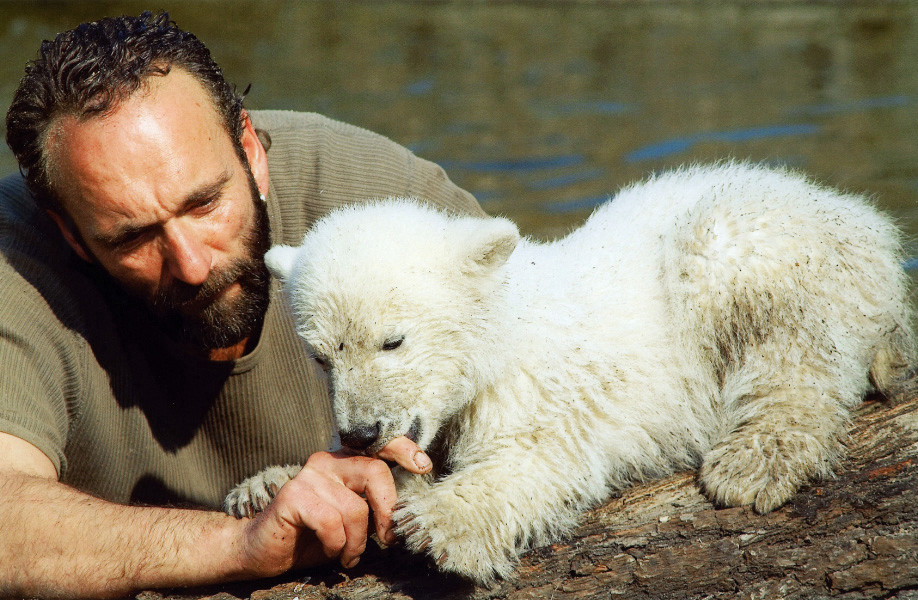

:::EN:::

English content goes here.

:::DE:::

**Clemens Maier-Wolthausen**

Am **5. Dezember 2006** gegen 15.00 Uhr brachte die Eisbärin "Tosca" zwei Jungtiere zur Welt. Nach kurzer Zeit stellte sich heraus, dass das Muttertier **keine Anzeichen einer pflegenden Fürsorge** zeigte. Eines der Jungtiere starb. Das andere aber wurde aus dem Gehege entfernt und wurde **erfolgreich mit der Flasche** versorgt.[^birth1]

*Der junge "Knut" bei ersten Erkundungen eines Außengeheges, 2007. (AZGB, Foto Griesbach)*

## A star is born!

Eigentlich kein ungewöhnlicher Vorgang in Zoos. Aus verschiedenen Gründen wurde die Geschichte des Eisbärenjungen bald sehr bekannt. Einen großen Anteil hatten daran die Medien, insbesondre die lokale ARD-Anstalt **Rundfunk Berlin-Brandenburg** (RBB). **Diese informierte ihre Hörer\*innen täglich mit Nachrichten aus dem Zoo über den Zustand des kleinen Bären und die Beziehung zu dessen Pfleger Thomas Dörflein.** Dazu nutzte der RBB unter 'www.rbb-online.de/knut' das damals noch relativ neue Medium weines weblog/blog, um die Berliner\*innen über die Entwicklung des Eisbärenjungen zu informieren. Dieser hatte maßgeblichen Anteil an "Knuts" Popularität.[^star1]

Die beiden waren ein Team wie für die Medien gemacht. Hier die tapsige weiße Fellkugel, dort der kernige, bärtige und stille Pfleger, der bei seinem Pflegling einzog und ihm angeblich auf der Gitarre Lieder von Elvis Presley vorsang. 

*Pfleger Thomas Dörflein und der nur wenige Monate alte "Knut", 2007. (AZGB, Foto Bröseke)*

Aber weder dieses Traumpaar, noch die Geschichte der Geburt allein können den folgenden **"Hype" um "Knut"** nicht allein erklären.

## Botschafter des Klimaschutzes

*Bundesumweltminister Sigmar Gabriel umrahmt von Thomas Dörflein, "Knut" und Direktor Bernhard Blaszkiewitz, 2007. (AZGB, Foto Bröseke)*

Hinzu kam ein besonderes Timing. "Knut" kam zu einem Zeitpunkt, an dem zum ersten Mal eine intensive Debatte um die Klimakrise und die Bedrohung des natürlichen Lebensraums der Eisbären geführt wurde. **Das Tier eignete sich als Botschafter in der Klimadebatte.** Weltweite Bedeutung konnte der Berliner Eisbär aber gewinnen, weil zudem noch ein Zufall half. Kurz nach der ersten öffentlichen Vorstellung des Tieres Ende März 2007 versammelten sich die die Staats- und Regierungschefs der Europäischen Union zum 50. Jahrestag der Unterzeichnung der Römischen Verträge in Berlin. Mit ihnen waren Vertreter der nationalen und internationalen Presse in die Stadt gekommen. Die waren ebenso begeistert von dem Jungtier wie die lokale Presse schon seit Monaten. **"Knut" machte "Headlines" in aller Welt.** Die überraschten Zoomitarbeiter gaben an dem Wochenende Hunderte Interviews.[^ambassador1] Zusätzlich sorgten Zehntausende zusätzliche Besucher für eine eindrucksvolle Kulisse. Sicherheitsleute mussten den Andrang vor der Freianlage kontrollieren. Bald war eine Million Gäste gekommen.[^ambassador2] 

*Knut wurde weltweit berühmt, sogar Kinder aus Cooper Station, NY in den USA schrieben ihm Briefe mit selbstgemalten Bildern. (AZGB)*

## Die Marke "Knut"

Der Zoo wollte das rege Interesse an dem Bären nutzen, finanziell und für den Artenschutz. Er schuf eine Marke, unter der lizensierte Produkte zum Verkauf angeboten wurden. Die **Erlöse kamen auch Artenschutzprojekten** zugute.[^trademark1] Der damalige Bundesumweltminister Sigmar Gabriel wurde offizieller Pate des kleinen Eisbären. Das sollte helfen, auf den menschengemachten globalen Klimawandels aufmerksam zu machen.[^trademark2] Im Frühjahr 2008 kam sogar ein Film über den jungen Eisbären und andere Tiere in die Kinos.[^trademark3] Die deutsche Ausgabe des Magazins 'Vanity Fair' hob "Knut" auf ihre Titelseite, die amerikanische zeigte ihn in einer Fotomontage zusammen mit Filmstar Leonardo di Caprio, der in jenem Jahr einen Film über den menschengemachten Klimawandel produziert hatte, auf einer Eisscholle.

- [ ] noch besorgen

*Cover der deutschen Ausgabe der Zeitschrift Vanity Fair, Nr 14 von 2007*

"Knut" zog, als er nach einigen Monaten schon ein Eisbär-"Teenager" wurde viele Schaulistige an. Als Zoodirektor Bernhard Blaszkiewitz die Entscheidung traf, Pfleger Thomas Dörflein aus Sicherheitsgründen den Nahkontakt mit dem nun bereits gefährlichen Bären zu untersagen, wurde dieses von Dörflein und den "Knutfans" kritisiert.
Der Pfleger Thomas Dörflein starb 2008 an einem Herzinfarkt. In den Fan-Kreisen wurde Dörfleins Tod so interpretiert, dass er an gebrochenem Herzen nach der erzwungenen Trennung von "Knut" starb.

## "Knut" stirbt

Am **19. März 2011** fiel der Eisbär aber in den Wassergraben des Geheges und ertrank. Lange blieb die genaue Todesursache ungewiss, bis Wissenschaftler\*innen des Institituts für Wildtierforschung eine Autoimmunkrankheit als Grund ausmachten. **Die Anteilnahme der Berliner und des internationalen Publikums war überwältigend.** Erneut erreichten den Zoo kistenweise Briefe aus aller Welt. In den meisten Zuschriften drückten junge und erwachsene 'Knut-Fans' ihre Trauer aus. Vor dem Eisbärengehege und am Zoozaun hinterließen Hunderte von Fans letzte Grüße. Eine Gruppe Berliner 'Knut-Fans' sammelte Geld und stellte auf dem Spandauer Friedhof 'In den Kisseln' neben der Grabstätte von Thomas Dörflein einen Gedenkstein für den Bären auf.

- [ ] noch besorgen image Knutdenkmal Fridhof
*'Knut-Denkmal' neben der Grabstelle für Thomas Dörflein auf dem Friedhof In den Kisseln, 2021. (Clemens Maier-Wolthausen)*

Allerdings provozierte "Knuts" Tod neben den Trauerbekundungen auch **Vorwürfe**, gerichtet an den Zoodirektor. 
Eine Frau, die anonym bleiben wollte - deren Berliner Telefonnummer aber auf der Faxkennung deutlich lesbar stand - schrieb an den Zoo im März 2011:

>Ihr brutales, erbarmungsloses Zoovolk! Gott soll Euch strafen // Knut! Todesmobbing // Mörder = Klös + Blaskewietz!

So stark waren die Emotionen, dass schon 45 Minuten später ein neues Fax von der gleichen Autorin kam:

>An den Berliner Zoo // was habt Ihr mit Eisbär BORIS + YAN-YAN Pandaweibchen // gemacht? // Wo ist Knuts VATER? // Pfui!

Und drei Wochen später:

>Knut // Erbarmungslos // TODGEMOBBT

Die 'Ts' des letzten Wortes waren in Kreuzform

Manche Autor\*innen nahmen in ihren Schreiben die Position des toten Tieres ein, wandten sich also 'in Person' "Knuts" an den Direktor.

*Bildunterschrift noch formulieren*

Im Zoo wird 2012 die Skulptur "Knut der Träumer" nach einem Entwurf des Künstlers Josef Tabachnyk errichtet. Die etwa 1,5 m lange und etwas über einen Meter breite Figur am Eisbärengehege besteht aus einem in Bronze gegossenen Eisbären, der auf zwei aus weissen Granit geformten Eisschollen liegt.[^tod1]

*Skulptur 'Knut der Träumer', 2021 (Clemens Maier-Wolthausen)*

Die benötigten Spenden wurden vom Förderverein 'Stiftung Hauptstadtzoos' gesammelt. Zudem werden 2012  Repliken des Denkmals als Souvenir verkauft. Die als 'denkmal' bezeichnete Skulptur ist 2012 auch das Motiv einer Gedenkmünze aus versilberter Bronze der Staatlichen Münze Berlin.[^tod2]

- [ ] Bild der Münze aus dem Archiv?

## "Knuts" Tod und Präparation - Proteste und Vermenschlichung

Schon kurz nach dem Tod des Eisbären wurde die Entscheidung getroffen, den Kadaver des Tieres in das **Naturkundemuseum** zu bringen. Dort sollte er präpariert werden und als Objekt weiterhin naturkundlicher Bildung dienen. Gegen diese fortgesetzte Aussstellung entbrandte unter den Knut-Fans ein **wütender Protest**. Hatten diese Besucher\*innen schon zu Knuts Lebzeiten Tendenzen einer starken Anthropomorphisierung/ Vemernschlichung des Eisbären gezeigt, wurden diese nun auch auf das tote Tier übertragen. Wieder erreichten den Zoo zahllose Schreiben, zwar äußerten manche Autor\*innen Verständnis für den Transfer des Tieres in das Naturkundemuseum, ander beklagten diesen aber als 'pietätlos'.

Es kam gar zu **Demonstrationen vor dem Zooeingang am Hardenbergplatz**. Die Demonstrant\*innen zeigten Plakate mit Worten wie:

>"Kinder fragen... Warum darf Knut nicht in den Himmel? // Mutter denkt: Weil mit ihm Geld verdient werden soll... // Mutter sagt: Knut wird es schon gutgehen... // Wir wollen unsere Kinder nicht anlügen müssen um sie zu schützen!!!! // Auch darum fordern wir: Lasst Knut's Körper in Ruhe und ihn endlich seinen Frieden finden."

Oder:

>"Erde zu Knut, Asche ins Museum! Gibt Knut endlich die letzte Ruhe, das seid ihr ihm schuldig, denn auch ein Eisbär hat eine Seele!"

*Protestplakat gegen die Präparation "Knuts", 2011. (AZGB)*

Dem Zoodirektor hatte einige bereits zuvor vorgeworfen, seinen Schützling nicht ausreichend versorgt zu haben, nun wurde er erneut persönlich angegriffen:

>"HR: BLASZKIEWITZ // SIE SIND EIN WITZ //STOPFEN SIE IHR // HERZ + HIRN AUS"

*Protestplakat gegen die Praparation "Knuts", 2011. (AZGB)*

Letztlich wurde Knut präpariert und ist sein Präparat heute  im Museum für Naturkunde zu sehen.

*"Knut" in der Prapärationswerkstatt im Naturkundemuseum, 2013. (Carola Radke, MfN 2013)*

*"Knut" in der Ausstellung des Naturkundemuseums, 2013. (Carola Radke, MfN 2013)*

## "Knut" forever

Noch 2020 war das Thema "Knut" und Dörflein geeignet, Emotionen auszulösen. Zum 12. Todestag von Thomas Dörflein erinnerte der Förderverein der Freunde der Hauptstadtzoos an den Tod des Pflegers von Knut.

*Post des Fördervereins Freunde der Hauptsstadtzoos auf Facebook, 22.09.2020*

Die unzähligen Kommentare und Reaktionen auf den Post bewiesen, dass Zoobesucher\*nnen durch das Thema noch heute emotional angesprochen werden.

*Kommentar auf den Post des Fördervereins Freunde der Hauptsstadtzoos auf Facebook vom 22.09.2020*

*Kommentare auf den Post des Fördervereins Freunde der Hauptsstadtzoos auf Facebook vom 22.09.2020*

Am Beispiel "Knuts" lässt sich möglicherweise eine erst seit dem Ende des 20. Jahrhunderts wachsende Sichtweise auf Zootiere und Museumsobjekte ausmachen. Es scheint 1935 keinerlei Kritik - selbst wenn sich die Quellen zwischen einer funktionierenden Zivilgesellschaft einer Demokratie und der einer Diktatur nicht vergleichen lassen - an einer Ausstellung des damals höchst beliebten Gorilla "Bobby" [[story.Bobby life]] gegeben zu haben. Dessen Totenmaske hing passenderweise im Präparierraum des Naturkundemuseums.

*"Knut in der Präparationswerkstatt des Naturkundemuseums. Im Hintergrund die Totenmaske von "Bobby", 2013.(Carola Radke, MfN 2013)*

"Knuts" Geschichte und der 'Starrummel', der sich um ihn bildete sind ungewöhnlich, zumal es sich bei dem Eisbären nicht um ein bislang unbekanntes Tier handelte, welches wie das erste Nashorn in Europa oder die erste in Wien ausgestellte Giraffe eine Sensation darstellte.[^forever1] 2012 inspirierte dieser 'hype' um "Knut" auch über dessen Tod hinaus akademisches Interesse.[^forever2] Und wiederholt hat sich solch eine Begeisterung für ein Zootier bisher nicht. Die 2010 in Nürnberg geborene und ebenso mit der Flasche aufgezogene Eisbärin "Flocke" oder die 2018 im Tierpark geborene "Hertha" haben annähernd die Popularität "Knuts" gewonnen. Es scheint als habe das Eisbärenjunge - und sein Pfleger - 2007 eine Nische gefüllt, ein besonderes Verlangen gestillt.

-----
## Footnotes

[^birth1]: Zoologischer Garten Berlin AG: Pressemitteilung, 04/07, 22.01.2007 und 15/07, 28.02.2007.

[^ambassador1]: Die Interviews sind im Tagesberichtsbuch März 2007 im Zoo verzeichnet.

[^ambassador2]: Pressemitteilung von Rudolf Reinhard, Zoologischer Garten Berlin AG 44/07, 04.07.2007.

[^trademark1]: Zoologischer Garten Berlin AG und Universal Music: Pressemitteilung, 25/07, 17.04.2007.

[^trademark2]: Sigmar Gabriel: Kann Knut den Klimawandel bremsen?, in: B.Z. extra: Das große Knut-Album, Berlin 2007, S. 49.

[^trademark3]: "Knut und seine Freunde", Regie: Michael G. Johnson, Produktion: DOKfilm Fernsehproduktion GmbH, Norddeutscher Rundfunk, Rundfunk Berlin Brandenburg, 2008.

[^forever1]: Dittrich, Lothar, Dietrich von Engelhardt, und Annelore Rieke-Müller, Hrsg. 2001. Die Kulturgeschichte des Zoos. Bd. 3. Ernst-Haeckel-Haus-Studien. Monographien zur Geschichte der Biowissenschaften und Medizin. Berlin: Verlag für Wissenschaft und Bildung.
<!-- Noch kapitel raussuchen -->

[^forever2]: RBB: "Presseinformation 072/2007 vom 23.03.2007: Neu im Programm: „Knut!“, https://www.rbb-online.de/unternehmen/presse/presseinformationen/pressearchiv/2007/neu_im_programm_0.html (07.05.2021); Flinterud, Guro. 2012. „A Polyphonic Polar Bear. Animal and Celebrity in Twenty-first Century Popular Culture“. Oslo: University of Oslo, Faculty of Humanities; dies. 2019. „Child Stars at the Zoo: The Rise and Fall of Polar Bear Knut“. In Zoo-Studies. A New Humanities, herausgegeben von Tracy McDonald und Daniel Vandersommers, 191–210. Montreal & Kingston, London, Chicago: McGill-Queen’s University Press.

[^star1]: Flinterud, Guro, und Adam Dodd. 2013. „Polar Bear Knut and his Blog“. In Animals on Display. The Creaturely in Museums, Zoos and Natural History, herausgegeben von Liv Emma Thorsen und Karen A. Rader. University Park, PA: The Pennsylvania State University Press.

[^tod1]: Vgl. Berlin.de: "Denkmal für Eisbär Knut im Zoo", https://www.berlin.de/tourismus/zoos-und-tierparks/eisbaer-knut/2315669-1694342.gallery.html?page=4 (07.05.2021).

[^tod2]: Münz-Woche: "Denkmal für Knut", https://muenzenwoche.de/denkmal-fuer-knut/ (07.05.2021).