:::EN:::

:::DE:::

# Entwurf Stichworte Architektur

## Menagerie

Zu Beginn dominieren Gitterstäbe. Diese ermöglichen oft sogar einen Nahkontakt mit den Tieren. Alles sehr nüchtern und funktional
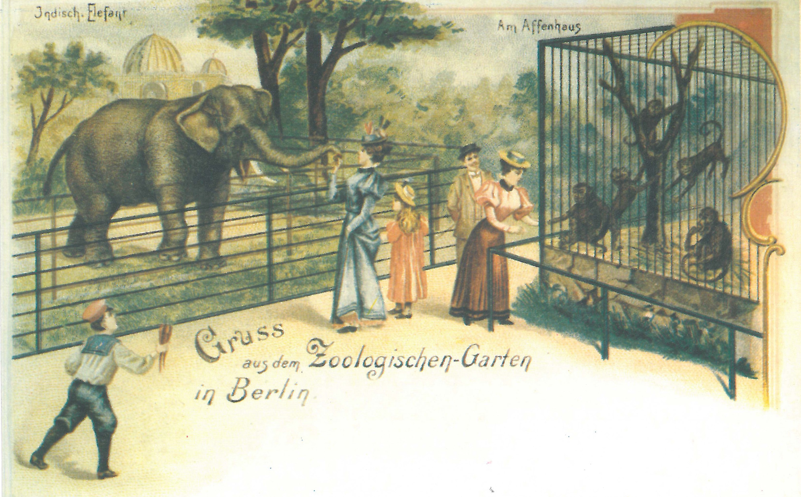

## Der 'systematische Zoo'

nach und nach die ersten Steinbauten, diese sind meist für einzelne Indivuen einer Art angelegt, Zucht wurde nicht beabsichtig.
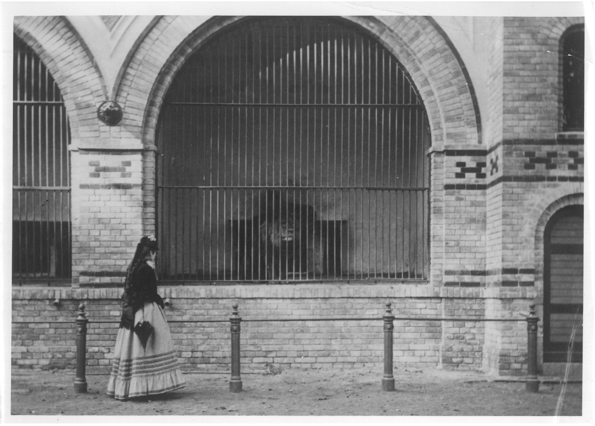

Auch in den Außengehegen setzt sich das fort
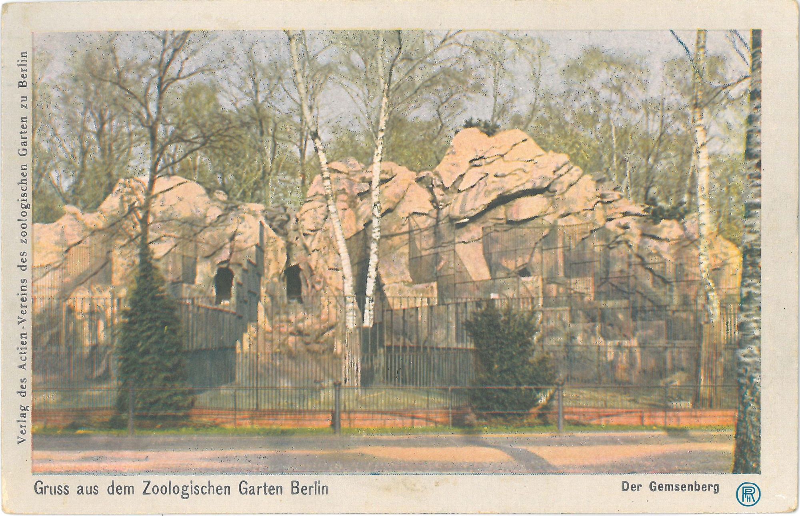

_Das Innere des Vogelhauses glich einem 'Supermarktregal' mit endlosen Reihen kleiner Käfige übereinander. In den meisten lebte nur ein Individuum einer Art, um 1930. (AZGB)_

Ab etwa 1871 dann exotisierende Architektur, erste wirkliche Freianlagen vor den Häusern sehr klein
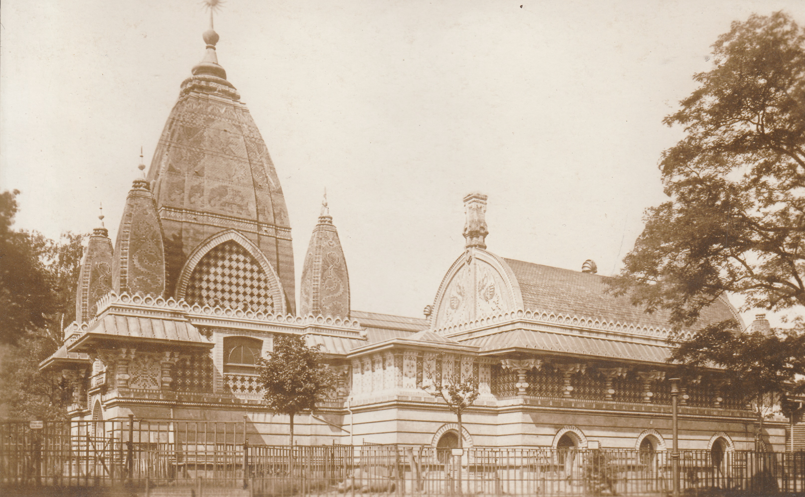

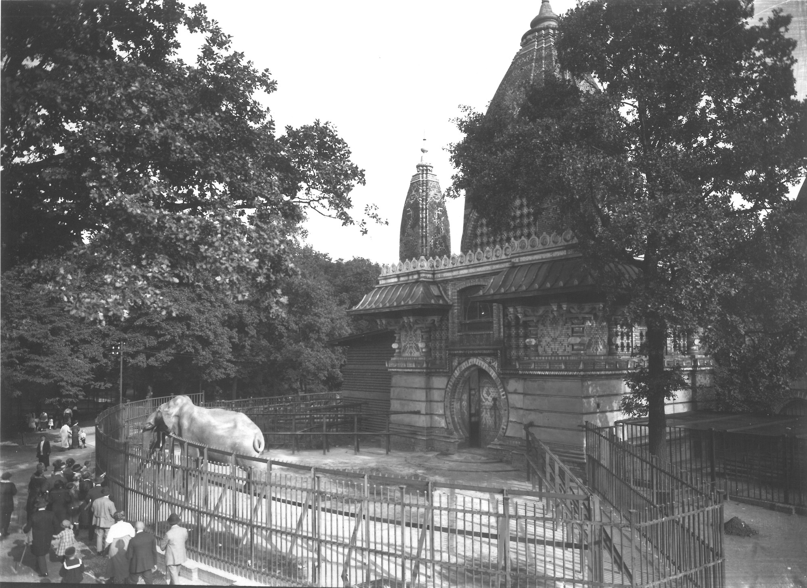

Strukturen der Ausstellung
- Zoogeographie
- Habitat
- Popularität
- Behavioural[^exhibition]

## 'Hagenbeckereien' und Exotismus

Hagenbecks Panoramen setzen sich durch, Kulissenbauten
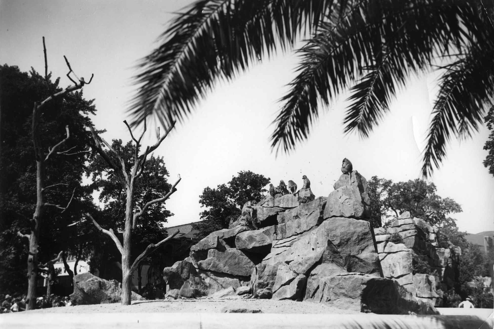

Löwensteppe als Bühneninszenierung
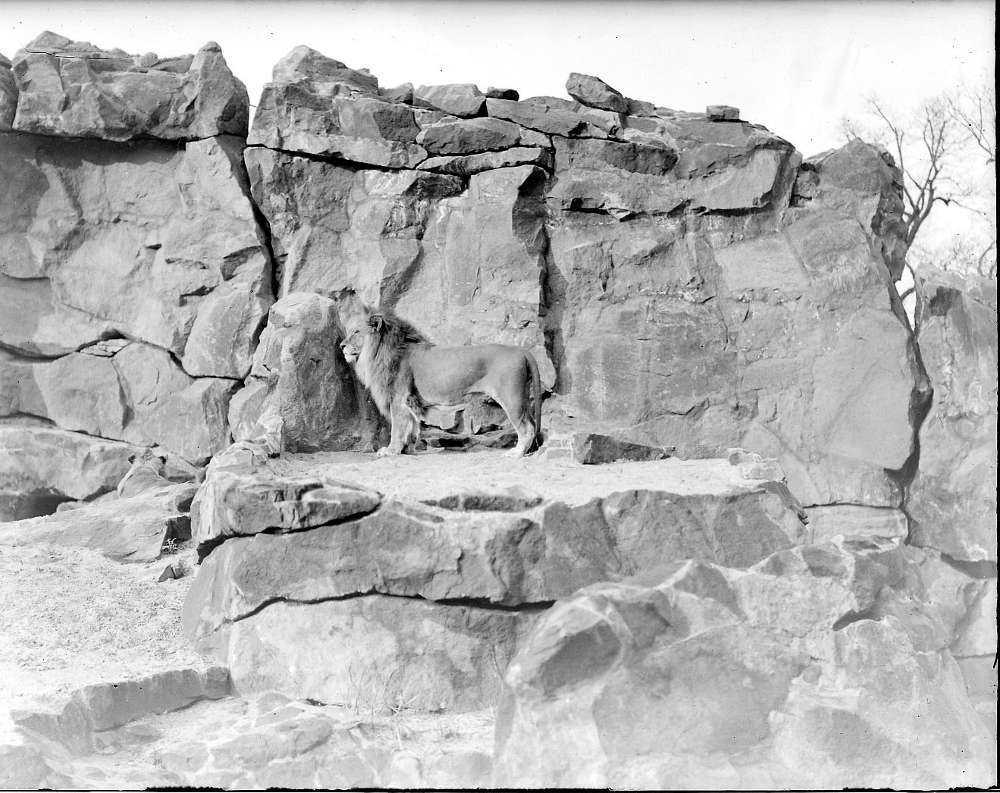

Nach wie vor exotisierende Bauten auch zu Beginn des 20. Jahrhunderts
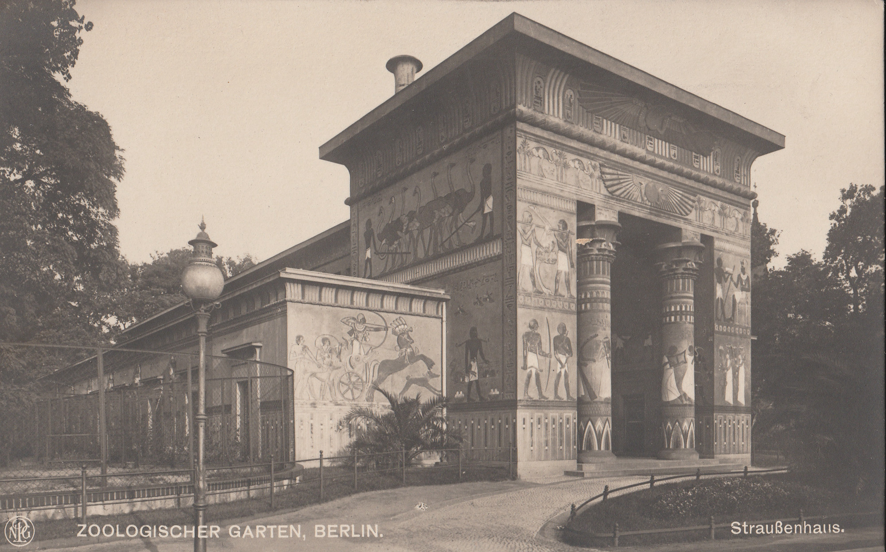

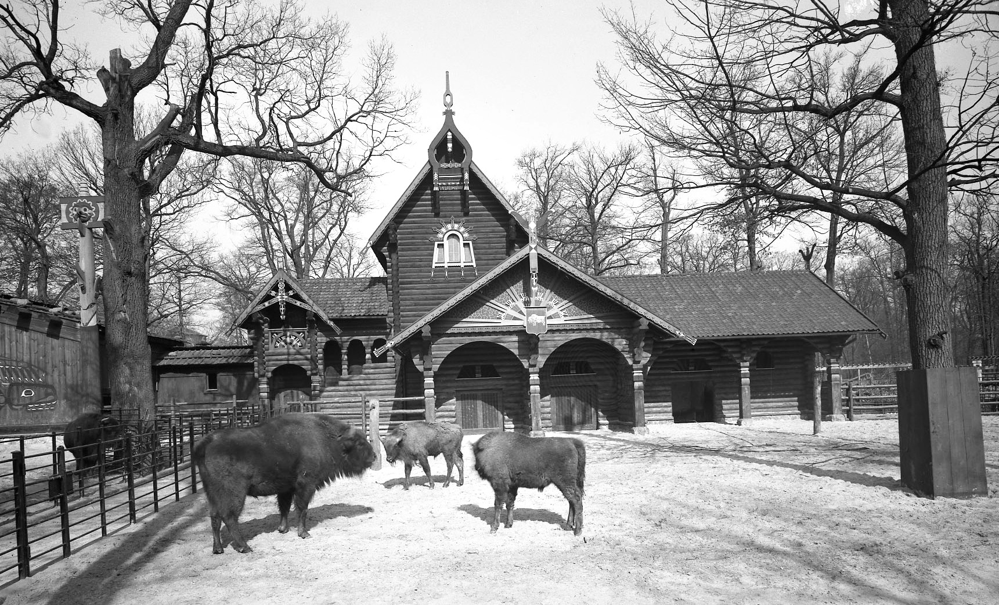

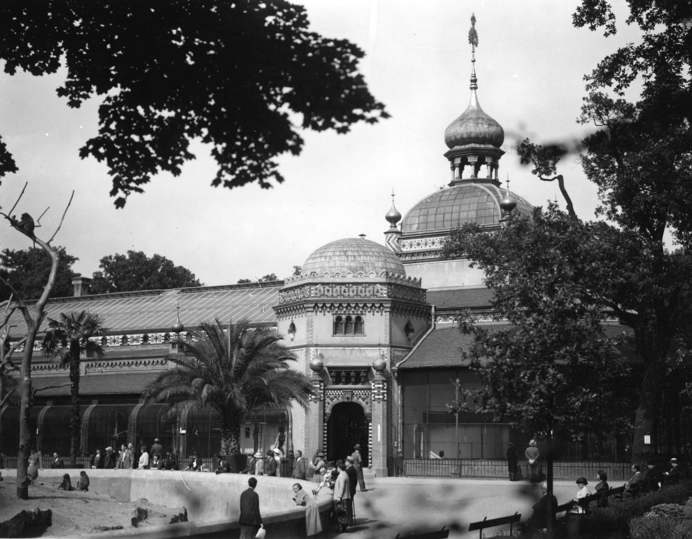

## 'Brutalismus'

Versuch moderner Zooarchitektur im Tierpark Anfang 1960er Jahre
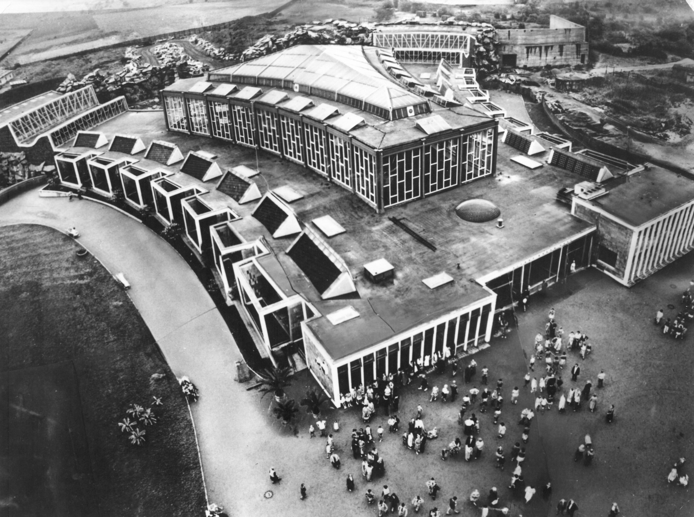

Viel zu viele Tiere auf kleinstem Raum
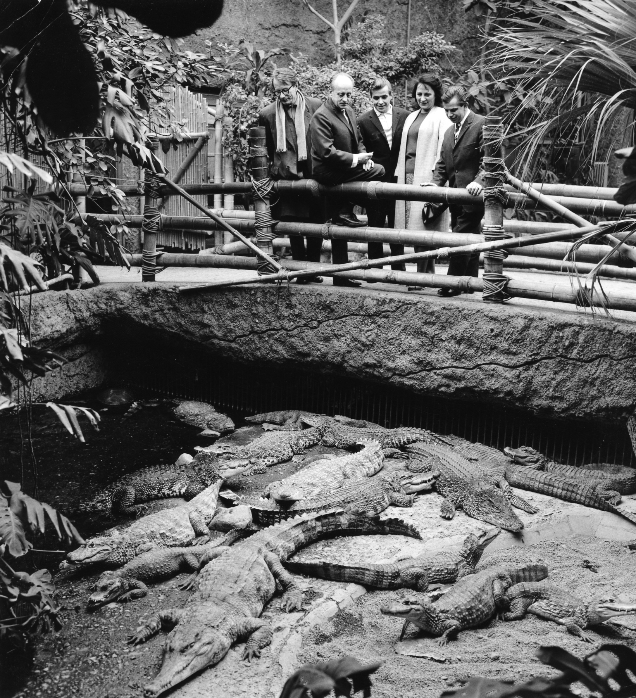

Hauptsache leicht zu reinigen Zooarchitektur im Badezimmerstil 1950-1960
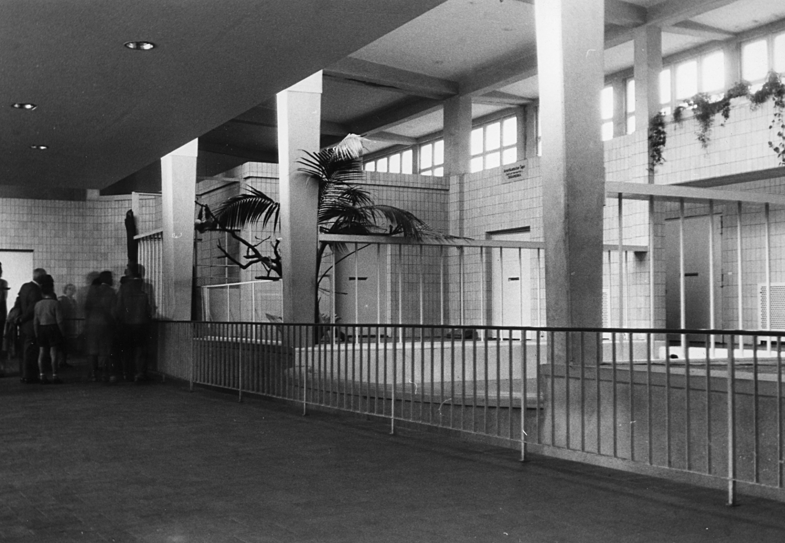
*Innenansicht des XXXX eröffneten Elefanten hauses des Zoo Berlin. (AZGB)*

*Das Raubtierhaus, 1973. (AZGB)*

## Neues Bauen?

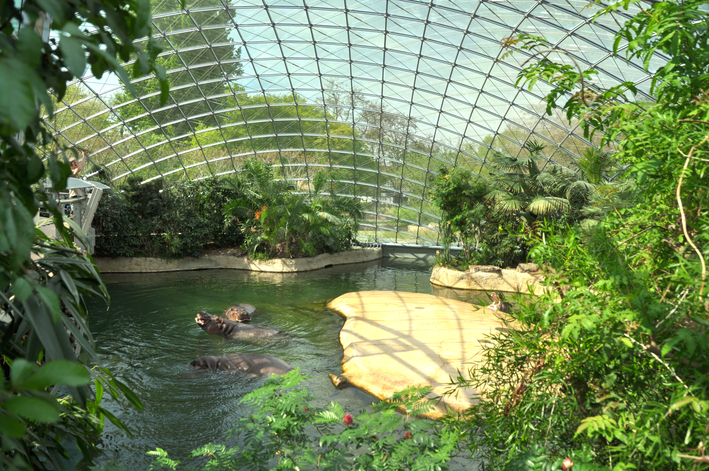
Dass Innere des Flusspferdhauses, 2019. (Clemens Maier-Wolthausen)

Hauck, Thomas E., Stefanie Hennecke, André Krebber, Wiebke Reinert, und Mieke Roscher. „Über die (Un-)Sichtbarkeit der Tiere im Zoo und die ‚Zoofizierung‘ des urbanen Raums“. In Urbane Tier-Räume, herausgegeben von Thomas E. Hauck, Stefanie Hennecke, André Krebber, Wiebke Reinert, und Mieke Roscher, 135–38. Berlinb: Dietrich Reimer Verlag, 2017.
Röntz, Ariane. „Tier-Mensch-Begegnungen entwerfen. Die Landschaftsarchitektonische Sicht auf das Phänomen der Grenze in zeitgenössischen Zoos“. In Urbane Tier-Räume, herausgegeben von Thomas E. Hauck, Stefanie Hennecke, André Krebber, Wiebke Reinert, und Mieke Roscher, 115–34. Berlinb: Dietrich Reimer Verlag, 2017.

> “Der Reiz des Exotischen lag nicht nur in der Omnipräsenz seltener, sogenannter ‘wilder’ Tiere in den zoologischen Gärten, sondern seit der zweiten Hälfte des 19. Jahrhunderts auch in der Verbreitung einer ethnographisch geprägten Architektur. Sie ersetzte die landwirtschaftlichen Gebäude aus Holz, Ziegel oder Stroh, die in den Zoos verbreitet waren. Diese waren von den Konstruktionen der englischen Gärten des 18. Jahrhunderts inspiriert und zeugten von der Neigung zum Pittoresken und Theatralischen, aber auch von dem Bestreben, die fremde Tierwelt in eine heimische europäische Umgebung zu integrieren und sie in den Dienst des Menschen zu stellen.”[^baratay2]
 
> “Exotische Tierwelt wurde konsumierbar und so allmählich dem westlichen Erlebniskanon als etwas Fremdes und doch Eigenes einverleibt.”[^woebse]

[^baratay2]: Baratay, Eric. 2021. „Theater des ‚Wilden‘: Zoologische Gärten in der Zeit August Gauls“. In _August Gaul. Moderne Tiere_, hg. von K. Lee Chichester, Nina Zimmer, und Kunstmuseum Bern, München: Hirmer: 45–58, 47.
[^woebse]: Anna-Katharina Wöbse, „Globale Kreaturen: Tiere in der internationalen Politik des frühen 20. Jahrhunderts“, in _Tierische Geschichte: Die Beziehung von Mensch und Tier in der Kultur der Moderne_, hg. von Dorothee Brantz und Christof Mauch (Leiden: Ferdinand Schöningh, 2009), 304–322, 306.
[^exhibition]: Bob Mullan und Garry Marvin, _Zoo Culture_, 2. Aufl. (Urbana, Chicago: University of Illinois Press, 1999): 69.
