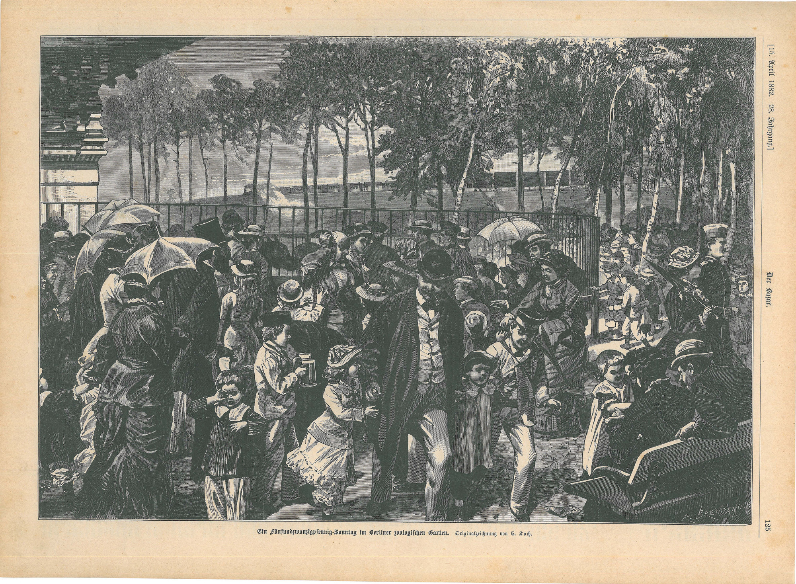

:::EN:::

:::DE:::

## Nicht nur die Tiere - Zoobesuche als Events

## Das erwünschte Publikum des Berliner Zoos zur Gründung

## Eliten

<!-- Hier noch die Eintrittskarten und Jahresabos -->

## Ein breiteres Publikum

## "Völkerschauen"

- Sondereingang
- Sonderschaugelände

## Konzerte

## Kuren

## Die große Restauration

## Bälle und Kongresse

## Flanieren

## Zirkus, Boxzelt und Oktoberfeste

## Tierpark als Familientagesausflug

## Tierpark als politische Bühne

