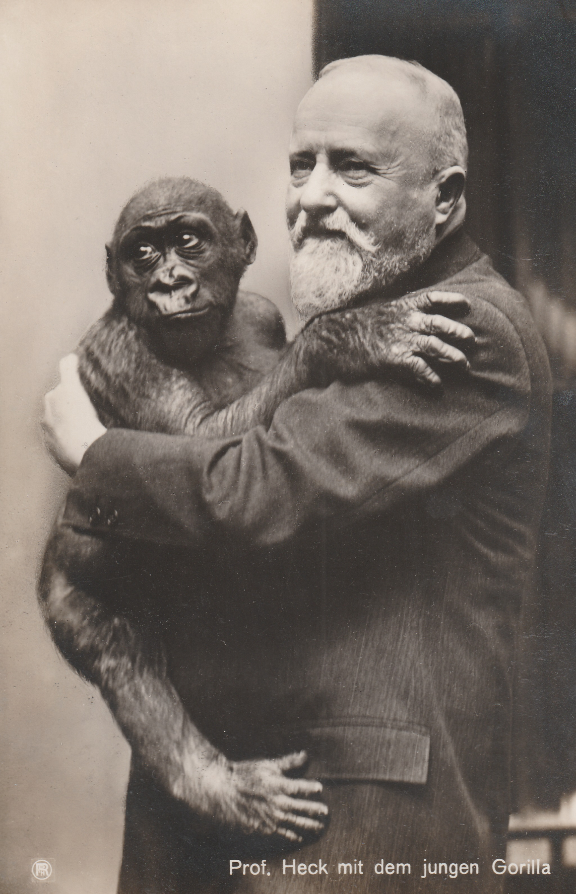
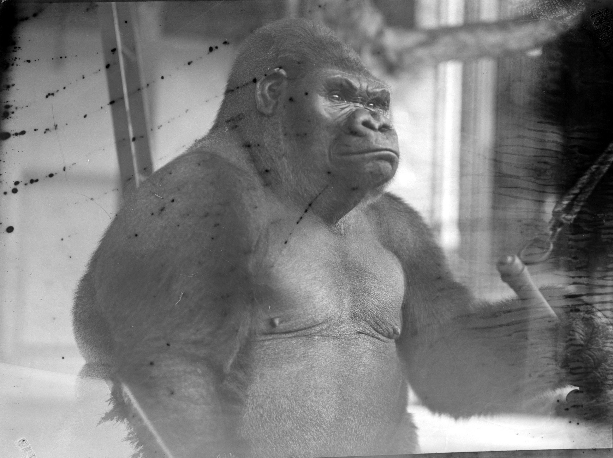

:::EN:::

EN content

:::DE:::

## Leben und Reise des Gorilla "Bobby"

<!-- Bild des toten Gorilla -->

## Fang

-	Von Kamerun über Marseille nach Berlin
    Quellen: Bericht der Zugfahrt??
    - die Akklimatisationsstation von Ruhe bei Marseille
	Themen: Kolonialimus, Gorillas ausstellen (Umlauff, Naturkundemuseen, Zoos), Evolutionstheorie

Actien-Verein des zoologischen Gartens zu Berlin: Geschäftsbericht über das Jahr 1928, Berlin 1929, o.S.: "Das Glanzstück unter den Ankäufen des Jahres 1928 war aber der junge männliche Gorilla, den wir uns nur durch umgehende telegraphische Bestellung sichern konnten, es war ein allgemeiner Wettbewerb um ihn. Er ist inzwischen schon merklich gewachsen und läßt auch für die Zukunft günstige Weiterentwicklung erhoffen." 

Eipper, Paul. _Tiere sehen dich an_. München: Piper & Co, 1952.:
**"Bobby" Ankunft**
Gerücht, nach Marseille komme ein Gorilla, Ruhe ist im Akklimatisationsgarten bei Nizza und als erster zur Stelle.- Zahnbestand lässt vermuten, dass er drei Jahre alt war.- kam aber als Säugling in menschliche Obhut bei Pflanzer-Paar.- die meisten Gorillas starben bald, Bobby aber war an Milchbrei, Kindermehl, gesüßten Tee, Obst und Gemüse schon gewöhnt.- mit dem Gorilla auch ein junger Schimpanse, der die letzten Monat in Kamerun bei ihm gewesen war.- 124

Zoo hatte die Tiere dem New Yorker Garten weggeschnappt.- alter Wärter auf Transport dabei.- 125

Zugreise durch die Schweiz.- Gorilla neugierig entspannt.- 126

Schimpanse "Toto".- 127

beide toben durchs Abteil.- in berlin kommt Bobby erst einmal allein in ein Gehege.- 128

Bilderseiten Boby mit Liebetreu

Schimpanse hatte beginnende Lungenentzündung.- Wiedervereinigung im Außenkäfig.- 129

ernsthaftes "Wesen". 130

Brandes über Aufzucht von Gorillas (104)
"Für den Tiergärtner ist es von größtem Interesse, möglichst zuverlässige Anhaltspunkte über die normale Entwicklung der verschiedensten Tiere hinsichtlich Größe Gewicht, Zahndurchbruch, Zahnwechsel usw. zu haben. Ganz besonders gilt dieses für die wertvollsten Tiere, deren glückliche Aufzucht natürlich ein ungemein wichtiges, auch wirtschaftlich wichtige Problem ist, zumal wir gerade von solchen Tieren nur sehr lückenhafte Kenntnisse aus ihrem Freileben haben können. Hier sind in erster Linie zu nennen die Menschenaffen und von ihnen die am seltensten in Europa zur Pflege gelangten Gorillas. Jeder Gorilla, der - sei es in seiner Heimat Afrika, sei es in Europa oder Amerika gepflegt wurde und zur Zeit gepflegt wird- war entweder der erschossenen Mutter von der Brust genommen oder oder bei sonst einer günstigen Gelegenheit als Kind gefangen worden. Nur ganz wenige haben von diesen haben bisher längere Zeit in der Gefangenschaftausgehalten, ... [^brandes1]

* 1928 etwa zweijährig durch die Tierhandlung Ruhe, Alfeld, nach Berlin

 Das Gewicht ihrer Tiere war für Zoologische Gärten immer schon ein wichtiges Kriterium für den Schauwert der Tiere und wurde als Ausweis für Gesundheit und Wohlbefinden öffentlich in Szene gesetzt [backlink: Bobby]. Dazu gehörte auch, nach dem Tod Organe oder Knochen zu wiegen und die Zahlen bekanntzugeben. 

## Leben im Zoo 
	Gewicht
- Bild der Gewichtstafel am Gehege - immer wieder die Erwähnung, dass er der erste Gorilla war, der in einem Zoo erwachsen wurde --> Eipper, Paul. „Der Gorilla Bobby“. _Kölnische Illustrierte Zeitung_, 13. Juli 1935. In AZGB mit Bild des Gewichtsschildes am Käfig

"Wollen wir Tiergärtner eine Lehre aus diesem Ergebnis ziehen, so ist es die, daß der Gorilla sehr reichlich gefüttert werden muß; denn ein so rapides Wachstum, wie es sich hier findet erfordert natürlich auch reichliches Heiz- und Baumaterial."[^brandes2] (Brandes, 116) Liegt hier der Grund für die Verfettung?
	…

Veterinärmedizinies Wissen über Ernährung von Affen im Zoo: 
"Überhaupt dürfen wir mit den Gesundheits- und sonstigen Verhältnissen in unserem Affenpalmenhause sehr zufrieden sein. Während man wohl sagen darf, daß man früher froh war, Affen einigermaßen am Leben erhalten zu können, Zuchterfolge aber, zumal befriedigende Entwicklung der Jungen, wenig zu verzeichnen waren, haben wir jetzt von nicht weniger als 9 Affenarten Junge, d.h. beinahe von allen, die wir überhaupt in zuchtfähigem Alter und familienweise besitzen. Diesen Erfolg dürfen wir der Einrichtung des Hauses zuschreiben und unserer jetzigen Affenhaltung, in der wir einen großen Fortschritt gemacht haben, seit die Kenntnis der Vitamine einigermaßen Allgemeingut geworden ist." Actien-Verein des zoologischen Gartens zu Berlin: Geschäftsbericht über das Jahr 1928, Berlin 1929, o.S.

Actien-Verein des zoologischen Gartens zu Berlin: Geschäftsbericht über das Jahr 1932, Berlin 1933, o.S.: "Der Gorilla 'Bobby' ist jetzt 7-8 Jahre alt, hat ein Gewicht von 133,5 kg und ist somit der größte Menschenaffe, der jemals irgendwo in Gefangenschaft gewesen ist."

Actien-Verein des zoologischen Gartens zu Berlin: Geschäftsbericht über das Jahr 1933, Berlin 1934, o.S.: "Der Gorilla 'Bobby' hat ein Gewicht von 190 kg bei einem Alter von ungefähr 10 Jahren erreicht und ist somit das einzigartigste und wertvollste Schaustück."

Actien-Verein des zoologischen Gartens zu Berlin: Geschäftsbericht über das Jahr 1934, Berlin 1935, o.S.: "Von den wertvollsten Tieren, dem See-Elefanten "Roland" und dem Gorilla "Bobby" ist nur Gutes zu melden. Letzterer hat ein Gewicht von ca. 250 kg (letzte Wägung am 7.1.1935 ergab 252,5 kg) bei einem jetzigen Alter von ungefähr 11 Jahren. Er ist nach wie vor unser wertvollstes und eigenartigstes Schaustück."

## Tod

**Eipper Mein Bobby ist tot**

Bobby starb am 1. August 1935, Toto ging ihm einige Monate voran.- Eippe habe ihn am 29. März 1928 in Menschenaffenhaus gesetzt.- damals 15 Kg.- in den letzten Wochen Probleme, linke Hand nicht mehr aufgestützt.- 139
er muss Kopfschmerzen gehabt haben, er presste immer seine Fäuste gegen die Schläfen.- verweigert Nahrung.- Liebetreu kann als einziger zu ihm herein.- Schwellungen an Hals und Rachen.- Mutter Liebetreu bringt Leckerbissen und trauert.- bewegt sich kaum noch.- 140
Krämpfe , schaumiges Erbrechen.- Titine kommt zum "Trösten".- Folgen einer Angina.- Bobby erschreckte und begeisterte.- 141
weitere Beschreibungen von Bobbys Körper und Verhalten.- 
Angriff auf Wärter Stellvertreter Wilke als Schreckreaktion.- er sei aber nicht bösartig gewesen.- 144f

## Bedeutung für den Zoo

   - Geschäftsberichte zeigen den Verlust - Extraerwähnung - Zeitungsarchiv checken
	Quellen: Fotografien im Zoo
-	Obduktion
	Quellen: Bericht + Fotografien

"Bobby" war nicht der einzige und auch nicht der erfolgreichste: Bamboo wurde im August 1927 in den Zoo in Philadelphia gebracht und lebte dort länger als die "zehn" Jahre von Bobby (Author ist also misinformiert), bis dahin hätten Gorillas in den USA immer nur ein jahr gelebt. Bobby hätte einen "mean streak" gehabt. (leider keine Quelle) Newman, James L. Encountering Gorillas: A Chronicle of Discovery, Exploitation, Understanding, and Survival. Lanham, Boulder, New York, Toronto, Plymouth: Rowman & Littlefield, 2013: 120.

## Pathologie

Koch, Walter. Bericht über das Ergebnis der Obduktion des Gorilla Bobby des Zoologischen Gartens zu Berlin. Ein Beitrag zur vergleichenden Konstitutionspathologie. Jena: Gustav Fischer Verlag, 1937.

Rümmler, Hans. „2. Niederschriften der wissenschaftlichen Sitzungen im Jahre 1935“. Herausgegeben von Deutsche Gesellschaft für Säugetierkunde. Zeitschrift für Säugetierkunde 12 (1937): 24–37.
———. „3. Führungen usw. im Jahre 1935“. Herausgegeben von Deutsche Gesellschaft für Säugetierkunde. Zeitschrift für Säugetierkunde 12 (1937).
———. „Bericht über die 10. Hauptversammlung“. Herausgegeben von Deutsche Gesellschaft für Säugetierkunde. Zeitschrift für Säugetierkunde 12 (1937).

## "Spreading"

-	Spreading: 
-	Dermoplastik MfN
	Quellen: Bericht?? Fotos Präparation
	Ausstellung im Säugetiersaal des MfN über die Zeit
-	Sammlungen MfN
	Schädel in Säugetiersammlung
	Hand- und Fuß in Naßsammlung
-	Abgüsse
	Anatomische Sammlung Charité

Abgüsse:
auch vom Kadaver von "M'Pungu" wurden Gipsabgüsse genommen und Statuen daraus hergestellt.

Bobby:
Körper zerlegt 
Körper in Publikationen 'seziert' und verteilt; der geschriebene Korpus / Textkorpus
Zerteilung des Körpers auch in verschiedenen Publikationen verwertet > nochmal ‚Zerlegung‘ / Zerteilung
Affenköpfe in Denkerposen 

## Erinnerung

	Totenmasken > wo überall?? (in meinem Büro ;-) Würde diese aus dem "Spreading" herausnehmen, die meisten zumindest, sie sind vielleicht eher Erinnerungen und nicht naturkundliche Objekte in anderen Zusammenhängen, außer natürlich einige wie die im Affenhaus heute
-	Statuen, Logos…
-	Nachkriegszeit bis heute

Das Berliner Zoo-Album. Fotos Friedrich Seidenstücker. Berlin: Nicolai, 1984. Bilder mit Bobby (36f)

Welzbacher, Christian. Bobby. Requiem für einen Gorilla. Berlin: MSB Matthes & Seitz Berlin Verlagsgesellschaft, 2019.

Newman, James L. Encountering Gorillas: A Chronicle of Discovery, Exploitation, Understanding, and Survival. Lanham, Boulder, New York, Toronto, Plymouth: Rowman & Littlefield, 2013.

„‚Bobby‘ trinkt Malzbier“. Neue Zeit, 18. Juli 1935.

---
## Footnotes

[^brandes1]: Brandes, Gustav. „Wichtige Daten über das Heranwachsen des Gorilla“. _Der Zoologische Garten_ 3, Nr. 4/8 (1930): 104–16, 104.

[^brandes2]: Brandes, Gustav. „Wichtige Daten über das Heranwachsen des Gorilla“. _Der Zoologische Garten_ 3, Nr. 4/8 (1930): 104–16, 116.
