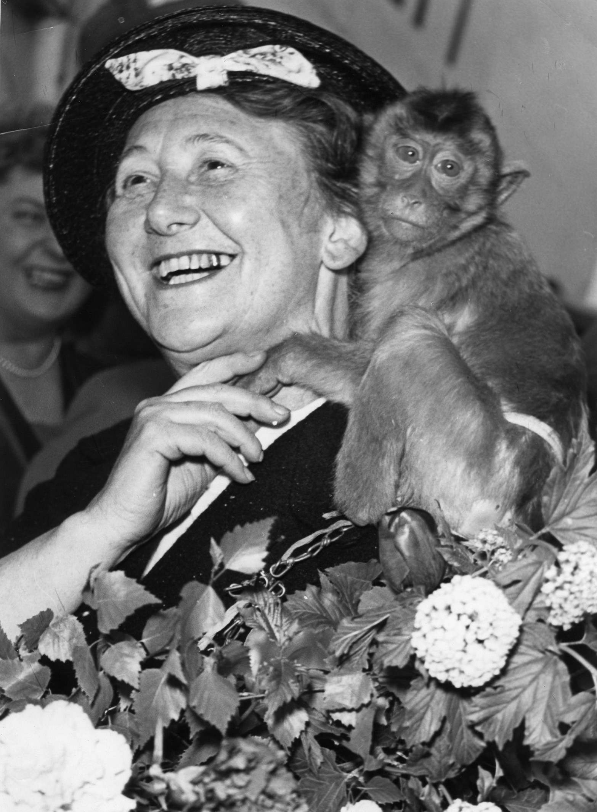
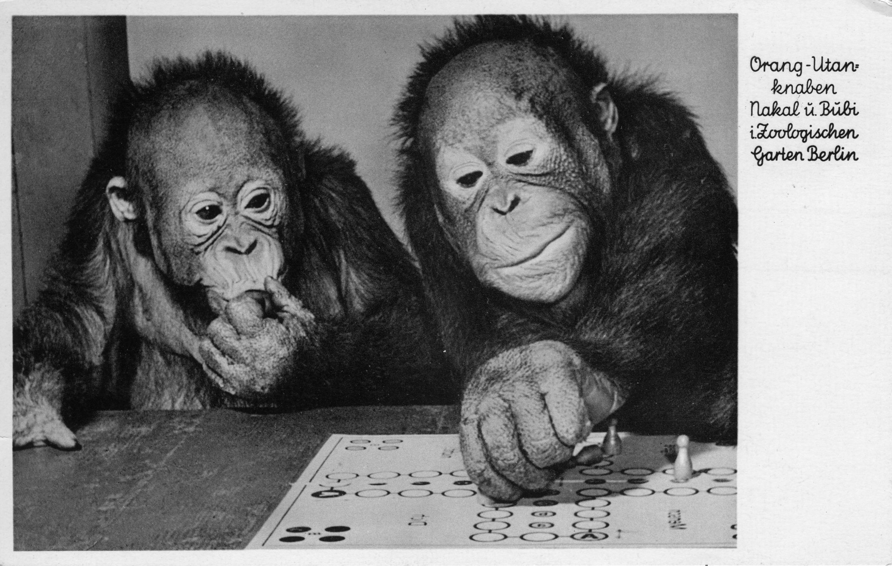
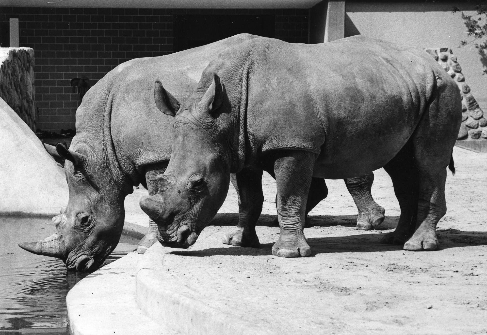
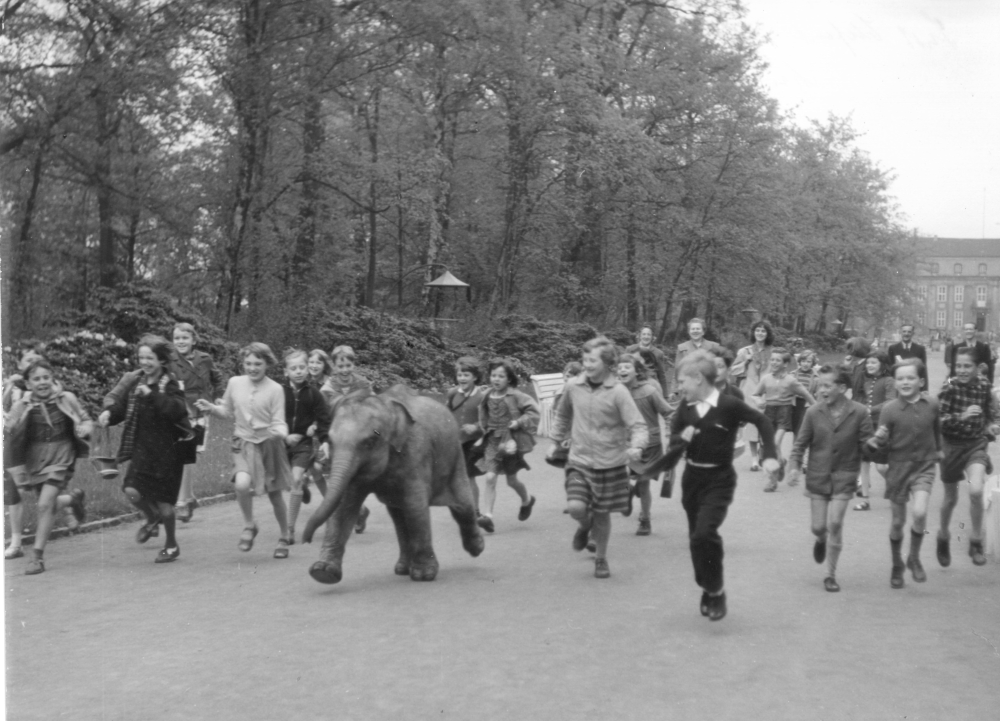
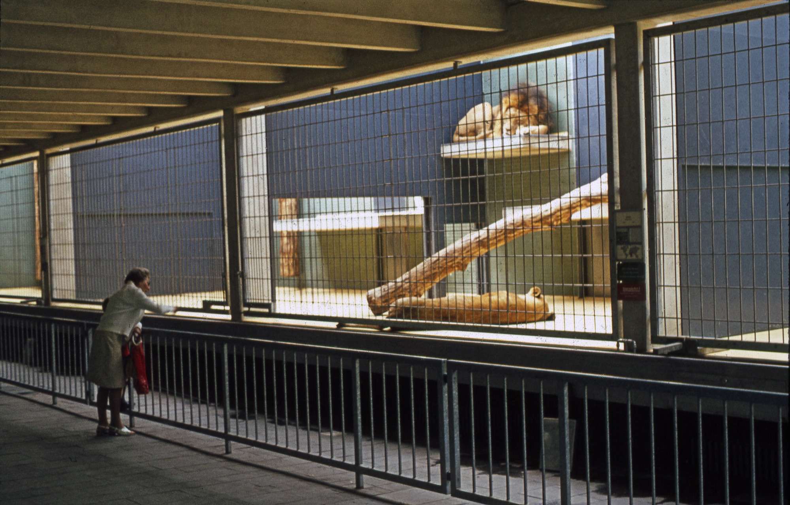

 
:::EN:::

In the summer of 1845, the board of the newly founded "Actien-Verein des Zoologischen Gartens bei Berlin" – the stock association of the Zoological Garden of Berlin – decided to ask Royal Prussian Consuls in the most important foreign trading and coastal cities to donate animals to the zoo. This was the result of a need to obtain urgently needed animals at low cost – especially those not native to Europe coveted by the public – in the face of a shortage of funds.

>"It would be very expedient in general to issue the same notificatorium  to the Royal Prussian Consuls in the most important commercial and coastal places, and at the same time to request them to send inexpensively-purchased live animals, possibly to donate them for the coming summer. This proposal was duly acknowledged, and its execution decided."[^1]

It is no longer possible to reconstruct what immediate effect this call had, but in 1852, 35 animals – most of them gifts – arrived in Berlin. The shipment had been organized by the Prussian Consul General in Cairo, Baron von Pentz.[^2] These animals and virtually all animal objects in the zoos of the time had one thing in common: **For most of the over 250 years that modern zoos have existed, the majority of animals in all zoos worldwide were taken directly from the wild.** The establishment of dozens of new zoological gardens in Europe in the second half of the 19th century created a hitherto unseen desire for live animals – particularly those that were not native to Europe, since these, zoo founders expected, would be most captivating to the public. But the animals had to be captured first. In the first decades after 1850, two modes of animal acquisition emerged in particular: Gifts and status symbols, and purchases from opportunistic traders.

## Status Symbols and Gifts

The two elephant bulls living at the Berlin Zoological Garden in the 1880s, "Rostom" and "Omar", had been gifts: gifts of state from the Prince of Wales and later King Edward VII to his nephew Kaiser Wilhelm II.  They were gifted in 1881, and originated from British-ruled India, from whence they had previously been captured and transported to Britain.

<figure>

<figcaption>

_The two Asian elephant bulls "Rostom" and "Omar", around 1885. "Rostom", atypically for the species, had no tusks. (AZGB. All rights reserved.)_

</figcaption>

</figure>

Like the animals exhibited in so-called travelling and manorial menageries that preceded them, such large animals from other continents and climate zones had long come to Europe via a wide variety of routes to arrive in the newly founded zoos of Germany and Western Europe. Many animal species were valued as status symbols by rulers in their regions of origin, much like the animals in the deer parks or bear pits popular at German and Italian courts. The animals were sold or given to European rulers as gifts.[^3] The general public in larger European cities had previously encountered such non-native and extraordinary-looking animals at travelling carnivals, and now demanded to see them in the newly established zoos. However, the permanent exhibition of larger mammals required the establishment of a commercial trade in animals.

## Trade Opportunists

For a long time, large mammals were rather the exception in zoos, and remained the domain of state gifts. The history of the animal trade probably began with sailors, captains and travelling merchants who, from about the end of the 18th century, brought chance purchases from non-European areas with them upon their return to the ports of Western and Southern Europe and sold them there. Since small animals were easier to transport, it was predominantly these that arrived in Europe. Amongst them were parrots and other birds, as well as various species of guenons and monkeys. Smaller predators and mammals that had been captured as young animals and were accustomed to humans were also common cargo. These were animals whose care did not make high demands of the traveller, and so could be taken care of in the spare time available on ship journeys of several months. This form of trade inevitably resulted in a limited range of species, and for the most part it was also a matter of individual animals.[^4] It is unknown how many animals died on the long sea voyages, were slaughtered or – when they could no longer be cared for – thrown overboard. However, it is fair to assume that growing demand and the expectation of profit led to an increased interest in the preservation and care of the animal commodity . Stables sprang up in ports where the incoming animals could be sold. Early examples were to be found in London and Amsterdam, two cities that became essential to acquiring new animals for the directors of the newly established European zoos. After 1870, moreover, the _Vente publique_ of the Societe Royale d'Anvers in Antwerp became a regular yearly event to which many directors travelled in order to obtain animals for their zoos. Here, animals were auctioned over the course of two days.[^5]

## Colonialism as a Precondition

The fact that these sales points in the ports and the auctions were always filled, and state gifts were on the increase was closely connected to European colonial expansion. The exhibition of non-European wildlife in significant numbers in the newly established zoos was inextricably entangled with European expansion and imperialism. **The military infrastructures and violent foundations of colonialism were necessary preconditions for the chance purchases, the hunting of animals, their transportation to Europe, and their subsequent exhibition** Often colonial officials themselves hunted animals in order to make gifts of them. This is illustrated by the example of the lion that the governor of German East Africa Hermann v. Wissmann donated to the Berlin Zoo in 1896.

<figure>

<figcaption>

_Postcard showing a lion from the German colony of 'Deutsch-Ostafrika', German East Africa, gifted to the Berlin Zoo by Hermann Wissmann, around 1900._

</figcaption>

</figure>

Wissmann, who was known even in Germany for his cruelty to colonized peoples, donated two further lions to the Berlin Zoo in addition to the lion pictured, making a total of one male and two females. The postcard produced by the zoo to mark the occasion shows only the male animal, whose appearance was perhaps more imposing due to his mane and who was thus better suited to publicity purposes. **Explicitly designating the animal as the "Wissmann Lion from German East Africa", the zoo incorporated itself into the colonial project and thus participated in the perpetuation of the colonial agenda.** The gift was valuable in two ways. Firstly, the animals, valued at 3.000 Marks, were noted as assets in the zoo's inventory. Secondly, the zoo was able to profit from colonial exploitation by making use of the advertising appeal of the "German-East African" lion and its patron, who had been elevated to the status of nobility by Kaiser Wilhelm II.[^6] Between about 1890 and 1914, gifts from functionaries of the German administration and merchants in the German colonies reached the Berlin Zoo every year.[^7]

All zoos of colonizing nations profited from the exploitation of the territories controlled by Europeans. Animal trading houses such as Jamrach, Hagenbeck, and Reiche, moreover, also profited from colonial conditions in Africa, Asia, and Oceania. The peoples of the regions occupied and administered by colonial officials were for the most part, and often violently, prevented from making use of their own country’s resources. Yet colonial administrators did grant licenses to trading houses to capture regional fauna.

The establishment of a colonial infrastructure also facilitated animal transportation for hunters and later trading houses, as well as enabling communication with potential clients. Hierarchies based on racism and power relations based on violence in the colonies ensured that animal traders and trappers had a plenty of labourers available for the heavy lifting and life-threatening tasks as well as the actual hunting expeditions.[^8]

Initially, hardly any professional animal traders were active in the German colonies, which, according to Carl Georg Schillings – himself a hunter and animal trapper – was due to poor transportation routes and the overall poor climate conditions of the German colonies. He described the situation in 1905:

>"Neither from German East Africa, nor from Southwest or West Africa has it been possible to get any regular import of live animals going. What the initiative of the well-known animal importer Menges has often succeeded in doing in Somaliland – a territory, however, quite incomparably healthier, where camels and horses can live – namely, the organization of regular exports of foreign animals, has still not been initiated for any of our colonial possessions."[^9]

For Schillings, this finding called for capital and commitment on the German side, for such regular export from the German colonies was in the interest of science, and in the "national interest."

## High Cost and High Risk

It is worth keeping in mind that for some herd-living and dangerous mammals, animal catchers killed other herd members and mother animals to safely obtain the coveted young. Juveniles were much easier to capture and transport than adults. The above-quoted Schillings had caught a rhinoceros for the Berlin Zoo. He had shot the animal’s mother for this purpose. However, the killing of a rhinoceros cow was no guarantor of success since, as Schillings described in a book, the young animals might still make good their escape under certain circumstances.[^10] The zoo bought the rhinoceros by means of an additional budget of 20.000 Reichsmark approved by the supervisory board. However, according to the 1908 annual report, it died four years later of "blood poisoning following pox disease."[^11]

A major risk for the animal traders was transportation, during which the animals could die or fall ill. **We do not have accurate figures on animal losses, but can reasonably assume that mortality was high, especially in the 19th century.** Captured animals would initially have to be kept in place and held captive by means of cages, enclosures, snares or chains until the expedition was completed or the desired number of animals had been collected. Subsequently, the hardships of the long journey could lead to the animal dying soon after arrival in the zoo itself. A report from the Berlin Zoo to the Natural History Museum of Berlin detailing animal carcasses that had been handed over demonstrates this.

<figure>

<figcaption>

_Zoo director Lutz Heck to Hermann Pohle, the curator for mammalian inventory of the National History Museum of Berlin, 07.06.1934. (MfN HBSB S004-02-05 Nr. 97. All rights reserved.)_

</figcaption>

</figure>

Two of the four animal carcasses listed for the Natural History Museum had been delivered by animal traders just a short time before.

## The Big Players – Hagenbeck and Co.

Bundling large shipments could mitigate risk. Although gifts from colonial officials, individual catches, and imports by seafarers enriched the zoos, a further development was necessary to satisfy the demand of the zoos of Europe and North America in the long term. The emergence of professional animal trading companies was central to this, with the firms of Hagenbeck, Reiche, Ruhe and Jamrach at the forefront. It was these commercial animal traders who, by means of large animal transports, facilitated a steady supply of animals for the exhibition of a large number of different species.

>"Although some animals came to zoological parks through donations, trades, or loans, zoos could not have come into existence, and their collections could not have taken the shape that they did, without a commercial trade in wild animals that provided a reliable supply of polar bears in San Antonio, for example, prairie dogs in Philadelphia, or zebra in Denver. Without animal trade few zoos could have displayed more than deer and birds – they would never have become 'real' zoos with elephants."[^12]

**The commercial animal trade, like the chance purchases of European merchants and the gifts of colonial officials, was premised on colonial dominion over the habitats of the animal species.** And although the German Reich became a colonial power relatively late, it was a Hamburg company that played a key role in the animal trade as early as about 1880 - Carl Hagenbeck.

Long before the German Reich occupied its own colonies, companies like Hagenbeck, or later Reiche in Alfeld, were capturing African and Asian animals for the purposes of international trade in the British, French, Dutch and Belgian colonial empires. In 1864, Hagenbeck joined forces with the Austrian animal catcher Lorenzo Casanova in British-ruled Sudan. Casanova built a capturing station for Hagenbeck near Kassala, halfway between Khartoum and the Red Sea coast. After Casanova's death, Hagenbeck maintained this business model and hired permanent "agents" or sales representatives, like Joseph Menges – mentioned above by C. G. Schillings. As the latter described the prevailing division of labour in Kassala, this entailed the (European) trader living quite comfortably, and the Sudanese workers bringing the animals to the "front door."[^13] The traders themselves were rarely or never actively involved. They relied on workers from the local population or nomadic people, who usually did the physical work of hunting, catching as well as caring for the animals in camps set up for collection and capture. The workers also accompanied the transports to the ports and sometimes beyond, to their destination. Although the colonial traders and trappers depended on the many mentioned people, they rarely or never have names in European memory culture; Europeans did not value their work. Images of African hunters and animal caretakers have survived mostly only as anonymous carrier caravans.[^14]

Alongside Hagenbeck, the companies Reiche and Ruhe from Alfeld were also major players in the international animal trade. After the turn of the 20th century, the Ruhe company ran collection and acclimatisation stations near Dire Daua in present-day Ethiopia, and near Nice in France. It was via Nice that the gorilla [["Bobby"|story. Bobby life]] came to Berlin.[^15] The international trade in wild animals was "perhaps the only area of colonial trade that was dominated by Germans."[^16]

That the business of catching and trading animals was profitable was due, among other things, to conditions in the zoos themselves. **In the often far too small enclosures, a lack of veterinary and ethological knowledge led to constant losses in the zoo populations.** There was hardly an animal that could live even close to how it would have in the wild, and the feed given frequently did not correspond to the needs of the animal. As a result of such ignorance, some carnivorous animals were given only vegetarian food, while herbivores were given meat.[^17] Breeding was not possible, because the zoo sometimes kept only single individuals of a species. It was arguably not even necessary, since there was a constant supply of new animals through the animal trade. The only limit was imposed by the financial means of the zoo. The lifespan of zoo animals was usually shorter than it would have been in their natural habitat.

At the beginning of the 20th century, a few zoos also organized or financed their own expeditions to obtain animals. For the London Zoo, and especially for U.S. zoos, these expeditions were not only a supply source for new animals. The Bronx zoos in New York and the National Zoo in Washington, as well as later the London Zoo, were able to market the expeditions themselves to the media through publications.[^18]

**The Berlin Zoo conducted its own capturing expeditions, albeit to a very limited extent.** Lutz Heck, who would later become zoo director, organized three animal catching expeditions in the 1920s and 1930s. In addition to supplying animals, these primarily served self-promotion. Although Heck brought considerable groups of animals to Berlin, it is questionable whether these could not have been obtained more cheaply via trade. For the most part, these trips served the self-promotion of Lutz Heck and the Zoo. Heck used the photos and film footage for extensive publications, full-length films, and lectures.[^19] These publications repeated and reinforced prevailing stereotypes about the people from regions of the earth where the animals had been captured.

<figure>

<figcaption>

_Shipment of two young captured giraffes, 1928. (AZGB, photo Lutz Heck. All rights reserved.)_

</figcaption>

</figure>

## Last Stand – The 1950s

After the end of the Second World War, Berlin lay in ruins. Buying the big cats and large mammals from Africa and Asia that were popular with the public was initially out of the question. So the hunt had to take place on home soil. The zoo director of the reconstruction years, [[material.katharina-heinroth]] not only obtained animals from a disbanded circus, she also acquired native animals, caught in the forests in and around Berlin, to fill the empty enclosures – see [[story.native and exotic]]. It was not until the mid-1950s that the international animal trade once again became a thriving business. Although the trading companies Hagenbeck and Ruhe did not reattain the near monopoly on the animal trade they had enjoyed in the previous long decades, Europe’s war-battered zoos did turn to them to fill their empty enclosures once more.[^20] According to former zoo director Bernhard Blaszkiewitz, around 1960, there was a real rush on gorillas – and not only at the Berlin Zoo, where they had just built the ape house.[^21]  Between 1957 and 1968, the Berlin Zoological Garden received four male and four female animals captured in the wild.[^22]

Colonial authorities and the governments of now independent former colonies were at this point still willing to issue capturing licenses. Zoo director [[material.katharina-heinroth]] flew to Borneo and Sumatra in 1955. This was not a classic trapping expedition; Heinroth had previously received quotes from private individuals and applied to local authorities for capturing and export permits. She came primarily to see the animals in the wild and then select specimens that she would accompany on their journey to the Berlin Zoo. Katharina Heinroth used her vacation for this purpose and brought a shipment of animals back to Berlin.[^23]

<figure>

<figcaption>

_Katharina Heinroth upon her return with the rhesus monkey "Putzi" on her shoulder, 1955. (AZGB. All rights reserved.)_

</figcaption>

</figure>

For the public, the two male orangutan cubs "Bubi" and "Nakal" were certainly the main attraction that Katharina Heinroth brought back from this trip. It is not known how Katharina Heinroth's contacts got hold of these young animals, which were accustomed to human interaction. In the zoo itself, they were kept in close contact with the keepers, as was customary at the time. Photographs of humanising poses like this one with a game of Ludo were among the best-sellers of the Berlin Zoo’s postcards.

<figure>

<figcaption>

_Berlin Zoo postcard picturing the two orangutans "Bubi" und "Nakal", 1959._

</figcaption>

</figure>

In 1963, Heinroth's successor Heinz-Georg Klös went to Apartheid South Africa to catch a pair of southern white rhinos and bring them to the Berlin Zoological Garden. He had received the capturing permit from the South African authorities after a previous application had been rejected in 1957. The two rhinos were paid for by the clothing store, the Leineweber company, for advertising purposes.[^24]

<figure>

<figcaption>

_White rhinos "Hlambamans" und "Kuababa" at the Berlin Zoo, 1964. (AZGB, photo Kleinschmidt. All rights reserved.)_

</figcaption>

</figure>

East Berlin’s newly opened Tierpark could rarely afford the wild-caught animals offered by trading houses. A lack of foreign currency and general paucity of resources made things difficult for the enormous new zoo. Although there had been gifts from well-wishing zoos in the GDR, and also from the Federal Republic, the animals perceived by the public as particularly attractive were barely represented. Nevertheless, the director of the zoo [[material.Heinrich Dathe]] did not have to do without them completely.

In July 1956, the Vietnamese head of state Hồ Chí Minh received a delegation of the Solidarity Committee of the GDR for Korea and Vietnam, and of the national council of the National Front in Hanoi. It was mandatory at the time for the approved, so-called bloc parties of the GDR to unite with the SED under the banner of this latter organization. Vietnamese animals were to be given to the delegation as a state gift. However, the shipment had not yet been fully prepared when the delegation left the country again. The Vietnamese authorities had had bears, python snakes, monkeys and even a tiger caught, and these animals now awaited departure in the port of Hanoi.

What came next was a drama surrounding the animals that went on for over a year. The still young GDR could not source a ship of its own that could call at the port in good time. Some of the animals died in Hanoi. The city committee of the Patriotic Front in Hanoi had even procured an elephant, but the animal did not survive the winter of 1956/57. The Vietnamese made efforts to capture another, but also submitted a query as to whether the deer and monkeys that were already ready for departure might be transported beforehand. **The arrival of suitable transportation was repeatedly announced – and repeatedly cancelled. The list of animals awaiting shipment reported by the GDR’s Hanoi embassy changed constantly.** When finally a Polish ship brought the animals to the GDR, at least one elephant, a number of big cats and monkeys, as well as some ungulates had passed away.[^25] Nevertheless, the animal shipment became a great publicity success for the zoo, which was certainly also due to the elephant calf "Kosko".

<figure>

<figcaption>

_"Kosko" races with elated children, 1958. (Tierpark Berlin, photo Zimmer. All rights reserved.)_

</figcaption>

</figure>

In today's understanding, this success was ultimately achieved at the high price of the death of the other animals during the long waiting period.

## Better Housing Conditions, Breeding Successes, and the End of Commercial Animal Catching

Fractures were now appearing that signalled a possible end to the animal trade. At the meetings of the International Union of Zoo Directors [[material.WAZA]] in 1958 and 1959, incumbent directors had already pointed to the problem of species extinction. Zoo director Heinrich Dathe reported on the panda and silver pheasant, and in the early 1960s, Bernhard Grzimek campaigned for an import ban on orangutans. More on this in [[story.zoos-and-conservation]]. In addition, veterinary medicine, especially reproductive medicine, and behavioural biology were evolving and these findings were also arriving with those charged with the care of zoo animals. Antibiotics and medication for the circulatory system were implemented, and new findings on nutrition and larger enclosures in particular resulted in longer lifespans for animals in human care. In 1983, the Philadelphia Zoo was still being cited as an example:

>"Although one might assume that our nutritional knowledge of captive animals is complete because of our long history of captive animal efforts, 60 to 70% of the animals dying in captivity die because of poor management and husbandry, with nearly 25% dying from nutritional problems."[^26]

Overall, not only did the lifespan of animals in zoos increase, but the animals kept now also successfully reproduced more frequently. **So-called "Badezimmerarchitektur" – relatively spartan "bathroom architecture" – was introduced: an unsuitable form of zoo architecture by today's standards, but new at the time.** Tiled indoor stalls were easy to clean and thus reduced threats produced by unwanted bacteria. In the 1960s, there was little sensitivity for the fact that while this improved the animals’ lifespan, it did little for their wellbeing. Glass fronts, which became widespread from the late 1970s onward, constituted another architectural improvement in housing conditions. They prevented, for example, apes from contracting germs from human visitors and being fed unsuitable food. Read more on this in [[story.Zoo Architecture]], [[story.feeding]] and [[story.feeding-prohibited]].

<figure>

<figcaption>

_ The predator enclosure of the Berlin Zoo was just one example of the so-called bathroom architecture, 1973. (AZGB. All rights reserved.)_

</figcaption>

</figure>

From the 1960s onward, the place of wild-caught animals was increasingly taken by offspring produced in the zoos themselves, and inter-zoo exchanges – for more on this, see [[Züchtungen|story.Breeding Animals for the Zoo]] and [[theme.Getting Zoo Animals]]. Today, zoos generally do not take individuals of endangered species from the wild as part of their species conservation efforts.

In 1975, there was a Convention on International Trade in Endangered Species of Wild Fauna and Flora, or [[material.cites]]. To a great extent, it ultimately put an end to the capturing of endangered animals from the wild for zoos. Commercial trade in wild-caught animals deemed endangered by the International Union for Conservation of Nature (IUCN), an international non-governmental organization, is prohibited. However, trade in offspring and non-commercial trade are possible, provided there is no threat to the continued existence of the species and national laws are observed. Species under special protection already include many of the show animals most popular with zoo visitors.[^27] Others are subject to strict regulations. In addition, there are veterinary regulations to prevent epidemics and diseases. In the case of mammals, zoos have little incentive to acquire wild animals captured in their habitats. Only aquariums continue to obtain specimens from the oceans, with the exception of many reptiles.

[^1]: Board minutes, 28.08.1845, AZGB O 0/1/76. Direct quotes have been translated into English for clarity’s sake.

[^2]: Minutes of the general assembly, 01.06.1852, AZGB O 0/1/62.

[^3]: Valuable insights into the history of the animal trade can be found in Dittrich, Lothar. "Vom Souvenir zum Handelsobjekt. Handel und Import fremdländischer Tiere". In _Menagerie des Kaisers – Zoo der Wiener. 250 Jahre Tiergarten Schönbrunn_, ed. by Mitchell G. Ash and Lothar Dittrich. Wien: Pichler, 2002: 331-343; Dittrich, Lothar. "Der Import von Wildtieren nach Europa - Einfuhren von der frühen Neuzeit bis zur Mitte des 20. Jahrhunderts". In _Tiere unterwegs. Historisches und Aktuelles über Tiererwerb und Tiertransporte_, ed. by Helmut Pechlaner, Dagmar Schratter, and Gerhard Heindl. Tiergarten Schönbrunn – Geschichte. Wien: Braumüller, 2007: 1-64.

[^4]: Dittrich, 2002: 332.

[^5]: Heck, Ludwig. _Heiter-ernste Lebensbeichte. Erinnerungen eines alten Tiergärtners_. Berlin: Deutscher Verlag, 1938: 123ff.

[^6]: Zoo 'Inventory' for 1897, Zoological Garden Berlin. On this, see also [[material.journale-the-zoo-directory]].

[^7]: Cf. Diallo, Oumar, and Joachim Zeller. "Zoologischer Garten, Hardenbergplatz 8". In _Berlin – Eine (post-)koloniale Metropole. Ein historisch-kritischer Stadtrundgang im Bezirk Mitte_, ed. by Farafina e. V. Berlin-Moabit. Berlin: Metropol-Verlag, 2021: 168-175. This is also shown by a systematic review of the annual reports between 1890 and 1914.

[^8]: Cf. inter alia Gissibl, Bernhard. _The nature of German imperialism: conservation and the politics of wildlife in colonial East Africa_. The environment in history: international perspectives, Volume 9. New York: Berghahn Books, 2016; Domínguez, Lara, and Colin Luoma. "Decolonising Conservation Policy: How Colonial Land and Conservation Ideologies Persist and Perpetuate Indigenous Injustices at the Expense of the Environment". _Land_ 9, Nr. 3 (2020). https://doi.org/10.3390/land9030065; Prendergast, David. "Colonial Wildlife Conservation and the Origins of the Society for the Preservation of the Wild Fauna of the Empire (1903-1914)". _Oryx_ 37 (01.04.2003): 251-260. https://doi.org/10.1017/S0030605303000425; MacKenzie, John M. _The Empire of Nature: Hunting, Conservation, and British Imperialism_. Studies in Imperialism. Manchester (UK), New York (NY): St. Martin's Press, 1997; Thompsell, Angela. _Hunting Africa: British Sport, African Knowledge and the Nature of Empire_, 2015.

[^9]: Schillings, Carl Georg. _Mit Blitzlicht und Büchse_. Leipzig, 1905: 188. Direct quotes have been translated into English for clarity’s sake.

[^10]: Schillings, 1905: 190-197.

[^11]: Annual reports of the stock association of the Zoological Garden of Berlin for 1904 and 1908. Direct quotes have been translated into English for clarity’s sake.

[^12]: Hanson, Elizabeth. _Animal Attractions: Nature on Display in American Zoos_. Princeton (NJ): Princeton University Press, 2002: 71, 73.

[^13]: Ames, Eric. _Carl Hagenbeck's Empire of Entertainments_. Seattle: University of Washington Press, 2008: 28-29.

[^14]: Vennen, Mareike. "Arbeitsbilder – Bilderarbeit. Die Herstellung und Zirkulation von Fotografien der Tendaguru-Expedition". In _Dinosaurierfragmente. Zur Geschichte der Tendaguru-Expedition und ihrer Objekte – 1906-2018_, ed. by Ina Heumann, Holger Stoecker, Marco Tamborini, and Mareike Vennen. Göttingen: Wallstein, 2018: 56-75 (especially 64).

[^15]: Eipper, Paul. _Freund aller Tiere. Ein Fahrtenbuch voll bunter Abenteuer_. Berlin: Ullstein, 1937: 94-95.

[^16]: Ames, Eric. _Carl Hagenbeck's Empire of Entertainments_. A McLellan Book. Seattle: University of Washington Press, 2008: 27.

[^17]: Kawata, Ken. "Zoo Animal Feeding: A Natural History Viewpoint". In _Der Zoologische Garten. Neue Folge_ 78 (2008): 17-42.

[^18]: Examples in Hanson, Elizabeth. _Animal attractions: nature on display in American zoos_. Princeton, N.J: Princeton University Press, 2002: 100-129. Besides contemporary newspaper articles, cf. also Mann, William M. _Wild animals in and out of the Zoo_. Bd. 6. Smithsonian Institution series. New York: Smithsonian Institution, 1938; Zoehfeld, Kathleen Weidner. _Wild lives: a history of the people & animals of the Bronx Zoo_. New York: Alfred A. Knopf, 2006; and Attenborough, David. _Zoo Quest to Guiana_. London: Lutterworth Press, 1956.

[^19]: Examples in Heck, Lutz. "Auf Giraffenfang in Ostafrika". In _Die Koralle_ 4, Nr. 10 (1928): 456-460; Heck, Lutz. "Als Tierfänger in Ostafrika. Die Tierfangexpedition des Zoologischen Gartens in Berlin". In _Die Koralle_ 5, Nr. 2 (1929): 82-86; Heck, Lutz. "Als Tierfänger in Ostarfrika". In _Die Kunst und ihre Welt_, Nr. Januar (1930): 8-11; Heck, Lutz. _Aus der Wildnis in den Zoo. Auf Tierfang in Ostafrika_. Berlin: Ullstein, 1930; Heck, Lutz. "Über Giraffen und Giraffenfang". In _Atlantis. Länder, Völker, Reisen_ 3, Nr. 8 (1931): 458-466; Heck, Lutz. "Pavian-Fang in Abessinien". In _Das Tier und wir_, Nr. 6 (1934): 1-6; Heck, Lutz. _Auf Tiersuche in weiter Welt_. Berlin: Paul Parey, 1941.

[^20]: Dittrich, Lothar. "Der Import von Wildtieren nach Europa – Einfuhren von der frühen Neuzeit bis zur Mitte des 20. Jahrhunderts". In _Tiere unterwegs. Historisches und Aktuelles über Tiererwerb und Tiertransporte_, ed. by Helmut Pechlaner, Dagmar Schratter, and Gerhard Heindl. Tiergarten Schönbrunn – Geschichte. Wien: Braumüller, 2007.
 
[^21]: Blaszkiewitz, Bernhard. "Beiträge zur Menschenaffenhaltung im Zoo Berlin nach 1945. 3. Mitteilung: Gorillas (Gorilla gorilla)". _Der Zoologische Garten. Neue Folge 79_ (2010): 232-242.

[^22]: For information on breeding and catches, see "Zootierliste". https://www.zootierliste.de/?klasse=1&ordnung=108&familie=10819&art=1071208 (02.06.2021).

[^23]: Heinroth, Katharina. _Mit Faltern begann's. Mein Leben mit Tieren in Breslau, München und Berlin_. München: Kindler, 1979: 203-212.

[^24]: Klös, Heinz-Georg. _Freundschaft mit Tieren: der Altdirektor des Zoologischen Gartens Berlin erzählt_. Berlin: Edition Q, 1997: 167-178.

[^25]: Copy DDR Ministry for Foreign Affairs to Solidarity Committee for Korea and Vietnam, 12.10.1956, Embassy of the DDR in Hanoi: Memo, 19.03.1957, PA AA, M 01/A 8367 and the entire correspondence on the matter with the ministry in: Politisches Archiv des Auswärtigen Amtes, the political archive of the Federal Foreign Office (PA AA), M 01/A 8367.

[^26]: Robbins, C. T. _Wildlife Feeding and Nutrition_. New York: 1983, cited from Kawata, 2008: 23.

[^27]: "Appendices". _CITES_, https://cites.org/eng/app/appendices.php (02.06.2021).

:::DE:::

Um kostengünstig an dringend benötigte, insbesondere die vom Publikum begehrten und nicht in Europa heimische Tiere zu kommen, beschloss der Vorstand des neugegründeten "Actien-Vereins des Zoologischen Gartens bei Berlin" im Sommer 1845 angesichts seiner Geldknappheit, die Königlich Preußischen Konsuln in den wichtigsten auswärtigen Handels- und Küstenstädten zur Schenkung von Tieren aufzufordern.

>"Es werde überhaupt sehr zweckmäßig sein, dasselbe Notificatorium an die Kgl. Pr. Consuln in den wichtigsten Handels- und Küstenplätzen zu erlassen, und dieselben gleichzeitig zur Uebersendung wohlfeil angekaufter lebender Thiere event.: zur Schenkung derselben für den künftigen Sommer aufzufordern. Dieser Vorschlag ward dienlich anerkannt und seine Ausführung beschlossen."[^1]

Welchen unmittelbaren Effekt dieser Aufforderung hatte, lässt sich nicht mehr rekonstruieren, allerdings kamen 1852 dann 35 Tiere, größtenteils Geschenke, in Berlin an. Der Transport war vom preußischen Generalkonsul in Kairo, Baron von Pentz, organisiert worden.[^2] Diesen Tieren und quasi allen Tierobjekten in den damaligen Zoos war eins gemein: **Für den größten Teil der etwas mehr als 250 Jahre, in denen moderne Zoos existieren, wurde die Mehrheit der Tiere in allen Zoos weltweit direkt aus der Wildbahn entnommen.** Die Gründung von Dutzenden neuer zoologischer Gärten in Europa in der zweiten Hälfte des 19. Jahrhunderts bedingte einen bis dahin nicht gesehenen Bedarf an lebenden Tieren – insbesondere solchen, die in Europa nicht heimisch waren, da diese, so die Erwartung der Zoogründer, das Publikum am meisten fesseln würden. Aber sie mussten zunächst gefangen werden. Dabei lassen sich für die ersten Jahrzehnte nach 1850 insbesondere zwei Modi des Tiererwerbs beschreiben: Geschenke mit Statussymbol-Charakter und Käufe bei opportunistischen Zwischenhändlern.

## Statussymbole und Geschenke

Die beiden Elefantenbullen des Berliner Zoologischen Gartens in den 1880er Jahren, "Rostom" und "Omar", waren Geschenke – Staatsgeschenke des Prince of Wales und späteren König Edward VII. für seinen Neffen Kaiser Wilhelm II. 1881 aus dem britisch beherrschten Indien, wo sie zuvor gefangen und nach Großbritannien transportiert worden waren.

<figure>

<figcaption>

_Die beiden asiatischen Elefantenbullen "Rostom" und "Omar", um 1885. "Rostom" hatte untypischerweise keine Stoßzähne. (AZGB. Alle Rechte vorbehalten.)_

</figcaption>

</figure>

Solche Großtiere aus anderen Kontinenten und Klimazonen waren in den neugegründeten Zoos Deutschlands und Westeuropas, wie die in den sogenannten Wandermenagerien oder den fürstlichen Menagerien zuvor ausgestellten Tiere, lange Zeit auf verschiedensten Wegen nach Europa gekommen. Viele Tierarten wurden in den Herkunftsregionen von dortigen Herrscher\*innen als Statussymbole ebenso geschätzt wie die Tiere in den an deutschen und italienischen Höfen beliebten Hirschgärten oder Bärenzwingern. Die Tiere wurden europäischen Herrscher\*innen verkauft oder geschenkt.[^3] Das allgemeine Publikum in den größeren europäischen Städten hatte solche nicht-einheimischen und außergewöhnlich aussehenden Tiere zuvor bei fahrenden Schausteller\*innen kennengelernt und verlangte sie nun auch in den neu gegründeten Zoos zu sehen. Die Voraussetzung für eine dauerhafte Ausstellung der Großsäuger wurde aber die Entwicklung eines professionellen Tierhandels.

## Handelsopportunisten

Die großen Säugetiere blieben lange Zeit eher die Ausnahme in den Zoos und die Domäne der Staatsgeschenke. Begonnen hat die Geschichte des Tierhandels wohl mit Matrosen, Kapitänen und reisenden Händlern, die etwa seit dem Ende des 18. Jahrhunderts Gelegenheitskäufe aus außereuropäischen Gebieten auf der Rückfahrt in die Häfen West- und Südeuropas mitbrachten und dort verkauften. Da kleine Tiere einfacher zu transportieren waren, kamen insbesondere diese in Europa an. Darunter waren Papageien und andere Vögel, verschiedene Meerkatzenarten und Affenarten. Auch kleinere Raubtiere und Säugetiere, die als Jungtiere gefangen und an Menschen gewöhnt worden waren, boten sich als Fracht an. Es handelte sich um Tiere, deren Pflege wenig anspruchsvoll war und in der Freizeit über Monate an Bord eines Schiffes geleistet werden konnte. Das Spektrum der Arten war bei dieser Handelsform zwangsläufig eingeschränkt und zumeist handelte es sich auch hierbei um einzelne Tiere.[^4] Die Anzahl der Tiere, die auf dem langen Seeweg starben, geschlachtet oder – wenn sie nicht mehr versorgt werden konnten – über Bord geworfen wurden, ist unbekannt. Es ist aber anzunehmen, dass die steigende Nachfrage und der zu erwartende Gewinn das Interesse an der Erhaltung und Pflege der Ware Tier erhöhte. In den Häfen entstanden Ställe, in denen die ankommenden Tiere verkauft wurden. Frühe Beispiele finden sich in London und Amsterdam, zwei Orte, die für die Direktoren der neugegründeten europäischen Zoos essenziell wurden, um neue Tiere zu erwerben. Zu einer regelmäßigen Veranstaltung wurde dann nach 1870 die _Vente publique_ der Societe Royale d'Anvers in Antwerpen. Hier wurden jährlich für zwei Tage Tiere versteigert, wozu viele Direktoren anreisten, um Tiere für ihre Zoos zu erwerben.[^5]

## Kolonialismus als Voraussetzung

Dass diese Verkaufsstellen in den Häfen und die Auktionen immer gefüllt waren und die Staatsgeschenke zunahmen, hing eng mit der europäischen kolonialen Expansion zusammen. Die Ausstellung nichteuropäischer Wildtiere in großer Zahl in den neugegründeten Zoos ist untrennbar mit der europäischen Expansion und dem Imperialismus verknüpft. **Die Gelegenheitskäufe, die Jagd nach Tieren, ihr Transport nach Europa und die anschließende Ausstellung beruhten auf den militärischen Infrastrukturen und gewaltsamen Bedingungen des Kolonialismus.** Oft jagten Kolonialbeamte selbst Tiere, um sie zu verschenken. Das wird am Beispiel des Löwen deutlich, den der Gouverneur von Deutsch-Ostafrika Hermann v. Wissmann 1896 dem Zoo Berlin schenkte.

<figure>

<figcaption>

_Postkarte mit dem von Hermann Wissmann dem Berliner Zoo geschenkten Löwe aus der deutschen Kolonie 'Deutsch-Ostafrika', um 1900._

</figcaption>

</figure>

Neben dem abgebildeten Löwen schenkte der für seine Grausamkeit gegenüber der kolonisierten Bevölkerung auch in Deutschland bekannte Wissmann zwei weitere Löwen dem Berliner Zoo, insgesamt ein Männchen und zwei Weibchen. Auf der Postkarte, die der Zoo zu diesem Anlass produzierte, ist nur das männliche Tier zu sehen. Dieses war seiner Mähne wegen möglicherweise imposanter und passte daher zu der Werbebotschaft der Postkarte. **Mit der expliziten Bezeichnung als "Wissmann-Löwe aus Deutsch-Ostafrika" gliederte sich der Zoo in das koloniale Projekt ein und machte sich so zum Multiplikator des kolonialen Programms.** Das Geschenk war in doppelter Hinsicht wertvoll: Zum einen wurden die Tiere mit einem Wert von 3.000 Mark in der Inventur des Zoos als Guthaben notiert, zum anderen konnte der Zoo von der Ausbeutung der Kolonie durch die Werbewirkung des "deutsch-ostafrikanischen" Löwen und seines durch Kaiser Wilhelm II. in den Adelsstand erhobenen Gönners profitieren.[^6] Zwischen etwa 1890 und 1914 erreichten den Berliner Zoo jedes Jahr Schenkungen von Funktionsträgern der deutschen Verwaltung und Kaufleuten in den deutschen Kolonien.[^7]

Alle Zoos der kolonisierenden Nationen profitierten von der Ausbeutung aller europäisch beherrschten Gebiete. Von den kolonialen Bedingungen in Afrika, Asien und Ozeanien profitierten jedoch auch Tierhandelshäuser wie Jamrach, Hagenbeck und Reiche. Die Bevölkerungen der besetzten und durch Kolonialbeamte verwalteten Regionen wurden von der Nutzung der Ressourcen in ihrem Land weitgehend und oft gewaltsam ausgeschlossen. Wohl aber vergaben Kolonialverwaltungen den Handelshäusern Lizenzen für das Fangen der regionalen Fauna.

Der Aufbau einer kolonialen Infrastruktur erleichterte den Jägern und später den Handelshäusern zudem den Transport der Tiere und die Kommunikation mit möglichen Auftraggebern. Auf Rassismen beruhende Hierarchien und auf Gewalt gestützte Machtverhältnisse vor Ort sorgten dafür, dass Tierhändlern und Tierfängern ein Reservoir von Arbeitskräften für die schweren und lebensgefährlichen Aufgaben sowie die eigentlichen Jagdexpeditionen zur Verfügung stand.[^8]

In den deutschen Kolonien waren zunächst kaum professionelle Tierhändler aktiv, was nach Ansicht Carl Georg Schillings, selbst Jäger und Tierfänger, an den mangelhaften Verkehrsrouten und dem insgesamt schlechten Klima der deutschen Kolonien lag. Er schilderte 1905 die Lage:

>"Weder aus Deutsch-Ost-, noch aus -Südwest- oder -Westafrika ist es überhaupt bis zum heutigen Tage gelungen, irgendwelche regelmäßige Einfuhr von lebenden Tieren in Schwung zu bringen. Was der Initiative des bekannten Tierimporteurs Menges häufig im Somali-Lande, – einem allerdings ganz unvergleichlich gesünderen Lande, in dem Kamele und Pferde leben können – gelungen ist: die Organisation regelmäßiger Exporte fremdländischer Tiere ist für irgend eine unserer kolonialen Besitzungen immer noch nicht in die Wege geleitet."[^9]

Für Schillings begründete dieser Befund die Forderung nach Kapital und Engagement auf deutscher Seite, denn solch ein regelmäßiger Export aus den deutschen Kolonien sei im Interesse der Wissenschaft, ein "nationale\[s] Interesse".

## Ein hoher Preis und hohe Risiken

Es ist wichtig, sich vor Augen zu führen, dass die Fänger bei einigen in Herden lebenden und gefährlichen Säugetieren, Herdenmitglieder oder Muttertiere töteten, um gefahrlos an die begehrten Jungtiere zu kommen. Jungtiere ließen sich wesentlich leichter fangen und transportieren als adulte Tiere. Der zitierte Schillings hatte für den Berliner Zoo ein Nashorn gefangen. Dazu hatte er das Muttertier erschossen. Die Tötung einer Nashornkuh musste aber nicht zwingend zum Erfolg führen, denn, wie Schillings in einem Buch beschrieb, konnten die Jungtiere unter Umständen dennoch entkommen.[^10] Der Zoo kaufte das Nashorn mittels eines zusätzlich durch den Aufsichtsrat genehmigten Budgets von 20.000 Reichsmark. Allerdings verstarb es vier Jahre später an einer "Blutvergiftung nach Pockenerkrankung", wie es im Geschäftsbericht von 1908 hieß.[^11]

Ein wesentliches Risiko für die Tierhändler war der Transportweg, auf dem die Tiere sterben oder erkranken konnten. **Wir haben keine akkuraten Zahlen über die Tierverluste, können aber davon ausgehen, dass die Sterblichkeit insbesondere im 19. Jahrhundert hoch war.** Die gefangenen Tiere mussten an Ort und Stelle mittels Käfigen, Gehegen, Schlingen oder Ketten zunächst fixiert und gefangen gehalten werden, bis die Expedition beendet oder die gewünschte Anzahl Tiere gesammelt worden war. Dann konnten die Strapazen langer Transporte zum schnellen Tod des Tieres im Zoo selbst führen. Eine Meldung des Zoologischen Gartens an das Naturkundemuseum zu Tierkadavern, die man übergeben hatte, zeigt dieses.

<figure>

<figcaption>

_Zoodirektor Lutz Heck an Hermann Pohle, den Säugetierkustos des Naturkundemuseums, 07.06.1934. (MfN HBSB S004-02-05 Nr. 97. Alle Rechte vorbehalten.)_

</figcaption>

</figure>

Zwei der vier aufgeführten Tierkadaver für das Naturkundemuseum waren erst kurz zuvor von Tierhändlern geliefert worden.

## Die großen Spieler – Hagenbeck und Co.

Die Bündelung großer Transporte konnte das Risiko mindern. Zwar bereicherten Geschenke von Kolonialbeamten, einzelne Fänge sowie die Einfuhren durch Seefahrer die Zoos, es musste aber zu einer weiteren Entwicklung kommen, um die Nachfrage der Tiergärten Europas und Nordamerikas dauerhaft zu befriedigen. Zentral war die Entstehung des professionellen Tierhandels mit den Firmen Hagenbeck, Reiche, Ruhe und Jamrach an der Spitze. Erst diese kommerziellen Tierhändler ermöglichten durch große Tiertransporte stetigen Nachschub für die Zurschaustellung einer großen Zahl unterschiedlicher Spezies.

>"Obwohl einige Tiere durch Schenkungen, Tausch oder Leihgaben in die zoologischen Gärten kamen, hätten die Zoos nicht entstehen und ihre Sammlungen nicht die Form annehmen können, die sie angenommen haben, ohne einen kommerziellen Handel mit Wildtieren, der für eine zuverlässige Versorgung mit Eisbären in San Antonio, Präriehunden in Philadelphia oder Zebras in Denver sorgte. Ohne den Tierhandel hätten nur wenige Zoos mehr als Hirsche und Vögel zeigen können - sie wären nie zu 'echten' Zoos mit Elefanten geworden.[^12]

**Der professionelle Tierhandel beruhte ebenso wie die Gelegenheitskäufe von europäischen Kaufleuten oder die Geschenke von Kolonialbeamten auf der kolonialen Beherrschung der Lebensräume der Tierarten selbst.** Und obwohl das Deutsche Reich erst relativ spät in den Kreis der Kolonialmächte eintrat, war es eine Hamburger Firma, die schon ab etwa 1880 eine große Rolle im Tierhandel spielte – Carl Hagenbeck.

Lange bevor das Deutsche Reich eigene Kolonien besetzte, fingen Firmen wie Hagenbeck, oder später Reiche in Alfeld, in den britischen, französischen, niederländischen und belgischen Kolonialreichen afrikanische und asiatische Tiere für den internationalen Handel. 1864 verband sich Hagenbeck im britisch beherrschten Sudan mit dem österreichischen Tierfänger Lorenzo Casanova. Dieser baute für Hagenbeck eine Fangstation bei Kassala – auf halbem Weg zwischen Khartum und der Küste des Roten Meeres. Auch nach dessen Tod behielt Hagenbeck dieses Modell bei und engagierte feste "Agenten" – oder Handelsvertreter – wie den oben von C. G. Schillings erwähnten Joseph Menges. Jener beschrieb die in Kassala vorherrschende Arbeitsteilung in der Form, dass der (europäische) Händler in Kassala recht komfortabel lebe und die sudanesischen Arbeiter\*innen die Tiere bis vor die "Haustür" brächten.[^13] Selten oder nie waren die Händler selber aktiv. Sie verließen sich auf Arbeiter\*innen aus der lokalen Bevölkerung oder nomadisch lebende Menschen, die in der Regel die physische Arbeit des Jagens, Fangens und auch der Pflege im Sammel- oder Fanglager verrichteten. Ebenso begleiteten Arbeiter\*innen die Transporte bis zu den Häfen und einige manchmal darüber hinaus bis an ihr Ziel. Obwohl die kolonialen Händler und Tierfänger auf die Arbeit der vielen genannten Menschen angewiesen waren, haben sie in deren Erinnerungen selten oder nie Namen. Europäer\*innen schätzten ihre Arbeit nicht wert. Bilder von afrikanischen Jäger\*innen und Tierpfleger\*innen sind zumeist nur als anonyme Trägerkarawanen überliefert.[^14]

Neben Hagenbeck waren auch die Firmen Reiche und Ruhe aus Alfeld bestimmende Größen im internationalen Tierhandel. Die Firma Ruhe betrieb nach der Wende zum 20. Jahrhundert bei Dire Daua im heutigen Äthiopien und bei Nizza Sammel- und Akklimatisationsstationen. Über Nizza kam auch der Gorilla [["Bobby"|story. Bobby life]] nach Berlin.[^15] Der internationale Handel mit Wildtieren war "perhaps the only area of colonial trade that was dominated by Germans".[^16]

Dass sich das Geschäft mit dem Tierfang und Handel lohnte, lag unter anderem am Zustand der Tiergärten selbst. **Mangelndes tiermedizinisches und ethologisches Wissen führte in den oft viel zu kleinen Gehegen zu ständigen Verlusten in den Zoopopulationen.** Es gab kaum ein Tier, das auch nur annähernd sein angeborenes Verhalten zeigen konnte, die Nahrung entsprach oft nicht den Bedürfnissen der Tiere. So wurde gar manchen fleischfressenden Tieren aus Unwissenheit nur vegetarische Nahrung gegeben, Herbivore erhielten hingegen Fleisch.[^17] Nachzucht war nicht möglich, da manchmal nur einzelne Individuen einer Art gehalten wurden, und vielleicht auch gar nicht nötig, denn es gab ja ständigen Nachschub durch den Tierhandel. Dieser war nur durch die finanziellen Mittel eines Zoos begrenzt. Die Lebenszeit von Zootieren war in der Regel kürzer als in ihrem natürlichen Lebensraum.

Zu Beginn des 20. Jahrhunderts organisierten oder finanzierten einige wenige Zoos auch eigene Expeditionen zur Beschaffung von Tieren. Zunächst im Zoo von London und besonders in US-amerikanischen Zoos waren diese Expeditionen nicht nur eine Bezugsquelle neuer Tiere. Die Zoos aus der Bronx in New York und der National Zoo in Washington sowie später auch der Londoner Zoo konnten die Expeditionen durch Publikationen medienwirksam vermarkten.[^18]

**Im Berliner Zoo wurden, wenn auch nur in einem sehr begrenzten Ausmaß, eigene Fangexpeditionen durchgeführt.** Lutz Heck, der spätere Zoodirektor, organisierte in den 1920er und 1930er Jahren drei Tierfangexpeditionen, die neben dem Tiernachschub vor allem der eigenen Werbung dienten. Zwar brachte Heck beachtliche Gruppen von Tieren nach Berlin, es ist aber fraglich, ob diese über den Handel nicht preiswerter zu beschaffen gewesen wären. Die Reisen dienten insbesondere der Eigenwerbung Lutz Hecks und des Zoos. Heck nutzte die Fotos und Filmaufnahmen für umfangreiche Publikationen, abendfüllende Filme und Vorträge.[^19] Diese Veröffentlichungen wiederholten und verstärkten dabei die vorherrschenden Stereotype über die Menschen in den Erdregionen, in denen die Tiere gefangen worden waren.

<figure>

<figcaption>

_Transport zwei gefangener junger Giraffen, 1928. (AZGB, Foto Lutz Heck. Alle Rechte vorbehalten.)_

</figcaption>

</figure>

## Letztes Aufbäumen – die 1950er Jahre

Nach dem Ende des Zweiten Weltkriegs lag Berlin in Trümmern, ein Kauf der beim Publikum beliebten Raubkatzen oder Großsäuger aus Afrika und Asien kam zunächst nicht in Frage. Die Jagd musste also auf heimischem Boden stattfinden. Die Zoodirektorin der Jahre des Wiederaufbaus, [[material.katharina-heinroth]] bezog nicht nur Tiere aus einem aufgelösten Zirkus, sie bekam zum Füllen der leeren Gehege auch einheimische Tiere, gefangen in den Wäldern in und um Berlin, siehe  [[story.native and exotic]]. Erst zur Mitte der 1950er Jahre wurde der internationale Tierhandel noch einmal ein florierendes Geschäft. Zwar erreichten die Handelsfirmen Hagenbeck und Ruhe das lange Jahrzehnte bestehende quasi-Monopol im Tierhandel nicht mehr, aber die kriegszerstörten Tiergärten in Europa füllten ihre leeren Gehege mit ihrer Hilfe wieder auf.[^20] Laut dem ehemaligen Zoodirektor Bernhard Blaszkiewitz begann nicht nur im Berliner Zoo um 1960 ein regelrechter Ansturm auf Gorillas.[^21] In Berlin hatte man gerade das Menschenaffenhaus gebaut. Zwischen 1957 und 1968 erhielt der Berliner Zoologische Garten vier männliche und vier weibliche Wildfänge.[^22]

Noch waren sowohl Kolonialbehörden als auch die Regierungen nun unabhängiger ehemaliger Kolonien bereit, Fanglizenzen zu vergeben. Die Zoodirektorin [[material.katharina-heinroth]] flog 1955 nach Borneo und Sumatra. Es handelte sich dabei nicht um eine klassische Fangfahrt, Heinroth hatte zuvor von Privatleuten Angebote bekommen und bei lokalen Behörden um die Fang- und Ausfuhrerlaubnisse angesucht. Sie kam vor allem, um die Tiere in der Wildbahn zu sehen und dann Exemplare auszusuchen und auf dem Transport in den Berliner Zoo zu begleiten. Katharina Heinroth nutzte dafür ihren Urlaub und brachte einen Tiertransport mit nach Berlin.[^23]

<figure>

<figcaption>

_Katharina Heinroth bei ihrer Rückkehr mit dem Rhesusaffen "Putzi" auf der Schulter, 1955. (AZGB. Alle Rechte vorbehalten.)_

</figcaption>

</figure>

Für die Besucher\*innen waren die beiden männlichen Orang-Utan-Jungtiere "Bubi" und "Nakal" sicher die größte Attraktion, die Katharina Heinroth von dieser Reise mitbrachte. Es ist nicht überliefert, wie die Kontaktpersonen Katharina Heinroths an diese an Menschen gewöhnten Jungtiere gekommen waren. Im Zoo selbst wurden sie, wie damals üblich, im Nahkontakt mit den Pfleger\*innen gehalten. Vermenschlichende Aufnahmen wie diese mit einem Mensch-ärgere-dich-nicht-Spiel gehörten zu den Verkaufsschlagern unter den Postkarten des Zoos.

<figure>

<figcaption>

_Postkarte des Zoo Berlin mit den beiden Orang-Utans "Bubi" und "Nakal", 1959._

</figcaption>

</figure>

1963 fuhr Heinroths Nachfolger Heinz-Georg Klös nach Apartheid-Südafrika, um ein Paar Südliche Breitmaulnashörner zu fangen und in den Zoologischen Garten Berlin zu bringen. Die Fangerlaubnis hatte er durch die südafrikanischen Behörden erhalten, nachdem seine Fangerlaubnis 1957 noch abgelehnt worden war. Die beiden Nashörner wurden als Werbemaßnahme von der Firma Leineweber, einem Bekleidungshaus, bezahlt.[^24]

<figure>

<figcaption>

_Breitmaulnashörner "Hlambamans" und "Kuababa" im Zoo Berlin, 1964. (AZGB, Foto Kleinschmidt. Alle Rechte vorbehalten.)_

</figcaption>

</figure>

Im neu eröffneten Tierpark in Ost-Berlin konnte man sich die angebotenen, wildgefangenen Tiere der Handelshäuser selten leisten. Devisen- und allgemeiner Ressourcenmangel machte dem riesigen neuen Zoo zu schaffen. Zwar hatte es Geschenke wohlwollender Zoos der DDR und auch der Bundesrepublik gegeben, die von den Besucher\*innen als besonders attraktiv wahrgenommenen Tiere waren aber kaum vorhanden. Dennoch musste der Direktor des Tierparks [[material.Heinrich Dathe]] nicht ganz auf sie verzichten.

Im Juli 1956 empfing der vietnamesische Staatschef Ho Chi Minh in Hanoi eine Delegation des Solidaritätsausschusses der DDR für Korea und Vietnam und des Nationalrates der Nationalen Front. Letzteres war die Zwangsorganisation unter der sich die zugelassenen, sogenannten Blockparteien mit der SED zusammenschließen mussten. Der Delegation sollten vietnamesische Tiere als Staatsgeschenk übereignet werden. Allerdings war der Transport noch nicht ganz vorbereitet, als die Delegation das Land wieder verließ. Die vietnamesischen Behörden hatten Bären, Pythonschlangen, Affen und sogar einen Tiger fangen lassen, die nun im Hafen von Hanoi auf den Abtransport warteten.

Nun folgte ein über ein Jahr dauerndes Drama um die Tiere. Die noch junge DDR fand kein eigenes Schiff, welches zeitnah die Region anlaufen würde. Einige der Tiere starben daraufhin in Hanoi. Das Stadtkomitee der Vaterländischen Front in Hanoi hatte sogar einen Elefanten beschafft, dieser überstand den Winter 1956/57 aber nicht. Daraufhin bemühte sich die vietnamesische Seite, einen weiteren Elefanten zu fangen, aber stellte auch eine Anfrage, ob die Hirsche und Affen, die bereitstünden, schon vorher transportiert werden könnten. **Immer wieder wurden Schiffstransporte avisiert – und immer wieder abgesagt. Die Liste der bereitgestellten Tiere, die die Botschaft der DDR in Hanoi meldete, änderte sich ständig.** Als letztlich ein polnisches Schiff die Tiere in die DDR brachte, waren mindestens ein Elefant, einige Raubkatzen und Affen sowie Huftiere verstorben.[^25] Dennoch wurde der Tiertransport für den Tierpark ein großer Werbeerfolg, was sicher auch an dem Elefantenkalb "Kosko" lag.

<figure>

<figcaption>

_"Kosko" rennt mit begeisterten Kindern um die Wette, 1958. (Tierpark Berlin, Foto Zimmer. Alle Rechte vorbehalten.)_

</figcaption>

</figure>

In heutigem Verständnis war dieser Erfolg letztlich zu dem hohen Preis des Todes der anderen Tiere während der langen Wartezeit erlangt worden.

## Bessere Haltungsbedingungen, Zuchterfolge und das Ende des professionellen Tierfangs

Es zeigten sich nun auch Brüche, die von einem möglichen Ende des Tierhandels kündeten. Bereits auf den Tagungen der [[Internationalen Union der Zoodirektoren|material.WAZA]] 1958 und 1959 wurde durch die amtierenden Zoodirektoren auf aussterbende Arten hingewiesen. Tierparkdirektor Heinrich Dathe berichtete vom Panda und Silberfasan, Bernhard Grzimek engagierte sich Anfang der 1960er für einen Importstopp von Orang-Utans. Mehr dazu in [[story.zoos-and-conservation]]. Hinzu kam, dass sich die Tiermedizin, insbesondere die reproduktive Medizin, und die Verhaltensbiologie weiterentwickelten und diese Erkenntnisse auch von den Verantwortlichen in den Zoos rezipiert wurden. Antibiotika und Kreislaufmittel kamen zur Anwendung und insbesondere neue Erkenntnisse zur Ernährung sowie wachsende Gehegegrößen bewirkten längere Lebensdauern von Tieren in menschlicher Obhut. Zwar hieß es noch 1983 unter Berufung auf den Zoo in Philadelphia:

>"Obwohl man annehmen könnte, dass unser Wissen über die Ernährung von Tieren in Gefangenschaft aufgrund unserer langjährigen Bemühungen um Tiere in Gefangenschaft vollständig ist, sterben 60 bis 70 % der Tiere, die in Gefangenschaft sterben, aufgrund von schlechtem Management und schlechter Haltung, wobei fast 25 % aufgrund von Ernährungsproblemen sterben."[^26]

Aber insgesamt verlängerten sich nicht nur die Lebensdauer in Zoos, die gehaltenen Tiere vermehrten sich nun auch häufiger durch Nachzuchten. **Eine nach heutigem Verständnis ungeeignete, aber damals neue Form der Zooarchitektur, die sogenannte Badezimmerarchitektur hielt Einzug.** Geflieste Innenställe ließen sich leicht reinigen und reduzierten damit den Einfluss von Bakterien. Ein Bewusstsein dafür, dass das ausschließlich die Lebensdauer, nicht aber das Wohlbefinden der Tiere verbesserte, war in den 1960er Jahren nicht ausgeprägt. Eine andere architektonische Verbesserung der Haltungsbedingungen bildeten die sich ab Ende der 1970er verbreitenden Glasfronten. Sie verhinderten zum Beispiel, dass sich Menschenaffen an den menschlichen Besucher\*innen mit Keimen ansteckten oder ihnen ungeeignetes Futter verabreicht wurde. Mehr dazu bei [[story.Zoo Architecture]], [[story.feeding]] und [[story.feeding-prohibited]].

<figure>

<figcaption>

_Das Raubtierhaus des Berliner Zoos war nur ein Beispiel für die sogenannte Badezimmerarchitektur, 1973. (AZGB. Alle Rechte vorbehalten.)_

</figcaption>

</figure>

Seit den 1960er Jahren traten zunehmend [[Züchtungen|story.Breeding Animals for the Zoo]], also in Zoos gezeugte Nachkommen, und der Tausch von Tieren zwischen den Zoos an die Stelle der Wildfänge. Hierzu mehr in [[theme.Getting Zoo Animals]]. Heute werden im Rahmen des Artenschutzes von Zoos in der Regel keine Individuen gefährdeter Arten mehr aus der Natur entnommen.

1975 gab es ein Übereinkommen über den internationalen Handel mit gefährdeten Arten freilebender Tiere und Pflanzen: Convention on International Trade in Endangered Species of Wild Fauna and Flora, kurz [[material.cites]]. Es beendete letztlich den Fang von gefährdeten Tieren in ihren Lebensräumen für Zoos weitgehend. Für Tiere, die von der Weltnaturschutzunion (International Union for Conservation of Nature, IUCN), einer internationalen Nichtregierungsorganisation, als gefährdet eingeschätzt werden, ist der kommerzielle Handel mit Wildfängen verboten. Der Handel mit Nachzuchten und nicht-kommerzieller Handel sind aber möglich, sofern keine Gefährdung für den Fortbestand der Art besteht und nationale Gesetze eingehalten werden. Unter die besonders geschützten Arten fallen bereits viele der bei den Zoobesucher\*innen beliebtesten Schautiere.[^27] Weitere unterliegen strengen Regelungen. Hinzu kommen veterinärmedizinische Regelungen zur Vermeidung von Seuchen und Krankheiten. Für Zoos bietet sich bei den Säugetieren kaum noch ein Anreiz, in ihren Lebensräumen gefangene Wildtiere zu erwerben. Einzig Aquarien beziehen nach wie vor – mit Ausnahme vieler Reptilien – Entnahmen aus den Meeren.

[^1]: Vorstandsprotokoll, 28.08.1845, AZGB O 0/1/76.

[^2]: Protokoll der Generalversammlung, 01.06.1852, AZGB O 0/1/62.

[^3]: Wertvolle Hinweise auf die Geschichte des Tierhandels finden sich in Dittrich, Lothar. "Vom Souvenir zum Handelsobjekt. Handel und Import fremdländischer Tiere". In _Menagerie des Kaisers – Zoo der Wiener. 250 Jahre Tiergarten Schönbrunn_, hg. von Mitchell G. Ash und Lothar Dittrich. Wien: Pichler, 2002: 331-343; Dittrich, Lothar. "Der Import von Wildtieren nach Europa - Einfuhren von der frühen Neuzeit bis zur Mitte des 20. Jahrhunderts". In _Tiere unterwegs. Historisches und Aktuelles über Tiererwerb und Tiertransporte_, hg. von Helmut Pechlaner, Dagmar Schratter, und Gerhard Heindl. Tiergarten Schönbrunn – Geschichte. Wien: Braumüller, 2007: 1-64.

[^4]: Dittrich, 2002: 332.

[^5]: Heck, Ludwig. _Heiter-ernste Lebensbeichte. Erinnerungen eines alten Tiergärtners_. Berlin: Deutscher Verlag, 1938: 123ff.

[^6]: 'Inventur' des Zoos für 1897, Zoologischer Garten Berlin. Hierzu siehe auch [[material.journale-the-zoo-directory]].

[^7]: Vgl. Diallo, Oumar, und Joachim Zeller. "Zoologischer Garten, Hardenbergplatz 8". In _Berlin – Eine (post-)koloniale Metropole. Ein historisch-kritischer Stadtrundgang im Bezirk Mitte_, hg. von Farafina e. V. Berlin-Moabit. Berlin: Metropol-Verlag, 2021: 168-175. Das ergibt auch eine systematische Durchsicht der Geschäftsberichte zwischen 1890 und 1914.

[^8]: Vgl. unter anderem Gissibl, Bernhard. _The nature of German imperialism: conservation and the politics of wildlife in colonial East Africa_. The environment in history : international perspectives, Volume 9. New York: Berghahn Books, 2016; Domínguez, Lara, und Colin Luoma. "Decolonising Conservation Policy: How Colonial Land and Conservation Ideologies Persist and Perpetuate Indigenous Injustices at the Expense of the Environment". _Land_ 9, Nr. 3 (2020). https://doi.org/10.3390/land9030065; Prendergast, David. "Colonial Wildlife Conservation and the Origins of the Society for the Preservation of the Wild Fauna of the Empire (1903-1914)". _Oryx_ 37 (01.04.2003): 251-260. https://doi.org/10.1017/S0030605303000425; MacKenzie, John M. _The Empire of Nature: Hunting, Conservation, and British Imperialism_. Studies in Imperialism. Manchester (UK), New York (NY): St. Martin's Press, 1997; Thompsell, Angela. _Hunting Africa: British Sport, African Knowledge and the Nature of Empire_, 2015.

[^9]: Schillings, Carl Georg. _Mit Blitzlicht und Büchse_. Leipzig, 1905: 188.

[^10]: Schillings, Carl Georg.: _Mit Blitzlicht und Büchse_. Leipzig 1905: 190-197.

[^11]: Geschäftsberichte des Aktien-Vereins des Zoologischen Gartens zu Berlin für 1904 und 1908.

[^12]: Hanson, Elizabeth. _Animal Attractions: Nature on Display in American Zoos_. Princeton (NJ): Princeton University Press, 2002: 71, 73. Direkte Zitate wurden zur besseren Verständlichkeit ins Deutsche übersetzt.

[^13]: Ames, Eric. _Carl Hagenbeck's Empire of Entertainments_. Seattle: University of Washington Press, 2008: 28-29.

[^14]: Vennen, Mareike. "Arbeitsbilder – Bilderarbeit. Die Herstellung und Zirkulation von Fotografien der Tendaguru-Expedition". In _Dinosaurierfragmente. Zur Geschichte der Tendaguru-Expedition und ihrer Objekte – 1906-2018_, hg. von Ina Heumann, Holger Stoecker, Marco Tamborini, und Mareike Vennen. Göttingen: Wallstein, 2018: 56-75 (insbesondere 64).

[^15]: Eipper, Paul. _Freund aller Tiere. Ein Fahrtenbuch voll bunter Abenteuer_. Berlin: Ullstein, 1937: 94-95.

[^16]: Ames, Eric. _Carl Hagenbeck's Empire of Entertainments_. A McLellan Book. Seattle: University of Washington Press, 2008: 27.

[^17]: Kawata, Ken. "Zoo Animal Feeding: A Natural History Viewpoint". In _Der Zoologische Garten. Neue Folge_ 78 (2008): 17-42.

[^18]: Beispiele in Hanson, Elizabeth. _Animal attractions: nature on display in American zoos_. Princeton, N.J: Princeton University Press, 2002: 100-129. Neben zeitgenössischen Zeitungsartikeln, vgl. zudem Mann, William M. _Wild animals in and out of the Zoo_. Bd. 6. Smithsonian Institution series. New York: Smithsonian Institution, 1938; Zoehfeld, Kathleen Weidner. _Wild lives: a history of the people & animals of the Bronx Zoo_. New York: Alfred A. Knopf, 2006; sowie Attenborough, David. _Zoo Quest to Guiana_. London: Lutterworth Press, 1956.

[^19]: Beispiele bei Heck, Lutz. "Auf Giraffenfang in Ostafrika". In _Die Koralle_ 4, Nr. 10 (1928): 456-460; Heck, Lutz. "Als Tierfänger in Ostafrika. Die Tierfangexpedition des Zoologischen Gartens in Berlin". In _Die Koralle_ 5, Nr. 2 (1929): 82-86; Heck, Lutz. "Als Tierfänger in Ostarfrika". In _Die Kunst und ihre Welt_, Nr. Januar (1930): 8-11; Heck, Lutz. _Aus der Wildnis in den Zoo. Auf Tierfang in Ostafrika_. Berlin: Ullstein, 1930; Heck, Lutz. "Über Giraffen und Giraffenfang". In _Atlantis. Länder, Völker, Reisen_ 3, Nr. 8 (1931): 458-466; Heck, Lutz. "Pavian-Fang in Abessinien". In _Das Tier und wir_, Nr. 6 (1934): 1-6; Heck, Lutz. _Auf Tiersuche in weiter Welt_. Berlin: Paul Parey, 1941.

[^20]: Dittrich, Lothar. "Der Import von Wildtieren nach Europa – Einfuhren von der frühen Neuzeit bis zur Mitte des 20. Jahrhunderts". In _Tiere unterwegs. Historisches und Aktuelles über Tiererwerb und Tiertransporte_, hg. von Helmut Pechlaner, Dagmar Schratter, und Gerhard Heindl. Tiergarten Schönbrunn – Geschichte. Wien: Braumüller, 2007.

[^21]: Blaszkiewitz, Bernhard. "Beiträge zur Menschenaffenhaltung im Zoo Berlin nach 1945. 3. Mitteilung: Gorillas (Gorilla gorilla)". _Der Zoologische Garten. Neue Folge 79_ (2010): 232-242.

[^22]: Für Informationen zu den Zuchten und Fängen, siehe "Zootierliste". https://www.zootierliste.de/?klasse=1&ordnung=108&familie=10819&art=1071208 (02.06.2021).

[^23]: Heinroth, Katharina. _Mit Faltern begann's. Mein Leben mit Tieren in Breslau, München und Berlin_. München: Kindler, 1979: 203-212.

[^24]: Klös, Heinz-Georg. _Freundschaft mit Tieren: der Altdirektor des Zoologischen Gartens Berlin erzählt_. Berlin: Edition Q, 1997: 167-178.

[^25]: Durchschrift Ministerium für Auswärtige Angelegenheiten der DDR an Solidaritätsausschuss für Korea und Vietnam, 12.10.1956, Botschaft der DDR in Hanoi: Aktenvermerk, 19.03.1957, PA AA, M 01/A 8367 sowie die gesamte Korrespondenz zu dem Vorgang mit dem MfAA in: Politisches Archiv des Auswärtigen Amtes (PA AA), M 01/A 8367.

[^26]: Robbins, C. T. _Wildlife Feeding and Nutrition_. New York: 1983, zitiert nach Kawata, 2008: 23. Direkte Zitate wurden zur besseren Verständlichkeit ins Deutsche übersetzt.

[^27]: "Appendices". _CITES_, https://cites.org/eng/app/appendices.php  (02.06.2021).
