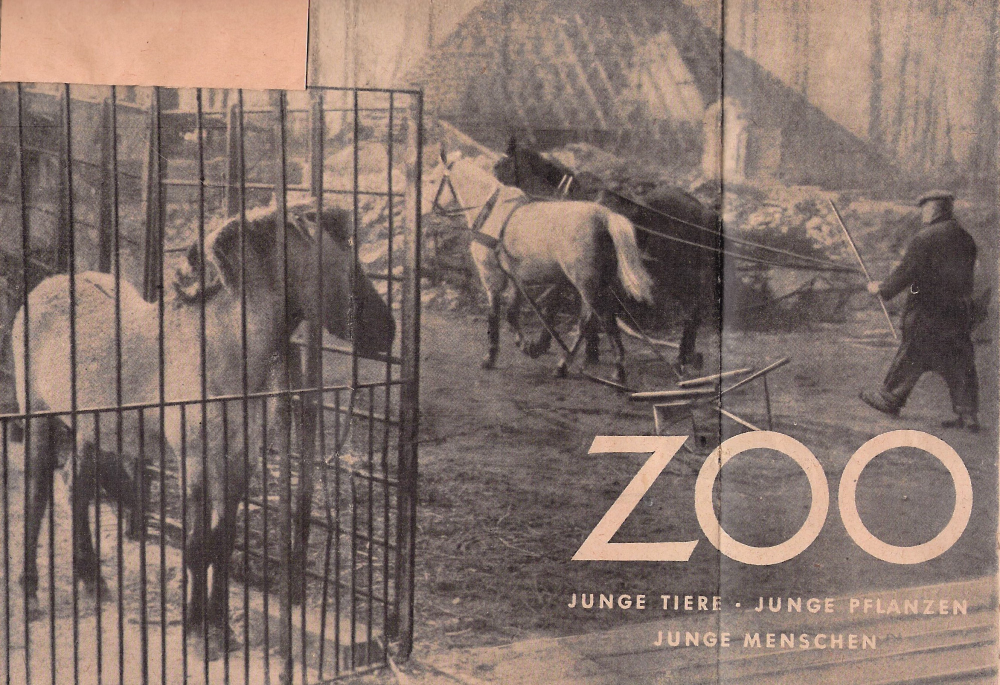
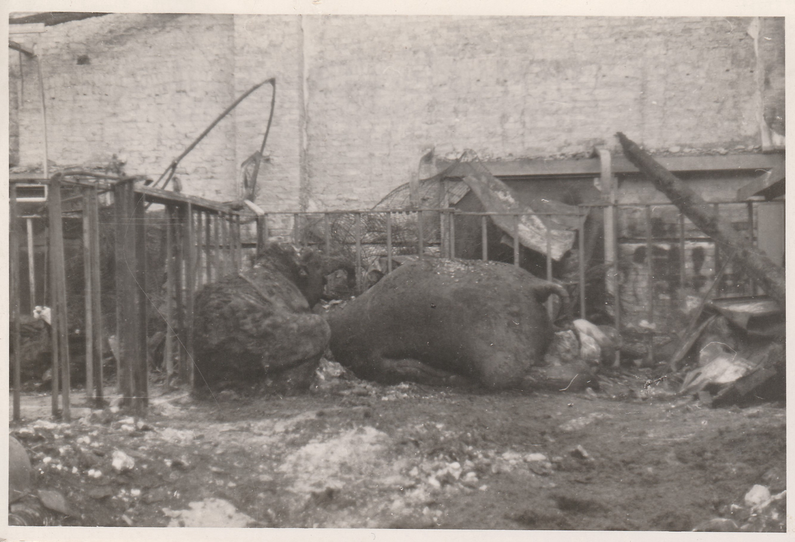

:::EN:::

<figure>

<figcaption>

_Poem by zoo visitor K. Ferber about the winter food crisis in the zoo – see [[material.Wintersnot im Zoo]], 06.10.1948. (AZGB. All rights reserved.)_ 

</figcaption>

</figure>

At the end of the Second World War, the Berlin Zoological Garden only had about 80 animals. In 1938, there had been over 3.000, and even in 1944, as many as 1.700.[^1] By May 1945, much of the zoo's grounds, including the Elephant Pagoda, had been destroyed.

<figure>

<figcaption>

_Elephant carcass at Berlin Zoo after a bombing raid in 1943. (AZGB. All rights reserved.)_

</figcaption>

</figure>

**One of the few surviving animals was the Asian elephant bull "Siam".** Brought to Germany from the British colony of Ceylon, now Sri Lanka, as a so-called [[wild catch|story.catching-animals]], he had actually been intended for the Krone circus. However, when "Siam" showed behavioural problems there, the circus sought a way rid itself of the "bad" animal, and gave "Siam" to the Berlin Zoo in 1933. He was the only one of nine elephants at the Berlin Zoo to survive the war. Seven had been killed in the bombing raids of November 1943 – see [[material.list-of-dead-zoo-animals]].

<figure>

<figcaption>

_After the end of the war,_ Life Magazine _reported on the only surviving elephant in the Berlin Zoo, October 1945._

</figcaption>

</figure>

At the time, the zoo was suffering from a lack of everything, from feed to firewood to building materials. The zoologist [[material.katharina-heinroth]], who also officially became director of the largely destroyed zoological garden on 3 August 1945, had great difficulty keeping the remaining animals alive, with few employees and almost no financial means. As early as May, the Soviet commander (Berlin was occupied and administered by Soviet troops at the time) had issued permission for the purchase of feed, so that meat for the carnivores as well as hay, oats and potatoes could for the time being be bought once more.[^2] **Nevertheless, the situation was tense and the procurement of feed remained a burning issue for the next few years.** As Katharina Heinroth wrote in March 1946 about the food situation at the zoo: "The scarcity of feed is terrible; potatoes, beets, hay and straw are most lacking. [...] We haven't had any potatoes in four months."[^3] How was she supposed to feed an elephant in these conditions?

After the biggest pieces of rubble had been cleared, Katharina Heinroth and the zoo staff set about producing feed for the animals themselves. Katharina Heinroth's initial desire with the reopening of the zoo in July 1945 had been to offer a place of recovery and recreation beyond the daily post-war routine. "I also dreamed of beautiful flowerbeds in the avenues," said Katharina Heinroth in an interview, "but things turn out differently. Every free corner has to be planted with vegetables. The remaining empty outdoor enclosures are divided amongst staff for personal use."[^4] Apart from the nursery, whose beds were already fully cultivated, "all the open spaces created by the battle in the zoo were now to be cultivated with feedstuff."[^5] **The deer enclosure became a vegetable garden; beets, potatoes and lettuce were soon growing on the open lawns and in the elephant enclosure[^6]. In short: the zoo was being tilled.**

<figure>

<figcaption>

_Vegetable and lettuce cultivation on the grounds of the Berlin Zoological Garden, reprinted in_ Vorwärts, _18.04.1946._

</figcaption>

</figure>

<figure>

<figcaption>

_The illustrated magazine_ Die Frau von heute _reports on the cultivation of vegetables and lettuce in the Berlin Zoological Garden, 07.05.1946._

</figcaption>

</figure>

However, this harvest was not nearly enough to feed even the few herbivores. Moreover, as already mentioned, the animals had to share the yield of these beds with zoo staff.[^7] The zoo therefore leased additional plots on the outskirts of Berlin - "expanses in comparison to which the few small gardens in the enclosures dwindle."[^8] In Spandauer Forst and Grunewald, for example, nine hectares were sown with green fodder, and grass for making hay. But "even all this is merely supplementary fodder"[^9], Katharina Heinroth replied to a zoo visitor's letter. The feed shortage had a direct impact on the rebuilding of the zoo's animal holdings. Growth in any of the animal population, let alone large mammals from the other side of the world, was out of the question for the time being. In the summer of 1947, Heinroth had to reply to letters from Berliners asking for a new herd of elephants: "Unfortunately, it will not be possible to acquire another herd of elephants in the next few years, as the food difficulties in the city are far too great. At the moment, we only have our old elephant 'Siam' and have our hands full trying to get him enough hay and straw, grass and turnips."[^10]

Though the death of animals due to [[overfeeding|story.feeding-and-overfeeding]] by visitors led to a general ban on feeding at the Berlin Zoo just ten years later, things were quite different in the late 1940s. The zoo staff's efforts alone did not suffice to provide for the animals. **The zoo was dependent on the city: on the transport infrastructure and the slaughterhouses, as well as on the visitors and governing bodies.** In newspaper articles, Katharina Heinroth called on the people of Berlin to support the animals by donating food.

<figure>

<figcaption>

_Appeal printed in the_ Illustrated Telegraph _to save the zoo, March 1949._

<figcaption>

</figure>

Even if Berliners did not succeed in "quickly giving the zoo freedom from worry", as the visitor's poem about the "winter shortages at the zoo" puts it, people donated food stamps, brought old bread and potato peelings, and collected acorns for the animals. "'Siam' consumes whole baskets of them and most of the other animals also seem to be quite satisfied with this substitute," Katharina Heinroth is quoted as saying.[^11] Until the 1950s, visitors to German zoos were generally allowed to feed the animals, albeit with some restrictions, and in times of food scarcity, Heinroth increasingly appealed to people in newspaper articles to collect, bring and donate food – see also [[story.feeding-prohibited]]. Whereas once feeding the animals was tolerated, "nowadays one would be grateful if more visitors engaged in this pleasure", as the _Neue Zeitung_ wrote in 1949.[^12] The illustrated women's magazine _Die Frau von heute_, published from 1946 as the mouthpiece of the Communal Women's Committees of the Soviet Occupation Zone,[^13] also encouraged its readers to get involved – pointing out that all zoo animals "are very receptive to vegetable scraps, carrots and the like. And anyone who has potato peelings will always find grateful takers at the zoo!"[^14] **The zoo utilised leftovers from the city's provisions that were not (or were no longer) suitable for human consumption, from canteen leftovers to the potato peelings of private households.**[^15]

Yet even the support of the population was not enough. Who was actually officially responsible for organising the necessary feed? The procurement of feed had to be reorganised after the war, see also [[story.the-zoo-and-national-socialism]]. The zoo was in constant need of hay, straw, potatoes, turnips, horse meat and slaughterhouse waste.[^16] On 6 August 1945, just three days after she had been appointed director of the zoo, Katharina Heinroth turned to the Haupternährungsamt, the main food office of the city of Berlin, to clarify the question of feed procurement. They compiled a list of the quantities of feed needed. A decision of the Allied Control Council of 10 November 1945 assured the zoo of receiving the necessary feed for its 240 animals on a regular basis from the magistrate of the city of Berlin. The procurement of feed was thus in the hands of the Haupternährungsamt.

<figure>

<figcaption>

_List of the [[feed requirements|material.feeding-list-1945]] for the large animals of the Berlin Zoo, 18.09.1945. (AZGB. All rights reserved.)_

</figcaption>

</figure>

After Katharina Heinroth had submitted a list of the large animals and their feed requirements, the office allocated the necessary rations – "as far as possible those unsuitable for human consumption."[^17] Slaughterhouses were instructed to hand over carcasses of horses and cattle to feed to the zoo’s carnivores; hospitals supplied food leftovers from their canteens – see also [[story.the-afterlife-of-zoo-animals]]. In this way, the zoo was partly integrated into the urban metabolism as a mechanism for recycling organic waste.

But since the animals consumed almost 4.500 kg of feed – mixed feed, oats and hemp, bread leftovers, potatoes and vegetables, meat scraps and horse meat – in addition to hay and straw every month, it still came to shortages periodically.[^18] At such times, improvisation was necessary. Hemp, millet, and oatmeal were initially nowhere to be found, but barley was available. Katharina Heinroth and her staff replaced missing potatoes with beets or bread scraps; the zookeepers regularly collected potato peelings "from half of Berlin".[^19] Daily portions were strictly rationed: "the old elephant 'Siam' with his frayed ears, who still has the horror of the bombings in his bones [...] is provided 100 pounds of food a day by the Berlin magistrate. The wily chimpanzee 'Susi', on the other hand, has to make do with [food] stamp 5"[^20] – meaning the lowest category of food stamp, as also received by children and pensioners. The _Tagesspiegel_ commented: "The magistrate allocates rations to animals just as strictly as to humans. Each species has its prescribed quota."[^21]

## Feeding the City

**The feed shortage in the zoo reflected the food situation in the city at the time.** The city administration also set food rations per person per day for the human population. From bread to meat to potatoes and coffee beans – everything was measured out in grammes.[^22] For some farm animals such as horses, cows and pigs, there were special feed cards.[^23] Food scarcity was everywhere, as were shortages in fuel for heating. In the long and particularly cold winter of 1946/47, the Großer Tiergarten, a large park bordering the zoo, was almost completely cleared of trees. Hundreds of old trees were turned into firewood and the resulting open spaces were immediately used to grow vegetables. The British occupation forces had temporarily authorised this use: Grain and vegetables grew on about 2.550 plots; horses and oxen pulled ploughs through the former park grounds. The senate allowed some areas to be cultivated as fields for green fodder.

<figure>

<figcaption>

_Vegetable cultivation in the deforested Großer Tiergarten in Berlin in 1946, with the Reichstag in the background. (Bundesarchiv Image 183-M1015-314, photo Otto Donath.)_

</figcaption>

</figure>

<figure>

<figcaption>

_Plot with vegetable patch in the deforested Großer Tiergarten in Berlin, 1945. (Bundesarchiv Image 183-H0813-0600-009, photo Dreyer.)_

</figcaption>

</figure>

The zoo, in its turn, was involved in the city's food situation in various ways. When it reopened on 1 July 1945, barely a month after the end of the war, it was not only one of the few places for recreation and passing the time. **The zoo was simultaneously a central intersection point for the exchange of materials, animals, and knowledge related to supplying the city.**

Even before the war, people had turned to the zoo for advice on keeping their pets. Now the focus of such questions increasingly shifted to queries about breeding and keeping animals such as chickens, pigeons, fur animals, or goats and rabbits – in other words, animals that could be kept as livestock or work animals, for one's own consumption or as breeding animals.[^24] A horticultural business wanted a donkey from the zoo for vegetable cultivation, and in exchange offered young plants in the spring, such as tomatoes, tobacco, and cabbage plants of all sorts.[^25] However, the zoo itself did not own a donkey. One couple wanted to buy a dairy sheep "on the basis of a recommendation on the radio […] to improve our meagre diet in these hard times."[^26] The zoo also had to disappoint them – as it did the man looking for a breeding hare, "as I would especially like to obtain good fur, in addition to the meat."[^27] The list of such examples is long, and in many cases Katharina Heinroth and her co-workers were unable to fulfil the requests that arrived in large numbers by post, due to their own troubles with food and feed shortages. Those who had something to exchange had a better chance of a positive response, as the zoo was able to replenish its own holdings at this time mainly through animal exchanges, and animals that it had retired and could use for breeding at the same time. In this way, in December 1945, an exchange between the zoo and the Daimler-Benz stock association almost came about. Due to the acute shortage of petrol, the latter was keen to exchange an engine for the zoo's truck for a horse – in the hopes of turning to real horsepower to transport food for the company canteen. Katharina Heinroth, however, refused on the grounds that the zoo's horses were too valuable.

## Zoo and City

**The Berlin Zoological Garden was not just sought out to provide expertise in animal keeping and breeding; it was integrated into the very supply infrastructure of the city.** In 1945, at the request of the district authority for the Tiergarten neighbourhood, it took 250 dairy goats into its care "in order to make a contribution to securing the people's food supply."[^28] We do not know exactly how this cooperation worked, or how long it lasted. It is known that such arrangements could lead to conflicts over animal feed. When the British military government asked the zoo to take on more domestic animals for the Tiergarten district, Katharina Heinroth replied that the zoo did not have enough feed to do so. The British commander in charge replied that the elephant and other animals would then have to be given to other zoos to provide resources for the farm animals.
For the zoo, however, animals coveted by the public were their economic and symbolic capital: "As a zoological garden we would have no interest at all in offering our visitors goats or sheep instead of animals from elsewhere. People don't come to the zoo to look at chickens or goats, and since we have to live on our income, we could soon have to close the zoo."[^29] This crystallises the question of what is constitutive of a zoo and its purpose, and which animal species it should primarily exhibit.

During these years, the question of whether the zoo would be forced to slaughter some of its holdings or give animals away due to feed shortages was, in fact, constantly in the room.[^30] After only 80 animals had survived at the end of the war, by September 1945, the zoo had 240 animals again – many of which it had taken over from a circus. **But on 10 November 1945, the Allied command imposed a ban on the zoo acquiring large animals**, as no feed could be provided for more animals, especially large animals that required good meat or large quantities of green fodder, and the struggling supply infrastructure in Berlin was not to be further burdened, see also [[story.Landwirtschaftliche Tiere]].[^31] Several times, the British commander threatened to close the zoo and evacuate the animals to the West. Katharina Heinroth was always able to ward this off.[^32]

**The British commander rather had in mind a display model for keeping domestic animals.** A strain of Leghorn chicks, a few sheep and goat lambs, breeding pairs of rabbits and ducklings that the zoo had reared or bred were to "provide an incentive for the population to keep animals simply, and could serve to produce breeding material to help gradually replenish the livestock in and around Berlin."[^33] **In times of need, the functions of the zoo as institution, and the views of what its tasks were thus underwent change.** Different expectations were placed on it by the Allies, the magistrate and the population, and new tasks were set for it. Although, in the end, the display model for farm animal keeping and breeding was not realised, the zoo became – sometimes against the will of its director – a place for the production of food for animals and humans. It emerged as a hub where, via correspondence, animals and knowledge were exchanged, and nutritional issues were discussed. At the same time, the zoo continued to adhere with great perseverance to the programmatic and not least financially motivated aspiration of exhibiting animals with popular appeal from all over the world.

In the meantime, the feed situation at the zoo remained tense, and just two years after the end of the war, in March 1947, the elephant "Siam" died. The daily newspapers wrote: "half frozen to death […] our zoo pachyderm has now died of starvation."[^34] "Siam" had not in fact starved to death, but died of a chronic intestinal inflammation, and complications in the heart muscle. This was the finding of the autopsy carried out jointly by the Veterinary School and the Zoological Museum (a part of the Natural History Museum). Misinformation or deliberate feint? We can only speculate. Certainly, the troubles with shortages in Berlin were a recurring theme in the _Telegraf_. And perhaps the idea that "our zoo elephant" was suffering from hunger just like the people of Berlin seemed comforting?

There are many examples of (zoo) animals that served as figures for identification and projection in hard times. Mieke Roscher and Anna-Katharina Wöbse have studied the function of zoo animals as providing support and the zoo as a place of social rapprochement between humans and animals in times of crisis – with a focus on Berlin and London during the Second World War.[^35] Something similar can be said of the post-war period. **It was not least about the idea that animals and humans shared the same fate, a sense of belonging to the same "we", a community of suffering.** Animals commemorated as war victims can be found as early as the 19th century: At the entrance to the Jardin des Plantes in Paris, for example, is a plaque commemorating the elephants and kangaroos of the menagerie there, which were counted among the victims of war after the siege of Paris in 1870. It may therefore come as no surprise that the Berlin Zoo received many letters expressing sympathy and regret over the death of the last Berlin Zoo elephant. At the same time, many wanted to know when there would be a new elephant to come and see.

<figure>

<figcaption>

_Condolence postcard from four-year-old Hello Kellner to the Berlin Zoo upon the death of "Siam". (AZGB. All rights reserved.)_

</figcaption>

</figure>

To this, however, Katharina Heinroth could only reply: "For the time being, we will not acquire a new elephant because of the feed shortages."[^36] But there were also outraged voices who – assuming that the elephant had starved to death – wanted to know why the zoo did not give away its animals if it could no longer feed them:

>"Now we have read [in the newspaper] that you are already trying to find a new elephant. Dear madam director, how can you justify this in your heart! It will merely suffer the same fate as Siam in a few weeks, maybe months. Just for the publicity of having an elephant again – I wouldn't do it. We know why we have to starve, but not an animal. We have to do without so much that is dear and beautiful, we would rather not have an elephant at the moment. Because when we come there and look at it, I am sure we will have to think, 'It's hungry like the rest of us.'"[^37]

In the first post-war years, the relationship between the zoo and the people of the city oscillated between care and competition. The city – the population as well as the authorities – supported the zoo in matters of feed. For example, "a tribe of about 20 children" was always on hand to collect chestnuts and acorns for the zoo animals, which quickly amounted to 100 hundredweight.[^38] In 1948, however, the Central Office for Drugs and Wild Fruits asked the zoo to stop allowing chestnuts to be collected for feeding purposes, because they were needed to feed the population, and because human labour was an important resource. The visitors who brought bread or potato peelings for the animals were forbidden from collecting acorns on the zoo grounds for their own use. Inspectors searched bags and backpacks at the exits: "At present we collect several hundredweight of such acorns taken back from the visitors at the ticket offices every day," the zoo director noted in 1948.[^39] **Particularly in times of need, humans and animals competed for the same resources.** Katharina Heinroth was aware of this dilemma: "Our keepers gather potato peelings from half of Berlin with touching diligence. But these are also becoming rarer, as many people gather the potato peels for their own use, because need is great. I know some people who live on potato peelings."[^40]

**Depending on where you stand, the zoo was a central intersection point for the exchange of animals and knowledge; a place of illegal food procurement, where acorns as well as animals were stolen; a part of the urban supply infrastructure; or a burden for the city's food supply plan** – a situation that was only normalising incrementally in the early 1950s. "We have all kinds of plans for the spring," wrote Katharina Heinroth in a letter in the spring of 1950, "the gardening should stop now, because the food situation for the population here in Berlin has improved fundamentally, so that you can buy vegetables at the markets again. So now we can once again arrange the gardens prettily."[^41] One thing becomes clear in view of these post-war years: while zoos describe the displaying of wild animals in urban spaces as their main function, they are not uncoupled from the city surrounding them and its political, social and economic situation. Crises such as the post-war period present the zoo with new challenges to which it must respond, and in the course of which the role of the institution, as well as the status and valuation of the animals, prove to be thoroughly mutable. In view of the challenges today presented by climate justice and social justice, this raises, not least, the question of what we want the zoo of the future to be and do.

[^1]: In 1938, there were 3.715 animals; in 1944 there were still 1.700 animals. Cf. half-year report for supervisory board meeting of 10.08.1955, AZGB N 4/2.

[^2]: Progress report of the Zoological Garden from 03.05. to 23.05.1945, AZGB O 0/1/75.  

[^3]: K. Heinroth to Paula, 01.03.1946, AZGB N 4/12. Direct quotes have been translated into English for clarity’s sake.

[^4]: "Siam under house arrest. Winter preparations at the zoo". _Das Volk_, 04.11.1945. The conversion of open spaces for the cultivation of vegetables and potatoes was, as one might imagine, widespread. The garden of the Museum for Natural History was also reserved for growing vegetables for staff until 1949. Direct quotes have been translated into English for clarity’s sake.

[^5]: Cf. progress report of the Zoological Garden from 03.05. to 23.05.1945, AZGB O 0/1/75. As a result of the war, a large number of the animals was dead, and large parts of the zoo buildings were destroyed, which is why there were many open spaces after the debris was removed. Direct quotes have been translated into English for clarity’s sake.

[^6]: K. Heinroth to L. Rüppell, n.d. [likely April/May 1946], AZGB N 4/12. Cf. also the annual report of the park department of the Berlin Zoological Garden 1945: "The large elephant enclosure and the unoccupied areas in the ostrich pen and in front of the pheasant house cultivated with Jerusalem artichokes and beets. The two main promenades sowed with potatoes." Direct quotes have been translated into English for clarity’s sake.

[^7]: "Most of the lawns will be tilled with turnips and fodder, the feed shortage is terrible." K. Heinroth to Paula, 01.03.1946, AZGB N 4/12 I. Cf. also K. Heinroth to L. Rüppell, n.d. [likely April/May 1946], AZGB N 4/12. Heinroth wrote in a letter: "Some of the retinue use the free enclosures as allotments." Progress report by Katharina Heinroth, 18.09.1945, AZGB N 4/2. Direct quotes have been translated into English for clarity’s sake.

[^8]: Annual report from 01.04.1949 to 31.12.1949, AZGB N/4/2. Direct quotes have been translated into English for clarity’s sake.

[^9]: K. Heinroth to P. Chudy, 17.07.1948, AZGB O 0/1/60. Direct quotes have been translated into English for clarity’s sake.

[^10]: K. Heinroth to W. Börner, 19.07.1947, AZGB O 1/2/37. Contributing to the shortage of food and the fact that no new animals could be acquired were not least the zoo's financial problems. After the division of the city by the Potsdam Agreement, its accounts were in banks in the eastern part of the city. Moreover, the zoo initially had little income. Direct quotes have been translated into English for clarity’s sake.

[^11]: "Sorgen im Berliner Zoo". _Neue Zeit_, 18.09.1948. Direct quotes have been translated into English for clarity’s sake.

[^12]: "Der Zoo braucht dringend Hilfe". _Die Neue Zeitung_[München], 07.04.1949. Direct quotes have been translated into English for clarity’s sake.

[^13]: The magazine was initially published by the Allgemeiner Deutscher Verlag in East Berlin, until 1948, when the Demokratischer Frauenbund Deutschlands (DFD) – the democratic women’s association of Germany – took over the editorship until the journal was discontinued at the end of 1962. After that, by decision of the SED secretariat, the magazine was published by Deutscher Frauenverlag GmbH Berlin, and from 1953 by Verlag für die Frau, Leipzig. In 1963, the magazine _Für Dich_ became the successor to _Frau von heute_.

[^14]: "Zoo. Junge Tiere, junge Pflanzen, junge Menschen". _Die Frau von heute_, 07.05.1946. Direct quotes have been translated into English for clarity’s sake.

[^15]: This attitude was reversed in the 1950s, at the time of the world 'economic miracle', when it was claimed that: "Whoever wants to prove their love for the animal by satisfying its hunger should recall that the animal is not a recycling mechanism for those foods that have become inedible for human beings." "Falsche Tierliebe." _Gießener Anzeiger_, 16.04.1960. See also [[story.feeding-prohibited]].

[^16]: K. Heinroth to the Haupternährungsamt of the city of Berlin, 06.08.1945, AZGB N 4/2.

[^17]: Cf. AZGB O 1/1/2. Direct quotes have been translated into English for clarity’s sake.

[^18]: Cf. magistrate of the city of Berlin, department for food and nutrition to the Zoological Garden Berlin, 17.11.1945, AZGB O 1/1/2.

[^19]: K. Heinroth to E. Mohr, 22.01.1946, AZGB N 4/12. Direct quotes have been translated into English for clarity’s sake.

[^20]: de Luce, Daniel. "Lebensmittelkarte 5 im Berliner Zoo". _Tägliche Rundschau_, 17.12.1946. Direct quotes have been translated into English for clarity’s sake.

[^21]: "Spinat oder Hirsche. Ein Frühlingsspaziergang durch den Berliner Zoo". _Der Tagesspiegel_, 03.04.1947. Direct quotes have been translated into English for clarity’s sake.

[^22]: Cf. _Verordnungsblatt (VOBl.) der Stadt Berlin 1945_, no. 1, July 1945: 5.

[^23]: "Einführung von Futtermittelkarten". _Verordnungsblatt (VOBl.) der Stadt Berlin 1945_, No. 7, 20.09.1945: 81.

[^24]: Cf. AZGB  O 1/2/42.

[^25]: Horticultural business F. Rauhut to K. Heinroth, 14.01.1947, AZGB O 1/2/42.

[^26]: M. Metzner to K. Heinroth, 09.04.1947, AZGB O 1/2/42. Direct quotes have been translated into English for clarity’s sake.

[^27]: H. Binck to the Zoological Garden Berlin, 16.11.1947, AZGB O 1/2/42.

[^28]: Progress report by Katharina Heinroth, 18.09.1945, AZGB N 4/2.

[^29]: File memo Katharina Heinroth, 19.03.1946, AZGB O 0/1/75. Direct quotes have been translated into English for clarity’s sake.

[^30]: When guinea pig breeding was being re-established, the zoo was "often forced to use guinea pigs as feed due to food scarcity". K. Heinroth to J. Roscher, 23.02.1947, AZGB O 1/2/42. On the threat of evacuation, cf. also K. Heinroth to K. Lorenz, 12.10.1948, AZGB N/4/12; K. Heinroth to E. Mohr, 28.02.1946, in: AZGB N 4/12.

[^31]: Between May and August 1945, the number of animals increased from 194 to 240, mainly due to the incorporation of animals from the Brumbach circus.

[^32]: Cf. Heinroth, Katharina. _Mit Faltern begann's. Mein Leben mit Tieren in Breslau, München und Berlin_. München: Kindler, 1979: 154-157. The Second World War had more or less severely destroyed many zoos throughout Europe. During the First and Second World Wars, moreover, troop units of the Reichswehr and the Wehrmacht captured animals in the conquered territories of Europe and handed them over to the zoological gardens of the Reich capital. In 1939, Lutz Heck also brought valuable show animals, including an elephant, from the Warsaw Zoo to German zoos. Cf. Szczygielska, Marianna. "Elephant Empire: Zoos and Colonial Encounters in Eastern Europe". _Cultural Studies_(2020): 1-22. https://doi.org/10.1080/09502386.2020.1780280; see also [[story.catching-animals]].

[^33]: K. Heinroth to the magistrate of the city of Berlin, department for food and nutrition, 20.03.1946, AZGB O 1/1/2. Cf. also K. Heinroth to the Allied commander of the city of Berlin, 15.05.1946, AZGB O 1/1/2. Direct quotes have been translated into English for clarity’s sake.

[^34]: "The last of Berlin’s pachyderms 'Siam' starved and half-froze to death in March last year." Cf. "Auf den Spuren des Elefanten". _Der Kurier_, 07.02.1948; and "'Siam' unter der Bandsäge." _Telegraf_, 21.03.1947. Direct quotes have been translated into English for clarity’s sake.

[^35]: Wöbse, Anna-Katharina, and Mieke Roscher. "Zootiere während des Zweiten Weltkrieges: London und Berlin 1939-1945". _WerkstattGeschichte_ 56 (2010): 44-62)

[^36]: K. Heinroth to W. Börner, 14.10.1947, AZGB O 1/2/42.

[^37]: C. Gutschmidt to K. Heinroth, 26.03.1947, AZGB O 1/2/37.

[^38]: Cf. K. Heinroth to E. Schmidt, 13.10.1948, AZGB O 0/1/274. Food shortages were already a central issue for people and zoo animals during the First World War. Especially in the so-called "Steckrübenwinter" – "turnip winter" – of 1916/17, it proved difficult to obtain grain and potato products, which caused riots and looting in many German cities. The notion that animals were competing with humans for food led to the instigation of mass slaughtering, which ultimately tended to exacerbate the situation. Cf. Klothmann, Nastasja. _Gefühlswelten im Zoo: Eine Emotionsgeschichte 1900-1945_. Bielefeld: transcript, 2015. Direct quotes have been translated into English for clarity’s sake.

[^39]: K. Heinroth to E. Schmidt, 13.10.1948, AZGB O 0/1/274.

[^40]: K. Heinroth to E. Mohr, 22.01.1946, AZGB N/4/12.

[^41]: K. Heinroth to U. Bergman, 07.03.1950, AZGB N 4/12. Cf. also AZGB O 1/1/1.

:::DE:::

<figure>

<figcaption>

_Gedicht des Zoobesuchers K. Ferber über die [[material.Wintersnot im Zoo]], 06.10.1948. (AZGB. Alle Rechte vorbehalten.)_

</figcaption>

</figure>

Am Ende des Zweiten Weltkriegs zählte der Berliner Zoologische Garten nur noch rund 80 Tiere. 1938 waren es über 3.000 gewesen und 1944 immerhin 1.700.[^1] Im Mai 1945 war das Gelände des Gartens, darunter auch die Elefantenpagode, zu großen Teilen zerstört.

<figure>

<figcaption>

_Elefantenkadaver im Berliner Zoo nach einem Bombenangriff 1943. (AZGB. Alle Rechte vorbehalten.)_

</figcaption>

</figure>

**Zu den wenigen überlebenden Tieren gehörte der asiatische Elefantenbulle "Siam"  .** Als sogenannter [[Wildfang|story.catching-animals]] von der britischen Kolonie Ceylon, dem heutigen Sri Lanka, nach Deutschland gebracht, war er eigentlich für den Zirkus Krone bestimmt gewesen. Als "Siam" dort jedoch Verhaltensauffälligkeiten zeigte, suchte der Zirkus einen Weg, das "böse" Tier wieder loszuwerden und gab "Siam" 1933 an den Berliner Zoo ab. Er war der Einzige von neun Elefanten im Berliner Zoo, der den Krieg überlebte. Sieben waren bei den Bombenangriffen im November 1943 getötet worden, siehe [[material.list-of-dead-zoo-animals]].

<figure>

<figcaption>

_Das_ Life Magazine _berichtete über den einzigen überlebenden Berliner Zoo-Elefant nach Kriegsende, Oktober 1945._

</figcaption>

</figure>

Im Zoo fehlte es damals an allem, von Futter über Brennholz bis zu Baumaterialien. Die Zoologin [[material.katharina-heinroth]], die am 3. August 1945 auch offiziell die Leitung des weitgehend zerstörten Zoologischen Gartens übernahm, hatte größte Mühe die verbliebenen Tiere mit ihren wenigen Mitarbeiter\*innen und nahezu ohne finanzielle Mittel durchzubringen. Bereits im Mai hatte der sowjetische Kommandant (Berlin war damals durch sowjetische Truppen besetzt und verwaltet) eine Genehmigung für den Erwerb von Futtermitteln ausgestellt, so dass einstweilen wieder Fleisch für die Raubtiere sowie Heu, Hafer und Kartoffeln gekauft werden konnten.[^2] **Dennoch war die Situation angespannt und die Beschaffung von Futter blieb die kommenden Jahre ein brennendes Thema**: "[D]ie Futtermittelnot ist furchtbar, am meisten fehlen Kartoffeln, Rüben, Heu und Stroh. \[...] Wir haben seit 4 Monaten keine Kartoffeln für den Betrieb bekommen" [^3], schrieb Katharina Heinroth im März 1946 über die Ernährungslage im Zoo. Wie sollte sie da einen Elefanten ernähren?

Nachdem der gröbste Schutt entfernt worden war, machten sich Katharina Heinroth und die Zoomitarbeiter\*innen daran, Futter für die Tiere selbst zu produzieren. Eigentlich war es Katharina Heinroths Ziel, mit der Wiedereröffnung des Zoos im Juli 1945 einen Ort der Erholung und des Vergnügens jenseits des Nachkriegsalltags zu bieten. "Ich träumte dabei auch von schönen Blumenbeeten in den Alleen", sagte Katharina Heinroth in einem Interview, "aber es kommt anders. Jede freie Ecke muß mit Gemüse bepflanzt werden. Die leeren Freigehege werden unter unsere Angestellten für den eigenen Bedarf aufgeteilt."[^4] Außer der Gärtnerei, deren Beete bereits voll bestellt waren, sollten nun "alle durch den Kampf im Zoo entstandenen Freiflächen mit Futtermitteln bebaut werden".[^5] **Das Hirschgehege wurde zum Gemüsegarten, auf den freien Rasenflächen und im Elefantengehege wuchsen schon bald Rüben, Kartoffeln und Salat[^6], kurz: Der Zoo wurde beackert.**

<figure>

<figcaption>

_Gemüse- und Salatanbau auf dem Gelände des Zoologischen Gartens Berlin, abgedruckt im_ Vorwärts_, 18.04.1946._

</figcaption>

</figure>

<figure>

<figcaption>

_Über den Gemüse- und Salatanbau im Zoologischen Garten Berlin berichtet die illustrierte Zeitschrift_ Die Frau von heute, _07.05.1946._

</figcaption>

</figure>

Allerdings reichte diese Ernte zur Versorgung auch der wenigen der Pflanzenfresser bei weitem nicht aus. Außerdem mussten sich die Tiere den Ertrag der Beete – wie bereits erwähnt – mit den Zoomitarbeiter\*innen teilen.[^7] Der Zoo pachtete daher zusätzliche Flächen am Rande von Berlin – "Flächen, gegen die die paar kleinen Gärten in den Gehegen verschwinden".[^8] Im Spandauer Forst und im Grunewald etwa wurden auf neun Hektar Grünfutter ausgesät und Wiesen zur Heuernte angelegt. Doch "auch das ist alles lediglich Beifutter"[^9], antwortete Katharina Heinroth auf die Zuschrift einer Person, die den Zoo besucht hatte. Die Futtermittelknappheit wirkte sich unmittelbar auf den Wiederaufbau des Tierbestands im Zoo aus. An einen erneuten Zuwachs an Tieren, zumal Großsäugern vom anderen Ende der Welt, war einstweilen nicht zu denken. Auf die Zuschriften von Berliner\*innen mit der Bitte, eine neue Elefantenherde anzuschaffen, musste Heinroth daher im Sommer 1947 noch erwidern: "Leider wird es in den nächsten Jahren nicht möglich sein, wieder eine Elefantenherde zu beschaffen, da die Ernährungsschwierigkeiten in der Stadt viel zu gross sind. Wir haben zur Zeit nur noch unseren alten Elefanten 'Siam'   und haben vollauf zu tun, um ihm genügend Heu und Stroh, Gras und Rüben heranzuschaffen."[^10]

Während im Berliner Zoo nur knapp zehn Jahre später der Tod von Tieren durch [[Überfütterung|story.feeding-and-overfeeding]] durch Besucher\*innen zu einem generellen Fütterungsverbot führte, sah dies in den späten 1940er Jahren noch ganz anders aus. Die eigenen Bemühungen der Zoomitarbeiter\*innen reichten für die Versorgung der Tiere nicht aus. **Der Zoo war auf die Stadt angewiesen – auf die Verkehrsinfrastrukturen und die Schlachthöfe ebenso wie auf die Besucher\*innen und Behörden.** In Zeitungsartikeln rief Katharina Heinroth die Berliner Bevölkerung dazu auf, die Tiere durch Lebensmittelspenden zu unterstützen.

<figure>

<figcaption>

_Zeitungsaufruf im_ Illustrierten Telegraf _zur Rettung des Zoos, März 1949._

<figcaption>

</figure>

Wenn es den Berliner\*innen auch nicht gelang, dem Zoo "Sorgenfreiheit rasch zu schenken", wie es in einem an den Zoo geschickten Gedicht über die "Wintersnot im Zoo" heißt, spendeten die Menschen Lebensmittelmarken, brachten altes Brot und Kartoffelschalen und sammelten Eicheln für die Tiere. "'Siam' verzehrt ganze Körbe davon und auch die meisten anderen Tiere scheinen mit diesem Ersatz recht zufrieden zu sein", wird Katharina Heinroth zitiert.[^11] Bis in die 1950er Jahre war es den Besucher\*innen der deutschen Zoos grundsätzlich, wenn auch mit Einschränkungen, erlaubt, die Tiere zu füttern und in Zeiten der Lebensmittelknappheit rief Heinroth die Menschen in Zeitungsartikeln vermehrt dazu auf, Nahrungsmittel zu sammeln, mitzubringen und zu spenden, siehe auch [[story.feeding-prohibited]]. Während früher das Füttern eher geduldet war, "wäre man heute dankbar, wenn sich recht viele Besucher dieses Vergnügen machen würden", schrieb entsprechend die _Neue Zeitung_ 1949.[^12] Auch die illustrierte Frauenzeitschrift _Die Frau von heute_, die ab 1946 als Organ der kommunalen Frauenausschüsse der sowjetischen Besatzungszone erschien[^13], wies ihre Leser\*innen ermunternd darauf hin, dass alle Zootiere "für Gemüseabfälle, Mohrrüben und dergleichen sehr empfänglich [seien]. Und wer über Kartoffelschalen verfügt, wird dafür im Zoo immer dankbare Abnehmer finden!"[^14] **Der Zoo verwertete Reste der städtischen Versorgung, die für den menschlichen Verzehr nicht (mehr) geeignet waren, von Kantinenresten bis zu den Kartoffelschalen privater Haushalte.**[^15]

Doch auch die Unterstützung der Bevölkerung reichte nicht aus. Aber wer war für die Organisation der Futtermittel eigentlich offiziell zuständig? Die Futtermittelbeschaffung musste nach dem Krieg neu geregelt werden, siehe auch [[story.the-zoo-and-national-socialism]]. Heu, Stroh, Kartoffeln, Rüben, Pferdefleisch und Schlachthofabfälle brauchte der Zoo laufend.[^16] Am 6. August 1945, nur drei Tage nachdem sie zur Leiterin des Zoos ernannt worden war, wandte sich Katharina Heinroth an das Haupternährungsamt der Stadt Berlin, um die Futterbeschaffung zu klären. Sie schickte eine Aufstellung der benötigten Mengen an Futtermitteln. Durch einen Beschluss des Alliierten Kontrollrates vom 10. November 1945 erhielt der Zoo die Zusicherung, dass er für seine 240 Tiere das nötige Futter regelmäßig durch den Magistrat der Stadt Berlin erhalten würde. Die Futterbeschaffung lag damit in den Händen des Haupternährungsamtes.

<figure>

<figcaption>

_Auflistung des [[Futtermittelbedarfs|material.feeding-list-1945]] für die Großtiere des Berliner Zoos vom 18.09.1945. (AZGB. Alle Rechte vorbehalten.)_

</figcaption>

</figure>

Nachdem Katharina Heinroth eine Liste der Großtiere mit deren Futterbedarfen eingereicht hatte, teilte das Amt die notwendigen Rationen zu, auch hier "möglichst solche, die für den menschlichen Gebrauch ungeeignet sind."[^17] Schlachthäuser wurden angewiesen, Kadaver von Pferden und Rindern zur Verfütterung an die Fleischfresser im Zoo abzugeben; Krankenhäuser lieferten Speisereste aus ihren Kantinen, siehe auch [[story.the-afterlife-of-zoo-animals]]. Der Zoo war somit teilweise als Verwertungsmaschine organischer Abfälle in den urbanen Metabolismus eingebunden.

Da die Tiere zusätzlich zu Heu und Stroh jeden Monat fast 4.500 kg Futtermittel – Mischfutter, Hafer und Hanf, Brotabfälle, Kartoffeln und Gemüse, Fleischabfälle und Pferdefleisch – verbrauchten, kam es dennoch immer wieder zu Engpässen.[^18] Dann musste improvisiert werden. Hanf und Hirse sowie Haferflocken waren anfangs nirgends zu bekommen, dafür gab es Gerste. Fehlende Kartoffeln ersetzten Katharina Heinroth und ihre Mitarbeiter\*innen durch Futterrüben oder Brotabfälle, die Zoopfleger\*innen sammelten regelmäßig Kartoffelschalen "aus halb Berlin zusammen".[^19] Die täglichen Portionen waren stark rationiert, "der alte Elefant 'Siam  ' mit seinen ausgefransten Ohren, dem noch immer der Schrecken der Bombenangriffe in den Knochen sitzt […] erhält 100 Pfund Futter am Tag vom Berliner Magistrat zur Verfügung gestellt. Die listige Schimpansin 'Susi'  muß sich dagegen mit \[Lebensmittel]Karte 5 begnügen"[^20], also der niedrigsten Kategorie wie sie auch Kinder und Rentner erhielten. Der _Tagesspiegel_ bemerkte dazu: "Der Magistrat teilt den Tieren ihre Rationen genau so streng zu wie den Menschen. Jede Gattung hat ihr vorgeschriebenes Quantum."[^21]

## Die Stadt ernähren

**Die Futterknappheit im Zoo spiegelte die damalige Ernährungslage der Stadt wider.** Auch für die Menschen setzte die Stadtverwaltung die Lebensmittelrationen pro Person und Tag fest. Von Brot über Fleisch bis zu Kartoffeln und Bohnenkaffee – alles war in Grammzahlen abgemessen.[^22] Für manche Nutztiere wie Pferde, Kühe und Schweine gab es spezielle Futtermittelkarten.[^23] Es fehlte überall an Nahrung ebenso wie an Heizmaterial. Im langen und besonders kalten Winter 1946/47 wurde der Große Tiergarten, der an den Zoo grenzte, fast komplett abgeholzt. Hunderte alte Bäume wurden zu Feuerholz und die entstandenen Freiflächen umgehend zum Anbau von Gemüse umgenutzt. Die britischen Besatzungstruppen hatten diese Nutzung vorübergehend genehmigt: Auf etwa 2.550 Parzellen wuchsen Getreide und Gemüse, Pferde und Ochsen zogen Pflüge durch den einstigen Parkboden. Einige Flächen ließ der Senat als Felder für Grünfutter bewirtschaften.

<figure>

<figcaption>

_Gemüseanbau im abgeholzten Großen Tiergarten in Berlin 1946, im Hintergrund der Reichstag. (Bundesarchiv Bild 183-M1015-314, Foto Otto Donath.)_

</figcaption>

</figure>

<figure>

<figcaption>

_Eine Parzelle mit einem Gemüsebeet im abgeholzten Großen Tiergarten in Berlin im Jahr 1945. (Bundesarchiv Bild 183-H0813-0600-009, Foto Dreyer.)_

</figcaption>

</figure>

Der Zoo wiederum war in verschiedener Hinsicht in Ernährungsfragen der Stadt eingebunden. Als er am 1. Juli 1945, nur knapp einen Monat nach Kriegsende, wiedereröffnete, gehörte er nicht nur zu den wenigen Orten der Erholung und des Zeitvertreibs. **Der Zoo war gleichzeitig Umschlagplatz für den Austausch von Materialien, Tieren und Wissen, die mit der Versorgung der Stadt zu tun hatte.**

Bereits vor dem Krieg hatten sich Menschen an den Zoo gewandt, um Ratschläge zur Haltung ihrer Heimtiere zu erhalten. Nun ging es verstärkt um Fragen der Zucht und Haltung von Hühnern, Tauben, Pelztieren oder Ziegen und Kaninchen – also um Tiere, die als Nutz- oder Arbeitstiere, zum eigenen Verzehr oder als Zuchttiere gehalten werden konnten.[^24] Ein Gartenbaubetrieb wollte vom Zoo einen Esel zum Gemüseanbau und bot im Tausch im Frühjahr Jungpflanzen wie Tomaten, Tabak, Kohlpflanzen aller Art.[^25] Der Zoo besaß jedoch selbst keinen Esel. Ein Ehepaar wollte sich "aufgrund einer Empfehlung im Radio" ein Milchschaf anschaffen, "zur Verbesserung unserer dürftigen Ernährung in dieser schweren Zeit".[^26] Auch sie musste der Zoo enttäuschen, ebenso wie den Mann, der auf der Suche nach einer Zuchthäsin war, "da ich neben dem Fleischgewinn vor allem gutes Pelzwerk erzielen möchte".[^27] Die Liste solcher Beispiele ist lang und in vielen Fällen konnten Katharina Heinroth und ihre Mitarbeiter\*innen aufgrund eigener Futterknappheit oder eigenen Bedarfs nur auf die wenigsten der Anfragen, die in großer Zahl per Post eintrafen, eingehen. Wer etwas zu tauschen hatte, hatte bessere Chancen auf eine positive Antwort, da der Zoo seine eigenen Bestände in dieser Zeit hauptsächlich durch Tiertausch und Tiere, die er in Pension nahm und zugleich zur Nachzucht einsetzen konnte, auffüllen konnte. Im Dezember 1945 kam es so beinah zu einem Tauschgeschäft zwischen dem Zoo und der Daimler-Benz Aktiengesellschaft. Diese wollte infolge des akuten Benzinmangels, einen Motor für den LKW des Zoos gegen ein Pferd tauschen. Sie setzten damit statt auf PS wieder auf reale Pferdestärken, um Lebensmittel für die Betriebskantine zu transportieren. Katharina Heinroth lehnte indes mit der Begründung ab, die Pferde des Zoos seien zu wertvoll.

## Zoo und Stadt

**Der Zoologische Garten wurde aber nicht nur wegen seiner Expertise in Sachen Tierhaltung und Tierzucht aufgesucht; er wurde selbst Teil der Berliner Versorgungsinfrastruktur.** 1945 nahm er auf Anfrage des Bezirksamts Tiergarten 250 Milchziegen in Pflege, "um so einen Beitrag für die Sicherung der Volksernährung zu liefern".[^28] Wie genau diese Zusammenarbeit funktionierte und wie lange sie währte, wissen wir nicht. Jedenfalls konnte sie zu Konflikten um Nahrung unter den Tieren führen. Als die britische Militärregierung den Zoo aufforderte, noch weitere Nutztiere für den Bezirk Tiergarten einzustellen, antwortete Katharina Heinroth, der Zoo hätte dafür nicht genügend Futtermittel. Der zuständige britische Kommandant erwiderte, dann müssten der Elefant und weitere Tiere an andere Zoos abgegeben werden, um Ressourcen für die Nutztiere zu schaffen.

Für den Zoo aber waren vom Publikum begehrte Tiere das wirtschaftliche und symbolische Kapital: "[A]ls Zoologischer Garten [hätten wir] gar kein Interesse, unseren Besuchern statt fremdländischer Tiere Ziegen oder Schafe zu bieten. Die Leute kommen nicht in den Zoo, um Hühner oder Ziegen anzuschauen, und da wir von unseren Einnahmen leben müssen, könnten wir bald den Zoo schliessen."[^29] Hier kristallisiert sich die Frage, was einen Zoo und seine Funktion ausmacht und welche Tierarten er primär ausstellen sollte.

Tatsächlich stand in diesen Jahren beständig die Frage im Raum, ob der Zoo gezwungen sein würde, einen Teil seiner Bestände wegen Futtermangels notzuschlachten oder Tiere wegzugeben.[^30] Nachdem am Ende des Krieges nur 80 Tiere überlebt hatten, zählte der Zoo im September 1945 wieder 240 Tiere, viele davon hatte er aus einem Zirkus übernommen. **Die Alliierte Kommandantur legte dem Zoo aber am 10. November 1945 ein Anschaffungsverbot für Großtiere auf**, da für mehr Tiere, insbesondere Großtiere, die gutes Fleisch oder große Mengen an Grünfutter benötigten, kein Futter bereitgestellt werden konnte und die schlechte Ernährungslage von Berlin nicht noch mehr belastet werden sollte, siehe auch [[story.landwirtschaftliche Tiere]].[^31] Mehrmals drohte der britische Kommandant an, den Zoo zu schließen und die Tiere in den Westen zu evakuieren – was Katharina Heinroth stets abwehren konnte.[^32]

**Dem britischen Kommandanten schwebte vielmehr eine Tiermusterschau mit Haustieren vor.** Ein Stamm Leghorn-Küken, einige Schaf- und Ziegenlämmer, Kaninchen-Zuchtpaare und Entenküken, die der Zoo aufgezogen oder nachgezüchtet hatte, sollten "eine Anregung für die Bevölkerung zur einfachen Tierhaltung bieten und könnten zur Gewinnung von Zuchtmaterial dienen, um die Viehbestände in und um Berlin allmählich wieder auffüllen zu helfen."[^33] **In Zeiten der Not wandelten sich somit die Funktionen eines Zoos und die Ansichten darüber, was seine Aufgaben waren.** Von den Alliierten, dem Magistrat und der Bevölkerung wurden andere Erwartungen an ihn gestellt und neue Aufgaben an ihn herangetragen. Obwohl letztlich die Musterschau für Nutztierhaltung und -zucht nicht realisiert wurde, wurde der Zoo – manchmal gegen den Willen seiner Direktorin – zu einem Ort der Produktion von Nahrungsmitteln für Tier und Mensch. Er erwies sich als Umschlagplatz, wo durch Korrespondenzen Tiere und Wissen ausgetauscht und Ernährungsfragen diskutiert wurden. Gleichzeitig hielt der Zoo weiterhin mit großer Beharrlichkeit an dem programmatischen und nicht zuletzt auch finanziell bedingten Ansinnen fest, möglichst attraktive Tiere aus aller Welt auszustellen.

Die Futterlage im Zoo blieb indessen angespannt und nur zwei Jahre nach Kriegsende, im März 1947, starb Elefant "Siam". Die Tageszeitungen schrieben, "halb erfroren" ist nun "unser Zoo-Dickhäuter auch verhungert."[^34] Tatsächlich war "Siam" nicht verhungert, sondern an einer chronischen Darmentzündung und einer starken Veränderung des Herzmuskels gestorben. Das ergab die Sektion, die die Tierärztliche Hochschule und das Zoologische Museum (Teil des Naturkundemuseums) gemeinsam durchführten. Falsch informiert oder bewusste Finte? Darüber kann nur spekuliert werden; auf jeden Fall war im _Telegraf_ die schwierige Versorgungslage in Berlin immer wieder ein bestimmendes Thema. Und vielleicht schien die Vorstellung tröstend, dass "unser Zoo-Elefant" ebenso Hunger litt wie die Berliner Bevölkerung?

Es finden sich viele Beispiele von (Zoo-)Tieren, die in schweren Zeiten als Identifikations- und Projektionsfiguren dienten. Mieke Roscher und Anna-Katharina Wöbse haben die Funktion von Zootieren als Beistand und den Zoo als Ort sozialer Annäherung von Mensch und Tier in Krisenzeiten untersucht und sich dabei konkret mit Berlin und London während des Zweiten Weltkriegs auseinandergesetzt.[^35] Ähnliches kann für die Nachkriegszeit gesagt werden. **Es ging nicht zuletzt um die Vorstellung, dass Tier und Mensch das gleiche Schicksal teilten, ein Wir-Gefühl, eine Leidensgemeinschaft.** Tiere, denen als Kriegsopfer gedacht wurde, finden sich bereits im 19. Jahrhundert – am Eingang zum Jardin des Plantes in Paris erinnert etwa eine Gedenktafel an die Elefanten und Kängurus der dortigen Menagerie, die zu den Kriegstoten der Belagerung von Paris 1870 gezählt wurden. Es mag daher auch nicht verwundern, dass der Berliner Zoo viele Zuschriften erhielt, in denen Mitgefühl und Bedauern über den Tod des letzten Berliner Zoo-Elefanten ausgedrückt wurden. Gleichzeitig wollten viele wissen, wann es einen neuen Elefanten zu sehen gebe.

<figure>

<figcaption>

_Beleids-Postkarte vom vierjährigen Hello Kellner an den Berliner Zoo zum Tod von "Siam". (AZGB. Alle Rechte vorbehalten.)_

</figcaption>

</figure>

Darauf aber konnte Katharina Heinroth wieder nur antworten: "Wir werden vorläufig des Futtermangels wegen keinen neuen Elefanten anschaffen." [^36] Daneben gab es aber auch empörte Stimmen, die – in der Annahme, dass der Elefant verhungert war – wissen wollten, warum der Zoo seine Tiere nicht fortgab, wenn er sie nicht mehr ernähren könne:

>"Nun lasen wir aber [in der Zeitung], Sie wollen sich jetzt schon wieder um einen neuen Elefanten bemühen. Ja, liebe Frau Direktor, können Sie denn dies mit Ihrem Herzen verantworten! Der erleidet doch dann in einigen Wochen, vielleicht Monaten dasselbe Schicksal wie der Siam. Bloß auf die Reklame hin, wieder einen Elefanten zu haben, würde ich das nicht tun. Wir wissen, warum wir hungern müssen, aber ein Tier doch nicht. Wir müssen jetzt auf soviel Liebes und Schönes verzichten, also wollen wir augenblicklich lieber keinen Elefanten haben. Denn wenn wir hinkommen und ihn ansehen, haben wir bestimmt immer noch den Gedanken: 'Es hat Hunger wie wir alle.'"[^37]

Das Verhältnis zwischen Zoo und Stadtgesellschaft bewegte sich in den ersten Nachkriegsjahren zwischen Fürsorge und Konkurrenz. Die Stadt – die Bevölkerung wie die Behörden – unterstützten den Zoo in Futterfragen. Beispielsweise war stets "ein Stamm von etwa 20 Kindern" zur Stelle, die Kastanien und Eicheln für die Zootiere sammelten, was schnell auf 100 Zentner kam.[^38] 1948 forderte jedoch die Zentrale für Drogen und Wildfrüchte den Zoo auf, keine Kastanien mehr zu Fütterungszwecken sammeln zu lassen, weil diese für die Versorgung der Bevölkerung benötigt würden und weil menschliche Arbeitskraft eine wichtige Ressource war. Den Besucher\*innen, die Brot oder Kartoffelschalen für die Tiere brachten, war es wiederum verboten, auf dem Zoogelände Eicheln für den eigenen Bedarf zu sammeln. Kontrolleur\*innen durchsuchten an den Ausgängen die Taschen und Rucksäcke: "Wir holen zur Zeit an den Kassen täglich einige Zentner solcher den Besuchern wieder abgenommener Eicheln ab", notierte die Zoodirektorin 1948.[^39] **Gerade in Zeiten der Not konkurrierten Mensch und Tier um die gleichen Ressourcen.** Katharina Heinroth war dieses Dilemma bewusst: "Unsere Wärter holen mit rührendem Fleiss Kartoffelschalen aus halb Berlin zusammen. Diese werden aber auch seltener, da viele Menschen die Kartoffelschalen für ihren Eigen-Bedarf zusammensuchen, denn die Not ist gross. Ich kenne einige, die von Kartoffelschalen leben."[^40]

**Je nach Perspektive war der Zoo Umschlagplatz für den Austausch von Tieren und Wissen oder ein Ort illegaler Nahrungsbeschaffung, wo Eicheln wie auch Tiere gestohlen wurden; ein Teil der städtischen Versorgungsinfrastruktur oder eine Belastung für den Ernährungsplan der Stadt** – eine Lage, die sich erst Anfang der 1950er Jahre Stück für Stück normalisierte: "Wir haben ja allerhand vor für das Frühjahr", schrieb Katharina Heinroth in einem Brief im Frühjahr 1950, "die Gärtelei soll jetzt aufhören, denn die Ernährungsverhältnisse hier in Berlin haben sich ja für die Bevölkerung grundlegend gebessert, so dass man jetzt wieder Gemüse auf den Märkten zu kaufen bekommt. Wir können also nun wieder im Garten unsere Anlagen sehr schön herrichten."[^41] Eins wird angesichts dieser Nachkriegsjahre klar: Während Zoos die Zurschaustellung von Wildtieren im Stadtraum als ihre Hauptfunktion beschreiben, sind sie nicht losgekoppelt von der sie umgebenden Stadt und ihrer politischen, sozialen und ökonomischen Lage. Krisen wie die Nachkriegszeit stellen den Zoo vor neue Herausforderungen, auf die er reagieren muss. Im Zuge dessen erweisen sich die Rolle der Institution ebenso wie Status und Bewertung der Tiere durchaus als wandelbar. Damit stellt sich angesichts der heutigen Herausforderungen für eine klima- und sozialgerechten Zukunft nicht zuletzt auch die Frage, was für einen Zoo der Zukunft wir wollen.

[^1]: Im Jahr 1938 waren es 3.715 Tiere; 1944 waren es noch 1.700 Tiere. Vgl. Halbjahresbericht für Aufsichtsratssitzung vom 10.08.1955, AZGB N 4/2.

[^2]: Tätigkeitsbericht des Zoologischen Gartens vom 03.05. bis 23.05.1945, AZGB O 0/1/75.  

[^3]: K. Heinroth an Paula, 01.03.1946, AZGB N 4/12.

[^4]: "Siam erhält Stubenarrest. Wintervorbereitungen im Zoo". _Das Volk_, 04.11.1945. Die Umnutzung von Freiflächen zum Anbau von Gemüse und Kartoffeln war, wie man sich vorstellen kann, weit verbreitet. Auch der Garten des Museums für Naturkunde war bis 1949 für den Gemüseanbau für die Mitarbeiter\*innen reserviert.

[^5]: Vgl. Tätigkeitsbericht des Zoologischen Gartens vom 03.05. bis 23.05.1945, AZGB O 0/1/75. Als Folgen des Krieges waren ein Großteil der Tiere tot und große Teile der Bebauung im Zoo zerstört, weshalb nach der Enttrümmerung viele Freiflächen entstanden.

[^6]: K. Heinroth an L. Rüppell, o.D. [vermutlich April/Mai 1946], AZGB N 4/12. Vgl. auch Jahresbericht der Parkabteilung des Zoologischen Gartens Berlin 1945: "Das grosse Elefantengehege und die unbesetzten Gehege im Straussenhaus und vor der Fasanerie mit Topinambur und Futterrüben bebaut. Die beiden Hauptpromenaden mit Kartoffen bebaut."

[^7]: "Die meisten Rasenflächen werden mit Rüben und Futtermitteln bestellt werden, die Futtermittelnot ist furchtbar." K. Heinroth an Paula, 01.03.1946, AZGB N 4/12 I. Vgl. auch K. Heinroth an L. Rüppell, o.D. [vermutlich April/Mai 1946], AZGB N 4/12. In einem Brief schrieb Heinroth: "Ein Teil der Gefolgschaft nutzt die freien Gehege als Schrebergärten." Tätigkeitsbericht von Katharina Heinroth, 18.09.1945, AZGB N 4/2.

[^8]: Geschäftsbericht vom 01.04.-31.12.1949, AZGB N/4/2.

[^9]: K. Heinroth an P. Chudy, 17.07.1948, AZGB O 0/1/60.

[^10]: K. Heinroth an W. Börner, 19.07.1947, AZGB O 1/2/37. Zur Futtermittelknappheit und der Tatsache, dass keine neuen Tiere erworben werden konnten, trugen nicht zuletzt die finanziellen Probleme des Zoos bei. Nach der Teilung der Stadt durch das Potsdamer Abkommen befanden sich seine Konten bei Banken im Ostteil der Stadt. Außerdem konnte der Zoo zunächst wenig Einnahmen verzeichnen.

[^11]: "Sorgen im Berliner Zoo". _Neue Zeit_, 18.09.1948.

[^12]: "Der Zoo braucht dringend Hilfe". _Die Neue Zeitung_\[München], 07.04.1949.

[^13]: Die Zeitschrift erschien zunächst im Allgemeinen Deutschen Verlag in Ost-Berlin, bis 1948 der Demokratische Frauenbund Deutschlands (DFD) die Herausgeberschaft bis zur Einstellung der Zeitschrift Ende 1962 übernahm. Danach erschien die Zeitschrift auf Beschluss des SED-Sekretariats im Deutschen Frauenverlag GmbH Berlin und ab 1953 im Verlag für die Frau, Leipzig. 1963 wurde die Illustrierte _Für Dich_ Nachfolgerin der _Frau von heute_.

[^14]: "Zoo. Junge Tiere, junge Pflanzen, junge Menschen". _Die Frau von heute_, 07.05.1946.

[^15]: Diese Einstellung verkehrte sich in den 1950er Jahren, zur Zeit des Weltwirtschaftswunders, als es hieß: "Wer seine Liebe zum Tier dadurch beweisen will, daß er dessen Hunger stillt, sollte daran denken, daß das Tier nicht die Verwertungsstelle für jene Nahrungsmittel ist, die für einen Menschen ungenießbar geworden sind." "Falsche Tierliebe". _Gießener Anzeiger_, 16.04.1960. Siehe auch [[story.feeding-prohibited]].

[^16]: K. Heinroth an das Haupternährungsamt der Stadt Berlin, 06.08.1945, AZGB N 4/2.

[^17]: Vgl. AZGB O 1/1/2.

[^18]: Vgl. Magistrat der Stadt Berlin, Abteilung für Ernährung an den Zoologischen Garten Berlin, 17.11.1945, AZGB O 1/1/2.

[^19]: K. Heinroth an E. Mohr, 22.01.1946, AZGB N 4/12.

[^20]: de Luce, Daniel. "Lebensmittelkarte 5 im Berliner Zoo". _Tägliche Rundschau_, 17.12.1946.

[^21]: "Spinat oder Hirsche. Ein Frühlingsspaziergang durch den Berliner Zoo". _Der Tagesspiegel_, 03.04.1947.

[^22]: Vgl. _Verordnungsblatt (VOBl.) der Stadt Berlin 1945_, Nr. 1, Juli 1945: 5.

[^23]: "Einführung von Futtermittelkarten". _Verordnungsblatt (VOBl.) der Stadt Berlin 1945_, Nr. 7, 20.09.1945: 81.

[^24]: Vgl. AZGB  O 1/2/42.

[^25]: Gartenbau F. Rauhut an K. Heinroth, 14.01.1947, AZGB O 1/2/42.

[^26]: M. Metzner an K. Heinroth, 09.04.1947, AZGB O 1/2/42.

[^27]: H. Binck an den Zoologischen Garten Berlin, 16.11.1947, AZGB O 1/2/42.

[^28]: Tätigkeitsbericht von Katharina Heinroth, 18.09.1945, AZGB N 4/2.

[^29]: Aktennotiz Katharina Heinroth, 19.03.1946, AZGB O 0/1/75.

[^30]: Als die Meerschweinchenzucht wieder im Aufbau war, blieb der Zoo "öfter gezwungen, aus Futterknappheit Meerschweinchen zu verfüttern". K. Heinroth an J. Roscher, 23.02.1947, AZGB O 1/2/42. Zur drohenden Evakuierung vgl. auch K. Heinroth an K. Lorenz, 12.10.1948, AZGB N/4/12; K. Heinroth an E. Mohr, 28.02.1946, in: AZGB N 4/12.

[^31]: Zwischen Mai und August 1945 stieg der Tierbestand von 194 auf 240 Stück, vor allem durch die Aufnahme von Tieren aus dem Zirkus Brumbach.

[^32]: Vgl. Heinroth, Katharina. _Mit Faltern begann's. Mein Leben mit Tieren in Breslau, München und Berlin_. München: Kindler, 1979: 154-157. Der Zweite Weltkrieg hatte in ganz Europa viele Gebäude und Gehege in Zoos mehr oder weniger schwer zerstört. Während des Ersten und Zweiten Weltkrieges haben außerdem Truppenverbände der Reichswehr und der Wehrmacht Tiere in den eroberten Gebieten Europas gefangen und dem Zoologischen Garten der Reichshauptstadt übergeben. 1939 brachte Lutz Heck außerdem wertvolle Schautiere, darunter einen Elefanten, aus dem Warschauer Zoo für deutsche Zoos. Vgl. Szczygielska, Marianna. "Elephant Empire: Zoos and Colonial Encounters in Eastern Europe". _Cultural Studies_(2020): 1-22. https://doi.org/10.1080/09502386.2020.1780280; siehe auch [[story.catching-animals]].

[^33]: K. Heinroth an den Magistrat der Stadt Berlin, Abteilung für Ernährung, 20.03.1946, AZGB O 1/1/2. Vgl. auch K. Heinroth an die Alliierte Kommandantur der Stadt Berlin, 15.05.1946, AZGB O 1/1/2.

[^34]: "Verhungert und halb erfroren war im März vergangenen Jahres 'Siam', der letzte der Berliner Dickhäuter." Vgl. "Auf den Spuren des Elefanten". _Der Kurier_, 07.02.1948;  sowie "'Siam' unter der Bandsäge." _Telegraf_, 21.03.1947.

[^35]: Wöbse, Anna-Katharina, und Mieke Roscher. "Zootiere während des Zweiten Weltkrieges: London und Berlin 1939-1945". _WerkstattGeschichte_ 56 (2010): 44-62.

[^36]: K. Heinroth an W. Börner, 14.10.1947, AZGB O 1/2/42.

[^37]: C. Gutschmidt an K. Heinroth, 26.03.1947, AZGB O 1/2/37.

[^38]: Vgl. K. Heinroth an E. Schmidt, 13.10.1948, AZGB O 0/1/274. Der Nahrungsmittelmangel war bereits im Ersten Weltkrieg ein zentrales Thema für die Menschen wie auch für die Zootiere. Besonders im sogenannten "Steckrübenwinter" 1916/17 gestaltete es sich schwierig, Getreide und Kartoffelprodukte zu erhalten, was in vielen deutschen Städten für Unruhen und Plünderungen sorgte. Die Vorstellung, Tiere seien ein Nahrungskonkurrent des Menschen führte zur Veranlassung von Massenschlachtungen, die letztendlich die Situation aber eher verschlechterten. Vgl. Klothmann, Nastasja. _Gefühlswelten im Zoo: Eine Emotionsgeschichte 1900-1945_. Bielefeld: transcript, 2015.

[^39]: K. Heinroth an E. Schmidt, 13.10.1948, AZGB O 0/1/274.

[^40]: K. Heinroth an E. Mohr, 22.01.1946, AZGB N/4/12.

[^41]: K. Heinroth an U. Bergman, 07.03.1950, AZGB N 4/12. Vgl. auch AZGB O 1/1/1.
