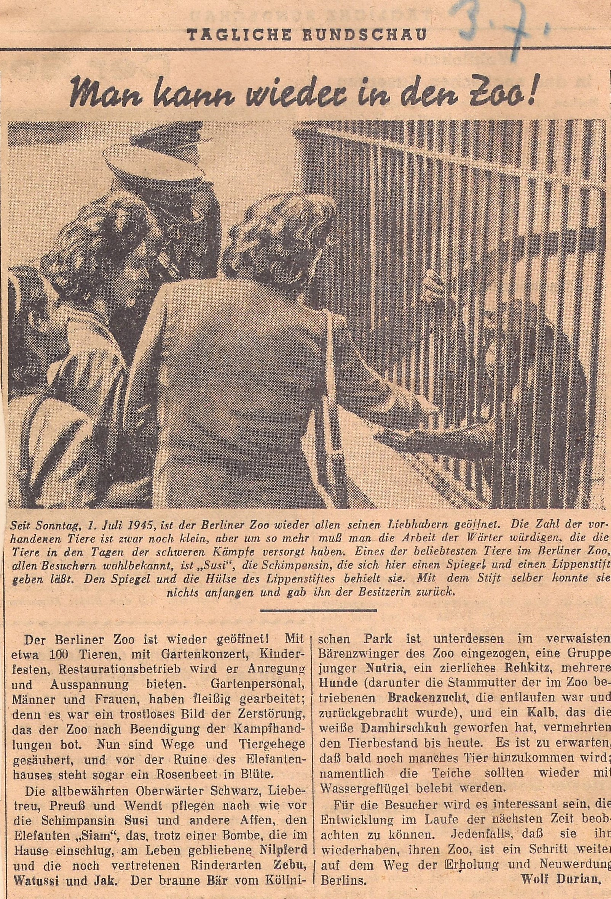

:::EN:::

While the zoo and the city of Berlin had serious problems feeding their inhabitants in the 1940s – see also [[story.feed-scarcity]] – by the end of the 1950s, the situation had largely normalised.[^1] In fact, in some ways, it had done a complete turnaround. The years of the economic boom saw visitors to the zoo once more feeding the animals at the Berlin Zoo as they pleased – to the extent that in 1960 the African elephant "Jambo" fell ill after, or rather as a result of, being fed by zoo visitors.

<figure>

<figcaption>

_Headline of the_ Bild-Zeitung _on the overfeeding problem, occasioned by "Jambo's" illness, 31.03.1960._

</figcaption>

</figure>

The elephant cow suffered severe peritonitis and a rupture in the small intestine caused by a blockage. **After spending fourteen days trying – unsuccessfully – to save "Jambo", the zoo decided to put the animal to sleep.** The incident was not an isolated case. Elephants had already died in the years before due to incorrect or excessive feeding in the zoological gardens of Antwerp, Hamburg, Frankfurt, Stuttgart and Gelsenkirchen. In Berlin in 1961 alone, a baboon, a spotted toucan, a valuable crane, and two deer died as a result of overfeeding.

What followed was a controversial debate, which took place both inside and outside zoos, about the proper feeding (and treatment) of zoo animals. These questions go back to the founding of zoological gardens in the 19th century: What was known at the time about the proper nutrition of zoo animals?

## Feeding: methods and knowledge

From the 19th century onwards, zoos in Germany and elsewhere set up feeding kitchens for the preparation of feed for their animals. These were run by feeding experts, often advised by veterinarians.[^2] The Aquarium Unter den Linden in Berlin employed a "Küchenmeister", or "kitchen master", from the 1880s onwards, and Frankfurt Zoo set up its own feeding kitchen as early as 1875. However, these were still located outside zoo grounds. Nowadays, these kitchens are usually integrated into the complex of the service and maintenance area.

<figure>

<figcaption>

_The service and maintenance area at the Berlin Zoo around 1930. The yard was located at the edge of the grounds, where, among other things, feed for the animals was grown, stored and prepared. (Photo archive Zoologischer Garten Berlin)_

</figcaption>

</figure>

At first, however, there was little knowledge in zoological gardens about the feeding habits of the different animal species they housed. As veterinary historian Benjamin Lamp observes about the history of zoo animal medicine, while it is true that menageries and zoos were able to draw on the knowledge of farm animal husbandry, there were many more species represented in zoological gardens, and people did not always have access to information about the biological requirements of the imported colonial animals; see also [[story.catching-animals]] and [[theme.how-do-animals-get-into-the-zoo]].[^3] This lack of knowledge was also in place with regard to the keeping and breeding of domestic and laboratory animals, which came from colonial territories to living rooms, zoological institutes and physiological laboratories throughout Europe in the 19th century. There, scientists as well as amateur researchers and enthusiasts tried to acclimatise the animals, i.e. to keep them alive or breed them in a new climate. Feeding was an essential and existential part of this. What we know today about the nutrition of laboratory animals, for instance, is the result of a longer process. The price of this knowledge, as the science historian Christian Reiß has shown, entails the numerous and often failed experiments of experts and amateurs alike.[^4]

In the 19th century, Europeans could often only guess at how wild animals that had previously been brought to Europe only sporadically – or indeed had never been brought to Europe before – fed in the wild. As such, attempts were made to keep them alive with substitute foodstuffs or feed mixtures. **The substitutes were often based on human as well as European or German habits rather than animal habits and preferences.** In the end, most animals were given high-calorie feed rations, which lacked important vitamins and minerals. Although veterinarians were quick to describe links between animal diseases such as rickets and the diets of domestic and zoo animals, until the 20th century, little sound scientific knowledge had been gained about the diets of wild animals in captivity.[^5] In Frankfurt, even after the Second World War, the "jam sandwich every day" remained a part of the chimpanzees''s menu, as did "the fried steak."[^6] Incorrect feeding with food that was too high in calories repeatedly led to health problems, especially in the larger animals.[^7]

## Good feeding, bad feeding?

Visitors to zoological gardens were a component of the feeding complex of these institutions from their beginnings. **It had been permitted to feed the animals in German public zoos, with one's own food or feed purchased on the zoo grounds, since their establishment.** Feeding offered the visitors an opportunity for direct contact with the animals. The phenomenon of incorrect and excessive feeding was therefore a part of, and a problem for, zoological gardens from the start. As early as 1872, the naturalist and writer Gustav Jäger remarked:

>"What amused me most was the persistence with which loaves and bread rolls were thrown to the seals, so that often a whole bucket of them could be skimmed off the pond in one day, and only a board with the inscription: 'The seal eats fish and not bread' was able to make pastry-loving Viennese children understand that there were no loaves and bread rolls floating around on the coast of the Baltic and North Seas."[^8]

Dried bread in fact remained one of the most important foodstuffs in zoos until the First World War. This was due, as Benjamin Lamp explains, not least to the fact that in the summer months, part of the zoo's feed came from visitors, who often brought old bread with them.[^9] These problems were also a topic of discussion for veterinary medicine from early on. In 1925, a vet noted in the _Tierärztliche Rundschau_: "Lately it is mainly stomach and intestinal diseases that afflict the animals – a problem with feed is also involved here, due to feeding by zoo visitors." The animals would "often fall ill and unfortunately die from the large quantities they cannot tolerate. We are powerless against these habits of the public, who, incomprehensibly, often throw spoiled food into the cages – only to attract the attention of the animals."[^10]

How and what the visitors fed was dependent not only on personal preferences, but also on the given political, economic and social contexts. How much the visitors themselves had at their disposal, in particular, played a role. Before the war, as Katharina Heinroth recalled, "so many sweets and cakes were given to the favourites of the Berlin zoo visitors that we had a lot of cases of intestinal diseases."[^11] During the time directly after the war, by contrast, she wished for more feeding by visitors. In these years, such gifts to zoo animals were often framed in the press as symbolic gestures of sharing.

<figure>

<figcaption>

_The_ Tägliche Rundschau _presents feeding the animals as an act of sharing in the post-war zoo, 03.07.1946._

</figcaption>

</figure>

Letters from visitors to the zoo also show that many felt that feeding the animals was not only a practical necessity, but also a form of caring. **While in the first post-war years, feeding became an act of solidarity with the zoo and its animals, and may even have saved the lives of some animals, the dangers of overfeeding returned in full force in the 1950s** – see also [[story.feeding-prohibited]].

[^1]: The plots for growing vegetables disappeared from the zoo as early as 1950: "We have a lot of plans for the spring; the gardening should stop now, because the food supply situation here in Berlin has improved fundamentally for the population, so that vegetables can now be bought at the markets again. We can now arrange our grounds prettily again." K. Heinroth to U. Bergman, 07.03.1950, AZGB N 4/12. Direct quotes have been translated into English for clarity’s sake.

[^2]: The German original uses masculine terms here because existing sources only document men in these professions.

[^3]: Cf. Lamp, Benjamin. _Entwicklung der Zootiermedizin im deutschsprachigen Raum_. Giessen: VVB Laufersweiler, 2009: 160. In addition, suitable food was not always available due to limited transportation possibilities and a lack of cooling technology, so that it was necessary to accustom the animals to substitute foodstuffs.

[^4]: Reiß, Christian. "Wie die Zoologie das Füttern lernte. Die Ernährung von Tieren in der Zoologie im 19. Jahrhundert". _Berichte zur Wissenschaftsgeschichte_ 35, no. 4 (2012): 286-299. https://doi.org/10.1002/bewi.201201586. Cf. also Vennen, Mareike. _Das Aquarium. Praktiken, Techniken und Medien der Wissensproduktion (1840-1910)_. Berlin: Wallstein, 2018.

[^5]: Cf. for instance Röll, Moritz Friedrich. "Die Knochenweiche (Rachitis)." In _Lehrbuch der Pathologie und Therapie der Hausthiere_, ed. by Moritz Friedrich Röll, Wien: Braumüller, 1860: 85; Cheadle, Walter Butler. _Rickets. A System of Medicine_, ed. by Thomas Clifford Allbutt, Bd. 4, London: 1897: 108-146. On this, see also Lamp, Benjamin. _Entwicklung der Zootiermedizin im deutschsprachigen Raum_, Giessen: VVB Laufersweiler, 2009: 160.

[^6]: Cf. Scherpner, Christoph. _Von Bürgern für Bürger – 125 Jahre Zoologischer Garten Frankfurt am Main_ Frankfurt a. M.: Zoologischer Garten, 1983: 126. Direct quotes have been translated into English for clarity’s sake.

[^7]: In elephants, excessive weight combined with unsuitable floor coverings often results in pathological changes in the soles of the feet and nails. The obesity of breeding bulls simultaneously endangers successful reproduction. The situation gradually changed as veterinary medicine developed, and as the large animal trading houses that were becoming established, such as Hagenbeck or Ruhe, acquired the knowledge of animal trappers. In this way, feeding began to be oriented more towards the needs of the animals, and to take into account eating habits in their natural environments.

[^8]: Jäger, Gustav. _Skizzen aus dem Thiergarten_, Leipzig: Baensch, 1872: 242. Direct quotes have been translated into English for clarity’s sake.

[^9]: Lamp, Benjamin. _Entwicklung der Zootiermedizin im deutschsprachigen Raum_, Giessen: VVB Laufersweiler, 2009: 161-162.

[^10]: Kallmann, E. "Die Krankheiten der Tiere im Zoologischen Garten in Berlin." _Tierärztliche Rundschau_ 28 (12.07.1925): 482-484. Direct quotes have been translated into English for clarity’s sake.

[^11]: de Luce, Daniel. "Lebensmittelkarte 5 im Berliner Zoo." _Tägliche Rundschau_, 17.12.1946. For further examples of animals that fell ill or died in the Berlin Zoo around 1930 as a result of overfeeding, see also "Feeding prohibited! Observations at the zoo". _Steglitzer Anzeiger_, 24.07.1930. Direct quotes have been translated into English for clarity’s sake.

:::DE:::

Während der Zoo und die Stadt Berlin in den 1940er Jahren große Probleme hatten, ihre Bewohner\*innen zu ernähren, siehe auch [[story.feed-scarcity]], hatte sich die Situation Ende der 1950er Jahre weitgehend normalisiert.[^1] Ja, in mancher Hinsicht verkehrte sie sich sogar. In der Zeit von Wirtschaftswunder und Wachstumsboom fütterten die Zoobesucher\*innen die Tiere im Berliner Zoo wieder ganz nach Belieben, und zwar so ausgiebig, dass 1960 der afrikanische Elefant "Jambo" nach oder vielmehr infolge der Fütterung durch Zoobesucher\*innen erkrankte.

<figure>

<figcaption>

_Schlagzeile der_ Bild-Zeitung _zur Überfütterungsfrage anlässlich der Erkrankung von "Jambo", 31.03.1960._

</figcaption>

</figure>

Die Elefantenkuh erlitt eine schwere Bauchfellentzündung und einen Riss im Dünndarm, der durch eine Verstopfung ausgelöst wurde. **Nachdem man vierzehn Tage lang ohne Erfolg versucht hatte "Jambo" zu retten, entschloss sich der Zoo, das Tier einzuschläfern.** Der Vorfall war kein Einzelfall: In den Zoologischen Gärten in Antwerpen, Hamburg, Frankfurt, Stuttgart und Gelsenkirchen waren in den Jahren zuvor bereits Elefanten durch falsches oder übermäßiges Füttern verendet. In Berlin starben allein 1961 ein Pavian, ein Bunttukan, ein wertvoller Kranich und zwei Hirsche infolge von Überfütterung.

Was folgte, war eine kontroverse Debatte über die richtige Ernährung (und Behandlung) von Zootieren, die innerhalb und außerhalb der Zoos geführt wurde. Die Frage reicht bis zu den Anfängen zoologischer Gärten im 19. Jahrhundert zurück. Wie stand es damals überhaupt um das Wissen über die richtige Ernährung von Zootieren?

## Futterweisen und Futterwissen

Für die Ernährung der Tiere wurden in den Zoos in Deutschland und anderswo ab dem 19. Jahrhundert Futterküchen eingerichtet, für die Futtermeister, häufig beraten durch Veterinärmediziner,  zuständig waren.[^2] Im Aquarium Unter den Linden in Berlin war ab den 1880er Jahren eigens ein "Küchenmeister" angestellt und der Frankfurter Zoo richtete bereits 1875 eine eigene Futterküche ein. Diese lag allerdings noch außerhalb des Zoogeländes; inzwischen sind die Küchen dagegen üblicherweise in den Komplex des Wirtschaftshofs integriert.

<figure>

<figcaption>

_Der Wirtschaftshof im Berliner Zoo um 1930, am Rand des Geländes gelegen, wo unter anderem das Futter für die Tiere angebaut, gelagert und zubereitet wurde. (Fotoarchiv Zoologischer Garten Berlin)_

</figcaption>

</figure>

Zunächst war allerdings in den Zoologischen Gärten nur wenig über die Fressgewohnheiten der unterschiedlichen Tierarten bekannt. Zwar konnten sich die Menagerien und Zoos das Wissen der Nutztierhaltung zunutze machen, schreibt der Veterinärhistoriker Benjamin Lamp über die Geschichte der Zootiermedizin. Doch waren in zoologischen Gärten ungleich mehr Arten vertreten und nicht immer bestand Zugang zu Informationen über die biologischen Ansprüche der importierten kolonialen Tiere, siehe auch [[story.catching-animals]] und [[theme.how-do-animals-get-into-the-zoo]].[^3] Diese Wissenslücke lässt sich auch für die Haltung und Zucht von Haustieren und Versuchstieren beobachten, die im 19. Jahrhundert meist aus kolonialen Gebieten in die Wohnstuben, zoologischen Institute und physiologischen Labore in ganz Europa kamen. Dort versuchten Wissenschaftler\*innen ebenso wie Amateurforscher- und Liebhaber\*innen, die Tiere zu akklimatisieren, sie also in einem anderen Klima am Leben zu erhalten oder zu züchten. Die Fütterung war dabei ein wesentlicher und existenzieller Teil. Was wir heute etwa über die Ernährungsweise von Labortieren wissen, ist das Ergebnis eines längeren Prozesses. Dieses Wissen war, wie der Wissenschaftshistoriker Christian Reiß gezeigt hat, nur für den Preis zahlreicher und häufig gescheiterter Versuche zu haben, an denen Fachleute und Amateur\*innen beteiligt waren.[^4]

Da Europäer\*innen im 19. Jahrhundert häufig nur vermuten konnte, wie sich Wildtiere, die bislang nur vereinzelt oder noch nie nach Europa importiert worden waren, in der freien Natur ernährten, versuchten sie, sie mit Substituten oder Futtermittelmischungen am Leben zu erhalten. **Die Substitute orientierten sich häufig eher an menschlichen und europäischen bzw. deutschen Gewohnheiten als an tierlichen Gewohnheiten oder Vorlieben.** Am Ende erhielten die meisten Tiere kalorienreiche Futterrationen, denen aber wiederum wichtige Vitamine und Mineralstoffe fehlten. Obwohl Veterinärmediziner  schon früh Zusammenhänge zwischen Tierkrankheiten wie der Rachitis und der Ernährungsweise von Haus- und Zootieren beschrieben, waren bis ins 20. Jahrhundert über die Ernährung von Wildtieren in Gefangenschaft nur wenige fundierte wissenschaftliche Erkenntnisse gewonnen worden.[^5] In Frankfurt erhielten die Schimpansen noch nach dem Zweiten Weltkrieg ein Menü, in dem das "Marmeladenbrot täglich" ebenso wenig fehlte "wie das gebratene Steak".[^6] Die falsche Fütterung mit zu kalorienreichen Futtermitteln führten vor allem bei Großtieren immer wieder zu gesundheitlichen Problemen.[^7]

## Gutes Füttern, schlechtes Füttern?

Die Besucher\*innen der zoologischen Gärten waren von Anfang an Teil des Fütterungs-Komplexes. **Seit ihrer Einrichtung war es in öffentlichen deutschen Tiergärten grundsätzlich erlaubt, die Tiere mit mitgebrachtem oder auf dem Tiergartengelände erworbenen Futter zu füttern.** Das Füttern bot den Besucher\*innen eine Möglichkeit zur direkten Kontaktaufnahme mit den Tieren. Das Phänomen der falschen und übermäßigen Fütterung war daher von Anfang Teil und Problem zoologischer Gärten. Bereits 1872 bemerkte der Naturkundler und Schriftsteller Gustav Jäger:

>"Am meisten ergötzte mich die Beharrlichkeit, mit der den Seehunden Milchbrote und Semmeln vorgeworfen wurden, so daß man oft an einem Tage einen ganzen Wassereimer voll vom Teiche abschöpfen konnte, und erst eine Tafel mit der Aufschrift: 'Der Seehund frißt Fische und kein Brot' war im Stande, die mehlspeisliebenden Wiener Kinder auf den Gedanken zu bringen, daß an der Küste der Ost- und Nordsee keine Milchbrote und Semmeln auf dem Wasser umherschwimmen."[^8]

Tatsächlich blieb getrocknetes Brot bis zum Ersten Weltkrieg eines der wichtigsten Futtermittel in Zoos. Das lag, so erklärt Benjamin Lamp, nicht zuletzt daran, dass in den Sommermonaten ein Teil der Nahrung von den Besucher\*innen stammte, die häufig altes Brot mitbrachten.[^9] Auch die Veterinärmedizin diskutierte diese Probleme schon früh. 1925 notierte ein Tierarzt in der _Tierärztlichen Rundschau_: "In letzter Zeit sind es hauptsächlich Magen- und Darmerkrankungen, von denen die Tiere heimgesucht werden: hier spricht aber eine Futterschädigung mit, die durch die Fütterung der Besucher des Zoo\[s] verursacht wird." An den großen Mengen, die die Tiere nicht vertragen, würden sie "oft erkranken und leider auch eingehen. Wir sind gegen diese Gewohnheiten des Publikums machtlos, das in unverständlicher Weise oft verdorbene Nahrungsmittel \[...] in die Käfige wirft – nur, um die Aufmerksamkeit der Tiere auf sich zu lenken".[^10]

Wie und was die Besucher\*innen fütterten, war dabei nicht nur von persönlichen Vorlieben, sondern ebenso von den jeweiligen politischen, ökonomischen und sozialen Kontexten abhängig. Insbesondere spielte eine Rolle, wie viel die Menschen selbst zur Verfügung hatten. Vor dem Krieg sei, wie Katharina Heinroth erinnerte, "den Lieblingen der Berliner Zoobesucher so viel an Süßigkeiten und Kuchen zugesteckt \[worden], daß wir eine Menge Fälle von Darmerkrankungen hatten."[^11] Für die Zeit unmittelbar nach dem Krieg wünschte sie sich dagegen mehr fütternde Besucher\*innen. In diesen Jahren wurden die Gaben an Zootiere in der Presse häufig als symbolische Geste des Teilens in Wort und Bild gesetzt.

<figure>

<figcaption>

_Die_ Tägliche Rundschau _präsentiert das Füttern der Tiere als Akt des Teilens im Zoo der Nachkriegszeit, 03.07.1946._

</figcaption>

</figure>

Auch die Briefe von Besucher\*innen an den Zoo zeigen, dass viele das Füttern der Tiere nicht nur als praktische Notwendigkeit, sondern als eine Form der Fürsorge empfanden. **Während in den ersten Nachkriegsjahren das Füttern zum solidarischen Akt mit dem Zoo und seinen Tieren avancierte und für manche Tiere sogar lebensrettend gewesen sein mag, kehrte die Gefahr der Überfütterung in den 1950er Jahre mit voller Macht zurück.** Siehe hierzu auch [[story.feeding-prohibited]].

[^1]: Die Gemüsebeete verschwanden bereits ab 1950 wieder aus dem Zoo: "Wir haben ja allerhand vor für das Frühjahr; die Gärtelei soll jetzt aufhören, denn die Ernährungsverhältnisse hier in Berlin haben sich ja für die Bevölkerung grundlegend gebessert, so dass man jetzt wieder Gemüse auf den Märkten zu kaufen bekommt. Wir können also nun wieder im Garten unsere Anlagen sehr schön herrichten." K. Heinroth an U. Bergman, 07.03.1950, AZGB N 4/12.

[^2]: Vorhandene Quellen belegen ausschließlich männliche Personen in diesen Berufen.

[^3]: Vgl. Lamp, Benjamin. _Entwicklung der Zootiermedizin im deutschsprachigen Raum_. Giessen: VVB Laufersweiler, 2009: 160. Hinzu kam, dass die passende Nahrung wegen eingeschränkter Transportmöglichkeiten oder mangelnden Kühltechniken nicht immer zur Verfügung stand, so dass die Tiere an Ersatznahrung gewöhnt werden mussten.

[^4]: Reiß, Christian. "Wie die Zoologie das Füttern lernte. Die Ernährung von Tieren in der Zoologie im 19. Jahrhundert". _Berichte zur Wissenschaftsgeschichte_ 35, Nr. 4 (2012): 286-299. https://doi.org/10.1002/bewi.201201586. Vgl. auch Vennen, Mareike. _Das Aquarium. Praktiken, Techniken und Medien der Wissensproduktion (1840-1910)_. Berlin: Wallstein, 2018.

[^5]: Vgl. etwa Röll, Moritz Friedrich. "Die Knochenweiche (Rachitis)." In _Lehrbuch der Pathologie und Therapie der Hausthiere_, hg. von Moritz Friedrich Röll. Wien: Braumüller, 1860: 85; Cheadle, Walter Butler. _Rickets. A System of Medicine_, hg. von Thomas Clifford Allbutt, Bd. 4, London: 1897: 108-146. Siehe hierzu auch Lamp, Benjamin. _Entwicklung der Zootiermedizin im deutschsprachigen Raum_. Giessen: VVB Laufersweiler, 2009: 160.

[^6]: Vgl. Scherpner, Christoph. _Von Bürgern für Bürger – 125 Jahre Zoologischer Garten Frankfurt am Main_. Frankfurt a. M.: Zoologischer Garten, 1983: 126.

[^7]: Bei Elefanten resultierten aus einem zu hohen Körpergewicht zusammen mit ungeeigneten Bodenbelägen häufig pathologische Veränderungen der Fußsohlen und Nägel. Gleichzeitig gefährdete die Adipositas der Zuchtbullen eine erfolgreiche Nachzucht. Die Situation änderte sich sukzessive, als sich die Tiermedizin weiterentwickelte und die sich etablierenden großen Tierhandlungen wie Hagenbeck oder Ruhe sich das Wissen der Tierfänger aneigneten, so dass man sich bei der Fütterung mehr an den Bedürfnissen der Tiere zu orientieren und ihre Ernährungsgewohnheiten in ihren natürlichen Lebensräumen zu berücksichtigen begann.

[^8]: Jäger, Gustav. _Skizzen aus dem Thiergarten_. Leipzig: Baensch, 1872: 242.

[^9]: Lamp, Benjamin. _Entwicklung der Zootiermedizin im deutschsprachigen Raum_. Giessen: VVB Laufersweiler, 2009: 161-162.

[^10]: Kallmann, E. "Die Krankheiten der Tiere im Zoologischen Garten in Berlin". _Tierärztliche Rundschau_ 28 (12.07.1925): 482-484.

[^11]: de Luce, Daniel. "Lebensmittelkarte 5 im Berliner Zoo." _Tägliche Rundschau_, 17.12.1946. Für weitere Beispiele von Tieren, die im Berliner Zoo um 1930 infolge Überfütterung erkrankten oder starben vgl. auch "Füttern verboten! Beobachtungen im Zoo". _Steglitzer Anzeiger_, 24.07.1930.
