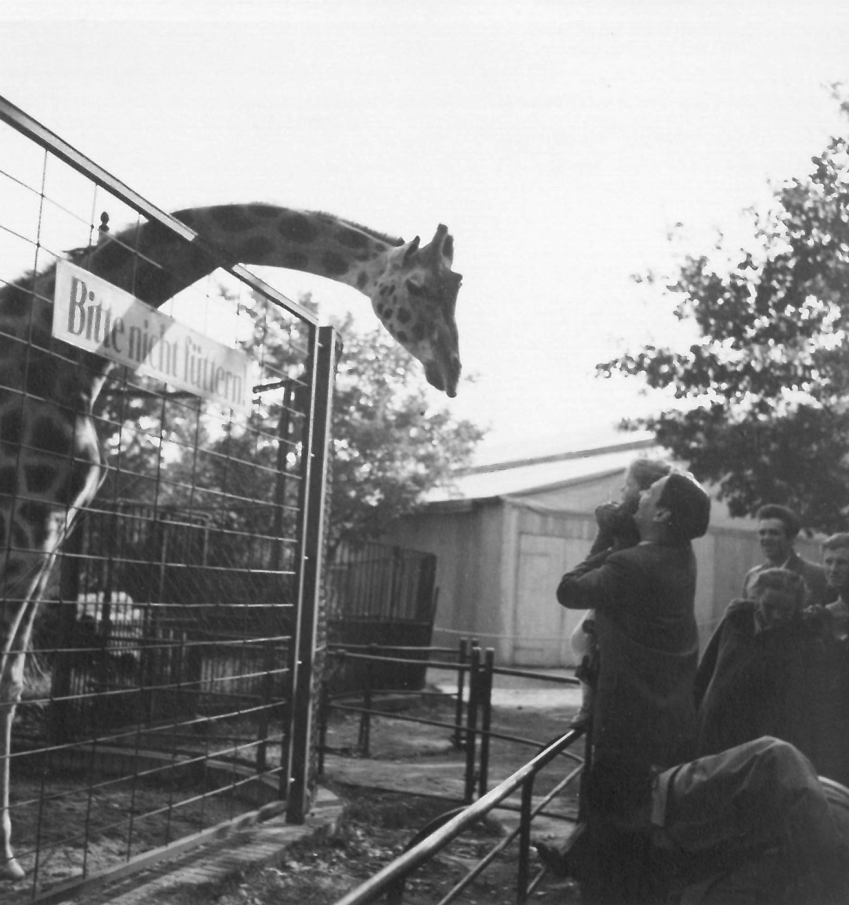
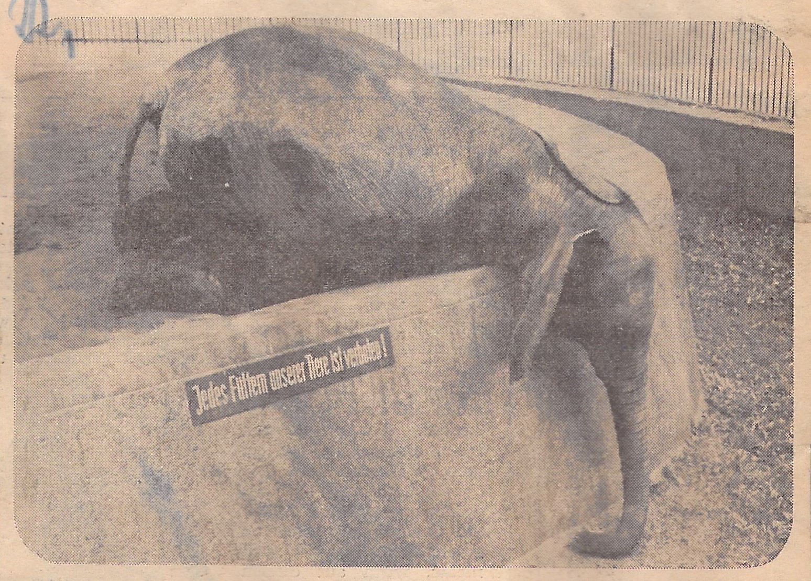
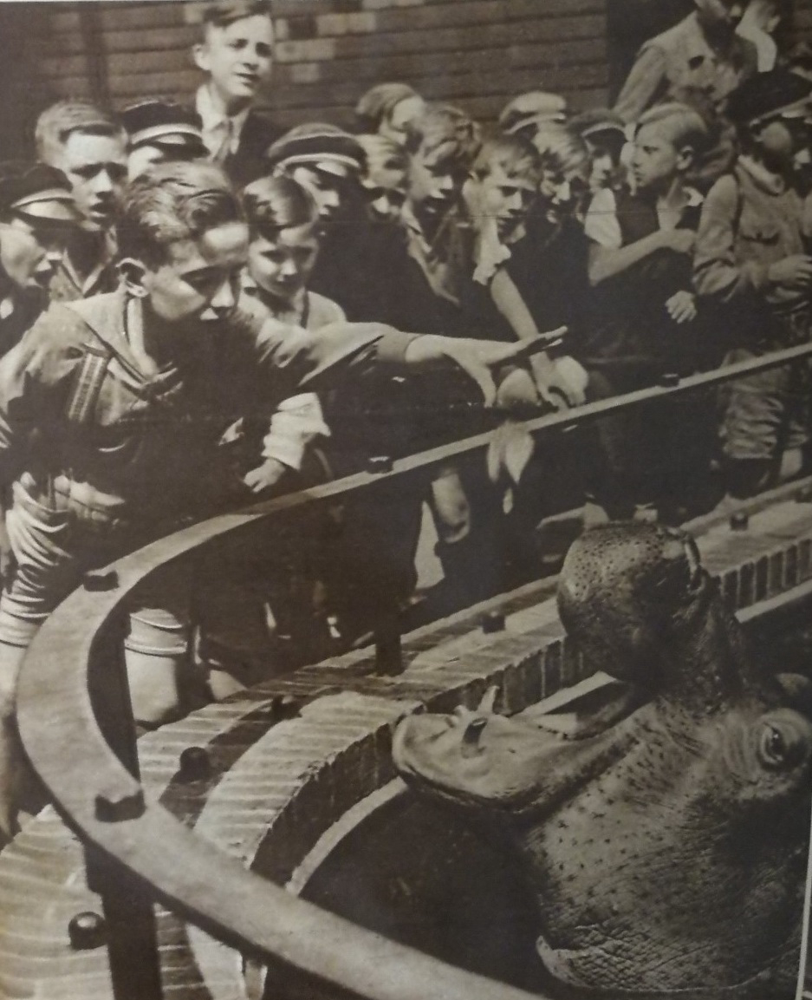

:::EN:::

The death of the elephant cow "Jambo", who fell ill at the Berlin Zoo in 1960 due to overfeeding by visitors, and eventually had to be put down, was followed by a heated debate. The discussion pivoted on the proper handling of animals in captivity, and specifically on the introduction of a feeding ban. **"Jambos's" death led to a general feeding prohibition at the Berlin Zoo from 10 April 1960.**

<figure>

<figcaption>

_Article in the_ Tagesspiegel _on the feeding ban at the Berlin Zoo, on the occasion of "Jambos's" illness, 31.03.1960._

</figcaption>

</figure>

The elephant's death was not the first case of a zoo animal dying as a result of overfeeding – see also [[story.feeding-and-overfeeding]]. Visitors feeding zoo animals with foodstuffs they've brought with them into the zoo is part of a long history of incorrect and excessive feeding. **From the founding of zoological gardens in the 19th century, feeding by visitors was generally permitted.** The zoo guide booklets of the time invited visitors to feed the animals – but even then, the zoo imposed some restrictions. As early as 1873, the Berlin Zoo guide booklets advised visitors not to feed some animals, and in the Hamburg Zoological Garden, visitors were also "most humbly and urgently requested to feed only those animals whose names are displayed on the notice boards" as early as 1879.[^1] Just a few days after the opening of the Frankfurt Zoological Garden in 1858, reports came through: "After the zoological garden was opened on Sunday, most of the animals suffered from an upset stomach as a result of the excessive feeding by visitors". The feeding of various animals thus had to be prohibited altogether. Warnings on the cages regarding the feeding prohibition are also mentioned in the zoo guide of Schönbrunn Zoo in 1912. In most zoos, particularly sensitive animal species such as apes, predators and sea lions were not allowed to be fed at all.[^2]

_What_ could be given to the animals was also indicated in zoo guides and on signs in the gardens from early on. **Elephants, like monkeys, were particularly popular with zoo visitors and Berliners could feed them bread, carrots, oranges, bananas and lemons.** In order to "steer the public's inclination to feed the animals into certain channels", red-marked mechanisms into which food could be placed were installed when the monkey house was extended in 1925. The monkeys "had to use some intelligence" to get at the food. At the same time, a feed shed was placed nearby, where "suitable food" could be purchased – an idea that, according to the zoo's annual report, was well received and simultaneously regulated feeding, at least to some extent.[^3]

Both inside and outside of Germany, discussions about visitor feeding and partial prohibitions in zoological gardens had been going on for a long time – see also [[story.feeding-and-overfeeding]]. Yet the majority of zoos did not introduce a general feeding ban until the 1950s, after illnesses and deaths caused by overfeeding became more frequent, especially in the well-attended summer months. When a newly acquired elephant at the Frankfurt Zoo died on 1 June 1953 as a result of overfeeding by visitors, the director at the time Bernhard Grzimek decided to impose a complete prohibition on the feeding of zoo animals by visitors. In 1957, the Leipzig Zoo followed suit, as did the Münster Zoological Garden in 1959, after several animals had died there as well.[^4] In the same year, the issue was also discussed at the annual meeting of the Verband Deutscher Zoodirektoren, the Association of German Zoo Directors, which called for a general prohibition on visitor feeding.

<figure>

<figcaption>

_Prohibition signs in zoological gardens, printed in_ 8-Uhr-Blatt, _13.04.1960._

</figcaption>

</figure>

However, the introduction of a general feeding prohibition was not without controversy, as is evident from press reports and letters to the zoos. **Since many zoo visitors had long been accustomed to feeding the animals, and the animals in turn expected food, the zoos' demands initially met with resistance in many places, from Frankfurt to Leipzig to Berlin.**[^5] The example of Berlin shows how lengthy and difficult it was to implement such a prohibition.

At first, the zoo hoped to manage with partial bans.

<figure>

<figcaption>

_As early as 1954, visitors were no longer allowed to feed giraffes at the Berlin Zoo. The sign and a barrier were meant to keep visitors at a distance. (AZGB, photo Ottmar Kränzlein. All rights reserved.)[^6]_

</figcaption>

</figure>

The _General Guidelines for the Feeding of Animals by Visitors_ for the Berlin Zoo in 1960 still stated:

>"It is, however, absolutely necessary that at least these partial prohibitions, which only affect particularly sensitive animal species, or only prohibit the use of harmful types of feed, are strictly adhered to. Wrong or excessive feeding has already led to severe health problems, to problems with breeding, and often enough to an agonising end for many animals. We therefore urgently request that our visitors observe the following guidelines."[^7]

Responsibility is placed in the hands of the visitors, but still formulated as a request, as a moral appeal. When the decision was made shortly afterwards to impose a general prohibition, this first had to be made public, enforced and accepted. What seems self-evident today initially required detailed explanation:

>"Please understand that we have taken this measure in the interest of keeping our animals healthy, and be sure to hand in any food you may have brought with you at the reception for the collection bins set up there. – With the sharp increase in visitors to our zoos today, it is no longer possible to expose the animals, which have been procured and reared with great effort, to well-intentioned but uncontrolled feeding by the public."[^8]

It was not only the increasing number of visitors that was being considered. **It was about keeping animals in conditions appropriate to the given species, which in terms of the quantity and quality of feed increasingly sought to take into account the feeding habits of the animals. It was precisely this knowledge that was to be imparted to the visitors:**

>"Even if your food seems unobjectionable to you, serious illnesses and deaths would continue to occur due to too many people feeding the animals; even if only every tenth visitor offered a small amount of food, an enormous amount would accumulate in the course of one day! An animal that is normally fed on hay and oats, for example, would be in mortal danger if it were suddenly given pounds of bread, fruit and kitchen scraps during a busy day at the zoo! The view that 'every animal knows what and how much suits them' is unfortunately wrong, and many a zoo animal has met an agonising end because of this."[^9]

<figure>

<figcaption>

_The new guidelines overwrite the old ones in the Berlin Zoo guide of 1960._

</figcaption>

</figure>

After the decision was made to ban visitor feeding of the animals, the outdated feeding rules were first overwritten by a makeshift red stamp in the Zoo guide of 1960. The next year, the regulations were completely revised. From then on, the guidebook indicated the prohibition right from the start, in the _Gartenordnung_ – the zoo regulations – or in the introduction. In the garden itself, signs were also placed directly at the enclosures.

<figure>

<figcaption>

_Sign prohibiting feeding at the Zoological Garden Berlin. (AZGB. All rights reserved.)_

</figcaption>

</figure>

<figure>

<figcaption>

_ Sign at the emu enclosure at the Berlin Zoo, 1980. (AZGB, photo Kühn. Alle rights reserved.)_

</figcaption>

</figure>

To ensure that the feeding ban was observed, handouts were distributed at the Frankfurt and Berlin zoos, and multilingual signs were put up: "Feeding 25,- DM and admission ban". In the East Berlin zoo, there was also the threat of a fine. Nevertheless, the prohibition was repeatedly disregarded, especially in the early days.[^10] **The feeding prohibition crystallised a conflict of interest between species-appropriate animal keeping, educational aims, and the desire for entertainment and direct contact with the animals.** For the zoological gardens, animal wellbeing and not least economic issues were also at stake. Elephants like "Jambo" were valuable animals, and their death was a correspondingly significant financial loss. The prohibition simultaneously resulted in savings in other departments: at the Stuttgart Zoo, as the _Tagesspiegel_ reported, expenditures on medicine had fallen by a third since the introduction of a prohibition on feeding.[^11]

**For zoo visitors, the prohibition in turn changed their relationship to the animals.** The Berlin Zoo had to issue countless warnings and reprimands because visitors continued to feed the animals despite the ban. The debate always revolved around emotions, because the issue of feeding, like hardly any other topic at the time, came to a head in the question of the "love of animals".

For a long time, and especially in the post-war years, those who fed and expressed their concern for the animals were considered "Tierfreunde", or "animal lovers"[^12]. **With the prohibition on feeding, a different understanding of "animal friendship" entered the scene. This also changed, for example, the way lion cubs were handled, and at the same time manifested in a changed attitude towards one's own feeding behaviour.**

For many, the love of animals, and concern for them, were best expressed by restraint – in the subordination of one's own desire to feed them: "We also regret the sad end of Jambo and welcome the feeding ban. There is no other way to deal with Berliners and their exaggerated love of animals"[^13], as an anonymous supporter of the ban put it in a letter to the zoo. Whereas previously giving readily had been one of the central virtues of the "animal lover" at the zoo, now it was self-control – on which the health of the animals was dependent. **Feeding – especially excessive feeding – was now judged to be "false animal love."**[^14] This was part of a broader change, as noted by cultural studies scholar Christina Wessely, who writes that the "rather intrusive animal lover" was increasingly being replaced by a view in which humans were quite deliberately relegated to the background – a process that was only largely completed around the turn of the millennium.[^15]

The Berlin Zoo also made use of the rhetoric of "animal friendship" to implement its feeding prohibition in the 1960s. It relied not only on disciplinary measures in the form of prohibition signs, but also on visitors' moral conscience:

>"The real animal lover stays in contact with their favourites even without a sugar cone, and is happy when the animals no longer just stand begging at the bars all day, but lead a healthy and carefree life in harmony with nature."[^16]

It was, in fact, the particularly tame animals, accustomed to humans and their feeding, who were especially in danger. In 1959, when feeding was still theoretically permitted, the zoo had already "had to decide to ban feeding for some very tame toucans during the Easter holidays."[^17]

The zoo also invoked the "love of animals" when it called on its visitors with a "special request" to actively contribute to enforcing the zoo rules. This was already the case when partial bans were still in place:

>"Special request: True animal lovers prove their love of animals and, together with our officials, make sure that no visitor disregards the feeding prohibitions on certain animals. It would be regrettable if the management were forced to issue an overarching feeding prohibition in order to put a stop to unauthorised feeding."

<figure>

![Page 8 from an old zoo guide. Text: Whom and what visitors may feed. (...) Please do not feed any spoiled food; it is absolutely harmful! Also, unripe fruit. Please do not feed any sugar or sweets; almost all animals like them, but if each visitor gives just a bit of sugar, it will amount to so much that the animals will become ill. We have suffered many a loss in this way. Prohibited from being fed: Large and small predators, apes, seals, penguins, birds of prey and owls, antelopes and giraffes, some deer species and ostriches. Framed at the very bottom is the aforementioned "special request".](images\mv\FuetterregelnWegweiser1956AusschnittJPG.jpg)

<figcaption>

_However, this appeal in the 1956 zoo guide was not yet a general prohibition on feeding. For many animals, feeding with certain foods was still permitted._

</figcaption>

</figure>

Many people took this at its word, and so in the first months after the ban was introduced, the zoo received numerous letters like this one:

>"…the love of animals prompts me to lament to you what I experienced during my visit to the zoo last Saturday. A boy of about six years gave an elephant some poppcorn [sic]. He and his father did not understand my pointing out the feeding prohibition; I heard them speaking English. But I think that even foreigners should know that one should not feed the animals. [...] I want to bring this to your attention in the hope that perhaps you will see fit to levy a fine on such unreasonable people. I am by no means alone in my conviction that only a fine, and not simple requests and prohibitions, will be successful in the long run, for the good of our beloved animals."[^18]

Another anonymous writer told of three ladies she had observed at the elephant enclosure. "One of them kept on feeding, and when I angrily told her to stop, because it was written everywhere, she got cheeky, – I have a full belly, but the animals are hungry, and I should move along. And she threw down another 1 whole toasted rusk". The correspondent ended her letter with the words: "If you think it is good that the woman is allowed to feed, then I never want to visit the zoo again. [...] An animal-loving zoo visitor".[^19]

These and other incidents further fuelled the discussion about which were the right measures to implement the feeding prohibition. **Suggestions from the public ranged from the introduction of guards, to fines, to expulsions from the zoo.**

Other suggestions were directed at altering the architecture, rather than disciplining people: "Wouldn't it be appropriate," wrote one visitor after the death of an elephant seal, "to put mesh screens all around and on top, or to surround the basins with glass and put wire mesh on top, so that it is impossible to stick even the smallest thing through! Feeding prohibitions are pointless; the animals must rather be shielded in such a way that deaths or illnesses no longer occur."[^20]

**The [[Architektur der Gehege|story.Zoo Architecture]] did indeed play an important role in the relationship between visitors and animals**. In the early 1930s, following Hagenbeck's open-air enclosures, the fences of many pens had been replaced by trenches. In 1930, the Berlin Zoological Garden also boasted that it had "de-fenced" its enclosures.[^21] However, the distance thus created did not necessarily completely cut off contact – nor was it the intention that it should do so. Rather, the trench in the elephant enclosure in Berlin was kept so narrow "that the animals could take bread from the visitors' hands with their trunks," as zoo director Lutz Heck described it.[^22] The hippopotamus pool also still allowed direct contact, and facilitated feeding by visitors, as a photograph from the illustrated magazine _Die Woche im Bild_ shows.

<figure>

<figcaption>

_The cover picture of_ Die Woche im Bild _of the hippo pool shows that feeding the animals had long been one of the attractions offered by the zoo – an attraction supported by architecture that allowed for proximity to the animals, 07.08.1930._

</figcaption>

</figure>

By the end of the 1950s, this was no longer an option. The food brought in by visitors was collected at the elephant enclosure.

<figure>

<figcaption>

_After "Jambo" fell ill, visitors had to hand over the food they had brought with them to the zookeeper, as reported by the_ Bild-Zeitung, _02.04.1960._ 

</figcaption>

</figure>

In the early 1960s, glass panes were even implemented in the designing of the new monkey house. Up until that point, the monkeys – excluding the apes – could be fed bread, tropical fruits, various vegetables, nuts, oatmeal and lentils.[^23] At one time, even popcorn was allowed – in the year the zoological garden opened a popcorn stand.[^24]

With the general feeding prohibition in 1960, the guidelines, and later the architecture of the facility, also changed for the monkeys – for reasons of hygiene and safety. This altered the relationship between proximity and distance. Some visitors were in favour of this in their letters, but there were also opposing views. Zoo visitor Erna von Bongart, for example, wrote that she felt that the monkeys

>"who have been in close contact with long-time subscribers for many years, such as little Bubi, should not be closed off so completely. [...] I don't think it's right to put in place such strict measures of isolation for the animals that have been used to human contact for all these years. Also, one should not forget how many lonely people there are; one also deprives them of a part of the fullness of their lives, of their joy."[^25]

The zoo itself at first also seemed torn between views. According to director Heinz-Georg Klös, a public zoo is "there for the animals and the people", which is why compromises had to be made. "If, for example, the animals are 'barricaded' too much behind glass, bars and barriers, the visitor – apart from not being allowed to feed them – lacks the direct experience, the contact." At the same time, Klös wrote in his response to a letter from a zoo visitor: "[W]e will gradually place our most valuable animals behind glass. Then unauthorised feeding can no longer occur, nor can any illnesses be transmitted to the animals by visitors."[^26] Was responsibility being transferred to people, or delegated to things that draw boundaries, limit contact and prevent closeness?

The issue had been discussed amongst zoo directors for some time. Yet in 1928, at the 40th Conference of Central European Zoological Gardens, "[e]very discussion on the separation of the monkeys from the public by glass walls" still led to "no unanimous response."[^27] **Animals and visitors were separated by the gradual conversion to enclosure architecture that prevented direct contact**. The change reduced contact with the animals to eye contact and put a definitive end to feeding by visitors.[^28] This proved beneficial to the health of many animals, as within a few years of introducing the general feeding prohibition, not least the need for medication and treatment decreased noticeably.[^29] Separating glass panels were used in the ape house as early as the early 1960s – a practice that is now widespread.[^30] At the same time, the workings of the feeding kitchen were made transparent: "Through large panes of glass, the public can see into the feeding kitchen and watch the keepers prepare [...]."[^31] In the mid-1970s, when the monkey house was renovated after the ape house, glass panes instead of iron bars were implemented to separate the animals from the public there too – simultaneously allowing a clearer view, and direct eye contact. The behaviour of many animals began to normalise; they no longer begged for food when a human approached. Zoo directors reported that fewer animals suffered, or died, from digestive disorders.[^32] "It is a pleasure to observe the animals in their natural way of life and playfulness after the introduction of the feeding prohibition"[^33], as one anonymous letter to the Berlin Zoo put it. There were many approving voices like this one, which, interestingly, due to the newly imposed distance identified the zoo as a place of the natural, and no longer regarded the begging of the animals as natural behaviour. This shows how notions of the "natural" are historically variable.

[^1]: Hennings, Edwin. _Katalogirter Führer durch den Berliner Zoologischen Garten_, 6. Ed. Berlin: A. Seidel, 1873: 2. The Hamburg Zoo guide pointed to the notice boards explicitly. Cf. Bolau, Heinrich. _Führer durch den Zoologischen Garten zu Hamburg_, 29. Ed. Hamburg: Verlag der Zoologischen Gesellschaft Hamburg, 1879: n.p. Direct quotes have been translated into English for clarity's sake.

[^2]: Backhaus, D. "Die Eröffnung des Gartens im Jahre 1858". In _Hundertjähriger Zoo in Frankfurt am Main_, ed. by the Zoological Garden of the City of Frankfurt am Main. Frankfurt a.M.: 1957. Direct quotes have been translated into English for clarity's sake.

[^3]: Zoological Garden Berlin. _Geschäftsbericht des Aktien-Vereins des Zoologischen Gartens zu Berlin_ for the year 1925. Direct quotes have been translated into English for clarity's sake.

[^4]: At the beginning of 1956, a report in the _Leipziger Volkszeitung_ informed of the introduction of a general prohibition on feeding: "Most of the treats brought by the public for their favourites are unsuitable for the animals, in many cases even harmful. [...] Often, nausea and intestinal diseases set in and medical treatment has to cure the spoilt stomachs. Unfortunately, it does not always go 'well', and we have already lost valuable animals in this way. In the interest of keeping our wards healthy, improper feeding must therefore be avoided." Dittrich, Lothar. "Nicht mehr füttern!" _Leipziger Volkszeitung_, January 1956, cited in: Haikal, Mustafa, and Jörg Junhold. _Auf der Spur des Löwen: 125 Jahre Zoo Leipzig_. Leipzig: Pro Leipzig e.V., 2003: 181.

[^5]: Conference of the Association of German Zoo Directors from 18 to 20 June 1959. Minutes of the business sessions, AZGB V 1/4; Lamp, Benjamin. _Entwicklung der Zootiermedizin im deutschsprachigen Raum_. Giessen: VVB Laufersweiler, 2009: 178.

[^6]: In the Berlin Zoo guide, giraffes first appear in the feeding guidelines in 1956, with the instruction that it is generally forbidden to feed them.

[^7]: Klös, Heinz-Georg. _Wegweiser durch den Zoologischen Garten Berlin 1960_. Berlin: Aktien-Verein des Zoologischen Gartens zu Berlin, 1960. Direct quotes have been translated into English for clarity's sake.

[^8]: Klös, Heinz-Georg. _Wegweiser durch den Zoologischen Garten Berlin 1961_. Berlin: Aktien-Verein des Zoologischen Gartens zu Berlin, 1961.

[^9]: Klös, Heinz-Georg. _Wegweiser durch den Zoologischen Garten Berlin 1961_. Berlin: Aktien-Verein des Zoologischen Gartens zu Berlin 1961. About ten years later, this was well-established and the guide simply noted: "Feeding is strictly prohibited. With around 2.5 million visitors a year, if everyone handed over even a small morsel, such large amounts of food would accumulate that the animals would have to suffer harm. Well-intentioned, but uncontrolled feeding can even result in death." Klös, Heinz-Georg. _Wegweiser durch den Zoologischen Garten Berlin 1975_. Berlin: Aktien-Verein des Zoologischen Gartens zu Berlin 1975.

[^10]: Cf. for instance Anonymous letter to the Management of the Zoological Garden Berlin, 08.08.1966, AZGB O 0/1/224; H. Gottheim to the Management of the Zoological Garden Berlin, 16.04.1960 , AZGB TIERKORRESPONDENZ 1.10.1959-31.6.1960 (unerschlossen); Zoological Garden Berlin to M. Hingst, 20.07.1960, AZGB TIERKORRESPONDENZ 1.10.1959-31.6.1960 (unerschlossen); C. Hübner to the Management of the Zoological Garden Berlin, no date, AZGB TIERKORRESPONDENZ 1.10.1959-31.6.1960 (unerschlossen; Management of the Zoological Garden Berlin to C. Hübner, AZGB TIERKORRESPONDENZ 1.10.1959-31.6.1960 (unerschlossen).

[^11]: "Füttern im Zoo von heute an verboten". _Tagesspiegel_, 31.03.1960.

[^12]:  On the figure of the "Tierfreund", cf. Wessely, Christina. _Löwenbaby._ Berlin: Matthes & Seitz, 2019; Klothmann, Nastasja. _Gefühlswelten im Zoo: Eine Emotionsgeschichte 1900-1945_. Bielefeld: transcript, 2015: 201-220.

[^13]: Anonymous letter to the Management of the Zoological Garden Berlin, 11.04.1960, AZGB O 0/1/112. Direct quotes have been translated into English for clarity's sake.

[^14]: Cf. "Falsche Tierliebe". _Gießener Anzeiger_, 16.04.1960. Direct quotes have been translated into English for clarity's sake.

[^15]: Wessely, Christina. _Löwenbaby._ Berlin: Matthes & Seitz, 2019: 59. Direct quotes have been translated into English for clarity's sake.

[^16]: Klös, Heinz-Georg. _Wegweiser durch den Zoologischen Garten Berlin 1961_. Berlin: Aktien-Verein des Zoologischen Gartens zu Berlin 1961: 8. Direct quotes have been translated into English for clarity's sake.

[^17]: Zoological Garden Berlin to M. Günther, 06.04.1959, AZGB Tierkorrespondenz 1.1.1959-30.9.1959 (unerschlossen). Direct quotes have been translated into English for clarity's sake.

[^18]: M. Hingst to the Zoological Garden Berlin, 12.07.1960, AZGB O 1/2/81. Direct quotes have been translated into English for clarity's sake.

[^19]: Anonymous letter to the Management of the Zoological Garden Berlin, 08.08.1966, AZGB O 0/1/224. Direct quotes have been translated into English for clarity's sake.

[^20]: A. Irmler to Heinz-Georg Klös, 21.09.1959, AZGB O 1/2/80. Direct quotes have been translated into English for clarity's sake.

[^21]: Beatz, H. "Der Zoo wird entgittert". _Morgenpost Berlin_, 22.02.1930. The shift was an international phenomenon. In the London Zoo, for instance, the biologist Julian Huxley, who became zoo director in 1936, advocated the dismantling of fences. Direct quotes have been translated into English for clarity's sake.

[^22]: Heck, Lutz. _Führer durch den Zoologischen Garten zu Berlin 1931_, Berlin: Aktien-Verein des Zoologischen Gartens zu Berlin, 1931: 5. Direct quotes have been translated into English for clarity's sake.

[^23]: Heck, Lutz. _Wegweiser durch den Zoologischen Garten Berlin_. Berlin: Aktien-Verein des Zoologischen Gartens zu Berlin, 1936.

[^24]: Cf. Heinroth, Katharina. _Der Zoologische Garten Berlin. Zweiter Bericht und Wegweiser nach dem Kriege 1956._ Berlin: Aktien-Verein des Zoologischen Gartens zu Berlin, 1956: 8.

[^25]: E. von Bongardt to the Management of the Zoological Garden Berlin, 01.10.1959, AZGB O 1/2/81. Direct quotes have been translated into English for clarity's sake.

[^26]: H.-G. Klös to C. Hübner, 13.05.1959, AZGB O 1/2/80. Direct quotes have been translated into English for clarity's sake.

[^27]: 40th Conference of Central European Zoological Gardens in Breslau from 23 to 25 August 1928, AZGB V 1/10. Direct quotes have been translated into English for clarity's sake.

[^28]: Exceptions today are petting zoos. Formerly, this was done by "Tierkinderzoos", "animal children's zoos".

[^29]: Cf. for instance. Scherpner, Christoph. _Von Bürgern für Bürger – 125 Jahre Zoologischer Garten Frankfurt am Main_. Frankfurt a. M.: Zoologischer Garten, 1983: 145. 

[^30]: Cf. May, Christina. _Die Szenografie der Wildnis: immersive Techniken in zoologischen Gärten im 20. und 21. Jahrhundert_. Berlin: Neofelis Verlag, 2020.

[^31]: Klös, Heinz-Georg, and Ursula Klös. _Der Berliner Zoo im Spiegel seiner Bauten, 1841-1989. Eine baugeschichtliche und denkmalpflegerische Dokumentation über den Zoologischen Garten Berlin_. Berlin: Heenemann, 1990: 237. Direct quotes have been translated into English for clarity's sake.

[^32]: Conference of the Association of German Zoo Directors from 18 to 20 June 1959. Minutes of the business sessions, AZGB V 1/4.

[^33]: Cf. Anonymous letter to the Management of the Zoological Garden Berlin, September 1960, AZGB O 0/1/224; Scherpner, Christoph. _Von Bürgern für Bürger – 125 Jahre Zoologischer Garten Frankfurt am Main_ Frankfurt a. M.: Zoologischer Garten, 1983: 145.

:::DE:::

Auf den Tod der Elefantenkuh "Jambo", die 1960 im Zoo Berlin wegen Überfütterung durch die Besucher\*innen erkrankte und schließlich eingeschläfert werden musste, folgte eine hitzige Diskussion. Sie drehte sich um den richtigen Umgang mit Tieren in Gefangenschaft und ihre Fütterung  . **"Jambos" Tod führte ab dem 10. April 1960 zu einem generellen Fütterungsverbot im Berliner Zoo.**

<figure>

<figcaption>

_Artikel im_ Tagesspiegel _zum Fütterungsverbot im Berliner Zoo anlässlich der Erkrankung von "Jambo", 31.03.1960._

</figcaption>

</figure>

Der Tod des Elefanten war nicht der erste Fall, bei dem Zootier an den Folgen von Überfütterung starb, siehe auch [[story.feeding-and-overfeeding]]. Zootiere mit mitgebrachten Lebensmitteln zu füttern, ist Teil einer langen Geschichte falscher oder übermäßiger Fütterung. **Seit ihren Anfängen im 19. Jahrhundert war das Füttern durch die Besucher\*innen in zoologischen Gärten grundsätzlich erlaubt.** Die damaligen Zooführer – kleine, gedruckte Informationshefte – luden die Besucher\*innen zum Füttern ein, allerdings schon damals mit Einschränkungen. Der Berliner Zooführer wies bereits 1873 darauf hin, manche Tiere nicht zu füttern und im Hamburger Zoologischen Garten wurden die Besucher\*innen ebenfalls schon 1879 "ergebenst und dringend ersucht, nur diejenigen Thiere zu füttern, deren Namen auf den Anschlagtafeln bekannt gemacht sind".[^1] Über den Zoologischen Garten Frankfurt hieß es nur wenige Tage nach der Eröffnung 1858: "Nachdem am Sonntage der zoologische Garten eröffnet worden, haben in Folge der von den Besuchern übermäßig gereichten Fütterung die meisten Thiere an verdorbenem Magen gelitten." So musste das Füttern verschiedener Tiere ganz untersagt werden. Mahnungen an den Käfigen bezüglich des Fütterungsverbots sind auch im Zooführer des Tiergartens Schönbrunn 1912 erwähnt. Besonders empfindliche Tierarten wie Menschenaffen, Raubtiere und Seelöwen durften in den meisten Zoos überhaupt nicht gefüttert werden.[^2]

Darüber, _was_ den Tieren angeboten werden durfte, wiesen die Zoowegweiser und im Garten aufgestellte Schilder ebenfalls schon früh hin. **Elefanten, ebenso wie die Affen bei den Zoogästen besonders beliebt, konnten die Berliner\*innen mit Brot, Möhren, Apfelsinen, Bananen und Zitronen füttern.** Um die "Neigung des Publikums, die Tiere zu füttern, [...] in bestimmte Bahnen [zu lenken]", wurden bei der Erweiterung des Affenhauses 1925 rot gekennzeichnete Vorrichtungen angebracht, wo das Futter hineingelegt werden konnte und die Affen "etwas Intelligenz anwenden müssen", um es zu ergreifen. Gleichzeitig war in der Nähe ein Futterhäuschen aufgestellt, wo man "geeignetes Futter" kaufen konnte – eine Idee, die laut Geschäftsbericht des Zoos gut ankam und das Füttern zumindest in gewissem Maße regulierte.[^3]

Diskussionen über die Fütterung durch Besucher\*innen und Teilverbote in zoologischen Gärten innerhalb und außerhalb von Deutschland waren schon lange präsent, siehe auch [[story.feeding-and-overfeeding]], doch führte die Mehrzahl der Zoos erst in den 1950er Jahren ein generelles Fütterungsverbot ein – nachdem sich die Erkrankungen und Tode, die auf Überfütterung zurückgingen, gerade in den gut besuchten Sommermonaten häuften. Als am 1. Juni 1953 ein erst kürzlich neu erworbener Elefant im Frankfurter Zoo an den Folgen der Überfütterung durch die Besucher\*innen verendete, beschloss der damalige Direktor Bernhard Grzimek, das Füttern der Zootiere durch Besucher\*innen komplett zu verbieten. 1957 folgte der Leipziger Zoo und 1959 der Zoologische Garten zu Münster, nachdem auch dort mehrere Tiere gestorben waren.[^4] Im gleichen Jahr wurde die Frage auf jährlichen Tagung des Verbands Deutscher Zoodirektoren diskutiert, der ein generelles Fütterungsverbot   beschloss.

<figure>

<figcaption>

_Verbotsschilder in zoologischen Gärten, abgedruckt im_ 8-Uhr-Blatt, _13.04.1960._

</figcaption>

</figure>

Die Einführung eines generellen Fütterungsverbots war jedoch nicht unumstritten, wie Pressemeldungen und Zuschriften an die Zoos belegen. **Da viele Zoobesucher\*innen seit Jahren daran gewöhnt waren und die Tiere ihrerseits Futter erwarteten, stießen die Forderungen der Zoos vielerorts, von Frankfurt über Leipzig bis Berlin, zunächst auf Widerstand.**[^5] Das Beispiel Berlin zeigt, wie langwierig und schwierig die Durchsetzung eines solchen Verbots war.

Zunächst hoffte der Zoo, mit Teilverboten auszukommen.

<figure>

<figcaption>

_Giraffen durften im Berliner Zoo bereits 1954 nicht mehr gefüttert werden. Das Schild und eine Absperrung sollten die Besucher\*innen auf Abstand halten. (AZGB, Foto Ottmar Kränzlein. Alle Rechte vorbehalten.)[^6]_

</figcaption>

</figure>

In den _Allgemeinen Richtlinien für die Fütterung der Tiere durch die Besucher_ für den Zoo Berlin heißt es noch 1960:

>"Es ist aber unbedingt erforderlich, daß wenigstens diese Teilverbote, die nur besonders empfindliche Tierarten betreffen bzw. nur die Verwendung schädlicher Futtersorten untersagen, strikt eingehalten werden. Falsche oder zu reichliche Fütterung hat schon bei vielen Tieren zu schweren Gesundheitsstörungen, zu Zuchtuntauglichkeit und oft genug zu einem qualvollen Ende geführt. Wir bitten unsere Besucher daher dringend, die Hinweise zu beachten".[^7]

Die Verantwortung wird in die Hände der Besucher\*innen gelegt. Es handelt sich noch um eine Bitte, einen moralischen Appell. Als kurz darauf auch hier ein generelles Verbot eingeführt wurde, musste dies erst einmal publik gemacht, durchgesetzt und akzeptiert werden. Was heute selbstverständlich erscheint, bedurfte damals einer ausführlichen Erklärung:

>"Haben Sie bitte Verständnis für diese im Interesse der Gesunderhaltung unserer Tiere getroffenen Maßnahme, und geben Sie etwa mitgebrachtes Futter unbedingt am Empfang für die dort aufgestellten Sammelbehälter ab. – Bei dem heute so sehr stark angestiegenen Besuch unserer Tiergärten ist es nicht mehr möglich, die unter großen Mühen beschafften und herangezogenen Tiere der gutgemeinten, aber unkontrollierbaren Fütterung durch das Publikum auszusetzen."[^8]

Nicht nur steigende Besuchszahlen wurden hier ins Feld geführt. **Es ging auch um den Anspruch einer artgerechten Tierhaltung, Quantität und Qualität des Futters an die Fressgewohnheiten der Tiere anzupassen. Eben dieses Wissen sollte den Besucher\*innen vermittelt werden:**

>"Auch wenn Ihr Futter Ihnen einwandfrei erscheint, würden doch immer wieder schwere Erkrankungen und Todesfälle dadurch eintreten, daß zu viele Menschen füttern; auch wenn nur jeder zehnte Besucher eine Kleinigkeit reicht, käme im Laufe des Tages eine gewaltige Menge zusammen! Ein Tier, das z.B. normalerweise mit Heu und Hafer ernährt wird, gerät in Lebensgefahr, wenn es bei starkem Zoobesuch auf einmal pfundweise Brot, Obst oder Küchenabfälle erhält! Die Ansicht: 'Jedes Tier weiß, was und wieviel ihm bekommt', ist leider falsch, und manches Zootier hat deswegen schon ein qualvolles Ende nehmen müssen."[^9]

<figure>

<figcaption>

_Die neuen Richtlinien überschreiben die alten im Berlin Zooführer von 1960._

</figcaption>

</figure>

Im Zooführer von 1960 wurde nach dem Beschluss des Verbots den nun veralteten Fütterungsregeln zuerst behelfsmäßig ein roter Stempel aufgedrückt. Im nächsten Jahr war das Regelwerk dann komplett überarbeitet. Auf das Verbot wies der Wegweiser von nun an gleich am Anfang in der _Gartenordnung_ oder in der einleitenden Ansprache hin. Im Garten selbst waren außerdem Schilder direkt an den Gehegen angebracht.

<figure>

<figcaption>

_Fütterungsverbotsschild im Zoologischen Garten Berlin 1969. (AZGB. Alle Rechte vorbehalten.)_

</figcaption>

</figure>

<figure>

<figcaption>

_Hinweisschild am Emugehege im Berliner Zoo 1980. (AZGB, Foto Kühn. Alle Rechte vorbehalten.)_

</figcaption>

</figure>

Damit das Fütterungsverbot eingehalten wurde, verteilte man im Frankfurter und Berliner Zoo Handzettel und stellte mehrsprachige Tafeln auf: "Füttern 25,- DM und Gartenverbot". Im Ostberliner Tierpark drohte ebenfalls eine Geldstrafe. Trotzdem wurde das Verbot gerade in der ersten Zeit immer wieder missachtet.[^10] **Im Fütterungsverbot kristallisierte sich ein Interessenkonflikt zwischen artgerechter Tierhaltung, Bildungsanspruch und dem Bedürfnis nach Unterhaltung und einem unmittelbaren Kontakt mit den Tieren.** Für die zoologischen Gärten standen dabei das Tierwohl und nicht zuletzt auch ökonomische Fragen auf dem Spiel. Elefanten wie "Jambo" waren wertvolle Tiere und ihr Tod ein entsprechend hoher finanzieller Verlust. Gleichzeitig ließen sich mit dem Verbot an anderer Stelle Einsparungen machen – im Stuttgarter Zoo, so berichtete der _Tagesspiegel_, waren seit Einführung eines Fütterungsverbots die Arzneimittelkosten um ein Drittel gesunken.[^11]

**Für die Zoogäste veränderte sich mit dem Verbot wiederum die Beziehung zum Tier.** Der Berliner Zoo musste unzählige Mahnungen und Verweise aussprechen, da Besucher\*innen die Tiere trotz des Verbots weiter fütterten. Die Debatte drehte sich immer wieder um Emotionen, denn in der Fütterungsfrage kulminierte damals wie bei kaum einem anderen Thema die Frage nach der "Tierliebe".

Lange Zeit und insbesondere in den Nachkriegsjahren galt als "Tierfreund"[^12] vor allem, wer fütterte und darin seine Sorge um die Tiere bekundete. **Mit den Fütterungsverboten tritt ein anderes Verständnis der "Tierfreundschaft" auf den Plan, das beispielsweise auch den Umgang mit Löwenbabys veränderte und sich zugleich in einer gewandelten Einstellung zum eigenen Fütterungsverhalten äußert.**

Für viele drückte sich nun die Liebe zum Tier und die Sorge um dieses gerade in Zurückhaltung aus, in der Zurückstellung des eigenen Fütterungswunsches: "Auch wir bedauern das traurige Ende von Jambo und begrüßen das Fütterungsverbot. Anders ist ja den Berlinern mit ihrer übertriebenen Tierliebe nicht beizukommen"[^13], hieß es in einer anonymen Zuschrift an den Zoo. Gehörte zuvor das bereitwillige Geben zu den zentralen Tugenden des "Tierfreunds" im Zoo, war es nun die Selbstbeherrschung, von der die Gesundheit der Tiere abhängig gemacht wurde. **Das Füttern – zumal das übermäßige – wurde nun als "falsche Tierliebe" bewertet.**[^14] Das war Teil eines umfassenderen Wandels, den die Kulturwissenschaftlerin Christina Wessely so erklärt, dass der  zuweilen recht aufdringliche "Tierfreund" sich zunehmend eine Auffassung aneignet, bei der der Mensch ganz bewusst in den Hintergrund rückt – ein Prozess, der erst um die Jahrtausendwende weitestgehend vollzogen ist.[^15]  

Der Berliner Zoo griff die Rhetorik der "Tierfreundschaft" in den 1960ern ebenfalls auf, um das Fütterungsverbot durchzusetzen. Er setzte damit nicht nur auf Disziplinarmaßnahmen in Form von Verbotsschildern, sondern ebenso auf das moralische Gewissen:

>"Der wirkliche Tierfreund behält auch ohne Zuckertüte den Kontakt mit seinen Lieblingen und freut sich, wenn die Tiere nicht mehr den ganzen Tag nur bettelnd am Gitter stehen, sondern gesund und unbeschwert ein naturgemäßes Leben führen."[^16]

In der Tat waren gerade die besonders zahmen, an Mensch und Futter gewöhnten Tiere besonders gefährdet. 1959, als das Füttern grundsätzlich noch erlaubt war, hatte der Zoo sich bereits "während der Osterfeiertage dazu entschließen müssen, bei einigen ganz zahmen Tukanen das Füttern grundsätzlich zu verbieten".[^17]

Auf die "Tierliebe" berief sich der Zoo zudem, wenn er seine Besucher\*innen mit einer "besonderen Bitte" dazu aufforderte, aktiv zur Durchsetzung der Zooregeln beizutragen. Auch dies galt bereits, als es noch um Teilverbote ging:
>"Besondere Bitte: Wahre Tierfreunde beweisen ihre Tierliebe und achten zusammen mit unseren Beamten darauf, daß kein Besucher die Fütterungsverbote bei bestimmten Tieren mißachtet. Es wäre bedauerlich, wenn die Direktion, um dem unerlaubten Füttern Einhalt zu tun, schließlich ein allgemeines Fütterungsverbot ergehen lassen müßte."

<figure>

![Seite 8 aus einem alten Zooführer. Text: Wen und womit dürfen die Besucher füttern. (...) Bitte keine verdorbenen Nahrungsmittel füttern, sie sind unbedingt schädlich! Ebenso unreifes Obst. Bitte keinen Zucker und keine Süßigkeiten füttern; fast alle Tiere nehmen sie zwar gern, aber wenn jeder Besucher nur ein Stückchen Zucker gibt, kommt bei großer Besucherzahl so viel zusammen, daß die Tiere krank werden. Schon mancher Verlust wurde uns auf diese Weise zugefügt. Nicht gefüttert werden dürfen: Große und kleine Raubtiere, Menschenaffen, Robben, Pinguine, Raubvögel und Eulen, Antilopen und Giraffen, manche Hirscharten und Strauße. Ganz unten steht mit Einrahmung die erwähnte "besondere Bitte".](images\mv\FuetterregelnWegweiser1956AusschnittJPG.jpg)

<figcaption>

_Dieser Appell im Zooführer 1956 war jedoch noch kein generelles Fütterungsverbot. Für viele Tiere war die Fütterung mit bestimmten Lebensmitteln noch erlaubt._

</figcaption>

</figure>

Das nahmen viele Menschen beim Wort und so erhielt der Zoo in den ersten Monaten nach Einführung des Verbots zahlreiche Zuschriften wie diese:

>"…die Liebe zu den Tieren veranlaßt mich, Ihnen zu klagen, was ich bei meinem Zoobesuch am vergangenen Sonnabend erlebt habe. Ein etwa sechsjähriger Junge gab einem Elefanten Poppcornflocken \[sic]. Meinen Hinweis auf das Fütterungsverbot verstanden er und sein Vater nicht, ich hörte, dass sie englisch sprachen. Aber ich meine, dass auch ein Ausländer wissen sollte, dass man die Tiere nicht füttern soll. \[…] Ich will diese Dinge zur Kenntnis bringen in der Hoffnung, dass Sie sich vielleicht doch veranlasst sehen, von derartigen unvernünftigen Menschen eine Geldstrafe zu erheben. Ich stehe keineswegs allein mit meiner Ueberzeugung, dass nur eine solche, nicht aber einfaches Bitten und Verbieten, für die Dauer Erfolg hat, zum Wohl unserer geliebten Tiere."[^18]

Eine weitere anonyme Schreiberin berichtete von drei Damen, die sie beim Elefantengehege beobachtet hatte. "Eine davon fütterte in einem fort, und als ich wütend sagte, sie soll das unterlassen, denn es steht doch überall angeschrieben, wird sie noch frech, – ich habe ja meinen Bauch voll, aber die Tiere hätten Hunger, und ich sollte mal machen, das [sic] ich weiterkomme. Dabei warf sie wieder 1 ganzen gerösteten Zwieback hin." Die Schreiberin schloss ihren Brief mit den Worten: "Wenn Sie es für gut befinden, das die Frau füttern darf, dann will ich den Zoo nie wieder besuchen. \[…] Eine tierliebe Zoobesucherin".[^19]

Diese und andere Vorfälle heizten die Diskussion um die richtigen Maßnahmen zur Umsetzung des Fütterungsverbots weiter an. **Die Vorschläge aus der Bevölkerung reichten von der Einführung von Wachpersonal über Geldstrafen bis zum Zooverweis.**

Andere Vorschläge richteten sich statt auf die Disziplinierung der Menschen auf die Wandlung der Architektur: "Wäre es nicht angebracht", schrieb eine Besucherin nach dem Tod eines See-Elefanten, "ringsherum u. oben Maschengitter anzubringen, oder die Basins mit Scheiben zu umgeben u. oben mit Drahtgitter zu versehen, sodaß es unmöglich ist, auch nur das Geringste durchzustecken! Fütterungsverbot zwecklos, man muss die Tiere stattdessen so abschirmen, daß Todes oder Krankheitsfälle nicht mehr vorkommen."[^20]

**In der Tat spielte die Architektur der Gehege eine wichtige Rolle für das Verhältnis zwischen Besucher\*innen und Tieren.** In den frühen 1930er Jahren waren im Gefolge der Hagenbeckschen Freigehege die Gitterstäbe vieler Ausläufe durch Gräben ersetzt worden. 1930 rühmte sich auch der Zoologische Garten Berlin, seine Anlagen zu "entgittern".[^21] Der so geschaffene Abstand schuf aber noch nicht unbedingt Kontaktlosigkeit – und das war auch nicht intendiert. Vielmehr war der Graben in der Elefantenanlage in Berlin so schmal gehalten, "daß die Tiere mit dem Rüssel dem Besucher Brot aus der Hand abnehmen können," wie es Zoodirektor Lutz Heck beschrieb.[^22] Auch das Nilpferdbecken erlaubte noch eine direkte Tuchfühlung und erleichterte das Füttern durch die Besucher\*innen, wie eine Fotografie aus der illustrierten Zeitschrift _Die Woche im Bild_ zeigt.

<figure>

<figcaption>

_Das Titelbild der_ Woche im Bild _vom Nildpferdbecken zeigt, dass Füttern lange zu den Attraktionen zoologischer Gärten gehörte, unterstützt durch eine Architektur, die Nähe schafft, 07.08.1930._

</figcaption>

</figure>

Ende der 1950er Jahre kam das nicht mehr in Frage. Bei den Elefanten wurden die mitgebrachten Lebensmittel eingesammelt.

<figure>

<figcaption>

_Nach "Jambos" Erkrankung mussten Besucher\*innen ihre mitgebrachten Lebensmittel bei Zoopfleger\*innen abliefern, wie die_ Bild-Zeitung _berichtete, 02.04.1960._

</figcaption>

</figure>

Bei der Planung des neuen Affenhauses kamen in den frühen 1960er Jahren sogar Glasscheiben zum Einsatz. Mit Ausnahme der Menschenaffen konnten die Affen bis dahin mit Brot, Südfrüchten, verschiedenen Gemüsesorten, Nüssen, Haferflocken und Linsen gefüttert werden.[^23] Zwischenzeitlich war sogar Popcorn erlaubt – just in dem Jahr, als ein Popcornstand im zoologischen Garten eröffnete.[^24]

Mit dem allgemeinen Fütterungsverbot von 1960 änderten sich auch die Richtlinien für die Affen und später die Architektur der Anlage – aus Hygiene- und Sicherheitsgründen. Damit veränderte sich das Verhältnis von Nähe und Distanz. Das befürworteten manche Besucher\*innen in ihren Zuschriften, doch gab es ebenso die gegenteilige Meinung. Zoobesucherin Erna von Bongart etwa schrieb, ihrem Empfinden nach sollten Affen nicht isoliert werden:

>"[Man sollte die Affen,] die seit langen Jahren mit langjährigen Abonnenten in engem Kontakt stehen, wie z.B. der kl. Bubi, nicht so völlig absperren. […] ich finde es doch nicht richtig bei den Tieren, die an menschlichen Kontakt all die Jahre gewöhnt, diese strikten Absperrungsmassnahmen vorzunehmen. Auch darf man nicht vergessen, wieviel einsame Menschen es gibt, man nimmt auch ihnen einen Teil ihres Lebensinhalts, ihrer Freuden."[^25]

Im Zoo selbst schienen Direktion und Mitarbeiter\*innen zunächst ebenfalls hin- und hergerissen. Ein öffentlicher Zoo sei Direktor Heinz-Georg Klös zufolge "für die Tiere und die Menschen da", weshalb man zu Kompromissen gezwungen sei. "Sind die Tiere z.B. allzusehr hinter Glas, Gitter und Absperrungen 'verbarrikadiert', fehlt dem Besucher – vom Füttern jetzt ganz abgesehen – das unmittelbare Erlebnis, der Kontakt." Gleichzeitig schrieb Klös in seiner Antwort auf den Brief einer Zoobesucherin: "[W]ir werden nach und nach unsere wertvollsten Tiere hinter Glas halten. Dann kann unerlaubtes Füttern nicht mehr vorkommen noch den Tieren von Besuchern irgendwelche Seuchen übertragen werden."[^26] Wird die Verantwortung den Menschen übertragen oder an Dinge delegiert, die Grenzen zu ziehen, Kontakte zu beschränken und Nähe zu verhindern?

Unter Zoodirektor\*innen wurde über das Thema schon länger beratschlagt. 1928 führte "[e]ine Diskussion über die Absperrung der Affen vom Publikum durch Glaswände" auf der 40. Konferenz mitteleuropäischer Zoologischer Gärten indes noch zu "keinem einheitlichen Ergebnis."[^27] **Mit der sukzessiven Umstellung der Gehege-Architekturen, die eine unmittelbare Berührung unterbanden, wurden Tiere und Besucher\*innen getrennt**. Die Umstellung reduzierte den Kontakt mit den Tieren auf den Blick und setzte dem Füttern durch die Besucher\*innen endgültig ein Ende[^28], was sich für viele Tiere als gesundheitsfördernd erwies, denn bereits wenige Jahre nach Einführung des generellen Fütterungsverbots sank der Medikamenten- und Behandlungsbedarf spürbar.[^29] Im Menschenaffenhaus kamen schon in den frühen 1960er Jahren trennende Glasscheiben zum Einsatz – eine Praxis, die heute weit verbreitet ist.[^30] Gleichzeitig wurde die Futterküche offengelegt: "Durch große Scheiben kann das Publikum in die Futterküche hineinsehen und die Tierpfleger bei der Zubereitung \[...] beobachten."[^31] Mitte der 1970er Jahre, als nach dem Menschenaffenhaus das Affenhaus renoviert wurde, trennten auch dort Glasscheiben statt Eisengitter die Tiere vom Publikum, die zugleich eine freiere Sicht und unmittelbaren Blickkontakt ermöglichten. Das Verhalten vieler Tiere begann sich zu normalisieren; sie bettelten nicht mehr nach Futter, wenn sich ein Mensch näherte. Die Zoodirektor\*innen berichteten davon, dass weniger Tiere an Verdauungsstörungen litten oder sogar daran eingingen.[^32] "Es ist eine Freude, die Tiere nach Einführung des Fütterungsverbotes in ihrer natürlichen Lebensweise und Verspieltheit zu beobachten"[^33], hieß es in einer anonymen Zuschrift an den Berliner Zoo. Wie diese gab es viele positive Stimmen, die interessanterweise durch die neue Distanz den Zoo wieder als Ort des Natürlichen auswiesen und das Betteln der Tiere eben nicht mehr als natürliches Verhalten ansahen. Hier zeigt sich, wie sich Vorstellungen des "Natürlichen" historisch wandeln können.

[^1]: Hennings, Edwin. _Katalogirter Führer durch den Berliner Zoologischen Garten_, 6. Aufl. Berlin: A. Seidel, 1873: 2. Der Hamburger Zooführer wies auf die Tafeln explizit hin. Vgl. Bolau, Heinrich. _Führer durch den Zoologischen Garten zu Hamburg_, 29. Aufl. Hamburg: Verlag der Zoologischen Gesellschaft Hamburg, 1879: o.S.

[^2]: Backhaus, D. "Die Eröffnung des Gartens im Jahre 1858". In _Hundertjähriger Zoo in Frankfurt am Main_, hg. vom Zoologischen Garten der Stadt Frankfurt am Main. Frankfurt a.M.: 1957.

[^3]: Zoologischer Garten Berlin. _Geschäftsbericht des Aktien-Vereins des Zoologischen Gartens zu Berlin_ für das Jahr 1925.

[^4]: Anfang 1956 informierte ein Bericht der _Leipziger Volkszeitung_ über die Einführung eines generellen Fütterungsverbots: "Die meisten der vom Publikum für ihre Lieblinge mitgebrachten Leckerbissen sind für die Tiere ungeeignet, in vielen Fällen sogar schädlich. [...] Oft stellen sich dann Uebelkeit und Darmerkrankungen ein und ärztliche Behandlung muß die verdorbenen Mägen wieder kurieren. Leider geht es aber nicht jedesmal 'gut' ab, und wir haben schon wertvolle Tiere auf diese Art und Weise verloren. Im Interesse der Gesunderhaltung unserer Pfleglinge muß deshalb eine unsachgemäße Fütterung unterbleiben." Dittrich, Lothar. "Nicht mehr füttern!" _Leipziger Volkszeitung_, Januar 1956, zit. nach: Haikal, Mustafa, und Jörg Junhold. _Auf der Spur des Löwen: 125 Jahre Zoo Leipzig_. Leipzig: Pro Leipzig e.V., 2003: 181.

[^5]: Tagung des Verbands Deutscher Zoodirektoren vom 18. Juni bis 20. Juni 1959. Protokoll der Geschäftssitzungen, AZGB V 1/4; Lamp, Benjamin. _Entwicklung der Zootiermedizin im deutschsprachigen Raum_. Giessen: VVB Laufersweiler, 2009: 178.

[^6]: Im Berliner Zooführer tauchen Giraffen 1956 das erste Mal in den Fütterungsrichtlinien auf mit dem Hinweis, dass es generell verboten ist, sie zu füttern.

[^7]: Klös, Heinz-Georg. _Wegweiser durch den Zoologischen Garten Berlin 1960_. Berlin: Aktien-Verein des Zoologischen Gartens zu Berlin, 1960.

[^8]: Klös, Heinz-Georg. _Wegweiser durch den Zoologischen Garten Berlin 1961_. Berlin: Aktien-Verein des Zoologischen Gartens zu Berlin, 1961.

[^9]: Klös, Heinz-Georg. _Wegweiser durch den Zoologischen Garten Berlin 1961_. Berlin: Aktien-Verein des Zoologischen Gartens zu Berlin 1961. Rund zehn Jahre später war das etabliert und der Zooführer vermerkte lediglich: "Das Füttern ist grundsätzlich untersagt. Bei rund 2,5 Millionen Besuchern im Jahr würden, wenn jeder auch nur einen kleinen Brocken reicht, derartig große Futtermengen zusammenkommen, daß die Tiere Schaden nehmen müssen. Gut gemeint, aber unkontrolliertes Füttern kann sogar den Tod zur Folge haben." Klös, Heinz-Georg. _Wegweiser durch den Zoologischen Garten Berlin 1975_. Berlin: Aktien-Verein des Zoologischen Gartens zu Berlin 1975.

[^10]: Vgl. etwa Anonyme Zuschrift an die Direktion des Zoologischen Gartens Berlin, 08.08.1966, AZGB O 0/1/224; H. Gottheim an die Direktion des Zoologischen Gartens Berlin, 16.04.1960, AZGB TIERKORRESPONDENZ 1.10.1959-31.6.1960 (unerschlossen); Zoologischer Garten Berlin an M. Hingst, 20.07.1960, AZGB TIERKORRESPONDENZ 1.10.1959-31.6.1960 (unerschlossen); C. Hübner an die Direktion des Zoologischen Gartens Berlin, o.D. AZGB TIERKORRESPONDENZ 1.10.1959-31.6.1960 (unerschlossen; Direktion des Zoologischen Gartens Berlin an C. Hübner, AZGB TIERKORRESPONDENZ 1.10.1959-31.6.1960 (unerschlossen).

[^11]: "Füttern im Zoo von heute an verboten". _Tagesspiegel_, 31.03.1960.

[^12]: Bei "Tierfreund" verwende ich keine genderneutrale Form, weil ich auf einen damals feststehenden Ausdruck Bezug nehme. Zur Figur des "Tierfreunds" vgl. Wessely, Christina. _Löwenbaby_. Berlin: Matthes & Seitz, 2019; Klothmann, Nastasja. _Gefühlswelten im Zoo: Eine Emotionsgeschichte 1900-1945_. Bielefeld: transcript, 2015: 201-220.

[^13]: Anonymer Brief an die Direktion des Berliner Zoologischen Gartens, 11.04.1960, AZGB O 0/1/112.

[^14]: Vgl. "Falsche Tierliebe". _Gießener Anzeiger_, 16.04.1960.

[^15]: Wessely, Christina. _Löwenbaby._ Berlin: Matthes & Seitz, 2019: 59.

[^16]: Klös, Heinz-Georg. _Wegweiser durch den Zoologischen Garten Berlin 1961_. Berlin: Aktien-Verein des Zoologischen Gartens zu Berlin 1961: 8.

[^17]: Zoologischer Garten Berlin an M. Günther, 06.04.1959, AZGB Tierkorrespondenz 1.1.1959-30.9.1959 (unerschlossen).

[^18]: M. Hingst an den Zoologischen Garten Berlin, 12.07.1960, AZGB O 1/2/81.

[^19]: Anonyme Zuschrift an die Direktion des Zoologischen Gartens Berlin, 08.08.1966, AZGB O 0/1/224.

[^20]: A. Irmler an Heinz-Georg Klös, 21.09.1959, AZGB O 1/2/80.

[^21]: Beatz, H. "Der Zoo wird entgittert". _Morgenpost Berlin_, 22.02.1930. Die Umgestaltung war ein internationales Phänomen. Im Londoner Zoo etwa setzte sich ab 1936 der Biologe Julian Huxley als neuer Zoodirektor für einen Abbau der Einzäunungen ein.

[^22]: Heck, Lutz. _Führer durch den Zoologischen Garten zu Berlin 1931_, Berlin: Aktien-Verein des Zoologischen Gartens zu Berlin, 1931: 5.

[^23]: Heck, Lutz. _Wegweiser durch den Zoologischen Garten Berlin_. Berlin: Aktien-Verein des Zoologischen Gartens zu Berlin, 1936.

[^24]: Vgl. Heinroth, Katharina. _Der Zoologische Garten Berlin. Zweiter Bericht und Wegweiser nach dem Kriege 1956._ Berlin: Aktien-Verein des Zoologischen Gartens zu Berlin, 1956: 8.

[^25]: E. von Bongardt an die Direktion des Zoologischen Gartens Berlin, 01.10.1959, AZGB O 1/2/81.

[^26]: H.-G. Klös an C. Hübner, 13.05.1959, AZGB O 1/2/80. 

[^27]: 40. Konferenz der Direktoren mitteleuropäischer Zoologischer Gärten in Breslau vom 23. Bis 25. August 1928, AZGB V 1/10.

[^28]: Ausnahmen bilden heute die Streichelzoos, vormals übernahmen dies "Tierkinderzoos".

[^29]: Vgl. u. a. Scherpner, Christoph. _Von Bürgern für Bürger – 125 Jahre Zoologischer Garten Frankfurt am Main_. Frankfurt a. M.: Zoologischer Garten, 1983: 145.

[^30]: Vgl. May, Christina. _Die Szenografie der Wildnis: immersive Techniken in zoologischen Gärten im 20. und 21. Jahrhundert_. Berlin: Neofelis Verlag, 2020.

[^31]: Klös, Heinz-Georg, und Ursula Klös. _Der Berliner Zoo im Spiegel seiner Bauten, 1841-1989. Eine baugeschichtliche und denkmalpflegerische Dokumentation über den Zoologischen Garten Berlin_. Berlin : Heenemann, 1990: 237.

[^32]: Tagung des Verbands Deutscher Zoodirektoren vom 18. Juni bis 20. Juni 1959. Protokoll der Geschäftssitzungen, AZGB V 1/4.

[^33]: Vgl. Anonyme Zuschrift an den Zoologischen Garten Berlin, September 1960, AZGB O 0/1/224; Scherpner, Christoph. _Von Bürgern für Bürger – 125 Jahre Zoologischer Garten Frankfurt am Main_ Frankfurt a. M.: Zoologischer Garten, 1983: 145.
