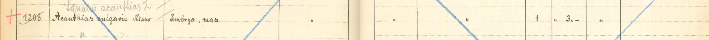

:::EN:::

EN content goes here.

:::DE:::

Die Objekte einer Lehrsammlung erfüllen vor allem eine Funktion: Sie sollen Wissen innerhalb des akademischen Lehrbetriebs vermitteln. Zur Veranschaulichung von Gestalt und Körperbau sowie von organischen Zusammenhängen und Funktionsweisen werden im Institut für Biologie der Humboldt-Universität zu Berlin noch heute Modelle, Wandtafeln und Präparate in Seminaren und Vorlesungen verwendet. Sie sind Anschauungsobjekte, manche auch wortwörtliche Gebrauchsobjekte – sie werden an die Wand gehängt, aufgestellt, vorgeführt oder herumgereicht. Dass es sich dabei teilweise um historische Objekte handelt, erkennt man oftmals erst auf den zweiten Blick. Verblasste Beschriftungen, kryptische Zifferncodes wie z.B. [[28.8.5.7-4|material.common-seadragon]] und Spuren der Abnutzung lassen Objektwege erahnen und weisen auf die bewegte Geschichte einiger Präparate hin. Sie ist geprägt von Prozessen des Transfers, sowohl auf funktionaler als auch auf räumlicher Ebene.

<figure>

<figcaption>

_Der mikroskopisch-zoologische Kurs im Zoologischen Institut Berlin, 1912/13. Wandtafeln, Modelle und Präparate wurden aufgehängt und bereitgestellt. Im Vordergrund stehen der Direktor Franz Eilhard Schulze, links daneben sein Abteilungsleiter Wilhelm Berndt.[^1]_

</figcaption>

</figure>

Inventare, Listen, Etiketten und andere Formen der Verzeichnung nahmen hier eine besondere Rolle ein. Als "Papier- und Objekttechniken" dokumentierten sie die Beschaffung von lebendigen, toten oder bereits präparierten Tieren und verzeichneten ihren ökonomischen sowie epistemischen Wert.[^2] Sie dienten der Einverleibung dieser tierischen Objekte in das spezifische Sammlungsgefüge und wurden zeitgleich zu einem Dokument eines Entwicklungsprozess, den sie mittels ihrer Materialität als "Gebrauchstext" selbst verwalteten.[^3] Doch wie funktionierten diese Verzeichnismedien? Welche Ordnungssysteme lagen ihnen zu Grunde und wer kann diese heute noch verstehen bzw. lesen? Gab es funktionale Besonderheiten, die die Inventare der Lehrsammlung aufgrund des Sammlungscharakters aufwiesen?

<!-- (Abbildung der Inventarbücher z.B. auf einem Tisch aufgestapelt) -->

In der Zoologischen Lehrsammlung der Humboldt-Universität zu Berlin finden sich historische Inventarbücher, die Mitarbeiter\*innen im Gründungsjahr der Sammlung 1884 anlegten. Anders als die [[material.tagebuecher-der-zoologischen-sammlung]] dokumentierten sie nicht das Tagesgeschehen, sondern verzeichneten den Sammlungsbestand. Heute geben sie einen Einblick in die sammlungsorganisatorische Arbeit und enthalten spannende Hinweise zur [[story.history-of-the-zoological-teaching-collection]]. Die Lehrsammlung war Teil des ebenfalls 1884 gegründeten  Zoologischen Instituts der Universität, das vor allem auf die akademische Lehre ausgerichtet war und sich somit von anderen zeitgenössischen naturkundlichen Einrichtungen unterschied, wie zum Beispiel dem Zoologischen Museum, das vorrangig Forschungszwecken diente.

In insgesamt acht Inventaren, denen jeweils eine römische Ziffer zugeordnet ist, wurden die kompletten Sammlungsbestände der institutseigenen Lehrsammlung, von Präparaten, Modellen oder Wandtafeln bis hin zu Instrumenten und Mobiliar, aufgelistet. Es handelt sich um große und sperrige Bücher, die auf Hunderten von Seiten Informationen verzeichnen. Das hier niedergeschriebene Wissen über die Sammlungsobjekte wird durch eine vorgedruckte Tabelle strukturiert, die mit unterschiedlichen Kategorien überschrieben ist, je nachdem um welches Inventar es sich handelt. Den tierischen Präparaten – neben Modellen aus [[Plastik|material.somsoplast-plastic-animal-models]] und [[Papiermaché|material.silkworm-in-papier-mache]] sowie Wandtafeln besonders relevant für die Lehre – waren gleich drei dieser Inventarbücher zugeordnet: "Inventar der Präparate Kap." V(1), V(2) und VII. Chronologisch und nach laufenden Nummern sortiert, wurden hier die Objekte im Zeitraum von 1884 bis 1943 aufgelistet. Wenn ein Präparat in die Lehrsammlung gelangte, wurde es mit einer Nummer versehen und Mitarbeiter\*innen des Instituts notierten in der dafür vorgesehenen Spalte Informationen wie "Bezeichnung", "Fundort", "Conservirung", "Erwerbung", "Stückzahl" und "Preis".

<figure>

<figcaption>

_Diese Seite aus dem Inventarbuch V(1) verzeichnet Präparate mit den Nummern 1201 bis 1216. (Zoologische Lehrsammlung. Alle Rechte vorbehalten.)_

</figcaption>

</figure>

In seiner Funktion als Eingangskatalog dokumentierte dieses Inventarbuch V(1) den Erwerb der Objekte und bot  u.a. durch die Spalte "Belag" einen Überblick über die jährlichen finanziellen Ausgaben der Sammlung. Eingangsverzeichnisse wie dieses waren damals auch in anderen Sammlungen üblich, allerdings trennte man für gewöhnlich die erste Erfassung der Objekteingänge und die weitere Inventarisierung voneinander, also organisierte diese in zwei separaten Listen. Die Inventare der Lehrsammlung erschienen hier als eine Mischform, die einer eigenwilligen bzw. institutsinternen Logik folgte.

Diese Anpassungen leiteten sich aus dem spezifischen Sammlungscharakter der Lehrsammlung ab. So standen die Kataloge vor allem in einem funktionalen Zusammenhang mit den Objekten. **Die Verzeichnung der Präparate musste dem praktischen Nutzen der Objekte als Lehrmaterial entsprechen.** Diese zweckgebundene Verzeichnung zeigt sich nicht nur an den festgehaltenen Informationen sondern auch durch die Wahl der Katalogisierungsmedien. Bezogen auf die inhaltliche Ebene des notierten Wissens lässt sich feststellen, dass die Kategorie "Fundort" Angaben enthält, die einem allgemeinen Vorkommen des jeweiligen Tieres entsprechen. Während zum Beispiel in der Lehrsammlung für das Präparat eines Graupapageis (_Psittacus erithacus_ L.)  etwa "Afrika" angegeben wurde und damit das Verbreitungsgebiet der Art gemeint war, war es in der wissenschaftlichen Sammlung des Zoologischen Museums wichtig, genaue Angaben über den Fundort des spezifischen Exemplars zu haben. Dieses Merkmal deutet auf das Profil der Lehrsammlung hin, das sich von den Aufgaben und auch Organisationslogiken einer Sammlung mit Forschungscharakter abgrenzte.

Zusätzlich zu ihrer Katalogisierung in den Inventarbüchern wurden um 1900 Etiketten an den Objekten befestigt, die Bezeichnung und Zugangsnummer beinhalteten.[^4]

<figure>

<figcaption>

_Zwei Etiketten eines Präparats der Kiemen einer Gemeinen Strandkrabbe_ (Carcinus maenas). _Die Kombination aus römischen Ziffern, Buchstaben und Zahlen weist auf die Aufstellungsordnung der Objekte innerhalb der Lehrsammlung hin. Die Nummer 3070 entspricht einem Eintrag im Inventarbuch V(1) mit der gleichen Nummerierung. (Zoologische Lehrsammlung. Alle Rechte vorbehalten.)_

</figcaption>

</figure>

Die Etiketten ergänzten die Inventarlisten der Eingangserfassung, reduzierten einerseits die Objektinformationen und beinhalteten andererseits zusätzliche Informationen, wie die Zuordnung einer Stellplatznummer. Die Etiketten kennzeichneten so den Ort des Objektes in der Sammlung und verwiesen auf die übergeordnete Klassifikation der Objekte innerhalb einer [[taxonomischen Systematik|theme.taxonomical-orders]]. Damit ermöglichten sie die Mobilisierung der einzelnen Präparate, aber auch die Zirkulation des mit ihnen verbundenen Wissens – ein Aspekt, der im Hinblick auf die tägliche Nutzung der Objekte im universitären Lehrbetrieb von signifikanter Bedeutung war.

Die Inventarbücher waren Teil eines Referenzsystems zwischen Verzeichnungsmedien und Sammlungsobjekten. Sie fixierten Objektinformationen und gewährleisteten gleichzeitig den Gebrauch der Objekte. **Denn Präparate, ebenso wie die Modelle oder die Wandtafeln mussten tagtäglich gefunden, genutzt und schließlich wieder verräumt werden.** Entsprechend der Integration der Sammlungsobjekte in den Kontext der akademischen Wissensvermittlung, kam es vereinzelt dazu, dass Objekte durch den Gebrauch zerstört wurden. Wie aber ließen sich solche Verluste verzeichnen? Aus den Inventaren geht hervor, dass beschädigte Objekte oftmals durch gleichwertige Präparate ersetzt wurden. Eine Bemerkung hielt diesen Austausch im jeweiligen Eintrag schriftlich fest. "Zerbrochen und aus den Beständen der Kgl. Zoolog. Sammlung ersetzt. 6.VI.1907", lautet beispielsweise eine Notiz, die sich unter der Verzeichnung eines Wildschweinschädels (_Sus scrofa_ L.) mit der Nummer 1396 findet.

Während des Zweiten Weltkriegs nahm die Sammlung großen Schaden. Als Folge eines Bombeneinschlags in der Nacht vom 22. auf den 23. November 1943 kam es zur fast vollständigen Zerstörung eines großen Teils des Bestandes, ein Verlust, der angesichts seines Ausmaßes nicht in Form einer Randbemerkung – wie beim zerbrochenen Wildschweinschädel – verzeichnet werden konnte.[^5] Die Sammlung musste nach dem Krieg im Zuge einer Neuinventarisierung komplett neu gesichtet werden. Der historische Bruch spiegelte sich auch im Katalogisierungssystem wieder. Mitarbeiter\*innen der Sammlung nutzten den Katalog jetzt als Inventur-Liste. Auf die direkte Ankündigung der "Neu-Inventarisierung des gesamten Bestandes ab 15. April 1946" im Inventarbuch V(2) folgten Seiten mit immer neu angelegten Listen. Präparate erhielten neue Nummern und ihre Aufzählung wurde immer wieder unterbrochen oder wies Lücken auf. Diese Listen von weiteren Listen lassen erahnen wie langwierig und teilweise unübersichtlich solche Sichtungsarbeiten abliefen.

<figure>

<figcaption>

_Im Inventarbuch V(2) folgte auf die Auflistung der Objekte mit den Nummern 375-385 die Auflistung der Präparate ab Nummer 2409, wenn auch etwas durcheinander. Die Objekte 2409 und 2414 wurden zwar genannt, aber fehlen bzw. wurden nicht verzeichnet. (Zoologische Lehrsammlung. Alle Rechte vorbehalten.)_

</figcaption>

</figure>

Vermutlich auch aus diesem Grund wurde die vorgedruckte Tabellenstruktur dabei nicht mehr vollständig ausgefüllt. Reduziert auf die Inventarnummer, die Bezeichnung und eine kurze Beschreibung der Objektart wurden die Präparate nacheinander aufgelistet. Ein in Alkohol konservierter männlicher Embryo eines Dornhais (_Acanthias vulgaris_ Risso), der zuerst 1888 unter der Nummer 1208 als Ankauf von der Zoologischen Station in Neapel in die Sammlung gelangte, tauchte hier wieder auf, als Objekt 2488.

<figure>

<figcaption>

_Das Präparat eines reifen männlichen Dornhai-Embryos_ (Acanthias vulgaris), _verzeichnet unter der Nummer 2488 im Rahmen der Neuinventarisierung der Sammlungsbestände im Inventarbuch V(2). (Zoologische Lehrsammlung. Alle Rechte vorbehalten.)_

</figcaption>

</figure>

Dass es sich dabei um ein und dasselbe Präparat handelt, verrät das Inventarbuch VII, das mit Einträgen aus den Jahren 1946/47 beginnt. Hier folgten die Objekte einer alphabetischen Ordnung und wurden unter ihrem jeweiligen Gattungsbegriff zusammengefasst.

<figure>

<figcaption>

_Die erste Seite des Inventarbuchs VII zeigt einen grafischen und systematischen Wandel der Verzeichnungspraxis. Das Präparat eines Dornhai-Embryos_ (Acanthias vulgaris) _wurde mit vier anderen Objekten jeweils mit den Nummern der vorherigen Inventarisierung in Inventarbuch V(1) und V(2) dem Gattungsbegriff "Acanthias" (bzw. "Squalus") untergeordnet. (Zoologische Lehrsammlung. Alle Rechte vorbehalten.)_

</figcaption>

</figure>

Das Präparat des Dornhai-Embryos fand sich nun unter der Nummer 863 und dem Gattungsbegriff _Acanthias_ (_Squalus_) wieder, inklusive der Nummern seiner vorgängigen Verzeichnung. Diese Übersicht ging außerdem einher mit der Aktualisierung der Objektbezeichnungen. Aus _Acanthias vulgaris_ Risso wurde _Squalus acanthias_ L. Entsprechend der Veränderung der zoologischen Klassifikation und korrespondierender Namensgebung wurde auch das erste Inventarbuch V(1) angepasst. Mitarbeiter\*innen ergänzten den Eintrag 1208 dort mit einer mit Bleistiftnotiz, die die linnésche Beschreibung vermerkte.

<figure>

<figcaption>

_Der Eintrag mit der Nummer 1208 verzeichnet erstmalig das Präparat eines Dornhai-Embryos im Inventarbuch V(1). Die mit Bleistift vermerkte Korrektur der lateinischen Bezeichnung verweist auf die im Rahmen von Neuinventarisierungen erfolgten Revisionen der ersten Inventarbücher V. (Zoologische Lehrsammlung. Alle Rechte vorbehalten.)_

</figcaption>

</figure>

Die Orientierung an bestimmten Klassifikationsstandards und einer neuen taxonomischen Systematik wurde hier erstmalig im Inventarbuch selbst sichtbar als Bestandteil des Verzeichnungsprozesses. Dieser brachte die Präparate in stetig neue Ordnungs- und Bedeutungszusammenhänge, machte sie zählbar und zirkulierbar.[^6] **Das Inventarbuch war hier für die Sammlungsmanager\*innen ein Werkzeug, das das Ringen um eine einheitliche und effektive Verzeichnungsform abbildete, diese allerdings auch selbst mitbestimmte.**[^7] Der Versuch die Inventarbücher entsprechend anzupassen scheiterte offensichtlich,  denn die grafische und systematische Umgestaltung der Katalogisierung im Inventarbuch VII wurde nur über wenige Seiten erstellt und nicht vervollständigt.

Inventarbuch VII zeugt von dieser Entwicklung und ist von weiteren Wechseln des Formats und der Katalogisierungssystematik geprägt. Die Nummerierungen orientierten sich nicht mehr an der chronologischen Auflistung der Objekteingänge, sondern sortierten Präparate entsprechend einer taxonomischen Rangstufe, der "Klasse" (Fische, Amphibien, Reptilien usw.). Das Ganze mündete schließlich in einer Listenstruktur, die als Transkription der Einträge der Inventarbücher V identifiziert werden kann.[^8] Die Sammlungsorganisation war anscheinend zur ersten Verzeichnungsform, der Liste, zurückgekehrt.

<figure>

<figcaption>

_Diese Seite aus dem Inventarbuch VII zeigt die Einteilung der Präparate in Tierklassen, z.B. Fische, Amphibien, Reptilien usw. Das rote Kreuz markiert den Eintrag für den Dornhai. (Zoologische Lehrsammlung. Alle Rechte vorbehalten.)_

</figcaption>

</figure>

Wie auch die Objekte der Sammlung selbst, weisen die Inventare Gebrauchsspuren auf. Die Seiten der Inventarbücher V zeigen farbliche Codierungen, Durchstreichungen und mit Bleistift vermerkte Notizen. Diese wurden nachträglich hinzugefügt, gehörten also nicht zu der ursprünglich beabsichtigten Verzeichnungspraxis. Sie entstanden vermutlich, als man die einzelnen Angaben in das Inventarbuch VII übertrug. Die Annotationen überlagern einander und betonen verschiedene zeitliche Ebenen. Gerade deshalb sorgen sie bei außenstehenden "Leser\*innen" und bei neuen Sammlungsmitarbeiter\*innen für Verwirrung. **Das Entziffern und die korrekte historische Einordnung gleichen detektivischer Arbeit, die trotz des minutiösen Abgleichens unterschiedlicher Einträge, Nummern und Handschriften nur selten zu einer präzisen Einschätzung führt.**

Markierungen mit Kreuzen, Kreisen und Punkten neben Einträgen des Inventarbuchs V stehen höchstwahrscheinlich für "erhalten geblieben" oder "verloren gegangen". Entsprechend gestaltete sich daraufhin die Übertragung der Verzeichnung in den Katalog VII. _Acanthias vulgaris_ Risso notierte man dabei wieder mit seiner alten Bezeichnung unter der Nummer 1208.

<figure>

<figcaption>

_Diese Seite aus dem Inventarbuch VII zeigt die Übertragung der Einträge 1185 bis 1216 aus dem Inventarbuch V(1), darunter auch der Dornhai-Embryo mit der Nummer 1208. Die vorgedruckte Tabelle wurde durch eine zusätzliche Spalte ergänzt, die die Stellplatznummer der Objekte vermerkt. (Zoologische Lehrsammlung. Alle Rechte vorbehalten.)_

</figcaption>

</figure>

<figure>

<figcaption>

_Diese Seite aus dem Inventarbuch V(1) zeigt die erste Verzeichnung der Präparate mit den Nummern 1201 bis 1216 mit entsprechenden Annotationen. Kreuze und Punkte am Seitenrand kennzeichneten vermutlich, ob Objekte verloren gegangen waren oder sich noch in der Sammlung befanden. Die Seiten wurden durchgestrichen und damit als ungültig markiert. (Zoologische Lehrsammlung. Alle Rechte vorbehalten.)_

</figcaption>

</figure>

Verlorene bzw. zerstörte Präparate wurden durch Leerstellen in den Inventarbüchern kenntlich gemacht oder durch andere Objekte ersetzt, wobei es sich dabei größtenteils nicht um ein Präparat derselben Art oder desselben Tieres handelte. Diese Wechsel, Anpassungen, Überschreibungen und Übertragungen betonen die praktische Ebene der Katalogisierung, die sich aus dem Gebrauch ergab und die sich durch ihre Materialität und Medialität formte und umformte.[^9] Zudem zeigen sie die Grenzen eines Inventares in Buchform auf, das dem System Liste verhaftet ist – eine Verzeichnungspraxis, die aufgrund ihrer kompakten und linearen Form der Katalogisierung emergenter Strukturen und Veränderungen nicht gewachsen war. In der Konsequenz überschrieben Mitarbeiter\*innen des Instituts die vorgedruckte Tabellenstruktur, fertigten neue Listen von Listen an und verifizierten bestehende Eintragungen oder markierten diese als ungültig.[^10] Trotz dieser Strategien und Hilfsmittel waren die lückenlose Übertragung und der Erhalt des Wissens und der Sammlungsobjekte nicht gesichert. **Nur wenige Objekte, die sich noch heute im Besitz der Sammlung befinden, können eindeutig einem präzisen, mittels der Verzeichnung festgehaltenen Erwerbskontext zugeordnet werden.** Zusätzlich erschwert wird dieser Umstand auch durch einen Wechsel der Verzeichnungsmedien, denn seit 1968 nutzte die Berliner Lehrsammlung ein [[Karteikartensystem|material.verzettelung]] für die Sammlungsorganisation.

Die Inventarbücher sind zu historischen Dokumenten geworden. Es sind diese Diskontinuitäten und funktionalen Verschiebungen der Verzeichnungspraxis, die auf ihren praktischen Gebrauch verweisen. Erfahrungswissen bestimmt die organisatorische Arbeit in der Sammlung. Es bildet sich erst durch die Handhabung der Verzeichnungssysteme, während es diese zugleich produziert. Um solche historischen Inventare lesen zu können, sind Wissenschaftler\*innen oftmals auf die Expertise von Sammlungsmitarbeiter\*innen angewiesen. Die Inventare der Lehrsammlung sind hier exemplarisch für administrative Abläufe, die als anonyme Strukturen den Instituts- und Sammlungsalltag bestimmen und die an vielen Stellen von mündlicher Weitergabe abhängig sind.

[^1]: Das Bild stammt aus dem Privatbesitz Elsi Hedströms, der Enkeltochter Franz Eilhard Schulzes. Die abgebildeten Personen wurden von Stefan Richter identifiziert, vgl. Richter, Stefan. "Franz Eilhard Schulze und die Zoologische Lehrsammlung der Berliner Universität". In _Theater der Natur und Kunst. Theatrum Naturae et Artis. Essays. 3 Bände_, hg. von Horst Bredekamp, Jochen Brüning und Cornelia Weber. Berlin: Henschel, 2000.

[^2]: te Heesen, Anke. "Die doppelte Verzeichnung. Schriftliche und räumliche Aneignungsweisen von Natur im 18. Jahrhundert". In _Gehäuse der Mnemosyne. Architektur als Schriftform der Erinnerung_, hg. von Harald Tausch. Göttingen: Vandenhoeck & Ruprecht, 2003: 263-286.

[^3]: Vgl. Vismann, Cornelia. _Akten. Medientechnik und Recht_, 3. Aufl. Frankfurt am Main: Fischer, 2011: 21ff.; Turner, Hannah. "Critical Histories of Museum Catalogues". _Mus Anthropol_ 39, Nr. 2 (2016): 102-110. https://www.doi.org/10.1111/muan.12118.

[^4]: Diese Etiketten sind heute nur noch in seltenen Fällen erhalten, da sie im Laufe der institutionellen Umstrukturierungen in der Nachkriegszeit entfernt wurden. Lediglich Objekte, die vor dieser Zeit an andere Institutionen abgegeben wurden und später wieder an das Institut zurückgeführt wurden, weisen diese alten Etiketten auf. In den Chroniken der Friedrich-Wilhelms-Universität wird jedoch die Anschaffung einer Schreibmaschine "zur Herstellung von Etiketten" im Rechnungsjahr 1894/95 angegeben. Siehe Anonym. "Chronik der königlichen Friedrich-Wilhelms-Universität zu Berlin für das Rechnungsjahr 1894/95". In _Chronik der Friedrich-Wilhelms-Universität_, Bd. 8. Berlin: 113. https://www.digi-hub.de/viewer/resolver?urn=urn:nbn:de:kobv:11-d-6653534 (20.06.2021).

[^5]:  Tembrock, Günther. "Das Zoologische Institut der Humboldt-Universität von 1945 bis zur Gründung der Sektion Biologie". _Wissenschaftliche Zeitschrift der Humboldt-Universität zu Berlin, Math.-Naturw. Reihe_ (1985): 281.

[^6]: Müller-Wille, Staffan. "Names and Numbers: 'Data' in Classical Natural History, 1758–1859". _Osiris_ 32, Nr. 1 (2017): 109-128.

[^7]: Müller-Wille, Staffan und Charmantier, Isabelle. "Lists as research technologies". _Isis_ 103, Nr. 4 (2012): 744.

[^8]: Eine genaue Datierung dieser Übersicht ist dabei nicht möglich. Allerdings schließt sie an die Verzeichnung von Objekteingängen aus den Jahren 1959/1960 an.

[^9]: Turner, Hannah. "Critical Histories of Museum Catalogues". Mus Anthropol 39, Nr. 2 (2016): 18f. https://www.doi.org/10.1111/muan.12118.

[^10]: Vgl. Vismann, Cornelia. _Akten. Medientechnik und Recht_, 3. Aufl. Frankfurt am Main: Fischer, 2011.
