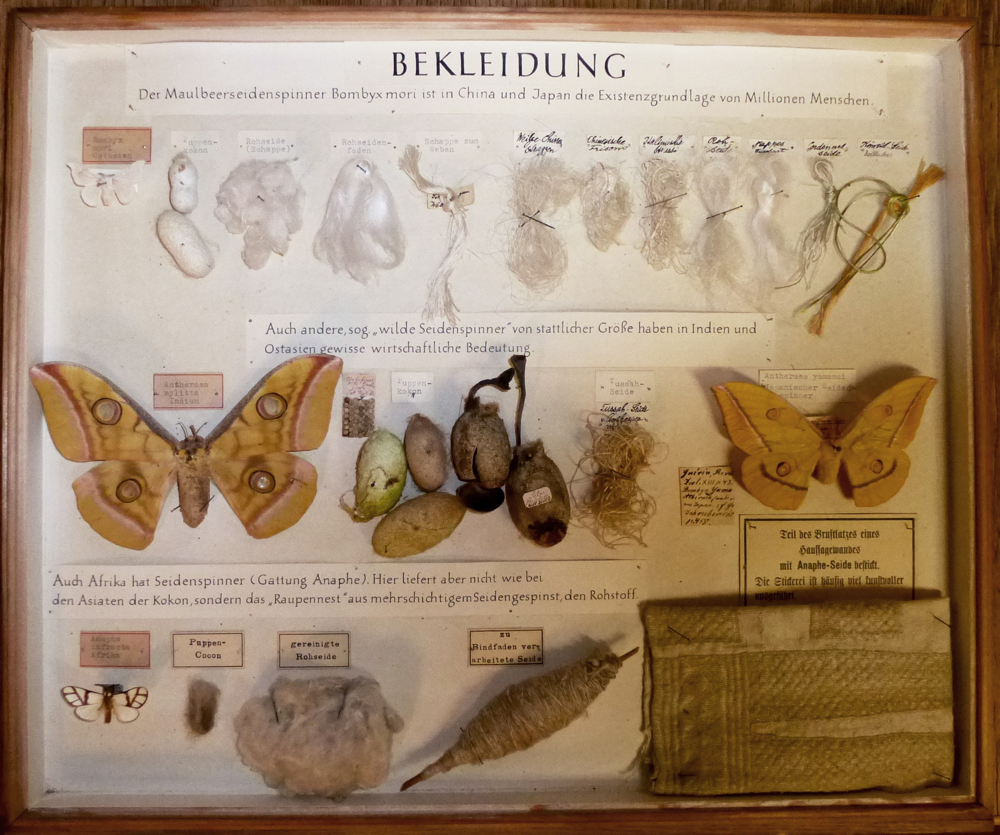
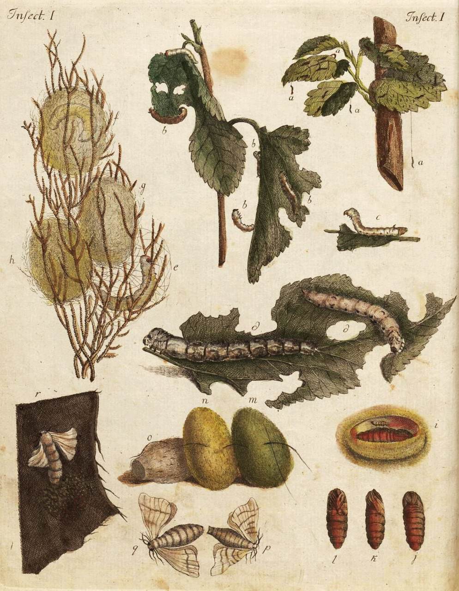

Hinweise zur Geschichte des Seidenbaus ins Preußen finden sich in den Forschungsarbeiten der Preußischen Akademie der Wissenschaften. Sie befasste sich in den 1880er und 1890er-Jahren umfassend mit dem merkantilistischen Wirtschaftssystem unter der Regierung Friedrichs des Großen und publizierte umfangreiche Quellen aus dem 18. Jahrhundert sowie entsprechende historische Analysen zu verschiedenen Industrieformen in der Reihe _Acta Borussica_. Als Erstes erschienen im Jahr 1882 drei Bände zur "Preußischen Seidenindustrie"[^1], die sie als Erfolgsmodell darstellten.

Dieser Publikation zufolge wurde das Geheimnis der Seidenherstellung in China über Tausende Jahre streng gehütet, bis im Jahr 522 zwei Mönche Samen des weißen Maulbeerbaums und Eier der Seidenraupe von China nach Byzanz schmuggelten. **Im 8. Jahrhundert gelangten von dort aus Seidenraupen nach Spanien, Italien und Frankreich, im 17. Jahrhundert fanden erste Versuche mit Seidenzucht in deutschen Provinzen statt.** Angetrieben von dem wirtschaftlichen Interesse an der Seide entfaltete sich eine globale und transnationale Geschichte, in der Tiere und die für sie überlebensnotwenigen Bäume vielfach migriert wurden.

In Preußen fasste der Große Kurfürst Friedrich Wilhelm von Brandenburg (1620-1688) die "Seidenziehung " in den 1680er-Jahren als einer jener Maßnahmen ins Auge, mit denen die Landwirtschaft und das Handwerk in dem vom Dreißigjährigen Krieg völlig verwüsteten Brandenburg wieder in Gang gebracht werden sollte. Besondere Hoffnung setzte er in die Hugenotten, jene französischen Glaubensflüchtlinge, denen er die Ansiedlung im protestantischen Preußen gewährte, als der französische König Louis XIV. 1688 das Edikt von Nantes widerrief und damit den calvinistischen Protestant\*innen alle religiösen und bürgerlichen Rechte entzog.

Wenig später, im Jahr 1897 publizierte der Historiker Leopold Hermann Fischer – im Rahmen der Selbsthistorisierung Preußens durch die Akademie der Wissenschaften -  Auszüge einer Korrespondenz. Es handelt sich um Briefe, die der Philosoph Gottfried Wilhelm von Leibniz (1646-1716) bis zu seinem Tod im Jahr 1716 mit dem Lehrer und Landwirt Johann Leonhard Frisch (1666-1743) wechselte.[^2] Leibniz hatte bereits in den 1690er-Jahren darüber nachgedacht, den in anderen deutschen Fürstentümern erprobten Seidenbau zur Finanzierung einer wissenschaftlichen Gesellschaft zu nutzen. **Den Begriff "Seiden-Cultur" verwendete der bekannte Philosoph für diese Form der Landwirtschaft erstmals 1703 in einer Denkschrift an den preußischen König Friedrich I. (1657-1713), um ihn von der Unternehmung zu überzeugen und die von ihm im Jahr 1700 gegründete Societät der Wissenschaften mit einer Finanzierungsmöglichkeit zu versorgen.**[^3] Er führte aus, dass es sich um einen lohnenden Erwerbszweig handele, der vielen Menschen Arbeit bringen würde. Dazu solle die Societät die bereits vorhandenen Maulbeerplantagen etwa in Köpenick und Glienicke übernehmen und aufforsten. Zudem sollten Baumschulen von _Morus alba_ angelegt werden, aus denen dann weitere Pflanzungen im Stadtgebiet vorgenommen werden könnten. Außerdem wies Leibniz auf den zierenden Charakter der Maulbeerbäume hin, die die Zufahrten zu den außerhalb der Stadt gelegenen Schlössern schmücken könnten: "Es würde schön stehen, wenn von Berlin nach Schönhausen, Fridrichsfelde und anderen Königl. nahegelegenen Häusern dergleichen Alléen geführet würden."[^4] Der neue Erwerbszweig, basierend auf der intrinsischen Verbindung zwischen Seidenraupe und weißem Maulbeerbaum, wurde in der gestalteten Umwelt und Landschaft vor allem durch Pflanzungen sichtbar, die zugleich als Zierbäume genutzt werden sollten.

## "Sie kleidet den Reichen, sie naehret den Arme"

Im Jahre 1707 erlangte Leibniz vom König tatsächlich das Privileg (alleinige Recht) für die Societät der Wissenschaften zur "Cultur " von Maulbeerbäumen. Da er sich selbst hauptsächlich in Hannover aufhalten musste, setzte er den Lehrer Frisch als Kurator ein. Nach seinen Anweisungen wurden die übernommenen Plantagen gepflegt, Baumschulen angelegt und zudem weiße Maulbeerbäume auf öffentlichen Plätzen, Friedhöfen und den Stadtbefestigungswällen gepflanzt. Im Jahr 1717 teilte der Soldatenkönig Friedrich Wilhelm I. (1688-1740) 18 Hugenottenfamilien aus Orange Teile des südlichen Tiergartens – die Keimzelle des späteren Stadtteils Moabit – zum Anlegen von Maulbeerplantagen zu.[^5] Weitere Seidenweber- und Spinnerkolonien, etwa das Kolonistendorf in Friedrichshagen, entstanden.[^6] Mit Blick auf Privilegien für die Glaubensflüchtlinge sowie Auseinandersetzungen mit ihnen, aber auch auf die Privilegien für und politischen Diskriminierungen der jüdischen Unternehmer in Berlin und Brandenburg[^7] stellt sich die Geschichte der Seidengewinnung und -verarbeitung in Preußen auch als komplexe Geschichte der religiösen Minderheiten dar.

Seine Hochphase erlebte der Seidenbau in Preußen schließlich zwischen 1740 und 1786 unter der Herrschaft Friedrich II., der ihn mit dem Ziel einer möglichst weitgehenden Rohstoffautarkie durch ein verzweigtes System von Subventionen und Strafen staatlich fördern ließ.[^8] Er richtete unter anderem Manufakturen ein und ordnete die Seidenherstellung als landwirtschaftlichen Nebenerwerb für Lehrer, Küster und Pastoren an, was bei diesen jedoch durchaus unbeliebt war. Das Gewerbe floriert und der Höhepunkt der Seidenproduktion in Preußen wurde in den 1780er-Jahren erreicht[^9] – "Sie kleidet den Reichen, sie naehret den Armen", wurde 1793 auf eine Preismedaille für den Seidenbau geprägt.[^10]

## Nutztiere: Von der Raupe zur Seide

Dass die ursprünglich aus China stammenden Seidenraupen überhaupt in dem durch kalte Winter bestimmten Nordeuropa aufgezogen und genutzt werden konnten, basiert auf ihren biologischen Eigenschaften. **Die Erfahrung hatte gezeigt, dass das Schlüpfen der Seidenraupen – bei ihrer Einführung in deutsche Provinzen im 17. und 18. Jahrhundert meist Seidenwürmer genannt – durch die kühle Lagerung der Eier fast um ein ganzes Jahr verzögert werden konnte.** Da in den nördlichen Ländern die Maulbeerbäume nur einmal im Jahr ausschlagen und die jungen grünen Blätter als Nahrung liefern, brachte man die Eier durch Erwärmen auf etwa 25 Grad jeweils im Frühsommer zum Schlüpfen. **In Preußen waren meist Frauen für die Pflege und Reinigung der jungen Raupen zuständig, die etwa 32 Tage lang mit den grünen Blättern des Maulbeerbaums gefüttert werden mussten, bis sie sich verpuppten.** Den Kokon spinnen sie aus einem einzigen, bis zu 2000 Meter langen Seidenfaden, der aus einer Drüse an ihrem Maul austritt. Im Kokon entwickelt die Puppe sich zum Schmetterling, der schließlich schlüpft, sich aber nur noch flatternd fortbewegen kann[^11] und sich bald darauf paart, um wieder Eier zu legen und danach zu sterben. Wie die deutschen Handbücher und Enzyklopädien des 18. Jahrhunderts schildern, musste das Schlüpfen der Schmetterlinge verhindert werden, da dabei der Seidenfaden beschädigt wurde. Zur Gewinnung der Seide wurden die Kokons einige Tage vor dem Schlüpfen in kochendes Wasser geworfen und so die Puppen getötet, damit anschließend der Seidenfaden in Gänze abgehaspelt werden konnte. Nur zu Reproduktionszwecken durften jeweils einige der Motten schlüpfen, deren Eier für den nächsten Zyklus zu bewahrt wurden.[^12]

Mit diesem Züchtungsvorgang verbanden sich in Preußen, Südeuropa und China bedeutende Wirtschaftszweige und die mit ihnen verflochtene Sozialgeschichte.

<figure>

<figcaption>

_Schaukasten im Museum für Naturkunde Berlin, Sammlung Lepidoptera. (Foto Britta Lange/MfN. Alle Rechte vorbehalten.)_

</figcaption>

</figure>

Ein weiterer Schaukasten im Museum für Naturkunde unklaren Herstellungsdatums trägt die Beschriftung "Bekleidung". Heute wird er in der Sammlung aufbewahrt, war jedoch früher wohl einmal für eine Ausstellung arrangiert worden. Sein einleitender Satz lautet: "Der Maulbeerspinner _Bombyx mori_ ist in China und Japan die Existenzgrundlage von Millionen von Menschen", verweist auf die Wirtschaftskraft der Seidenherstellung und die Haltung von Seidenraupen als Nutztiere in Manufakturen, aber auch in privaten Haushalten. Dabei wird der Maulbeerspinner gegenüber anderen sich verpuppenden Schmetterlingsarten bevorzugt, da sein Seidenfaden bei entsprechender menschlicher Fertigkeit in einem Stück abgewickelt werden kann. Beim Verdrillen der einzelnen Fäden entsteht so ein gleichmäßiges Garn und damit ein glatter Stoff, während alle anderen Raupenarten kürzere Fadenstücke produzieren, so dass ein in der Dicke ungleichmäßiger Faden produziert wird, aus dem die so genannte Wildseide gewebt wird, die unterschiedliche Stärken aufweist.

**Die "Seiden-Cultur" in Preußen zielte auf der Makroebene auf die Idee einer Rohstoffautarkie. Auf der Mikroebene stellen sich dagegen andere Fragen und Probleme.** Der Umgang mit den Seidenraupen im Privatbereich war zwar zeitweise lukrativ, jedoch nicht angenehm, wie eine Vielzahl von Quellen bezeugt, etwa die Briefe von empörten Pfarrern und Lehrern an Friedrich II.[^13] **Die Pflege der stetig fressenden Raupen war aufwendig**: Zahlreiche Handbücher aus dem späten 18. und 19. Jahrhundert erläutern detailreich, wie Seidenzimmer eingerichtet, Gestelle gebaut, Blätter drapiert, die Temperatur überwacht und die etwa daumengroßen Raupen von Kot gereinigt werden mussten. Die Tiere wurden häufig von Krankheiten heimgesucht, stanken und starben oft vorzeitig, wie etwa Johann Wolfgang von Goethe in _Dichtung und Wahrheit_ zur Raupenzucht seines Vaters in der Nähe von Frankfurt am Main schildert: "Die daraus entstehende Fäulnis erregte einen wirklich pestartigen Geruch, und da man die toten und kranken wegschaffen und von den gesunden absondern musste, um nur einige zu retten, so war es in der Tat ein äusserst beschwerliches und widerliches Geschäft […]."[^14]

<figure>

<figcaption>

_In einem Buch von 1790 heißt es: "Der Seidenwurm und die Biene sind die nützlichsten Insecten für den Menschen."[^15]_

</figcaption>

</figure>

Trotz der vielfältigen Bemühungen konnte doch Unabhängigkeit vom Seidenimport aus Italien und Frankreich mit all diesen Maßnahmen nicht erzielt werden. Im Gegenteil: **Im 19. Jahrhundert ging der Seidenbau wegen dem Fall der Zollschranken, zunehmender Gewerbefreiheit und übermächtiger Konkurrenz aus den südeuropäischen Ländern in Preußen zurück.** Zwar wurde in den 1830er-Jahren der Seidenbaugewerbeverein gegründet, doch lebte der Anbau vor allem auf lokaler Ebene fort – durch private Initiativen wie die des Lehrers Türk in Zehlendorf[^16] oder die ab 1840 angelegte Maulbeerplantage von Johann Adolf Heese in Steglitz. Straßennamen wie die Plantagenstraße und die Filandastraße (filanda ist der italienische Ausdruck für eine Haspelmaschine), aber auch die Maulbeerallee in Staaken zeugen von dieser heute weitgehend vergessenen Form der Industrie. Ende des 19. Jahrhunderts und während des 20. Jahrhunderts wurde immer wieder Propaganda für wirtschaftliche Autarkie über den Seidenbau betrieben, und im 20. Jahrhundert sah Deutschland Revivals des Seidenbaus nach dem Ersten Weltkrieg und während des Nationalsozialismus zur Erzeugung u. a. von Fallschirmseide. Auch in der DDR wurde in den 1950er und 1960er Jahren noch einmal Seide, vor allem im Voigtland, mit dem Ziel produziert, den Staat unabhängig von Importen aus dem Westen zu machen.[^17] Und heute? In Berlin und Brandenburg zeugen noch alte Maulbeerbäume vom [[Seidenbau|story.silkworms]]. Zwar finden sich im Vogtland heute noch immer Seidenwebereien, die Seide jedoch beziehen sie inzwischen aus dem globalen Handel, etwa aus Brasilien.[^18]

[^1]: Schmoller, Gustav und Otto Hintze. _Die Preußische Seidenindustrie im 18. Jahrhundert und ihre Begründung durch Friedrich den Großen_, Acta Borussia, Band 1-3. Berlin, 1892.

[^2]: Vgl. _Joh. Leonh. Frisch’s Briefwechsel mit G.W. Leibniz. Ein Beitrag zur Geschichte des geistigen Lebens in Berlin am Anfang des 18. Jahrhunderts_, hg. von Dr. L.H. Fischer, Sonderabdruck aus Band 2 des Archivs der Brandenburgia, Gesellschaft für Heimatkunde der Provinz Brandenburg zu Berlin. Berlin, 1896.

[^3]: Leibniz, G.W. _Denkschrift an König Friedrich I_, Klopp Reihe I, Band 10. Ohne Datum/wahrschl. 1703: 372f. (Schriftstück XVII-1), 373-378 (Schriftstück XVII-2).

[^4]: Leibniz, ohne Datum/wahrschl. 1703: 377.

[^5]: Vgl. Hildebrand, Bernd. _300 Jahre Moabit. Zur Geschichte eines Berliner Stadtteils von der hugenottischen Gründung 1718 bis zur Eingemeindung nach Berlin 1861_, hg. von Heimatverein und Geschichtswerkstatt Tiergarten e.V. Berlin: Saint Albin Verlag, 2018.

[^6]: Kießhauer, Rolf. _Seidenraupen in Friedrichshagen?_, 2. erw. Aufl. Berlin: Antiquariat Friedrichshagen, 1998.

[^7]: Nicht alle anfragenden jüdischen Personen erhielten das königliche Schutzprivileg zur Seidenproduktion. Vgl. Meier, Brigitte. _Jüdische Seidenunternehmer und die soziale Ordnung zur Zeit Friedrichs II.: Moses Mendelssohn und Isaak Bernhard – Interaktion und Kommunikation als Basis einer erfolgreichen Unternehmensentwicklung_, Veröffentlichungen des Brandenburgischen Landeshauptarchivs BV035362462 52. Berlin: BWV, 2007.

[^8]: Königliche Dekrete verhängten Geldstrafen für das Abhacken von Maulbeerbäumen.

[^9]: Vgl. Herzfeld, Erika. _Preußische Manufakturen: großgewerbliche Fertigung von Porzellan, Seide, Gobelins, Uhren, Tapeten, Waffen, Papier u. a. im 17. und 18. Jahrhundert in und um Berlin_. Berlin: Verder Nation, 1994.

[^10]: Vgl. etwa Caspar, Helmut. "Sie kleidet und ernährt". _Münzen und Medaillen_,  2016, http://www.helmutcaspar.de/aktuelles16/muenzmed16/seiden.html (28.07.2021).

[^11]: Die Maulbeerspinner waren damals schon so überzüchtet, dass sie nicht mehr fliegen konnten.

[^12]: Vgl. Krünitz, Johann Georg. _Oekonomische Encyklopädie oder allgemeines System der Staats-Stadt-Haus-und Landwirthschaft ist der Titel einer der umfangreichsten Enzyklopädien des deutschen Sprachraums_, Bd. 152. Leopold Wilhelm Krause, 1830.

[^13]: Vgl. u.a. Kießhauer, Rolf. _Seidenraupen in Friedrichshagen?_, 2. erw. Aufl. Berlin: Antiquariat Friedrichshagen, 1998.

[^14]: Goethe, Johann Wolfgang von. _Dichtung und Wahrheit_, 1. Teil, 4. Buch. Ca. 1811.

[^15]: Bertuch, F.J. _Bilderbuch für Kinder, enthaltend eine angenehme Sammlung von Thieren, Pflanzen, Blumen, Früchten, Insecten, Trachten und allerhand andern unterrichtenden Gegenständen aus dem Reiche der Natur, der Künste und Wissenschaften […]_, 1. Band. Weimar/Gotha, 1790: Tafel I.

[^16]: Vgl. _Am seidenen Faden: Kolonisation und kulturlandschaftliche Entwicklung im Süden Berlins_. Berlin: Heimatverein für d. Bezirk Zehlendorf e.V, 2001.

[^17]: Heilmeyer, Marina und Michael Seiler. _Maulbeeren – zwischen Glaube und Hoffnung_. Potsdam: Vacat, 2006.

[^18]: Vgl. etwa Plauener Seidenweberei GmbH, https://www.seide.de/ (26.08.2021).
