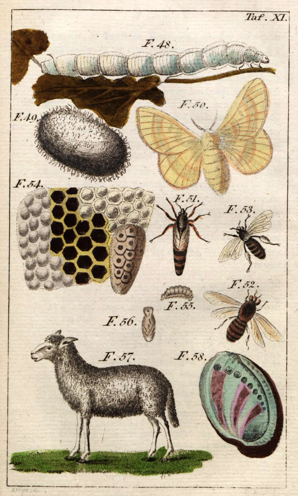
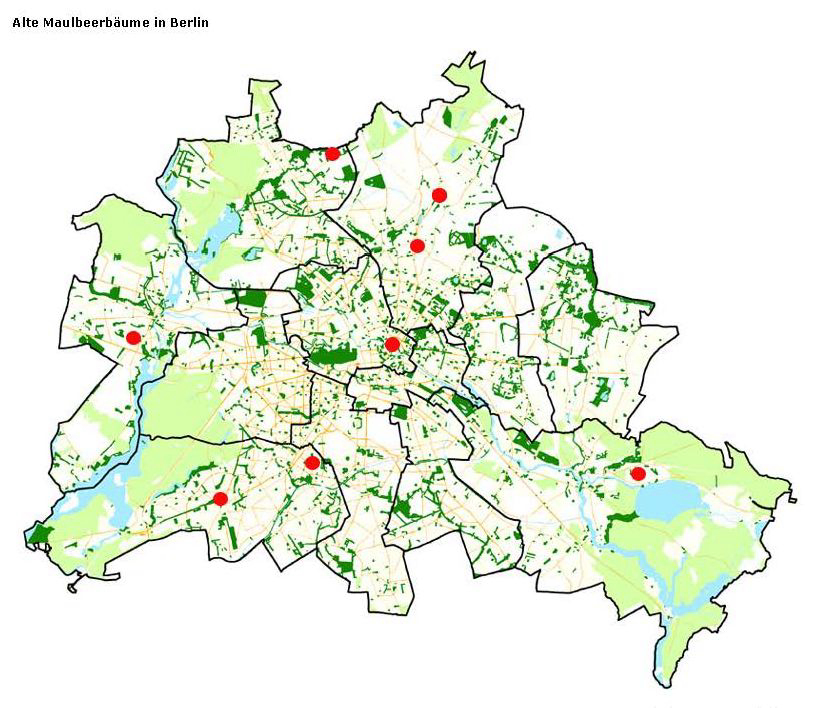
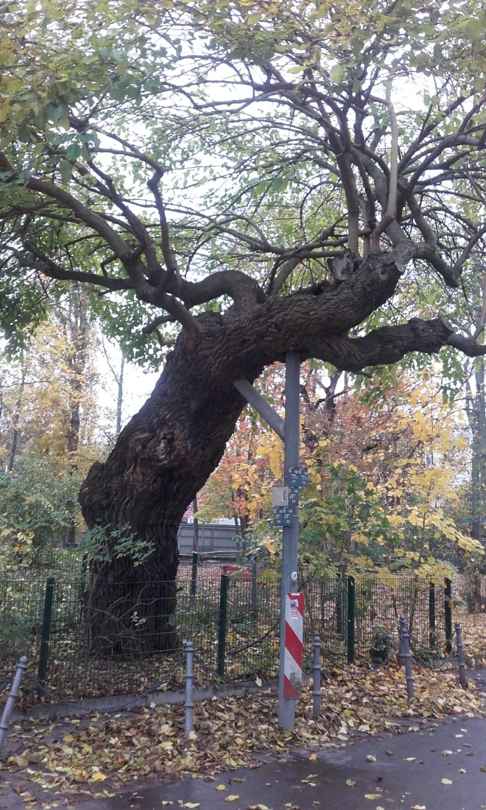

<figure>

<figcaption>

_Maulbeerbaum am Museum für Naturkunde Berlin, 2021. (Foto Britta Lange)_

</figcaption>

</figure>

Während das große Dinosaurierskelett in der Haupthalle des Berliner Museums für Naturkunde stadt- und weltbekannt ist, scheint kaum jemand etwas über einen Baumriesen zu wissen, der sich im Hof des Museums befindet. **In der Durchfahrt zwischen dem Museum, dem heutigen Institut für Biophysik und dem Thaer-Institut für Agrar- und Gartenbauwissenschaften der Humboldt-Universität steht ein großer Maulbeerbaum an der Habersaathstraße.** Was ist seine Geschichte? Die Spuren führen ins Preußen des 18. Jahrhunderts, in Museumssammlungen und märkische Dörfer, zu Naturforscherinnen, Königen und Seidenraupen.

## _Morus alba_ am Museum für Naturkunde und in den märkischen Dörfern

Die Kuratorin der Sammlung Lepidoptera (Schmetterlinge), Viola Richter, weist mich auf den Baum hin, als sie mir im Herbst 2020 auf meine Anfrage hin Schaukästen mit Präparaten von Seidenraupen heraussucht.[^1] Einer dieser Kästen zeigt die vier zoologischen Stadien der Entwicklung von _Bombyx mori_, dem Maulbeerspinner, in jeweils mehreren Exemplaren: das Ei, die Raupe (bombyx), die Puppe im Kokon und den ausgeschlüpften Schmetterling.

<figure>

<figcaption>

_Alter Schaukasten zu Entwicklungsstadien von_ Bombyx mori, _Museum für Naturkunde Berlin, Sammlung Lepidoptera, 2020. (Foto Britta Lange. Alle Rechte vorbehalten.)_

</figcaption>

</figure>

Die seit Jahrtausenden in Asien und Europa kultivierte Art _Bombyx mori_ ernährt sich ausschließlich von den Blättern des weißen Maulbeerbaumes, _Morus alba_. "Morus" ist zugleich der lateinische Begriff für Brombeere (im Französischen "mûre" für Brombeere und "mûrier" für Maulbeerbaum), was auf Form und Farbe der Früchte des Baumes verweist. **Da die Seidenraupe in Koevolution mit dem weißen Maulbeerbaum lebt, ist die Verfügbarkeit von frischen grünen Blättern des _Morus alba_ Voraussetzung für die Haltung der Tiere und damit auch für die Herstellung von Seidenfäden.** Der Maulbeerbaum ist in der Natur wie auch in der Namensgebung untrennbar mit dem Tier verbunden.

Heutzutage werden in Berlin keine lebenden Seidenraupen mehr aufgezogen, weder im Museum und der Universität noch in Manufakturen oder von Privatleuten. Der weiße Maulbeerbaum ist jedoch noch da und ziert im Hof die Habersaathstraße. Seine Höhe – vielleicht 15 Meter – lässt darauf schließen, dass er schon viele Jahrzehnte alt ist. Ferdinand Damaschun, zuvor Mineraloge am Museum für Naturkunde, lässt mich wissen, dass der Baum im Jahr seiner Einstellung, 1974, schon sehr groß war. Der damalige Leiter des Museums, der Botaniker Walter Vent, der den Baum vom Direktorenzimmer aus sehen konnte, fragte ihn nach diesem Baum.[^2]

**Der Baum gehörte vermutlich gar nicht zu dem 1889 vollendeten Museumsgebäude, sondern zum Gebäude der gegenüberliegenden ehemaligen Landwirtschaftlichen Hochschule, das bereits 1880 fertiggestellt wurde. Mit dieser Institution war zumindest mittelbar auch die Geschichte der Seidenraupen in Brandenburg verknüpft.** Hier begannen im Wintersemester 1880/81 die Vorlesungen, und am 14. Februar 1881 erhielt das Institut den Titel Königliche Landwirtschaftliche Hochschule Berlin.[^3] Damit war in Berlin, das zehn Jahre zuvor zur Reichshauptstadt geworden war, ein Forschungsgebiet institutionalisiert worden, das der bedeutende Arzt und Landwirt Albrecht Daniel Thaer (1752-1828) aus Celle bereits zuvor im ländlichen Brandenburg etabliert hatte. Thaer, der heute als Begründer der Agrarwissenschaft gilt, eröffnete 1806 auf dem märkischen Rittergut Möglin das Landwirtschaftliche Lehrinstitut und experimentierte dort unter anderem mit dem Fruchtwechsel auf den Feldern sowie der Zucht von Merino-Schafen. Bei dem Institut, das ab 1819 Königliche Preußische Akademische Lehranstalt des Landbaus hieß, handelt es sich um den direkten Vorläufer der akademischen Landwirtschaftsausbildung in Berlin. Thaer hielt zudem an der 1810 gegründeten Berliner Universität von 1810 bis 1819 als außerordentlicher Professor agrarwissenschaftliche Vorlesungen und veröffentlichte auf Grundlage seiner Forschungen in Möglin zahlreiche Schriften zur "Gewerbslehre" (Agrarökonomie) und "Agronomie" (Landwirtschaftswissenschaft) sowie zur Tierzucht.

Wenn auch bisher noch nicht nachweisbar ist, dass Thaer in Möglin Maulbeerbäume bewirtschaften ließ, forschte und lehrte er doch im Herzen einer Landschaft, in der vor allem unter dem preußischen König Friedrich II. (1712-1786) während des 18. Jahrhunderts zahlreiche Personen mit der Aufzucht von Seidenraupen und damit auch mit der Pflanzung und Unterhaltung von weißen Maulbeerbäumen beschäftigt waren. **So weisen unter anderem die Chroniken der umliegenden märkischen Dörfer nach, dass nicht nur größere Unternehmungen wie die Seidenweberkolonie im wenige Kilometer entfernten Wriezen begonnen wurden[^4], sondern auch Grüppchen von Maulbeerbäumen und -büschen in Obstplantagen, auf Friedhöfen und an Alleen gepflanzt wurden.**[^5]

Die so genannten Frauen von Friedland – Helene Charlotte von Lestwitz (1754-1803) und ihre Tochter Henriette Charlotte von Itzenplitz (1772-1848) –, die in ihren Salons in Kunersdorf Thaer und andere Persönlichkeiten der Berliner Gelehrten- und Künstlerkreise wie die Brüder Alexander und Wilhelm von Humboldt empfingen, betrieben Plantagen und Orangerien mit exotischen Gewächsen, darunter auch weiße und schwarze Maulbeeren.[^6] Aus Friedland hatte schon 1754 der Weinmeister Schmidt 30 Maulbeerbäume bezogen und damit eine Plantage um die Kirche des einige Kilometer entfernten Bollersdorf angelegt.[^7] Im Jahr 1763 wiederum pflanzte der Küster eine Plantage auf dem Friedhof in Heckelberg[^8] und 1788 legte der Lehrer und Küster des Dorfes Prädikow eine Maulbeerplantage auf dem Friedhof an[^9], und viele weitere Beispiele sollten folgen.

## Wissen über _Bombyx mori_

Um die Geschichte des aus Brandenburg und Berlin verschwundenen Tiers nachzuzeichnen, bedarf es unterschiedlicher Perspektiven. Seidenraupen wurden als Nutztiere verstanden und ausschließlich zur Herstellung eines Produkts, des Seidenfadens, gehalten. **In der Naturphilosophie, in der Insekten seit Aristoteles bis in die Frühe Neuzeit als "niedere" Tiere galten, waren Seidenraupen damit eine Besonderheit, nämlich die einzigen "nützlichen Tiere" dieser Klasse neben den Honigbienen.** Dies erklärt, warum Seidenraupen und Honigbienen in populärwissenschaftlichen Publikationen des 18. Jahrhunderts oft zusammen abgebildet wurden.
  
<figure>

<figcaption>

_In dieser populärwissenschaftliche Darstellung von Insekten aus dem Jahr 1794 erscheinen Seidenraupe und Honigbiene gemeinsam.[^10]_

</figcaption>

</figure>

Anders als die Bienen und anders als Nutztiere aus dem Bereich der Vögel, Fische oder Säugetiere jedoch kam _Bombyx mori_ in Preußen nicht in Freiheit vor. **Nur in menschlicher Obhut und in künstlich warm gehaltenen Räumen konnten die Eier überwintern.** Auch diese fehlenden wilden Formen in Freiheit sind ein Grund dafür, dass mit dem Erlöschen der Seidenherstellung die lebende Seidenraupe als Tier außerhalb der Forschung in vollständige Vergessenheit geriet  – kam sie doch aufgrund der klimatischen Gegebenheiten in Nordeuropa in der Natur nicht vor. Wer heute die Geschichte des Seidenbaus in Brandenburg Preußen mit Fokus auf die Tiere rekonstruieren will, steht somit vor dem Problem, dass die Tiere und die Erinnerung an sie nicht mehr präsent sind. Ihr Verschwinden aus dem Alltag führte dazu, dass der tägliche Umgang mit den Tieren nicht mehr auf lebendige Quellen zurückgreifen kann. Um die Praktiken ihrer Haltung und Zucht und die Techniken der Seidengewinnung nachzuvollziehen, sind Forschende einerseits auf bildliche und schriftliche Quellen angewiesen, andererseits auf Überreste materieller Kultur. Dazu zählen nicht nur die Produkte des Seidenbaus (Kleidung, Accessoires, Möbelbezüge, Tapeten), die Sammlungsobjekte wie etwa Schaukästen, [[Modelle|material.silkworm-in-papier-mache]] und Präparate sowie die Instrumente und verbliebenen Gebäude des Seidenbaus. Hinweise geben darüber hinaus die Spuren in der Landschaft – Plantagenstrukturen und alte Maulbeerbäume.

Was wissen wir heute über die Seidenraupe? Was wusste man damals über das Tier und woher stammt dieses Wissen? **Die zeitgenössische Wissensproduktion einerseits und die kulturellen Narrationen über Seidenraupen andererseits leiten sich, so meine These, aus dem alltäglichen Umgang mit den Tieren und ihrer Beobachtung ab.**[^11] Praktiken des Pflegens, Sinneserfahrungen wie Tasten, Riechen und Hören der Tiere, Ökonomien des Züchtens und Tötens verflochten sich mit Momenten der Beobachtung und Reflexion. Das "Zusammenleben" mit den Seidenraupen führte zu zwei signifikanten Folgen. Einerseits wurde neues wissenschaftliches Wissen über die Tiere ausgebildet, andererseits führten das Erfahrungs- und Alltagswissen zu ästhetischen Reflexionen und zu Denkanstößen: Eigenschaften der Seidenraupe, vor allem das Verpuppen und das Ausschlüpfen der Schmetterlinge, also die sichtbare und vollständige Metamorphose/Gestaltwandlung, wurden als Denkmodell in andere gesellschaftliche Kontexte – Religion, Kunst, Ökonomie, Politik – überführt. **Das Tier wurde auch zum Denkmodell oder Denk-Objekt.**

In Europa musste es für Züchter\*innen von Seidenraupen bereits zum Allgemeinwissen gehören, dass die Raupen aus Eiern schlüpfen und diese zuvor von den Schmetterlingen abgelegt worden waren, denn nur diese Erfahrung ermöglichte die Zucht. Doch erst die Künstlerin und Wissenschaftlerin Maria Sibylla von Merian formulierte nach der eingehenden Beobachtung von Raupen (freilich nicht nur Seidenraupen) im Jahr 1679 in ihrem Buch Der Raupen wunderbare Verwandelung und sonderbare Blumen-nahrung eine Widerlegung der Aristotelischen Urzeugungsthese, nach der niedrige Tiere wie Würmer und Schmeißfliegen nicht aus einer geschlechtlichen Zeugung, sondern aus Unrat und Dämpfen entstünden.[^12] **Indem sie die Vorstellung der Urzeugung widerlegte, legte Maria Sybilla von Merian einen Grundstein für die Insektenkunde und die moderne Zoologie[^13], die sich einerseits zunehmend von mythologischen und theologischen Narrativen verabschiedete, andererseits zu neuen Erkenntnissen wie auch Terminologien kam.**

Der Zoologe Carl von Linné prägte im 18. Jahrhundert für die Gestaltwandlung mancher Tierarten den Begriff der Metamorphose[^14]  – und heute gilt die Gestaltveränderung vom Ei über die Raupe und die Puppe im Kokon zum Schmetterling als vollständige Metamorphose. Da sich dieser Prozess bei _Bombyx mori_ innerhalb weniger Wochen vollzieht, in denen das Tier alle vier Stadien durchläuft (Ei, Raupe, Puppe, Schmetterling), eignete sich die Art besonders gut, um die zoologische Metamorphose  zu vermitteln. So waren noch in den 2010er Jahren im Insektarium des Berliner Zoos lebende Seidenraupen zu beobachten.

<figure>

<figcaption>

_Der Buchumschlag für Maria Sibylla von Merians_ Der Raupen wunderbare Verwandelung und sonderbare Blumen-nahrung _zeigt das Zusammenspiel zwischen Raupen und Pflanzen. (Nürnberg/Frankfurt: Bey Johann Andreas Graffen, 1679)_

</figcaption>

</figure>

## Alte Maulbeerbäume in Berlin

Nachdem im 17. und 18. Jahrhundert die [[story.seiden-cultur]] in Preußen einen Aufschwung erlebt und sich als Wirtschaftszweig etabliert hatte, griff die prébine, die Krankheit der Seidenraupen, im Jahr 1854 von Frankreich nach Deutschland über. **Die meisten Bestände an Seidenraupen wurden vernichtet[^15] und die Industrie konnte nicht mehr nachhaltig wiederbelebt werden.** Dass sie fortan nur noch von Amateur*innen betrieben wurde, öffnete die Geschichte des Seidenbaus in Preußen auch ihrer Historisierung und Bewertung. Gegen Ende des 19. Jahrhunderts waren die zum Seidenbau gehörigen Tiere verschwunden, doch ein Teil der Bäume geblieben. Ihre Früchte wurden nach wie vor zur Herstellung von Gelees, Süßspeisen und Sirup genutzt, und ihr leuchtendes Grün ließ sie weiterhin als Zierbäume gelten. Zwar wurden (wie bereits nach dem Tod Friedrichs des Großen) die Plantagen abgeholzt, doch einige Bäume überlebten die Phase ihrer landwirtschaftlichen Nutzung. **So stehen heute noch einzelne, sehr alte Maulbeerbäume in Köpenick und auf dem Friedhof in Zehlendorf – beides lag zum Zeitpunkt ihrer Anpflanzung vor den Toren der Stadt.**[^16] Die Karte alter Maulbeerbäume der Berliner Senatsverwaltung zeigt deutlich, wie sich das Stadtgebiet seit dem 18. Jahrhundert ausgedehnt hat und wie zugleich das "Land" in die Stadt hineingewachsen ist, die noch im 19. Jahrhundert auch von Ackerbau und Viehzucht bestimmt wurde.[^17]
  
<figure>

<figcaption>

_Die roten Punkte markieren alte Maulbeerbäume in Berlin.[^18]_ 

</figcaption>

</figure>

Vielleicht am spektakulärsten ist jener alte Maulbeerbaum, der heute noch in einem Hinterhof im Kreuz von Friedrichstraße und Claire-Waldoff-Straße am Gelände der heutigen Charité steht. 

<figure>

<figcaption>

_Alter Maulbeerbaum in Berlin-Mitte nahe dem Charité-Campus, 2020. (Foto Britta Lange)_ 

</figcaption>

</figure>

Seine Pflanzung und Bewahrung stehen in Zusammenhang mit einer Siedlung für die französischen Hugenotten, die 1685 dort angelegt wurde. Der alte Baum hat heute die Form einer verwachsenen Kopfweide, steht am Rand einer Parkfläche und wird von einer Stahlkonstruktion gestützt, auf der Verkehrs- und Wasserhinweisschilder angebracht sind. Es sieht so aus, als sei die Natur in die Kultur hineingewachsen – oder umgekehrt. Zwar markieren die Schilder Akte menschlicher Verwaltung und Logistik, doch verweist kein Schild auf den Baum als Naturdenkmal oder als Kulturdenkmal im Zusammenhang mit der Hugenottensiedlung und der vergessenen Industrie der Seidenkultur. So mag der Baum noch ein Zeitzeuge der Widerrufung des Edikts von Nantes 1685 sein – was dazu führte, dass aus Frankreich jene Glaubensflüchtlinge nach Preußen einwanderten, denen der preußische König den Seidenbau in Berlin gestattete –, doch wird der Baum (wenn überhaupt) unter "Natur" verbucht ... doch nicht einmal das, denn im Baumkataster der Stadt Berlin ist er wiederum nicht zu finden.[^19] Der französische Friedhof liegt heute ein wenig weiter nördlich an der Chausseestraße und hier findet sich tatsächlich eine ganze Reihe nachgepflanzter Maulbeerbäume, auf deren Verbindung zur Seidenraupenzucht eine Tafel auf dem Friedhof verweist. **Gerade auf Friedhöfen und in Parks ist zu beobachten, dass beim Verschwinden der ältesten Maulbeerbäume junge nachgepflanzt werden, obwohl ihr Zusammenhang mit der Seidenraupe in Vergessenheit geraten ist.** Es hat sich somit eine landschaftsgärtnerische Tradition ausgebildet, die unabhängig von der Nutzindustrie geworden ist und nur noch selten aktiv an diese erinnert.

<figure>

<figcaption>

_Maulbeerbäume auf dem französischen Friedhof in Berlin-Mitte, 2020. (Foto Britta Lange)_ 

</figcaption>

</figure>

Gänzlich unbekannt dagegen ist der Stadtverwaltung und dem Baumkataster jener weiße Maulbeerbaum an der Habersaathstraße, der möglicherweise zu Studienzwecken für die Landwirtschaftliche Hochschule angepflanzt wurde. Gegebenenfalls stand er auch im Zusammenhang mit der Anschaffung des Modells eines [[Seidenspinners in Papiermaché|material.silkworm-in-papier-mache]] aus der Werkstatt des Pariser Modelleurs Louis Auzoux.[^20] Es liegt nahe, dass der reale Baum und das Raupenmodell etwa zeitgleich angeschafft und möglicherweise auch Seidenraupen gehalten wurden, um ihre Ernährung, ihre Pflege, ihre Vermehrung zu beobachten und zu lehren. Genau wissen können wir es nicht, da der Baum zwar als Zeuge noch da ist, über seine Geschichte jedoch nicht alles verrät.

[^1]: Ich danke für Auskünfte Viola Richter, Sandra Miehlbradt und Ferdinand Damaschun (alle Museum für Naturkunde Berlin), Gerhard Scholtz (Zoologische Lehrsammlung der Humboldt-Universität zu Berlin), Sabine Graefe (Thaer Museum Möglin), Wolfgang Bokelmann (zuvor Thaer-Institut der Humboldt-Universität zu Berlin) sowie für die Mithilfe in der Recherche bei Sofie Fingado und Estela Braun Carrasco.

[^2]: Persönliche E-Mail, 5. Mai 2021.

[^3]: "Geschichte – Albrecht Daniel Thaer-Institut für Agrar- und Gartenbauwissenschaften". _HU Berlin_, ohne Datum, https://www.agrar.hu-berlin.de/de/institut/profil/geschichte/standardseite (24.08.2021); Vgl. auch Klemm, Volker. _Von der Königlichen Akademie des Landbaus in Möglin zur Landwirtschaftlich-Gärtnerischen Fakultät der Humboldt-Universität zu Berlin_. Berlin, 1998.

[^4]: In dem ab 1781 errichteten Seidenbauhaus ist heute eine Sparkassenfiliale untergebracht.

[^5]: Kopien der Chroniken werden in der heutigen Thaer-Gedenkstätte in Möglin aufbewahrt.

[^6]: Die Reichenower Bäume 1754 stammten von der "Friedländer Plantage". Zu Kunersdorf und Friedland, vgl. Walter, Friedrich. _Verzeichniss der auf den Friedländischen Gütern cultivirten Gewächse. Nebst einem Beitrag zur Flora der Mittelmark. Alphabetisch geordnet so weit sie bestimmt sind_ (3. Auflage). 1815: 35.

[^7]: Schmidt, Rudolf. _Die Herrschaft Friedland. Nachrichten zur Geschichte von Alt- und Neufriedland, Gottesgabe, Carlsdorf, Kleinbarnim, Grube, Sietzing, Gersdorf, Batzlow, Ringenwalde, Burgwall, Metzdorf, Horst, Wubrigsberg_, hg. vom Kreisausschuss des Kreises Oberbarnim. Bad Freienwalde/Oder, 1928: 206.

[^8]: Schmidt, Rudolf. _6 Höhendörfer im Kreise Oberbarnim. Zur Heimatgeschichte von Trampe, Klobbicke, Tuchen, Heckelberg, Freudenberg, Beiersdorf_, hg. vom Kreisausschuss des Kreises Oberbarnim. Bad Freienwalde/Oder, 1926: 137.

[^9]: Schmidt, Rudolf. _Die Herrschaft Eckardstein. I. Beiträge zur Entwicklungsgeschichte von Prötzel, Prädikow, Grunow, Reichenow, Sternebeck, Harnecop, Bliesdorf und Vevais_, hg. vom Kreisausschuss des Kreises Oberbarnim. Bad Freienwalde/Oder, 1926: 68.

[^10]: _Neue Bilder Gallerie für junge Söhne und Töchter zur angenehmen und nützlichen Selbstbeschäftigung aus dem Reiche der Natur, Kunst, Sitten, und des gemeinen Lebens_. Berlin: Oehmigcke, 1794: Tafel XI.

[^11]: Obwohl Frauen maßgeblich an dieser Pflege und Beobachtung beteiligt waren, werden sie in den publizierten Schriften zur Seidenkultur kaum erwähnt und treten nur in Ausnahmefällen als Autorinnen auf.

[^12]: Merian, Maria Sibylla. "Einführung".  In _Der Raupen wunderbare Verwandelung und sonderbare Blumen-nahrung_. Nürnberg/Frankfurt: Bey Johann Andreas Graffen, 1679.

[^13]: Vgl. Kutschera, Ulrich: "Pionierin der Entwicklungsbiologie und Ökologie – Maria Sibylla Merian (1647-1717)". _Biologie unserer Zeit_ 1, Nr. 47 (2017): 28-36. https://doi.org/10.1002/biuz.201710610.

[^14]: Vgl. Töpfer, Georg : "Metamorphose". _Historisches Wörterbuch der Biologie. Geschichte und Theorie der Biologischen Grundbegriffe_. Stuttgart: 2011, 3 Bde: 573-591.

[^15]: Vgl. Takeda, Junko Thérèse. "Global Insects: Silkworms, Sericulture, and Statecraft in Napoleonic France and Tokugawa Japan"._French History_ 28, Nr. 2 (2014): 207-225. https://doi.org/10.1093/fh/cru044.

[^16]: Vgl. Berliner Senatsverwaltung für Umwelt, Verkehr und Klimaschutz. "Maulbeerbäume in Berlin". _Stadtgrün_, ohne Datum, https://www.berlin.de/senuvk/umwelt/stadtgruen/stadtbaeume/de/maulbeeren/index.shtml (28.07.2021).

[^17]: Vgl. u.a. Wischermann, Clemens. "Der Ort des Tieres in der Stadt". _Informationen zur modernen Stadtgeschichte_ 2 (2009): 5-12.

[^18]: Berliner Senatsverwaltung für Umwelt, Verkehr und Klimaschutz. "Standorte alter Maulbeerbäume". _Stadtgrün_, ohne Datum, https://www.berlin.de/senuvk/umwelt/stadtgruen/stadtbaeume/de/maulbeeren/fenster_karte.shtml (20.8.2021).

[^19]: Berliner Senatsverwaltung für Stadtentwicklung und Wohnen. _Geoportal Berlin_, ohne Datum, https://www.stadtentwicklung.berlin.de/geoinformation/fis-broker/ (24.08.2021).

[^20]: Das aufklappbare Funktionsmodell gehört heute zum Bestand der Zoologischen Lehrsammlung der Humboldt-Universität zu Berlin. Vgl. "Modell, Raupe, Seidenspinner". Datenbankeintrag der HU, ohne Datum, https://www.sammlungen.hu-berlin.de/objekte/zoologische-lehrsammlung/8322/ (24.08.2021).
