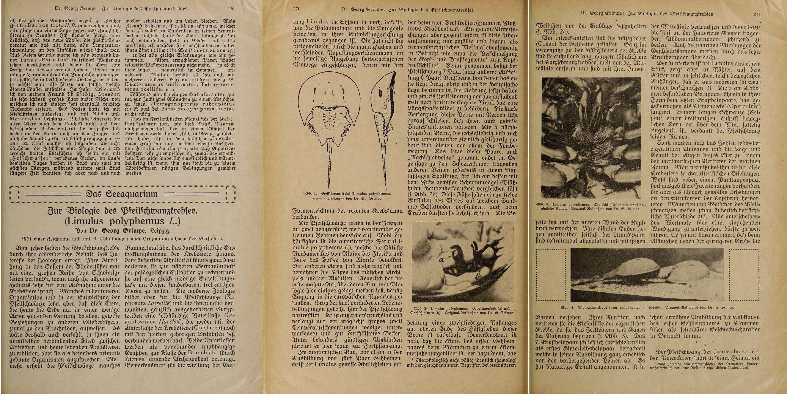
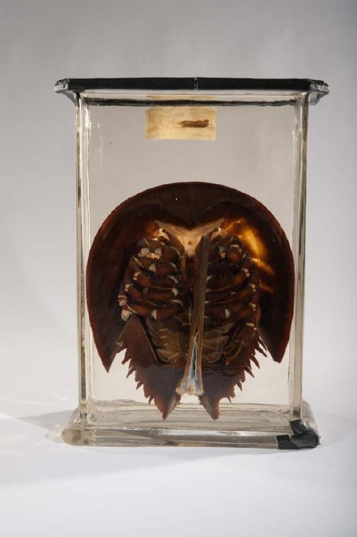
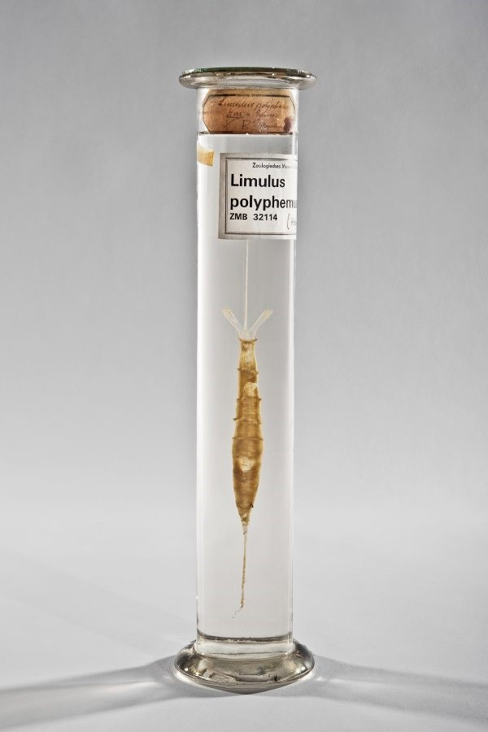
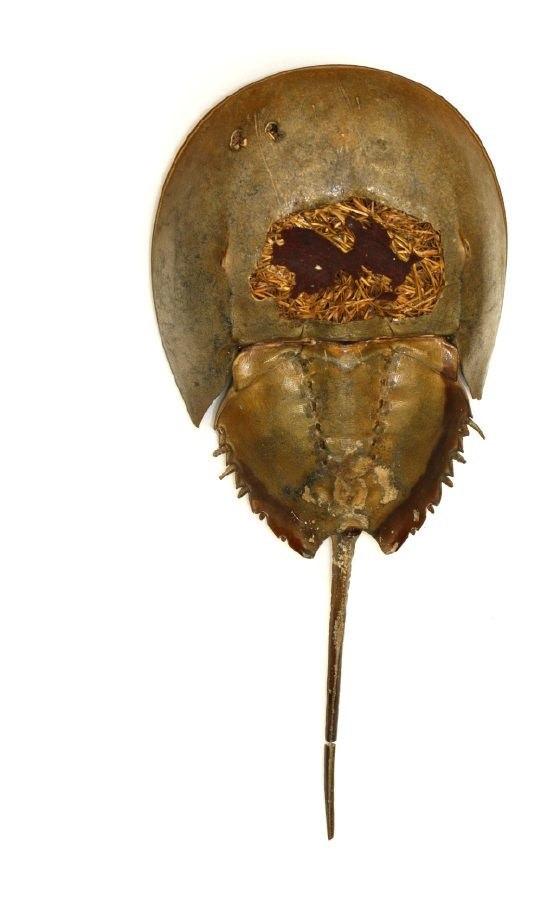
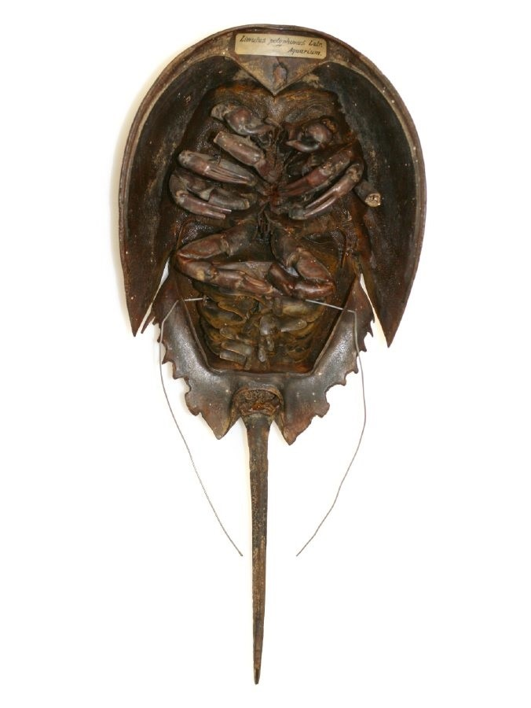

:::EN:::

<figure>

 

<figcaption>

_Wet specimen of a horseshoe crab with inventory number ZMB 48487 at the Berlin Museum of Natural History. (MfN, ZMB 48487. Photo: Carola Radke/MfN. All rights reserved.)_

</figcaption>

</figure>

At the Berlin Museum of Natural History, a specimen of a horseshoe crab preserved in alcohol bears the inventory number "ZMB [Berlin Zoological Museum] 48487". It is one of a series of historical wet specimens of the species _Limulus polyphemus_ (Linnaeus, 1758).[^1] These limulus specimens were not originally part of the natural history museum's collection and have a long history behind them that has taken them through different stations. The history of these animals and the species as a whole is a good example of how an animal's significance and utilisation change in different scientific contexts, as does its epistemological status and even its entire mode of existence. 

## From the aquarium via the teaching collection to the museum: Provenance histories

If the historical limulus specimens in Berlin's Museum of Natural History were not originally intended for its collection, where did they come from, and what was their purpose? What kinds of distances did they cover over time, and what can they tell us about the history of the collection?

The specimens themselves give us a clue about their earlier function. The way that they have been prepared indicates that they were not items in a _research_ collection, like that of the natural history museum, but rather _teaching_ objects. Firstly, the specimens were literally cut to fit university teaching requirements or consisted of isolated body parts that could be used to demonstrate an animal's various functions or organs. Some of the animals' body parts have been exposed, like the nervous system has been here.

<figure>

<figcaption>

_The front of specimen ZMB 48487 reveals the animal's exposed nervous system. (MfN, ZMB 48487. Photo: Carola Radke/MfN. All rights reserved.)_

</figcaption>

</figure>

Organs have been removed from other animals and prepared as individual specimens.

<figure>

<figcaption>

_In this specimen, the heart and vessels of a horseshoe crab have been isolated. This animal came from the (Berlin?) Aquarium and was probably part of the Zoological Teaching Collection to begin with. It is now stored at the Museum of Natural History Berlin. (MfN, ZMB 32114. Photo: Carola Radke/MfN. All rights reserved.)_

</figcaption>

</figure>

Traces of wear and tear provide more clues. Material damage and wires on some of the dry specimens indicate that they were exhibited, hung up, and handled.

<figure>

<figcaption>

_This historical specimen of a horseshoe crab has suffered damage over time. (MfN, ZMB 32107. Photo: Carola Radke/MfN. All rights reserved._

</figcaption>

</figure>

<figure>

<figcaption>

_The wires on the specimen show that it was hung up, which points to its probable earlier use as an exhibition or teaching object. (MfN, ZMB 48477. Photo: Carola Radke/MfN. All rights reserved.)_

</figcaption>

</figure>

In fact, these specimens have come from the "Zoological Institute", as can be read at the top of the jar label. This was a former institute of Friedrich-Wilhelm-Universität zu Berlin, where, after the founding of the institute in 1884, a Zoological Teaching Collection was established.

<figure>

<figcaption>

_Label on the specimen from the Zoological Institute, which now bears inventory number ZMB 48487, at the Museum of Natural History. (MfN, ZMB 48487. Photo: Mareike Vennen. All rights reserved.)_

</figcaption>

</figure>

The Zoological Institute should not be confused with the collection of the Zoological Museum, which laid the foundations for today's Museum of Natural History collection, where these specimens are currently stored. Both institutions were part of Friedrich Wilhelm University, where they were first housed in the main building until they moved to the newly built Museum of Natural History on Invalidenstraße in 1888 and 1889 respectively. However, even though they shared a roof, they largely worked independently of each other, as their functions and tasks, and therefore the structure and holdings of their collections, differed markedly. While the Zoological Museum had a research collection that served scientific purposes, the Zoological Institute was responsible for training students and arranged its teaching collection accordingly (see [[story.history-of-the-zoological-teaching-collection]]). The fact that the specimen with its nervous system exposed initially belonged to the Zoological Institute is verified by the institution's label, on which the museum's inventory number was noted much later. How did the specimen make its way into the Zoological Teaching Collection and from there into the Museum of Natural History's research collection? 

In the teaching collection, the first catalogues from the 19th century provide evidence of how limulus specimens were acquired (see [[story.inventory-books]]). At that time, science had been familiar with horseshoe crabs for quite some time; there are pictures and descriptions of them that date back as far as the 16th century. However, the animals that had been available to teaching and research had mainly been dead specimens in a preserved state. According to the inventory catalogues, for example, the Zoological Institute purchased limulus specimens from the Berlin natural history dealer Linnaea and the Hamburg company J.F.G. Umlauff.[^2]

<figure>

(/images/mv/umlauff-katalaog-2.jpg)

<figcaption>

_In its 1900 sea life sales catalogue, the Hamburg natural history dealer J.F.G. Umlauff had animals like horseshoe crabs on offer. Umlauff, J.F.G. (ed.)._ Grosser illustrierter Catalog über Muscheln, Corallen, Gorgonien und Seethiere. Hamburg: Naturalienhandlung & Museum Hamburg, 1900: _left, cover; right p. 19._

</figcaption>

</figure>

In the 19th century, as the practice of keeping animals in aquariums spread from the English coast throughout Europe and shortly afterwards to the US, which led to the founding of a number of public aquariums in the 1860s, they became further sources for zoological teaching and research collections. More and more sea creatures that were not endemic to European waters were being imported live[^3], including horseshoe crabs. Of the four surviving species, three live in the Indo-Pacific waters of South East Asia[^4], while the species _Limulus polyphemus_ (Linnaeus, 1758) can be found in the West Atlantic and along the east coast of North and Central America (see [[story.moving-horseshoe-crabs]]). Most limuli in European aquariums come from the East Coast of the US, in particular from Delaware Bay in New Jersey.[^5] In Germany, the aquariums in Hamburg and Hanover were already showing horseshoe crabs from that region as early as in the mid-1860s[^6], as were the Unter den Linden Aquarium in Berlin and, from 1913, the aquarium at Berlin Zoo.[^7]

<figure>

<figcaption>

_The Berlin Zoo's aquarium guide depicted drawings of some of the sea-creatures that were on display in 1914. (AZGB. All rights reserved.)_

</figcaption>

</figure>

Horseshoe crabs were also popular with private aquarists, who helped to produce knowledge about their living conditions and how to keep these animals. 

<figure>

<figcaption>

_Aquarists, who were organised into associations, helped to produce knowledge about horseshoe crabs in specialist journals like the_ Blätter für Aquarien- und Terrarienkunde (1916).

</figcaption>

</figure>

Public aquariums gave many animals to collections after they died, thereby making them available for scientific research and teaching, including the Zoological Museum and the Zoological Institute in Berlin. "Berlin Aquarium" has been noted on the label of the wet specimen with its nervous system exposed.[^8] After having made its way from the New York coast to Berlin Aquarium, the animal that would later become specimen ZMB 48487 was dispatched to the Zoological Teaching Collection after its death. When, how, and why it then became part of the museum's research collection is unclear. Its transfer to the museum might have had something to do with the historic transformations that were taking place in zoological instruction. Whether this took place before the Second World War or afterwards is unclear. But the limulus specimens potentially moved to the museum (then still part of the Humboldt University as well) in 1970, when the collection's former section head decided to downsize it.[^9] So far, it has not been possible to definitively determine exactly why the teaching collection gave the animals to the museum and why the museum accepted them. At any rate, the specimens' function gradually changed after they switched collections. While they were probably actively used in academic teaching to demonstrate the anatomy of the horseshoe crab (see [[material.papier-mache-silkworm]]) while they were still part of the teaching collection, they are now preserved as historical specimens in the museum collection.[^10] Some of their eventful history – transforming from aquarium animals into teaching specimens, and ultimately into historical collection items – can still be seen today. The various place names that have been entered on the labels are now helping us to reconstruct the provenance of specimen ZMB 48487. The final addition so far has been the ZMB number, which is issued by the collection curator when they create the catalogue.[^11] Ocean, aquarium, teaching collection, and research collection – all of these spaces play an important role in producing and conveying knowledge about horseshoe crabs (among other things).[^12]

## From crab to spider: Taxonomic histories

Those looking for horseshoe crab specimens at the Berlin Museum of Natural History, however, might find that their name proves to be a red herring luring them to the wrong collection. This has to do with the history of the species – or, more precisely: with the history of its scientific investigation. It is not just individual specimens like ZMB 48487 that have switched places and functions over time: the species _Limulus polyphemus_ as a whole switched places within the taxonomic order in the 19th century and, as a result, within the collection structure. Science has thus changed its perspective on the horseshoe crab and what we know about it – in short: it has turned one animal into another. 

Up until the 19th century, zoological studies assumed that limuli were crustaceans, primarily because they lived in the sea, had gills, and looked like crabs.[^13] As a result, the animals were classified as crustaceans. In aquariums, they were exhibited together with crabs and prawns, as they were, for example, in the world's first public aquarium building, London's Zoological Garden in Regent's Park.[^14] The same applied to the natural history and animal trade. Umlauff, for example, placed the horseshoe crabs on offer next to crabs in its "Catalogue of Shells, Corals, Soft Corals, and Sea Creatures". 

<figure>

 

<figcaption>

_Horseshoe crabs in the sales catalogue of the Hamburg natural-history dealer J.F.G. Umlauff, Umlauff, J.F.G. (ed.): _Grosser illustrierter Catalog über Muscheln, Corallen, Gorgonien und Seethiere, _Hamburg: Naturalienhandlung & Museum Hamburg, 1900._

</figcaption>

</figure>

In the second half of the 19th century, however, more and more claims were being made that horseshoe crabs were more closely related to arachnids than crabs. A number of comparative studies were required to settle this issue of species classification. London zoologist Edwin Ray Lankester, for instance, published two pertinent articles with the title "Limulus as Arachnid" in the 1881 _Quarterly Journal of Microscopical Science_.[^15] Aquariums played another important role in these comparative anatomical studies as sites of observation and as sources for providing specimens from the 1860s onwards. Edwin Lankester, for instance, received live horseshoe crabs from the Royal Westminster Aquarium in London for his anatomical and histological studies. In Hamburg, zoologists like Karl August Möbius were given horseshoe crabs by the zoo aquarium there.[^16] It was therefore not by coincidence that the number of studies being published on the horseshoe crab grew from the 1870s.[^17] After Lankester and others had drawn the conclusion that the animals had more in common with spiders and scorpions than with crustaceans, _Limulus polyphemus_ was classified as a chelicerate in 1901. The horseshoe crab thus changed its subphylum within the taxonomic order.[^18]

Here, the dynamics of taxonomic knowledge become visible, revealing that the [[taxonomic order|theme.taxonomical-orders]]) is subject to historical change. Within the museum, horseshoe crab specimens then migrated from the Crustacean Collection to the Arachnid and Myriapod Collection, joining the spiders and centipedes, and received a new signature.[^19] Their original taxonomic classification and former location within the Crustacean Collection is still visible for some of the objects at the Berlin Museum of Natural History. Behind the acronym ZMB (for "Zoological Museum Berlin", which allows an object to be assigned to a special collection) and the inventory number for arachnids (for example "48490"), there is additional information provided in brackets, which points to this species' eventful taxonomic history: 

> ZMB 48490 [ex crustacean no. 5928], 4 juveniles, alcohol; Nahant, Massachusetts, USA; leg. Fröbel, date not recorded; good condition.[^20]

The same applies to museum exhibitions, where knowledge was spatially organised according to a systematic taxonomic concept. While horseshoe crabs were displayed in the crustacean department in the 19th century, they joined the arachnids in the 20th century. On the Biodiversity Wall at the Berlin Museum of Natural History – a four-metre high and twelve-metre long installation that displays around 3,000 animals from all kinds of habitats – you will now find horseshoe crabs alongside scorpions and spiders.

Science has not just redefined the horseshoe crab within the taxonomic order: the way it has moved through spaces of knowledge and collection spaces has changed what the animal was and what it is. In this sense, museum collections, and the research that takes place within them, are also sites of world-making that reorganize nature.

## From the ocean to the laboratory: Biomedical histories 

In the second half of the 20th century, horseshoe crabs made their way into new scientific contexts, where they became part of an experimental practice that furthered their connection to humans even more. In the mid-1950s, researchers discovered that horseshoe crab blood (which is blue due to the amount of copper it contains) is rich in amoebocytes, i.e., cells that immediately react to poisons.[^21] This led to medical practitioners like Frederik Bang and Jack Levin developing the Limulus amoebocyte lysate test (LAL test) from the blood of _Limulus polyphemus_. This test makes use of the fact that limulus blood coagulates when it comes into contact with certain bacteria, meaning that, when the immune cells in the blood of the horseshoe crab encounter invading bacteria, they agglutinate around it and protect the rest of the animal's body from the toxins. The coagulation factor, which can verify the presence of even tiny amounts of a given pathogen, can reveal the presence of bacterial contamination, also known as endotoxins.[^22] Since the 1970s, the LAL test has been used to determine the presence of endotoxins in human blood serum and is now sold in the United States. For this reason, when thousands of crabs come out of the sea in spring to breed and spawn (especially in Delaware Bay), they are caught by trawlers or collected on the beach and brought to specialist laboratories of biomedical companies, where a canula inserted into their hearts removes up to a third of their blood. Afterwards they are taken back to where they were caught and released back into the sea alive. The short- and long-term damage caused by the bleeding is still unclear, but the number of studies pursuing this issue is increasing.[^23] 

Biomedical research has taken horseshoe crabs to new spaces, namely, modern laboratories, where the animals – or more precisely: their blood – are turned into a valuable resource. A few years ago, the price for a litre of limulus blood on the global market had already been estimated at about USD 15,000.[^24] Since the LAL test was approved, the demand for horseshoe crabs in the pharma industry has been gradually increasing, as the test is now the standard for screening both implantable medical devices and injectable medications, and for testing biological samples for bacterial contamination.[^25] Strictly speaking, biomedicine is not the only field in which horseshoe crabs have been exploited by humans: the animals were earlier used in agriculture (as fertiliser) and fishing (as bait).[^26] But, in recent decades especially, noticeable changes have been recorded in horseshoe crab populations. The unregulated capture of limuli in the late 1990s led to a drastic drop in US populations. Their use in the biotechnical industry has profoundly changed the human world but also the living conditions of horseshoe crabs. In this sense, scientific research and its applications have proven to be processes of world-making that have helped to secure an important medical resource for humans, but have put the animals' lives in danger in order to do so.
Moreover, reduced limulus spawning activity due to their capture is not just having an impact on the species itself, but also on larger ecological contexts, as horseshoe crabs are an important link in coastal biodiversity. The eggs laid by the animals each spring on the beaches of Delaware Bay are an important food source for migratory birds like the red knot (_Calidris canutus_). On its annual 18,000-mile journey from Tierra del Fuego on the southern tip of South America to the Canadian Arctic and back, the red knot lands in the bay while the horseshoe crab is spawning. The noticeable decline in horseshoe crab populations since the 1990s has thus correlated with a visible decline in red-knot population. Although catch quotas have been introduced and various initiatives taken to protect horseshoe crabs at a regional, national and international level, the International Union for Conservation of Nature (IUCN) declared the horseshoe crab endangered in 2016.[^27] This might have to do not least with the fact that, although an artificial alternative to the LAL test has now been developed, it has not yet become the standard in the US.[^28] At the same time, the demand for tests continues to grow – now more than ever, in fact, as the LAL test is also being used in the development of vaccines. Since the beginning of the Corona pandemic, more than 100 different vaccines have been tested. Successful vaccines must be carefully tested before they are introduced on the market, which further increases the need for limulus serum. Horseshoe crabs are thus playing an important, albeit little-known, role in the lives of almost everybody. 

Connections such as the ones outlined here and the ensuing interdependencies and dynamics frequently only become visible once we chart the paths and movements of animals and species and find the links between them. To do this, it is important to trace the stories of _individual animals_ through various spaces (of knowledge), like the journey from the ocean to the aquarium, to museum collections or laboratories. This also means examining the history of the _species_, in particular the various disciplines, fields of application, and ecologies in which the species have played a role. Taking a perspective like this uncovers genealogies and illustrates how the worlds and lives of humans and animals are intertwined. This knowledge can also be utilised for the present and the future. Insights like these into the connections between the routes taken by migratory birds like the red knot and the spawning activities of the horseshoe crabs in Delaware Bay have led to the development of cross-species approaches in ecology and conservation.[^29] Similarly, historical collection data in natural history museums and historical reports on the anthropogenic spread of horseshoe crabs (see [[story.moving-horseshoe-crabs]]) can be used to investigate urgent questions about the loss of biodiversity. In this sense, spaces of knowledge like collections and laboratories are also spaces of world-making that change living conditions, habitats, and lives. The challenge that remains is to find visions that will enable us to coexist in the future. 

[^1] Cf. Dunlop, Jason A., Marlene S. Compton, Anja Friederichs. "An Annotated Catalogue of the Horseshoe Crabs (Xiphosura) Held in the Museum für Naturkunde Berlin." _Zoosystematics and Evolution_ 88, no. 2 (2012): 215-222, 215. https://doi.org/10.1002/zoos.201200018. I would like to thank Jason Dunlop for providing so much helpful information about the specimens and their history. 

[^2] In 1885, for example, the teaching collection purchased a dry specimen from Umlauff for five marks; between 1891 and 1894, the catalogue recorded the acquisition of three wet specimens from the Berlin-based natural-history dealer Linnaea for two, five, and six marks respectively. Cf. Zoologisches Institut (ZIB), Inventarbuch V, vol. 1.

[^3]: On the history of the aquarium in the 19th century, see Vennen, Mareike. _Das Aquarium: Praktiken, Techniken und Medien der Wissensproduktion (1840-1910)_. Göttingen: Wallstein, 2018.

[^4] These include _Carcinoscorpius rotundicauda_ (Latreille, 1802), _Tachypleus gigas_ (O. F. Müller 1785), and _Tachypleus tridentatus_ (Leach, 1819). The North Atlantic species is classified as its own sub-family.

[^5] Animal and natural history dealers were initially responsible for importing the animals, after which, from the late 19th century onwards, aquarists began keeping them in New York itself in aquariums that sold the animals. In 1896, New York Aquarium opened in Manhattan's Battery Park, before later moving to Coney Island. Between 1879 and 1883, there had already been one aquarium in the city, the Great New York Aquarium on the corner of 35th Street and Broadway, which had been founded by W.C. Coup, a veteran of New York's show business and partner of P.T. Barnum. There, too, there were horseshoe crabs on display, back then under the title of "King Crab". Cf. _New York Aquarium Journal_, ed. by New York Aquarium 1 (1876).

[^6] Cf. Hess, Wilhelm. _Führer durch J.G. Egestorff's Aquarium zu Hannover: Eine kurze Uebersicht der darin befindlichen Thiere_. Hanover: Druck von Wilhelm Riemschneider, 1867: 35; Lloyd, William Alford. "On the Occurrence of Limulus Polyphemus off the Coast of Holland, and on the Transmission of Aquarium Animals." _The Zoologist_ 9 (1874): 3845–3855, 3850. 

[^7] On the Aquarium Unter den Linden, see Brehm, Alfred. _Führer durch das Berliner Aquarium: Eine kurze Beschreibung der in ihre zur Schaugestellten Thiere._ Berlin: Verlag des Berliner Aquariums, 1870: 83-84. In 1920, 1925, 1928, 1930, and 1934, the New York Aquarium sent horseshoe crabs to the Berlin Zoo Aquarium. Cf. the relevant business reports from the Berlin Zoological Garden.

[^8]: Because specimen ZMB 48487 is undated, "Berlin Aquarium" could mean one of two institutions: the Aquarium Unter den Linden ran from 1869 to 1910, where horseshoe crabs could be viewed as early as in 1870 (cf. Brehm, Alfred. _Führer durch das Berliner Aquarium: Eine kurze Beschreibung der in ihre zur Schau gestellten Thiere_. Berlin: Verlag des Berliner Aquariums, 1870: 83-84.) The old collection catalogues tell us that the Zoological Institute had already received specimens from there in November 1895. (Cf. Zoologisches Institut [ZIB]. Inventarbuch V, vol. 1, no. 3409; Zoologisches Institut [ZIB], Inventarbuch V, vol. 2, no. 4301.) Three years after the building had to close in 1910, a new aquarium was opened in the Zoological Garden. Before and after the First World War, the New York Aquarium donated ten to 20 live limuli to it each year and also gave dead specimens to the Zoological Institute. Cf. Zoologischer Garten Berlin. _Geschäftsbericht für das Jahr 1914. Berlin: 1915._

[^9] Cf. Richter, Stefan. "Die Lehrsammlung des Zoologischen Instituts der Berliner Universität – ihre Geschichte und ihre Bedeutung." _Sitzungsberichte der Gesellschaft Naturforschender Freunde zu Berlin_ 37 (25 February 1999): 59-76, 64.

[^10] Dunlop, Jason A., Marlene S. Compton, and Anja Friederichs. "An Annotated Catalogue of the Horseshoe Crabs (Xiphosura) Held in the Museum für Naturkunde Berlin." _Zoosystematics and Evolution_ 88, no. 2 (2012): 215-222, 215. https://doi.org/10.1002/zoos.201200018.

[^11] The numbers that begin with "48" were only recently assigned to predominantly older specimens, as the curator of the Arachnid Collection, Jason Dunlop, explains.

[^12] At the same time, knowledge about horseshoe crabs depends quite existentially on the lives and/or deaths of the animals (e.g., their transportability and ability to survive in the aquarium), and on their materiality (for example the damaged materiality of dry specimens). 

[^13] This assumption is reflected in many of the names that were given to the animal: in German _Pfeilschwanzkrebs_ (arrow-tailed crab), in English horseshoe crab, and earlier even king crab. See, e.g., Müller, Otto Frederik. _Entomostraca seu Insecta Testacea_. Havnia: Sumtibus J.G. Mülleriani, 1785; Bosc, L. S. G. _Histoire naturelle des crustacés, contenant leur description et leurs moeurs; avec figures dessinées d'après nature_. Paris: Deterville, 1802; Desmarest, A.-G. _Considerations générales sur la classe des crustaces_. Paris: Levrault, 1825.

[^14] In the aquarium guide, it says: "In the tanks in the centre of the house will be found some curious Crustaceans – such as the King-crab (Limulus)." Sclater, Philip Lutley. _Guide to the Gardens of The Zoological Society of London,_ 20th edition. London: 1876.

[^15] Lankester, Edwin Ray. "Limulus an Arachnid." _Quarterly Journal of Microscopical Science_, New Series 21 (1881): 504–548, 609–649; see also Heymons, R. "Die Entwicklungsgeschichte der Scolopender." _Zoologia_ 33 (1901): 1–244.

[^16] Lankester, Edwin Ray. "Limulus an Arachnid." _Quarterly Journal of Microscopical Science_, New Series 21 (1881): 504–548, 609–649; see also Heymons, R. "Die Entwicklungsgeschichte der Scolopender." _Zoologia_ 33 (1901): 1–244; Lloyd, William Alford. "On the Occurrence of Limulus Polyphemus off the Coast of Holland, and on the Transmission of Aquarium Animals." _The Zoologist_ 9 (1874): 3845–3855, 3850.

[^17] See, e.g., Dohrn, Anton. "Untersuchungen über Bau und Entwicklung der Arthropoden."_Jenaische Zeitschrift für Naturwissenschaft_ 5 (1870): 54–81; Gegenbaur, Carl. "Anatomische Untersuchung eines Limulus." _Abhandlungen der Naturforschenden Gesellschaft Halle_ 4 (1858): 227-250; Milne-Edwards, Alphonse. _Recherches sur l'anatomie des Limules_. (Series: _Annales des sciences naturelles_, 5th series, vol. xvii). Paris: 1873; Packard, Alpheus Spring Jun. _The Development of Limulus Polyphemus_. Boston: Society of Natural History, 1872.

[^18] This makes them special, as they are the only arachnids that live under water. For the latest studies in the discussion on the taxonomy of horseshoe crab, see Howard, Richard J., Mark N. Puttick, Gregory D. Edgecombe, and Jesus Lozano-Fernandez. "Arachnid Monophyly: Morphological, Palaeontological and Molecular Support for a Single Terrestrialization within Chelicerata." _Arthropod Structure & Development_ 59 (2020): no. 100997. https://doi.org/10.1016/j.asd.2020.100997.

[^19] Many museum and university collections still organise their collections by the biological systematics of class, order, family, genus, and species, even though spatial limitations mean that it is often difficult to implement this systematic order properly. In the second half of the 19th century, many collections in the natural history museums of Europe were split in two during the museum reform movement – into a public display exhibition and a research collection closed to the public. Cf. Nyhard, Lynn K. _Modern Nature: The Rise of the Biological Perspective in Germany_. Chicago: The University of Chicago Press, 2009; Köstering, Susanne. _Natur zum Anschauen: Das Naturkundemuseum des deutschen Kaiserreichs 1871-1914_. Cologne et al.: Böhlau, 2003; 

[^20] This is the entry in Dunlop, Jason A., Marlene S. Compton, and Anja Friederichs. "An Annotated Catalogue of the Horseshoe Crabs (Xiphosura) Held in the Museum für Naturkunde Berlin." _Zoosystematics and Evolution_ 88, no. 2 (2012): 215-222, 215. https://doi.org/10.1002/zoos.201200018.

[^21]: Howell's studies from 1881 had already proven that human blood and haemolymphe ("blood") in the limulus coagulate in a similar way. But it was not until 70 years later that his studies were taken further, when Bang described a bacterial infection in a population of horseshoe crabs that caused their blood to coagulate in 1956. Cf. Liebsch, Manfred. "Die Geschichte der Validierung des LAL- Tests." _ALTEX_ 12, no. 2 (1995): 76-80, 78.

[^22]: On the history of the LAL test, see, e.g., Levin J. "The History of the Development of the Limulus Amebocyte Lysate Test." _Progress in Clinical and Biological Research_ 189 (1985): 3-30.

[^23]: Images of this procedure can be found here, for example: https://www.nationalgeographic.com/animals/article/covid-vaccine-needs-horseshoe-crab-blood (23.11.2021). For studies on the impact of taking limulus blood, see Hurton L, Berkson J. "Potential Causes of Mortality for Horseshoe Crabs (_Limulus polyphemus_) During the Biomedical Bleeding Process." _Fishery Bulletin_ 104 (2006): 293–298; Walls, E. A., and Berkson, J. "Effects of Blood Extraction on the Mortality of the Horseshoe Crab, Limulus polyphemus." _Virginia Journal of Science_ 51, no. 3 (2000): 195-198. Rudloe, Anne. "The Effect of Heavy Bleeding on Mortality of the Horseshoe Crab, _Limulus polyphemus_, in the Natural Environment." _Journal of Invertebrate Pathology_ 42, no. 2 (1983): 187-176, doi.org/10.1016/0022-2011(83)90059-9.

[^24]: Cf. Das, Alok. "Horseshoe Crabs in Modern Day Biotechnological Applications." In _Changing Global Perspectives on Horseshoe Crab Biology_, ed. by Ruth H. Carmichael et al. Cham: Springer International Publishing, 2015: 463-473, 470.

[^25]: Das, 2015.

[^26]: As early as in the mid-18th century, horseshoe crabs were being used in agriculture as fertiliser and then later in fishing as bait. In some regions, they are eaten as food. Cf. Loveland, R.E., M.L. Botton, and C.N. Shuster Jr. "Life History of the American Horseshoe Crab (Limulus polyphemus L.) in Delaware Bay and its Importance as a Commercial Resource." In _Proceedings of the Horseshoe Crab Forum: Status of the Resource_, ed. by J. Farrell and C. Martin. Lewes: University of Delaware Sea Grant College Program, 1996: 15–22; Smith, David R., Michael J. Millard, and Ruth Herrold Carmichael. "Comparative Status and Assessment of Limulus polyphemus, with Emphasis on the New England and Delaware Bay Populations." In _Biology and Conservation of Horseshoe Crabs_, ed. by John T. Tanacredi, Mark Botton, and David R. Smith. New York: Springer, 2009: 361–386.

[^27]: Smith, D.R., M.A. Beekey, H.J. Brockmann, T. L. King, M. J. Millard, and J.A. Zaldívar-Rae. "Limulus polyphemus." _The IUCN Red List of Threatened Species_ 2016: e.T11987A80159830. https://dx.doi.org/10.2305/IUCN.UK.2016-1.RLTS.T11987A80159830.en

[^28]: On the testing method, see Maloney, Tom, Ryan Phelan, and Naira Simmons. "Saving the Horseshoe Crab: A Synthetic Alternative to Horseshoe Crab Blood for Endotoxin Detection." _PLoS Biology_ 16, no. 10 (Oct. 2018). https://doi.org/10.1371/journal.pbio.2006607.

[^29]: See, e.g., McGowan, Conor P., David R. Smith, John A. Sweka, et al. "Multispecies Modeling for Adaptive Management of Horseshoe Crabs and Red Knots in the Delaware Bay." _Natural Resource Modelling_ 24, no. 1 (2011): 117–156. 

:::DE:::

<figure>

 

<figcaption>

_Nasspräparat eines Pfeilschwanzkrebses im Museum für Naturkunde Berlin mit der Inventarnummer ZMB 48487. (MfN, ZMB 48497. Foto: Carola Radke/MfN. Alle Rechte vorbehalten.)_

</figcaption>

</figure>

Im Berliner Museum für Naturkunde befindet sich das Präparat eines Pfeilschwanzkrebses in Alkohol mit der Inventarnummer "ZMB [Zoologisches Museum Berlin] 48487". Es gehört zu einer Reihe historischer Nasspräparate der Art _Limulus polyphemus_ (Linnaeus, 1758).[^1] Diese Limulus-Präparate gehörten ursprünglich nicht zur Sammlung des Naturkundemuseums. Sie haben eine lange Geschichte mit mehreren Ortswechseln hinter sich. Die Geschichte dieser Tiere und der ganzen Art zeigt beispielhaft, wie sich in unterschiedlichen wissenschaftlichen Kontexten die Bedeutung und Verwendung von Tieren ebenso wie ihr epistemischer Status oder sogar ihre ganze Seinsweise verändert. 

## Vom Aquarium über die Lehrsammlung ins Museum. Provenienzgeschichten

Wenn die historischen Limulus-Präparate, die sich heute im Berliner Naturkundemuseum befinden, ursprünglich nicht für dessen Sammlung bestimmt waren, woher stammen sie und was war ihr Zweck? Welche Wege haben sie im Laufe der Zeit zurückgelegt und was vermögen diese über die Sammlungsgeschichte auszusagen?
Einen Hinweis auf ihre frühere Funktion liefern die Präparate selbst. Die Art der Zurichtung deutet darauf hin, dass es sich nicht um Objekte einer _Forschungs_sammlung wie der des Naturkundemuseums handelt, sondern um _Lehr_objekte. Zum einen wurden Präparate für die universitäre Lehre buchstäblich zugeschnitten oder bestanden aus isolierten Körperteilen, um verschiedene Funktionen oder Organe eines Tieres zu demonstrieren. In diesem Fall sind bei manchen der Tiere bestimmte Körperpartien wie etwa das Nervensystem freigelegt.

<figure>

<figcaption>

_Die Vorderseite des Präparates ZMB 48487 zeigt, dass das Nervensystem des Tieres freigelegt ist. (MfN, ZMB 48487. Foto: Carola Radke/MfN. Alle Rechte vorbehalten.)_
Bei anderen sind einzelne Organe extrahiert.

</figcaption>

</figure>

<figure>

<figcaption>

_Herz und Gefäße eines Pfeilschwanzkrebses sind beim Präparat ZMB 32114 isoliert. Das Tier stammt aus dem (Berliner?) Aquarium, war vermutlich zunächst Teil der zoologischen Lehrsammlung und wird heute im Museum für Naturkunde aufbewahrt. (MfN, ZMB 32114. Foto: Carola Radke/MfN. Alle Rechte vorbehalten.)_

</figcaption>

</figure>

Einen weiteren Hinweis liefern Gebrauchsspuren. Materialschäden oder Drähte an manchen der Trockenpräparate deuten darauf hin, dass sie ausgestellt, aufgehängt oder in die Hand genommen wurden.

_Dieses historische Präparat eines Pfeilschwanzkrebses hat im Laufe seiner Geschichte Schäden davongetragen. (MfN, ZMB 32107. Foto: Carola Radke/MfN. Alle Rechte vorbehalten.)_

_Die Drähte an diesem Präparat weisen auf eine Aufhängung und diese vermutlich auf den früheren Gebrauch als Ausstellungs- bzw. Lehrobjekt hin. (MfN, ZMB 48477. Foto: Carola Radke/MfN. Alle Rechte vorbehalten.)_

Tatsächlich stammen diese Präparate aus dem "Zoologischen Institut", wie oben auf den Etiketten am Glas zu lesen ist. Dabei handelt es sich um ein ehemaliges Institut der Berliner Friedrich-Wilhelms-Universität, an dem seit seiner Gründung 1884 eine zoologische Lehrsammlung aufgebaut wurde.

![Leicht vergilbtes Etikett mit schwarz gedruckter Schrift, sowie handschriftlich vermerkten Nummern und Symbolen.]

_Etikett des Präparats aus dem Zoologische Institut, das heute im Museum für Naturkunde die Inventarnummer ZMB 48487 trägt. (MfN, ZMB 48487. Foto: Mareike Vennen. Alle Rechte vorbehalten.)_

Das Zoologische Institut ist nicht zu verwechseln mit der Sammlung des Zoologischen Museums, das den Grundstock der heutigen Sammlungen im Museum für Naturkunde bildete, wo die Präparate derzeit untergebracht sind. Zwar gehörten beide Einrichtungen zur Friedrich-Wilhelms-Universität, in deren Hauptgebäude sie zunächst untergebracht waren, bis sie 1888 bzw. 1889 in das neu erbaute Museum für Naturkunde in der Invalidenstraße einzogen. Sie agierten jedoch, wenn auch unter einem Dach, weitgehend unabhängig voneinander, da sich ihre Funktionen und Aufgaben und daher auch der Aufbau und Bestand ihrer Sammlungen deutlich voneinander unterschieden. Während das Zoologische Museum eine Forschungssammlung besaß, die wissenschaftlichen Zwecken diente, war das Zoologische Institut für die Ausbildung von Studierenden zuständig und hatte seine Lehrsammlung entsprechend ausgerichtet (siehe[[story.history-of-the-zoological-teaching-collection]]). Dass das Präparat mit freigelegtem Nervensystem zuerst Teil des Zoologischen Instituts war, belegt das Etikett dieser Institution, auf dem die Inventarnummer des Museums erst nachträglich notiert wurde. Wie kam das Limulus-Präparat mit freigelegtem Nervensystem in die Zoologische Lehrsammlung und von dort in die Forschungssammlung des Naturkundemuseums? 

In der Lehrsammlung finden sich bereits in den ersten Katalogen aus dem späten 19. Jahrhundert (siehe [[story.inventory-books]]) Belege für die Anschaffung von Limulus-Präparaten. Zu dieser Zeit waren Pfeilschwanzkrebse in der Wissenschaft längst bekannt; Abbildungen und Beschreibungen sind schon aus dem 16. Jahrhundert belegt. Lange Zeit hatten Lehre und Forschung jedoch überwiegend tote Tiere in konserviertem Zustand zur Verfügung. So erwarb das Zoologische Institut laut den Inventarkatalogen Limulus-Präparate etwa von der Berliner Naturalienhandlung Linnaea und der Hamburger Firma J.F.G. Umlauff.[^2]

(/umlauff-katalaog-2.jpg)

_Im Verkaufskatalog der Meerestiere von 1900 bot die Hamburger Naturalienhandlung J.F.G. Umlauff unter anderem Pfeilschwanzkrebse an, die sie im Katalog neben den Krebstieren platzierte. Umlauff, J.F.G. (Hg.). _Grosser illustrierter Catalog über Muscheln, Corallen, Gorgonien und Seethiere_. Hamburg: Naturalienhandlung & Museum Hamburg, 1900: links Umschlag; rechts S. 19._

Als sich in der zweiten Hälfte des 19. Jahrhunderts von den englischen Küsten ausgehend die Aquarienhaltung in ganz Europa und kurz darauf in den USA verbreitete und im Zuge dessen ab den späten 1860er-Jahren in vielen Städten öffentliche Aquarien gegründet wurden, wurden diese zu weiteren Bezugsquellen für zoologische Lehr- und Forschungssammlungen. Immer mehr Meerestiere, die nicht in europäischen Gewässern heimisch waren, wurden lebend importiert.[^3] Das gilt auch für Pfeilschwanzkrebse. Von den vier noch existierenden Arten leben drei in den indopazifischen Gewässern Südostasiens[^4], während die Art _Limulus polyphemus_ (Linnaeus, 1758) im westlichen Atlantik entlang der Ostküste von Nord- und Mittelamerika verbreitet ist (siehe [[story.moving-horseshoe-crabs]]). Die meisten Limuli in europäischen Aquarien stammen von der Ostküste der USA, insbesondere aus Delaware Bay in New Jersey.[^5] In Deutschland zeigten bereits Mitte der 1860er-Jahre die Aquarienhäuser in Hamburg und Hannover Pfeilschwanzkrebse aus dieser Region[^6], ebenso wie das Aquarium Unter den Linden in Berlin und ab 1913 das Aquarium im Berliner Zoo.[^7]

_Der Aquarienführer von 1914 präsentierte Zeichnungen ausgewählter Meerestiere, die ausgestellt waren. (AZGB. All rights reserved.)_

Pfeilschwanzkrebse waren auch unter privaten Aquarianer:innen beliebt, die zum Wissen über die Lebensbedingungen und Haltung der Tiere beitrugen. 

_Die in Vereinen organisierten Aquarianer:innen trugen in Fachzeitschriften wie den_ Blättern für Aquarien- und Terrarienkunde _(1916) zum Wissen über Pfeilschwanzkrebse bei._

Von Aquarien aus wurden viele Tiere nach ihrem Tod an Sammlungen abgegeben und dadurch für wissenschaftliche Forschungs- und Lehrzwecke nutzbar gemacht, so auch für das Zoologische Museum und das Zoologische Institut in Berlin. Auf dem Etikett des Nasspräparats mit freigelegtem Nervensystem ist "Berliner Aquarium" vermerkt.[^8] Nachdem also das Tier, das später zum Präparat ZMB 48487 werden sollte, vermutlich von der Küste bei New York ins Berliner Aquarium gelangte, wurde es nach seinem Tod in die Zoologische Lehrsammlung überstellt. Wann, wie und weshalb es von dort in die Forschungssammlung des Museums kam, ist nicht gesichert. Die Abgabe an das Museum könnte mit den historischen Wandlungen des Zoologieunterrichts zusammenhängen. Ob dies vor dem Zweiten Weltkrieg geschah oder danach, ist nicht klar. Möglicherweise wurden die Limulus-Präparate aber auch im Jahr 1970, als sich der damalige Sektionsleiter der Sammlung entschied, diese zu verkleinern, dem Museum (das damals ebenfalls noch Teil der Humboldt-Universität war) überlassen.[^9] Die genauen Gründe, weshalb die Lehrsammlung die Tiere ans Museum gab und dieses sie annahm, können (bislang) ebenfalls nicht endgültig geklärt werden. Jedenfalls hat sich mit dem Sammlungswechsel im Laufe der Zeit die Funktion der Präparate gewandelt. Während sie in der Lehrsammlung vermutlich aktiv in der Lehre eingesetzt wurden, um die Anatomie des Pfeilschwanzkrebses zu vermitteln (siehe [[material.silkworm-in-papier-mache]]), werden sie in der Museumssammlung heute vornehmlich als historische Präparate aufbewahrt.[^10] Diese wechselvolle Geschichte der Wandlungen vom Aquarientier zum Lehrpräparat und schließlich zum historischen Sammlungsobjekt ist teilweise noch sichtbar. Die verschiedenen Orte, die auf dem Etikett eingetragen sind, helfen heute, die Provenienz des Präparates ZMB 48487 zu rekonstruieren. Der (bislang) letzte Zusatz ist die ZMB-Nummer, die die Sammlungskurator\*innen bei der Erstellung des Bestandskatalog vergeben.[^11] Meer, Aquarium, Lehr- und Forschungssammlung - all diese Räume werden (unter anderem) dazu genutzt, Wissen über Pfeilschwanzkrebse zu produzieren und zu vermitteln. Zu diesem Zweck werden die Tiere auf unterschiedliche Weise erforscht, zugerichtet, klassifiziert, so dass den Pfeilschwanzkrebsen ein je unterschiedlicher Status zukommt.[^12]

## Vom Krebs zur Spinne. Taxonomiegeschichten

Wer allerdings im Berliner Naturkundemuseum die Präparate der Pfeilschwanzkrebse sucht, lässt sich womöglich von ihrem Namen auf eine falsche Fährte und in die falsche Sammlung locken. Das hängt mit der Geschichte der Art, genauer gesagt mit der Geschichte ihrer Erforschung zusammen. Nicht nur einzelne Präparate wie ZMB 48487 haben historische Orts- und Funktionswechsel durchgemacht, sondern die ganze Art _Limulus polyphemus_ wechselte im 19. Jahrhundert ihren Ort innerhalb der taxonomischen Ordnung und, davon ausgehend, innerhalb der Sammlungsstruktur. Die Wissenschaft verändert somit den Blick auf Pfeilschwanzkrebse und das Wissen über sie, kurz: sie macht aus dem Tier ein anderes. 

Bis ins 19. Jahrhundert gingen zoologische Studien davon aus, dass es sich bei den Limuli um Krebstiere handelt, vor allem weil sie im Meer leben, Kiemen besitzen und wie Krebse aussehen.[^13] Diese Annahme spiegelt sich in vielen der Namen, die dem Tier gegeben wurden: Pfeilschwanzkrebs, im Englischen _horseshoe crab_ oder früher auch _king crab_. Entsprechend wurden die Tiere innerhalb der Krebstiere verortet. In Aquarien waren sie zusammen mit Krebsen und Krabben ausgestellt und als Krebstiere ausgewiesen, etwa im weltweit ersten öffentlichen Aquarienhaus im Londoner Zoologischen Garten im Regent's Park.[^14] Gleiches galt für den Naturalien- und Tierhandel, beispielsweise bei der Firma Umlauff, die Pfeilschwanzkrebse in ihrem "Catalog über Muscheln, Corallen, Gorgonien und Seethiere" anbot. 

 

_Im Verkaufskatalog der Hamburger Naturalienhandlung J.F.G. Umlauff ist der Pfeilschwanzkrebs neben den Krebstieren platziert. Umlauff, J.F.G. (Hg.):_ Grosser illustrierter Catalog über Muscheln, Corallen, Gorgonien und Seethiere. Hamburg: Naturalienhandlung & Museum Hamburg, 1900.

In der zweiten Hälfte des 19. Jahrhunderts wurden jedoch vermehrt Stimmen laut, die nachweisen wollten, dass Pfeilschwanzkrebse enger mit den Spinnenartigen als mit Krebsen verwandt sind. Um diese Frage der Artenbestimmung zu klären, waren vergleichende Untersuchungen notwendig, wie jene des Londoner Zoologen Edwin Ray Lankester, der 1881 im _Quarterly Journal of Microscopical Science_ zwei einschlägige Artikel mit dem Titel "Limulus as Arachnid" veröffentlichte.[^15] Die vergleichenden anatomischen Studien waren auf Material angewiesen. Auch hier spielten ab den 1860er-Jahren Aquarien als Beobachtungsstätte und Bezugsquelle eine wichtige Rolle. Edwin Lankester erhielt für seine anatomischen und histologischen Studien lebende Pfeilschwanzkrebse vom Royal Westminster Aquarium in London. In Hamburg bekamen Zoologen wie Karl August Möbius Pfeilschwanzkrebse aus dem dortigen Zoo-Aquarium. [^16] Nicht zufällig nahmen daher ab den 1870er-Jahren die Studien zum Pfeilschwanzkrebs zu.[^17] Nachdem Lankester und andere zu dem Schluss gekommen waren, dass die Tiere mehr Merkmale mit Spinnen und Skorpionen gemein hatten als mit Krebstieren, wurde _Limulus polyphemus_ im Jahr 1901 in die Gruppe der Chelicerata eingeordnet. Der Pfeilschwanzkrebs wechselte damit innerhalb der taxonomischen Ordnung die Gruppe.[^18]
Hier werden die Dynamiken taxonomischen Wissens sichtbar, die zeigen, dass das taxonomische System (siehe [[theme.taxonomical-orders]]) ein Resultat wissenschaftlicher Arbeit und damit historischen Wandlungen unterworfen ist. Es folgte ein physischer Ortswechsel innerhalb des Museums.[^19] Die Präparate der Pfeilschwanzkrebse wanderten von der Sammlung der Crustaceen zu den Arachnida und Myriapoda, den Spinnentieren und Tausendfüßlern, wo sie neu verzeichnet wurden und eine neue Signatur erhielten. Bei manchen Objekten im Berliner Naturkundemuseum ist ihre ursprüngliche taxonomische Einordnung und ihr ehemaliger Sammlungsort in der Krebssammlung noch sichtbar. Hinter dem Akronym ZMB (für "Zoologisches Museum Berlin", was die Zuordnung zu einer speziellen Sammlung ermöglicht) und der Inventarnummer für Spinnentiere (etwa "48490") findet sich ein Zusatz in Klammern, der auf die alte Signatur verweist und an die wechselhafte Taxonomiegeschichte der Art erinnert:

> ZMB 48490 [ex crustacean no. 5928], 4 juveniles, alcohol; Nahant, Massachusetts, USA; leg. Fröbel, date not recorded; good condition.[^20]

Ähnliches gilt für die Schausammlungen, deren räumliche Wissensorganisation lange auf eine systematisch-taxonomische Konzeption zielte. Während Pfeilschwanzkrebse im 19. Jahrhundert in der Abteilung der Krebstiere ausgestellt waren, sind sie im 20. Jahrhundert zu den Spinnentieren umgezogen. Auf der "Biodiversitätswand" im Berliner Museum für Naturkunde, einer vier Meter hohen und 12 Meter langen Installation, die rund 3000 Tiere aus allen Lebensräumen ausstellt, findet man daher heute den Pfeilschwanzkrebs neben Skorpionen und Spinnen.

Die Wissenschaft hat nicht nur Pfeilschwanzkrebse innerhalb des taxonomischen Systems neu bestimmt. Die Bewegung durch Wissens- und Sammlungsräume verändert das, was das Tier war und was es ist. In diesem Sinne sind Museumssammlungen und die darin stattfindende Forschung auch Orte des _world-making_, die die Natur neu ordnen.

## Vom Meer ins Labor. Verwertungsgeschichten 

In der zweiten Hälfte des 20. Jahrhunderts hielten Pfeilschwanzkrebse Einzug in neue wissenschaftliche Kontexte und wurden Teil einer experimentellen Praxis, die sie noch weiter mit dem Menschen verband. Denn Mitte der 1950er-Jahre fanden Forscher\*innen heraus, dass das Blut der Pfeilschwanzkrebse (das durch den Kupferanteil blau gefärbt ist) reich an Amöbozyten ist, also Zellen, die unmittelbar auf Giftstoffe reagieren.[^21] Daraufhin entwickelten Mediziner wie Frederik Bang und Jack Levin in den 1960er-Jahren aus dem Blut von _Limulus polyphemus_ den sogenannten Limulus-Amöbozyten-Lysat-Test (LAL-Test). Dieser Test macht sich zunutze, dass das Limulus-Blut bei Kontakt mit bestimmten Bakterien gerinnt. Wenn also die Immunzellen im Blut des Pfeilschwanzkrebses auf eingedrungene Bakterien treffen, verklumpen sie um diese herum und schützen den restlichen Körper des Tieres vor den Toxinen. Durch diesen Gerinnungsfaktor, der bereits kleinste Mengen von Krankheitserregern nachweisen kann, können bakterielle Verunreinigungen, sogenannte Endotoxine, angezeigt werden.[^22] Seit den 1970er-Jahren wird der LAL-Test zum Nachweis von Endotoxinen im menschlichen Blutserum verwendet und in den Vereinigten Staaten vermarktet. Dazu werden die Krebse im Frühjahr, wenn sie – insbesondere in Delaware Bay – zu Tausenden aus dem Meer kommen, um sich zu paaren und zu laichen, mit Schleppnetzen gefangen oder am Strand eingesammelt und in spezialisierte Labore biomedizinischer Unternehmen gebracht. Dort wird ihnen mit einer Kanüle aus dem Herzen bis zu einem Drittel ihres Blutes entnommen, woraufhin sie wieder an den Fangort zurückgebracht und lebend freigelassen werden. Welche Kurz- und Langzeitschäden sie durch die Blutentnahme davontragen, weiß man noch nicht sicher, doch nehmen Studien, die diese Frage behandeln, zu.[^23] 

Die biomedizinische Forschung brachte Pfeilschwanzkrebse in neue Räume, namentlich moderne Labore, in denen die Tiere, genauer gesagt ihr Blut, zur wertvollen Ressource wurde - auf dem Weltmarkt wurde der Preis für einen Liter Limulus-Blut vor einigen Jahren bereits auf rund 15.000 Dollar geschätzt.[^24] Seit der Zulassung des LAL-Tests hat der Bedarf an Pfeilschwanzkrebsen für die Pharmaindustrie schrittweise zugenommen, da der Test heute Standard für das Screening sowohl implantierbarer medizinischer Geräte als auch injizierbarer Medikamente und biologischer Proben auf bakterielle Verunreinigungen ist.[^25] Genau genommen ist die Biomedizin nicht das einzige Feld, in dem Pfeilschwanzkrebse vom Menschen verwertet werden; schon früher wurden die Tiere in der Landwirtschaft (als Dünger) und der Fischerei (als Köder) eingesetzt.[^26] Doch sind merkliche Veränderungen in den Populationen vor allem in den letzten Dekaden zu verzeichnen. Der unregulierte Fang von Limuli in den späten 1990er-Jahren führte zu einem drastischen Rückgang der Populationen in den USA. Ihre Verwendung in der biotechnischen Industrie verändert die Lebenswelt der Menschen und gleichzeitig die Lebensbedingungen der Pfeilschwanzkrebse tiefgreifend. Die wissenschaftliche Forschung und ihre Anwendungen erweisen sich auch in diesem Sinne als Prozesse des _world-making_, wodurch eine für den Menschen wichtige medizinische Ressource gesichert, dafür aber das Leben der Tiere gefährdet wird.

Die durch den Fang reduzierte Laichaktivität der Limuli hat darüber hinaus nicht nur Auswirkungen auf die Art, sondern auf größere ökologische Zusammenhänge, da Pfeilschwanzkrebse ein wichtiges Bindeglied für die Biodiversität an den Küsten sind. Die Eier, die die Tiere jedes Jahr im Frühjahr am Strand der Delaware Bay ablegen, sind eine wichtige Nahrungsquelle für Zugvögel wie den Knutt (_Calidris canutus_). Er landet jedes Jahr zur Zeit des Laichs der Pfeilschwanzkrebse in der Bucht, auf seinem fast 30 000 Kilometer langen Weg, den er jährlich von Feuerland an der Südspitze Südamerikas in die kanadische Arktis und zurück absolviert. Der merkliche Rückgang der Pfeilschwanzkrebs-Population seit den 1990er-Jahren korrelierte daher mit einem sichtbaren Rückgang der Küstenvogelpopulation. Trotz der Einführung von Fangquoten und verschiedenen Initiativen zum Schutz der Pfeilschwanzkrebse auf nationaler und internationaler Ebene stufte die Weltnaturschutzunion (IUCN) den Pfeilschwanzkrebs 2016 als gefährdet ein.[^27] Das mag nicht zuletzt daran liegen, dass zwar inzwischen eine künstliche Alternative zum LAL-Test entwickelt wurde, diese jedoch in den USA noch nicht standardmäßig eingesetzt wird[^28], während gleichzeitig der Bedarf an Tests weiter steigt - und zwar aktuell mehr denn je, da der LAL-Test auch in der Impfstoffentwicklung eingesetzt wird. Seit Beginn der Corona-Pandemie werden mehr als 100 verschiedene Impfstoffe getestet. Die erfolgreichen Impfstoffe müssen sorgfältig geprüft werden, bevor sie auf dem Markt eingeführt werden, was den Bedarf an Limulus-Serum weiter steigert. Pfeilschwanzkrebse spielen daher im Leben von fast jedem und jeder eine wichtige, wenn auch wenig bekannte Rolle. 

Verbindungen wie die hier geschilderten und die damit verknüpften Abhängigkeiten und Dynamiken werden häufig erst sichtbar, wenn wir die Wege und Bewegungen von Tieren und Arten verfolgen und zueinander in Beziehung setzen. Dafür ist es wichtig, die Geschichte _einzelner Tiere_ durch verschiedene (Wissens-)Räume hinweg zu verfolgen, etwa vom Meer in Aquarien, Museumssammlungen oder Labore. Dazu gehört zugleich, die Geschichte der _Art_ zu untersuchen, insbesondere die unterschiedlichen Disziplinen, Anwendungsfelder und Ökologien, in denen die Art eine Rolle spielte oder spielt. Ein solcher Blick deckt Genealogien auf und macht deutlich, auf welche Weise die Welten und Leben von Menschen und Tieren ineinander verstrickt sind. Dieses Wissen kann auch für die Gegenwart und Zukunft genutzt werden. So haben Erkenntnisse über die Verbindungen zwischen den Migrationsrouten von Zugvögeln wie dem Knutt und der Laichaktivität der Pfeilschwanzkrebse in Delaware Bay zu artübergreifenden Ansätzen in der Ökologie und im Artenschutz geführt.[^29] Ebenso können historische Sammlungsdaten in Naturkundemuseen und historische Berichte zur menschenbedingten Verbreitung von Pfeilschwanzkrebsen (siehe [[story.moving-horseshoe-crabs]]) für aktuelle Fragen des Biodiversitätsverlusts genutzt werden. In diesem Sinne sind Wissensräume wie Sammlungen und Labore zugleich Räume des _world-making_, die Lebensbedingungen, Lebensräume und Leben verändern. Es bleibt die Herausforderung, daraus auch Visionen für ein Zusammenleben in der Zukunft finden. 

[^1] Vgl. Dunlop, Jason A., Marlene S. Compton, und Anja Friederichs. "An Annotated Catalogue of the Horseshoe Crabs (Xiphosura) Held in the Museum für Naturkunde Berlin". _Zoosystematics and Evolution_ 88, Nr. 2 (2012): 215-222, 215. https://doi.org/10.1002/zoos.201200018. Ich danke Jason Dunlop für viele hilfreiche Hinweise zu den Präparaten und ihrer Geschichte. 

[^2] 1885 etwa erwarb die Lehrsammlung ein Trockenpräparat der Firma Umlauff für fünf Mark; zwischen 1891 und 1894 verzeichnet der Katalog den Erwerb von drei Nasspräparaten der Berliner Naturalienhandlung Linnaea für zwei, fünf und sechs Mark. Vgl. Zoologisches Institut (ZIB). Inventarbuch V, Bd. 1.

[^3]: Zur Geschichte des Aquariums im 19. Jahrhundert vgl. Vennen, Mareike. _Das Aquarium. Praktiken, Techniken und Medien der Wissensproduktion (1840-1910)_. Göttingen: Wallstein, 2018.

[^4] Hierzu gehören _Carcinoscorpius rotundicauda_ (Latreille, 1802), _Tachypleus gigas_ (O. F. Müller 1785) und _Tachypleus tridentatus_ (Leach, 1819). Die nordatlantische Art ist in eine eigene Unterfamilie eingeordnet.

[^5] Nachdem der Import der Tiere zunächst vor allem in der Hand von Tier- und Naturalienhändlern lag, wurden sie seit dem ausgehenden 19. Jahrhundert auch in New York selbst in Aquarien gehalten, die Tiere abgaben. Das New York Aquarium eröffnete 1896 im Battery Park in Manhattan, das später nach Coney Island umzog. Zwischen 1876 und 1883 gab es bereits ein Aquarium in der Stadt, das Great New York Aquarium an der Straßenecke 35th Street / Broadway, gegründet von W.C. Coup, einem Veteranen im New Yorker Showgeschäft und Partner von P.T. Barnum. Auch dort waren Pfeilschwanzkrebse zu sehen, damals noch unter dem Namen "King Crab". Vgl. das _New York Aquarium Journal_, hg. von New York Aquarium 1 (1876).

[^6] Vgl. Hess, Wilhelm. _Führer durch J.G. Egestorff's Aquarium zu Hannover. Eine kurze Uebersicht der darin befindlichen Thiere_. Hannover: Druck von Wilhelm Riemschneider, 1867: 35; Lloyd, William Alford. "On the Occurrence of Limulus Polyphemus off the Coast of Holland, and on the Transmission of Aquarium Animals". _The Zoologist_ 9 (1874): 3845–3855, 3850. 

[^7] Zum Aquarium Unter den Linden vgl. Brehm, Alfred. _Führer durch das Berliner Aquarium: Eine kurze Beschreibung der in ihre zur Schaugestellten Thiere._ Berlin: Verlag des Berliner Aquariums, 1870: 83-84. Im Berliner Zoo-Aquarium trafen in den Jahren 1920, 1925, 1928, 1930 und 1934 Sendungen mit Pfeilschwanzkrebsen aus dem New Yorker Aquarium ein. Vgl. die entsprechenden Geschäftsberichte des Zoologischen Gartens Berlin.

[^8]: Da das Präparat ZMB 48487 undatiert ist, könnten mit dem "Berliner Aquarium" zwei unterschiedliche Einrichtungen gemeint sein: Von 1869 bis 1910 existierte das Aquarium Unter den Linden, wo bereits ab 1870 Pfeilschwanzkrebse zu sehen waren.(Vgl. Brehm, Alfred. _Führer durch das Berliner Aquarium: Eine kurze Beschreibung der in ihre zur Schau gestellten Thiere_. Berlin: Verlag des Berliner Aquariums 1870: 83-84.) Aus den alten Sammlungskatalogen wissen wir, dass das Zoologische Institut von dort bereits im November 1895 Exemplare erhielt.(Vgl. Zoologisches Institut (ZIB). Inventarbuch V, Bd. 1, Nr. 3409; Zoologisches Institut (ZIB). Inventarbuch V, Bd. 2, Nr. 4301.) Nachdem das Haus 1910 schließen musste, eröffnete drei Jahre später im Zoologischen Garten ein neues Aquarium. Vor und nach dem Ersten Weltkrieg wurde es durch das New York Aquarium jährlich mit Sendungen von zehn bis 20 lebenden Pfeilschwanzkrebsen beschenkt und gab wiederum tote Limuli an das Zoologische Institut ab. Vgl. Zoologischer Garten Berlin. _Geschäftsbericht für das Jahr 1914_. Berlin: 1915.

[^9] Vgl. Richter, Stefan. "Die Lehrsammlung des Zoologischen Instituts der Berliner Universität – ihre Geschichte und ihre Bedeutung". _Sitzungsberichte der Gesellschaft Naturforschender Freunde zu Berlin_ 37 (25. Februar 1999): 59-76, 64.

[^10] Dunlop, Jason A., Marlene S. Compton, und Anja Friederichs. "An Annotated Catalogue of the Horseshoe Crabs (Xiphosura) Held in the Museum für Naturkunde Berlin". _Zoosystematics and Evolution_ 88, Nr. 2 (2012): 215-222, 215. https://doi.org/10.1002/zoos.201200018.

[^11] Die Nummern, die mit "48" beginnen, werden erst in jüngerer Zeit vergeben und zwar vornehmlich an ältere Exemplare, erklärt der Kurator der Spinnensammlung, Jason Dunlop.

[^12] Gleichzeitig hängt das Wissen über die Limuli ganz existenziell vom Leben bzw. dem Tod der Tiere (etwa ihrer Transportierbarkeit und Überlebensfähigkeit im Aquarium) und von ihrer Materialität (etwa der beschädigten Materialität der Trockenpräparate) ab.

[^13] Vgl. etwa Müller, Otto Frederik. _Entomostraca seu Insecta Testacea_. Havnia: Sumtibus J.G. Mülleriani, 1785; Bosc, L. S. G. _Histoire naturelle des crustacés, contenant leur description et leurs moeurs; avec figures dessinées d'après nature_. Paris: Deterville, 1802; Desmarest, A.-G. _Considerations générales sur la classe des crustaces_. Paris: Levrault, 1825.

[^14] Im Aquarienführer heißt es: "In the tanks in the centre of the house will be found some curious Crustaceans – such as the King-crab (Limulus)". Sclater, Philip Lutley. _Guide to the Gardens of The Zoological Society of London,_ 20. Auflage. London: 1876.

[^15] Lankester, Edwin Ray. "Limulus an Arachnid". _Quarterly Journal of Microscopical Science_, New Series 21 (1881): 504–548, 609–649; vgl. auch Heymons, R. "Die Entwicklungsgeschichte der Scolopender". _Zoologia_ 33 (1901): 1–244.

[^16] Lankester, Edwin Ray. "Limulus an Arachnid". _Quarterly Journal of Microscopical Science_, New Series 21 (1881): 504–548, 609–649; vgl. auch Heymons, R. "Die Entwicklungsgeschichte der Scolopender". _Zoologia_ 33 (1901): 1–244; Lloyd, William Alford. "On the Occurrence of Limulus Polyphemus off the Coast of Holland, and on the Transmission of Aquarium Animals". _The Zoologist_ 9 (1874): 3845–3855, 3850.

[^17] Vgl. etwa Dohrn, Anton. "Untersuchungen über Bau und Entwicklung der Arthropoden." _Jenaische Zeitschrift für Naturwissenschaft_ 5 (1870): 54–81; Gegenbaur, Carl. "Anatomische Untersuchung eines Limulus." _Abhandlungen der Naturforschenden Gesellschaft Halle_ 4 (1858): 227-250; Milne-Edwards, Alphonse. _Recherches sur l'anatomie des Limules_. (Series: _Annales des sciences naturelles_, 5th series, vol. xvii). Paris: 1873; Packard, Alpheus Spring Jun. _The Development of Limulus Polyphemus_. Boston: Society of Natural History, 1872.

[^18] Das macht sie zu etwas Besonderem, da es sich um die einzigen Spinnentiere handelt, die unter Wasser leben. Zu den jüngsten Untersuchungen in der Diskussion um die Taxonomie von Pfeilschwanzkrebsen vgl. Howard, Richard J., Mark N. Puttick, Gregory D. Edgecombe, Jesus Lozano-Fernandez. "Arachnid Monophyly: Morphological, Palaeontological and Molecular Support for a Single Terrestrialization within Chelicerata". _Arthropod Structure & Development_ 59 (2020): Nr. 100997. https://doi.org/10.1016/j.asd.2020.100997.

[^19] Viele Museums- und Universitätssammlungen organisieren bis heute ihre Sammlungen nach der biologischen Systematik der Klasse, Ordnung, Familie, Gattung und Art, wenn auch der Umsetzung dieser systematischen Ordnung durch räumliche Beschränkungen oft Grenzen gesetzt sind. In der zweiten Hälfte des 19. Jahrhundert wurden im Zuge der Museumsreformbewegung viele Sammlungen der naturhistorischen Museen in Europa zweigeteilt - in eine öffentliche Schausammlung und eine nichtöffentliche Forschungssammlung. (Vgl. Nyhard, Lynn K. _Modern Nature. The Rise of the Biological Perspective in Germany_. Chicago: The University of Chicago Press, 2009; Köstering, Susanne. _Natur zum Anschauen: Das Naturkundemuseum des deutschen Kaiserreichs 1871-1914_. Köln u.a.: Böhlau, 2003.) 

[^20] Dies ist der Eintrag in Dunlop, Jason A., Marlene S. Compton, and Anja Friederichs. "An Annotated Catalogue of the Horseshoe Crabs (Xiphosura) Held in the Museum für Naturkunde Berlin". _Zoosystematics and Evolution_ 88, Nr. 2 (2012): 215-222, 215. https://doi.org/10.1002/zoos.201200018.

[^21]: Durch die Untersuchungen von Howell im Jahr 1885 waren schon damals die Ähnlichkeiten zwischen der Gerinnung des Blutes beim Menschen und der Gerinnung der Hämolymphe ("Blut") beim Limulus nachgewiesen worden. Doch erst 70 Jahre später wurden die Untersuchungen weiterverfolgt, als Bang 1956 eine bakterielle Infektion in einer Pfeilschwanzkrebs-Population beschrieb, die zur Gerinnung des Blutes führte. (Vgl. Liebsch, Manfred. "Die Geschichte der Validierung des LAL- Tests". _ALTEX_ 12, Nr. 2 (1995): 76-80, 78.

[^22]: Zur Geschichte des LAL-Test vgl. etwa Levin J. "The History of the Development of the Limulus Amebocyte Lysate Test". _Progress in Clinical and Biological Research_ 189 (1985): 3-30.

[^23]: Bilder von diesem Prozedere finden sich etwa hier: https://www.nationalgeographic.com/animals/article/covid-vaccine-needs-horseshoe-crab-blood (23.11.2021). Für Untersuchungen zu den Auswirkungen der Blutentnahme vgl. Hurton L, Berkson J. "Potential Causes of Mortality for Horseshoe Crabs (_Limulus polyphemus_) During the Biomedical Bleeding Process". _Fishery Bulletin_ 104 (2006): 293–298; Walls, E. A., und Berkson, J. "Effects of Blood Extraction on the Mortality of the Horseshoe Crab, Limulus polyphemus". _Virginia Journal of Science_ 51, Nr. 3 (2000): 195-198. Rudloe, Anne. "The Effect of Heavy Bleeding on Mortality of the Horseshoe Crab, _Limulus polyphemus_, in the Natural Environment". _Journal of Invertebrate Pathology_ 42, Nr. 2 (1983): 187-176. https://doi.org/10.1016/0022-2011(83)90059-9.

[^24]: Vgl. Das, Alok. "Horseshoe Crabs in Modern Day Biotechnological Applications". In _Changing Global Perspectives on Horseshoe Crab Biology_, ed. by Ruth H. Carmichael et al. Cham: Springer International Publishing, 2015: 463-473, 470.

[^25]: Das, 2015.

[^26]: Bereits Mitte des 18. Jahrhunderts wurden Pfeilschwanzkrebse als Düngemittel in der Landwirtschaft und später als Köder in der Fischerei eingesetzt und sie werden in manchen Regionen gegessen. Vgl. Loveland, R.E., M.L. Botton, und C.N. Shuster Jr. "Life History of the American Horseshoe Crab (Limulus polyphemus L.) in Delaware Bay and its Importance as a Commercial Resource". In _Proceedings of the Horseshoe Crab Forum: Status of the Resource_, hg. von J. Farrell and C. Martin. Lewes: University of Delaware, Sea Grant College Program, 1996: 15–22; Smith, David R., Michael J. Millard, and Ruth Herrold Carmichael. "Comparative Status and Assessment of Limulus polyphemus, with Emphasis on the New England and Delaware Bay Populations". In _Biology and Conservation of Horseshoe Crabs_, hg. von John T. Tanacredi, Mark Botton, and David R. Smith. New York: Springer, 2009: 361–386.

[^27]: Smith, D.R., M.A. Beekey, H.J. Brockmann, T.L. King, M.J. Millard, und J.A. Zaldívar-Rae. "Limulus polyphemus". _The IUCN Red List of Threatened Species_ 2016: e.T11987A80159830. https://dx.doi.org/10.2305/IUCN.UK.2016-1.RLTS.T11987A80159830.en

[^28]: Zu den Testverfahren vgl. Maloney, Tom, Ryan Phelan und Naira Simmons. "Saving the Horseshoe Crab: A Synthetic Alternative to Horseshoe Crab Blood for Endotoxin Detection". _PLoS Biology_ 16, Nr. 10 (Oct. 2018). https://doi.org/10.1371/journal.pbio.2006607.

[^29]: Vgl. etwa McGowan, Conor P., David R. Smith, John A. Sweka u.a. "Multispecies Modeling for Adaptive Management of Horseshoe Crabs and Red Knots in the Delaware Bay". _Natural Resource Modelling_ 24, Nr. 1 (2011): 117–156.
