:::EN:::

Could a nearly 100-year-old educational and recreational institution whose function was to exhibit live animals for the purposes of education and entertainment serve National Socialist aims? Are zoos not global phenomena in their fundamental constitution, and open to all those seeking to learn?

As will become evident, from 1933 onward, the Berlin Zoo became a colonial stage and a site of racist exclusion, as well as an instrument of National Socialist propaganda. 
After Adolf Hitler was appointed Chancellor of the German Reich on 30 January 1933, the new regime endeavoured by all means available to it to penetrate into all areas of society. This entailed control in the sense of monitoring labour, and also particularly in exercising checks in culture and propaganda. Berlin's most well-visited educational and recreational institution, the Zoological Garden and its aquarium, were not spared. Adaptation to the policies of the National Socialists and their local representatives – Gauleiter of the National Socialist German Workers' Party (NSDAP) Joseph Goebbels and National Socialist Prussian Prime Minister Hermann Göring – proceeded rapidly at the zoo. This was mainly thanks to the zoo management and the members of the supervisory board. Nazi policies affected every aspect of the zoo's operation: management and the public became involved in antisemitic policies; the German war of aggression and extermination brought new sources of animals; exhibition practices and the 'program' of animals on display changed; work procedures were altered by the war. The exploitation of forced labourers also became an everyday practice in the zoo.

How could this happen and what were the determining factors?

## The Heck Family

In 1932, [[material.Lutz Heck]] became director of the Berlin Zoological Garden. He took over the post from his father Ludwig Heck, who had held it since 1888. The Heck family was German nationalist and colonial revisionist in orientation, and maintained close contacts in the right-wing conservative nationalist milieu. Lutz and Ludwig Heck clearly expressed their enthusiasm for National Socialist politics in their publications of 1935 and 1938. Both paid homage in their writings to the "Führer", who had "fully consciously [...] based the state on blood and soil."[^1] As early as June 1933, Lutz Heck became a sponsoring member of the Schutzstaffel (SS)[^2], and supported the party organization SS of the NSDAP with regular donations. In return, like all sponsors, he received lapel pins that made his loyalty to the regime apparent.

Soon Lutz Heck also became privately acquainted with the Prussian Prime Minister and Reich Minister of Aviation, from 1934 also "Reichsforstmeister", head of the Reich’s forestry ministry, and "Reichsjägermeister", chief huntsman of the Reich, Hermann Göring . At his request, Heck stepped up his breeding of European bison. 

In January 1934, Göring had presented his plans for the Schorfheide to some forestry officials. He wanted to establish a large nature reserve there, where he also wished to hunt the largest land mammal in Europe.[^ 3] Lutz Heck decided to multiply his herd from the zoo as quickly as possible by means of so-called displacement breeding with the closest relative of the European bison, the North American bison, in order to make Göring's plans a reality. [^4] In 1935, he undertook an expedition to Canada "on behalf of the Reichsforst- und Reichsjägermeister Hermann Göring, the German hunting community, and the zoo."[^5] The goal was, among other things, to procure bison to reinforce his breeding efforts.

**Lutz Heck offered himself to the regime however he could. His books and publications praised the Nazi state’s legislation regarding game conservation.[^6]** At Heck's instigation, Göring was appointed leader of the Fachschaft Deutsche Bracken Olpe, a club for breeders of hunting dogs[^7] – certainly a minor honour, but nevertheless apt for winning over the passionate hunter Göring. In addition, Lutz Heck provided Göring with young lions as pets, which he took back when they had outgrown the "petting age."[^8]

<figure>

<figcaption>

_Entrance gate of Berlin Zoo known as the Elefantentor, Elephant Gate, around 1938. (AZGB. All rights reserved.)_

</figcaption>

</figure>

## The Supervisory Board

The NSDAP's anti-Jewish racist policies were also implemented at the zoo from 1933. Two long-time members of the supervisory board, Georg Siegmann and Walter Simon, were subjected to humiliating discussions by the board due to their Jewish identity.[^9] As a result of this pressure, they resigned from their positions in the same year.[^10]

<figure>

<figcaption>

_Regardless of his service, Georg Siegmann was expelled from the supervisory board and murdered by the National Socialists. (Sketch Filippo Bertoni.)_

</figcaption>

</figure>

During these years, vacancies on the supervisory board were immediately filled by National Socialist candidates such as the last governor of the German colony of Togo, Adolf Friedrich of Mecklenburg, SS Brigadeführer Ewald von Massow, or the racist anthropologist and pioneer of National Socialist race theory Eugen Fischer.[^11] Georg Siegmann and his wife Helene were deported to Auschwitz via the camp at Theresienstadt and murdered. Walter Simon was deported with his wife to Riga, where both were murdered.

<figure>

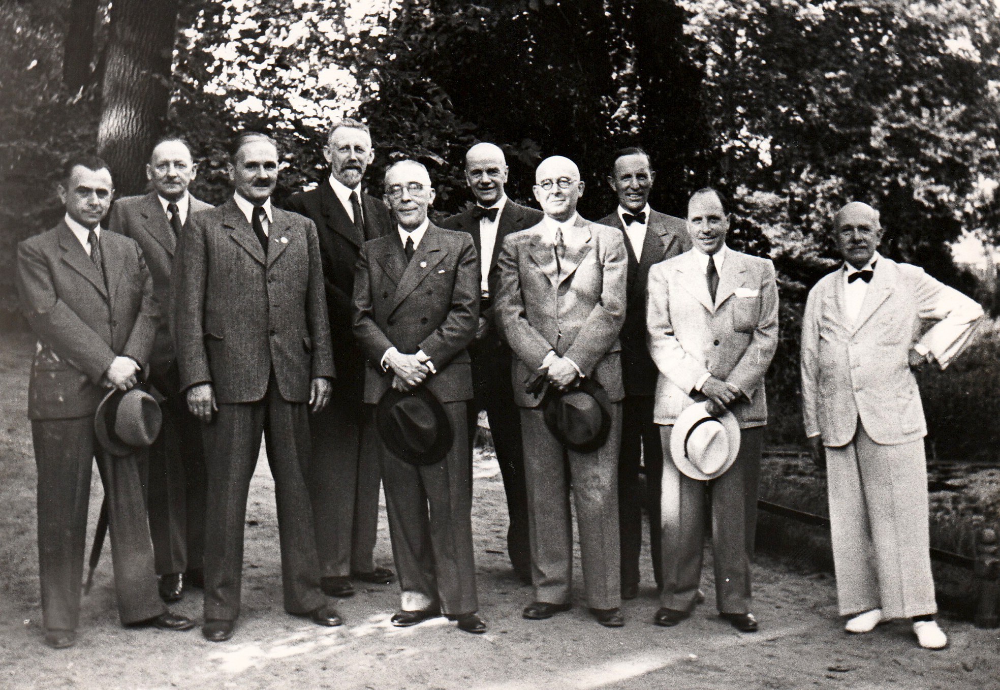

<figcaption>

_The supervisory board of the Zoological Garden Berlin AG on a visit to the zoo. Lutz Heck (third from the left), Eugen Fischer (fourth from the left) und Oskar Heinroth (first from the right.). (AZGB. All rights reserved.)_

</figcaption>

</figure>

The zoo's staff, like that of many large companies in Berlin, was also 'Nazified' within a few weeks. Workers’ councils were replaced by appointed representatives and the staff band played in front of a portrait of Hitler, a swastika and the symbol of the German Labour Front, the National Socialist organization that was to replace the free trade unions.

<figure>

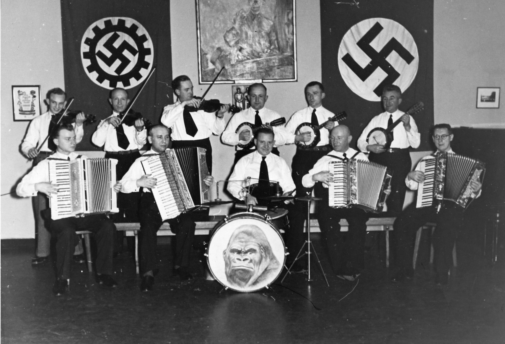

<figcaption>

_The zoo band, 1938. (AZGB, Photo Springer. All rights reserved.)_

</figcaption>

</figure>

## The Zoo and Propaganda

Financially, the zoo flourished with the rise of National Socialism. This was facilitated by the fact that it catered to National Socialist visitors and the ruling nationalist ideology. From May 1933, there were substantial reductions in the price of admission for members of National Socialist organizations, such as the NSDAP, the National Socialist Motorist Corps, the Sturmabteilung (SA), the Schutzstaffel (SS), and the German nationalist military organization Der Stahlhelm. [^12] The following year, the zoo management went on to lower prices for all visitors, "in accordance with the aims of the National Socialist state leadership."[^13] In 1935, likely thanks in part to an agreement with the Nazi recreational organization Kraft durch Freude, it was able to record a large influx of visitors.

<figure>

 

<figcaption>

_Entry ticket for "Kraft durch Freude" Day at the zoo, 1936. (AZGB. All rights reserved.)_

</figcaption>

</figure>

For his part, Lutz Heck put the political climate to use for his colonial revisionist ambitions. He sponsored a "Colonial Art Exhibition" in the exhibition halls at the zoo in 1933, where he displayed a replica of his trapping expedition encampments in eastern Africa.[^14] In 1927/28, his trappings for the zoo had included giraffes from the former German colony of German East Africa, the territory of Tanganyika subsequently ruled by the British. In the summer of 1934, the zoo held a "Kolonialer Volkstag", a "Colonial Day for the People", to commemorate colonialism. In a tour for the press, reporters were taken to see "German Colonial Animals" – meaning animals from former German colonies. In 1937, the zoo celebrated a "Colonial Festival" under a slogan proclaiming "Everyone in Africa once."[^15]

In time for the 1936 Summer Olympics in Berlin, the zoo opened a 2000-square-metre lion steppe - a crowd magnet. In 1936 there were also the many additional tourists who had travelled to Berlin for the Games. They brought the zoo a record attendance of more than two million paying guests.[^16] <!Insert sentence about the zoo’s narrative of financial recovery from „Bobby“ death, once ready!--> **The zoo participated in the elaborate propaganda for the Games and provided animals for the Olympic Village where the athletes lived.** Native waterfowl and fallow deer from the zoo frolicked around a central pond there.

In August 1935, the zoo was finally granted an extension to its grounds on the edge of the Tiergarten park, at the behest of Prussian Prime Minister Hermann Göring. The police and the Reiter-SA (Sturmabteilung) had objected at first, as the extension would restrict a bridle path, but in the end, Goering's wish was fulfilled.[^17] On the new strip of land, Heck settled "native animal species" in large enclosures. In addition to "German" predators such as the wolf and the bear, "German birds of prey" such as the eagle and the buzzard were exhibited. The fact that all of these animals were also to be found in neighbouring countries of the German Reich, and that some, like the bear, were no longer extant in Germany at all, was irrelevant for propaganda purposes. Rather, this framing as "German animals" allows itself to be read as legitimisation of the expansionist policies of the National Socialists.[^18] Native livestock were displayed in a replica farm barn. These, too, were instrumentalised for propaganda purposes: the presentation was intended to show that humans and animals had supposedly lived "intimately" with each other on the "older German homesteads."[^19] The rustic architecture in the style of northern German farmhouses was a "propagandistic sign of a connection to the peasant class and the native soil. The gable [of a barn] honoured the 'Führer's' concern for the German farmer in a carved banderole. The blood-and-soil ideology [was] unmistakable here."[^20]

<figure>

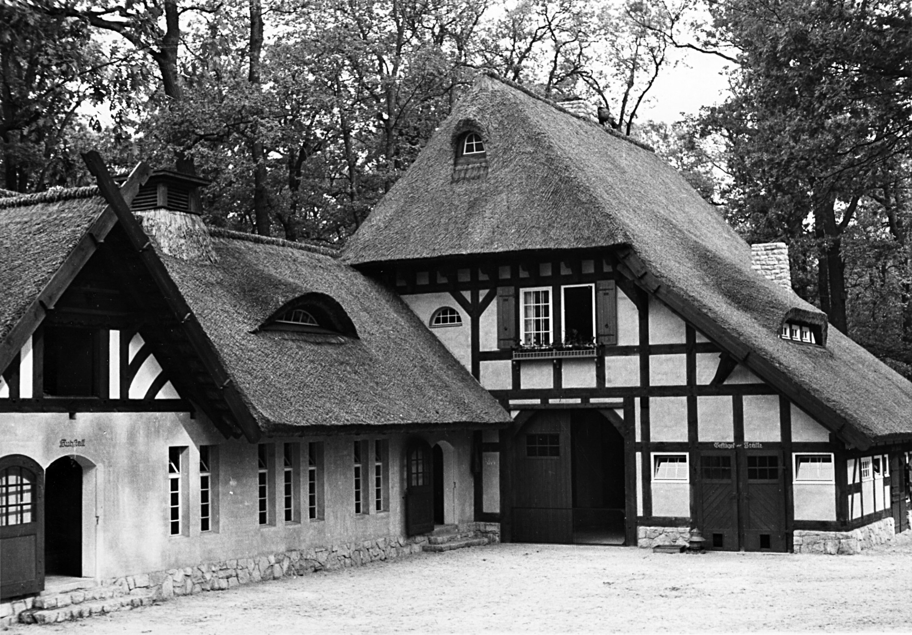

<figcaption>

_"Lower Saxon farmhouse with barn" in the Berlin Zoo, 1937. (AZGB. All rights reserved.)_

</figcaption>

</figure>

The zoo had previously been organized strictly according to taxonomic principles, see also [[theme.taxonomical orders]]. For the first time, now, an area was created in the zoo grounds that corresponded to the previously rejected idea of a 'geozoo'. Instead of being arranged according to outwardly recognizable relationships, the geographical perspective became a guiding principle. These collections of animals that shared a natural space, which had been rejected in Berlin until that point, were introduced in the zoo in the course of National Socialist propaganda. At the centre of the "German Zoo", as this section was henceforth dubbed in the zoo's publications, stood the enclosure for a special species of cattle - the so-called aurochs. This species is considered the progenitor of all European breeds of domestic cattle. However, the last specimen of this species had already died out in the 17th century. Lutz Heck and his brother Heinz, director of the Munich Zoo Hellabrunn, tried to resurrect these animals by cross-breeding different species of cattle.[^21]

<figure>

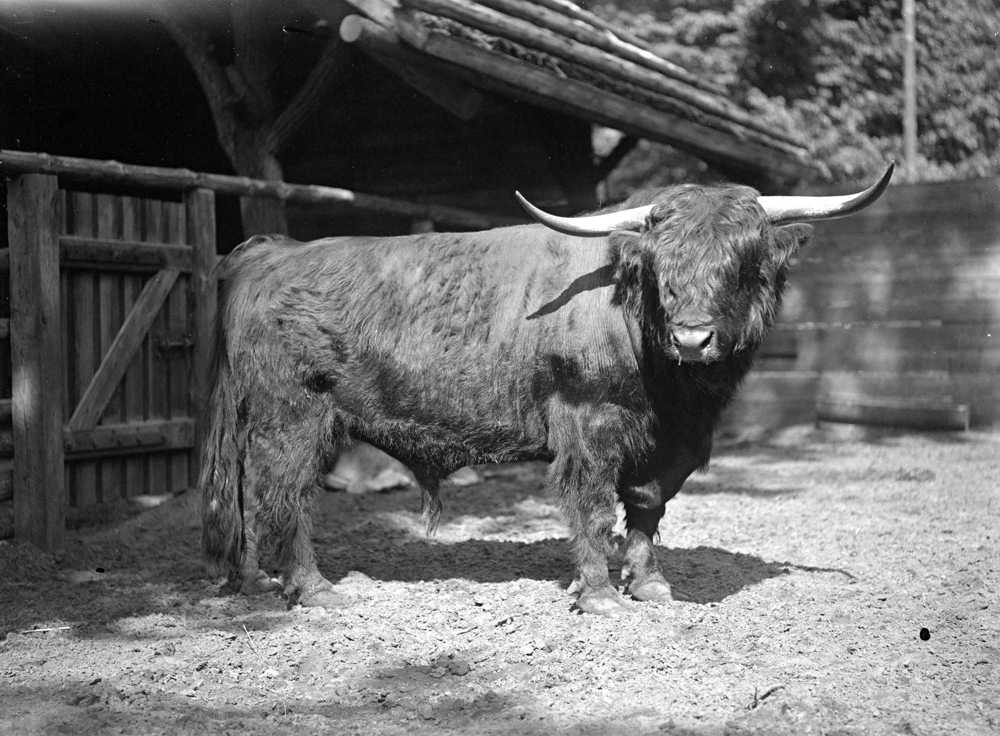

<figcaption>

_One of the cattle resulting from Lutz Heck's backbreeding efforts, around 1930. (AZGB. All rights reserved.)_

</figcaption>

</figure>

The aim was to create an original German animal that would be "a true symbol of German strength and courage."[^22] In his publications, Heck repeatedly referred to the Nibelungenlied, which also features Siegfried's hunt for aurochs.[^23] The Heck brothers failed. They lacked genetic material, so that they achieved at most a lookalike breed, in which the external characteristics of the animal species were reproduced approximately. The attempt was considered unscientific by many of their colleagues even then, and is still widely viewed as unscientific today. **For propaganda purposes, however, Lutz Heck was able to use his "aurochs" to serve National Socialist ideas with cattle as well.**

The alignment with National Socialist propaganda paid off for Lutz Heck. On 1 May 1937, immediately after the admission ban of 1933 was lifted, Lutz Heck became a member of the NSDAP.[^24] This was only possible for aspirants who had rendered outstanding services to the party despite their lack of membership. In the summer of 1938, Reichsforstmeister Göring furthermore appointed him head of the Oberste Naturschutzbehörde, the highest nature conservation authority in the Reich.[^25]

## Jewish Shareholders and Visitors

The adoption of National Socialist and racist policies by the zoo management also had consequences for the Jewish people who supported the zoo as visitors and shareholders. **The rapidly increasing disenfranchisement of Jewish Germans that began in 1933, with Berufsverboten – occupational bans – and expropriations, forced them to liquidate their assets for bare survival. Escape from Germany was often only possible through the expenditure of great financial resources. Shares in the zoo thus also had to be sold.**

However, the zoo shares had never been speculative stocks. Profit distributions were not foreseen. Free admission for family members functioned, in a manner of speaking, as the 'dividend' of the shareholders. But of course the price of a zoo share fluctuated over the years and a sale could result in profits or losses. For many Jewish Berliners, shares in the zoo, which had often been in the family for decades, were of great sentimental value. They were associated with a long tradition of Jewish patronage in Berlin, which demonstrated the shareholders’ belonging in the Berlin bourgeoisie. Many visited the zoo regularly, some even daily.[^26] Some Jewish shareholders had still been able to find buyers for sales at market price before 1938. However, the increased supply of shares for sale, and the forced situation of the sellers increasingly caused prices to fall.

According to the statutes of the shareholders’ association, there were no legal controls over who bought the shares, nor did the zoo have to consent to a sale. Although the zoo shares were registered shares, since they were associated with a right of admission, registration in the zoo's share register always took place only after the sale. This was a thorn in the side of the supervisory board. In the spring of 1938, it therefore planned to give the zoo a right of approval for all sales by amending the statutes. This would have allowed the zoo to exclude Jewish buyers, or to exert pressure on both sides to lower the sales price. The board ultimately refrained from doing so for legal reasons, since the amendment to the statutes would also have affected non-Jewish shareholders, who in turn would have had to give their consent.[^27] In the minutes of the meeting, this was articulated as follows:

>"The proposal of the board of directors to amend § 3 to the effect that the transfer of shares be made dependent on the consent of the company, in order in this way to gradually eliminate the non-Aryans among the shareholders, is, in the opinion of our legal counsel, unfortunately impracticable, because [...] in the case of already existing companies, the consent of all shareholders concerned is required."

In July 1938, however, the supervisory board decided to acquire the legally permitted ten percent of its own shares from Jewish shareholders. After the November pogrom of 1938, the last remaining Jewish shareholders tried to sell their shares. The zoo itself acquired about 100 shares from Jewish owners and passed them on to "Aryan owners."[^28] The few documented interim sales from those months show that the zoo tried to make a profit on these transactions by buying at low cost and selling at a higher price.[^29]

Once Jewish people were virtually excluded from the zoo as shareholders, the supervisory board sought to make them disappear from the zoo as visitors too. At the board meeting of 8 November 1938, SS-Brigadeführer Ewald von Massow, a member of the supervisory board, proposed that Jewish children be banned from playing in the common playground. In addition, the board decided that for the coming Christmas celebrations, notices should be placed on the nativity scene set up in the zoo indicating that Jews were not welcome there.[^30] The minutes of the meeting noted:

>"[...] these signs could then be officially placed at all entrances on 1 January."

The following night, Nazis across Germany murdered hundreds of Jewish Germans and destroyed livelihoods and synagogues in an organized pogrom. The Nazis blamed German Jews for this planned and centrally coordinated violence. The Berlin police chief banned them from visiting places of entertainment in the days that followed. The measures planned by the zoo management anticipated official governmental policy. The zoo, which had always identified itself as an educational institution, excluded this group of visitors, defined by racist ideology and persecution as not belonging to the 'Volk'.

## The Zoo during the War

The consistent accommodation of National Socialist policies was to pay off for the Berlin Zoo director and his zoo during the war. His privileged status was made clear, for example, by the fact that at the beginning of the war, the zoo was classified as 'important to the war effort' and thus individual employees could be exempted from military service. **Shortly after the German attack on Poland, Hermann Göring decreed on 14 September 1939 that zoological gardens were to remain open during the war to fulfil their task of providing popular education for the Volk.[^31]** They provided an opportunity for diversion for the population, which was desired by the regime. The extent to which Lutz Heck had influenced Göring in the making of this decision can no longer be reconstructed from the sources.

An air-raid shelter for visitors and employees was built under the borders at the Elephant Gate entrance in the middle of the promenade.[^32] From the spring of 1941 onward, there was also the mighty air defence tower 'Zoobunker' to the north of the zoo, which could provide shelter for several thousand people.

<figure>

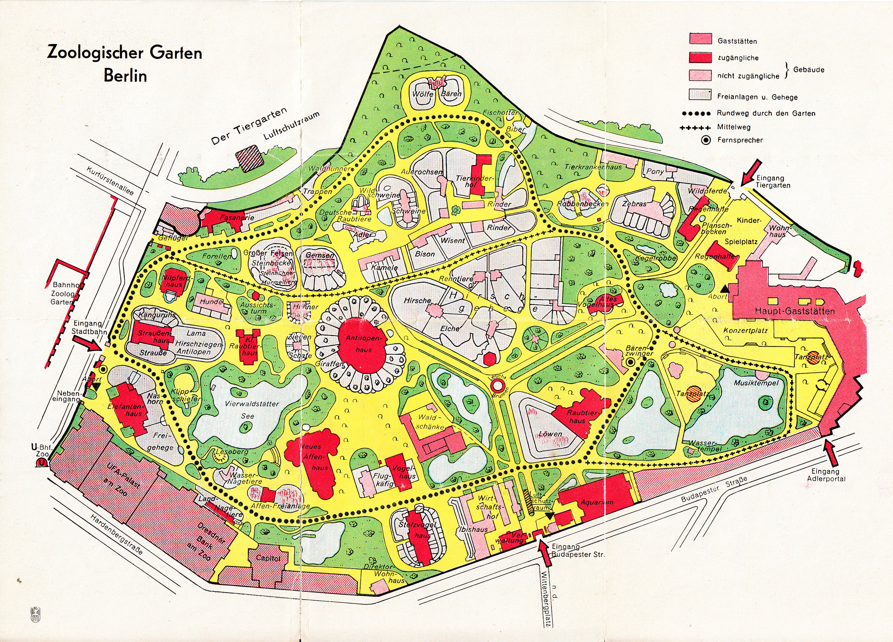

<figcaption>

_Site plan of the zoo around 1940. Air raid shelters are marked at the south entrance on Budapester Straße, at the Elephant Gate, and to the northwest of the zoo. (AZGB. All rights reserved.)_

</figcaption>

</figure>

The new Steinbockfelsen, or Ibex Boulder, completed in 1938, had been constructed from the outset so that the interior could be used as an air-raid shelter. However, it was not considered gas-tight and therefore not officially used as such.

<figure>

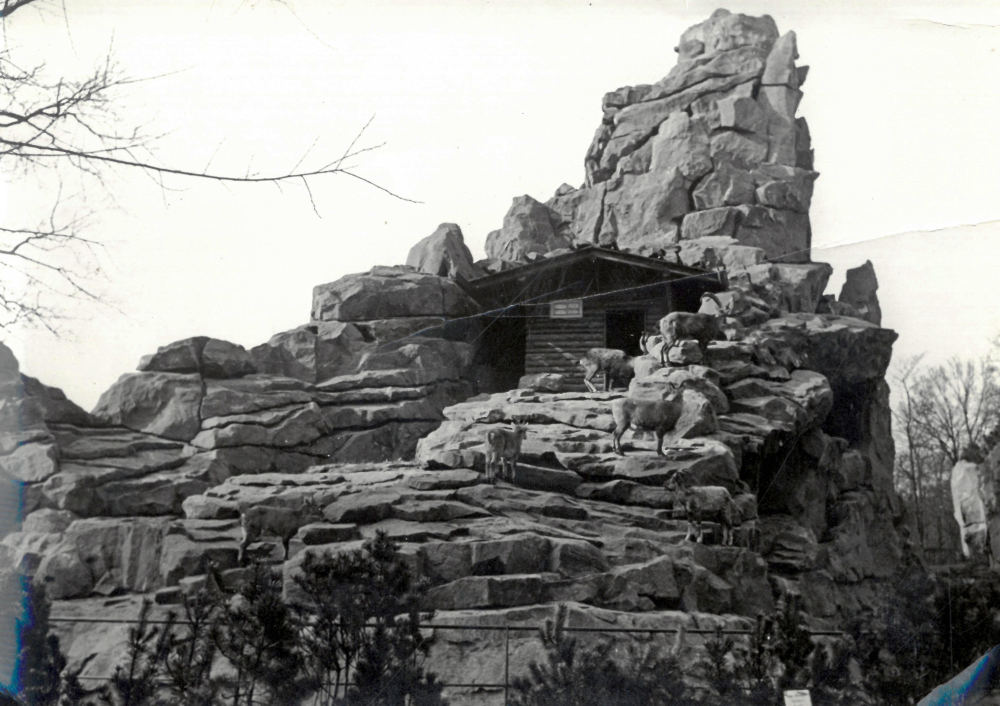

<figcaption>

_An air-raid shelter for 150 people was planned for construction under the Steinbockfelsen, built in 1938. (AZGB. All rights reserved.)_

</figcaption>

</figure>

In addition, contingency plans were developed to capture or kill escaping animals in the event of a bombing. A zoo fire department, consisting of employees, was established. Lookouts in earth bunkers were to intervene armed with nets and rifles in case animals escaped during a bombing raid. These emergency plans were later adopted by other zoos. In Berlin, they were the reason that no predators or other animals considered dangerous escaped or were killed precautionarily. Accounts of zoo animals running across the Kurfürstendamm can be safely relegated to the realm of myth.[^33] In the London Zoo, whose population suffered under German bombing during the Blitz, poisonous snakes and spiders were killed as a precaution, and similar measures were adopted. Here, the predators were to be shot in the event of an escape. In this respect, aerial warfare against the civilian population not only meant that zoo animals previously perceived as safe once again became potentially wild and dangerous animals.[^34] The war led above all to a paradoxical reversal or extension of function for the keepers: to the curative aspect of their work was added, under the conditions of war, a potentially lethal one. Ideological warfare intruded into the relationship between caregivers and those they were tasked with caring for. <!--Insert link to theme.care once ready! -->

Other zoos, however, did not enjoy the same protections. **According to Antonina Zabinska, the wife of Warsaw Zoo director Jan Zabinski, Lutz Heck came to Warsaw immediately after the city’s occupation and ordered the most beautiful animals to be transferred to other zoos in the Reich’s territory.** He then initiated the liquidation of the Warsaw Zoological Garden on behalf of the Nazi regime.[^35]

<figure>

<figcaption>

_Excerpt from the annual report of 1939. (AZGB. All rights reserved.)_

</figcaption>

</figure>

The zoo also looted the spoils of war from other sources from 1939 onward. Polish Konik, or "Panje horses", came from the SS (Schutzstaffel) in 1940. As in their efforts with aurochs, Lutz Heck and his brother Heinz Heck, the zoo director in Munich, tried to crossbreed the extinct horse genus of the tarpans.[^36]

<figure>

![Print in Gothic lettering: … Wir erhielten an wertvollen Geschenken von der Wehrmacht: 1 Wildziege, 1 Dachs und 1 Gänsegeier von der Insel Kreta durch den General der Flieger Andrae, aus der Gegend von Smolensk 13 Marderhunde und von einem Transportgeschwader 1 Karpathenbär. Vom Forstamt Nieswicz wurden uns 2 Wölfe und 1 Kolkrabe überbracht. Außerdem überließ uns die Wehrmacht Rehe, Waschbären, verschiedene Affen, Raubvögel und Hauspfauen. Aus privater Hand wurden uns 1 Weißohräffchen, Burunduks und einige Papageien überlassen.](images/cmw/Kriegsbeute_GB.jpg)

<figcaption>

_Excerpt from the annual report of 1942. (AZGB. All rights reserved.)_

</figcaption>

</figure>

By 1941, Lutz Heck had risen to the position of head of the nature conservation department of the Reichsforstamt, or Reich Forestry Authority. After the German attack on the Soviet Union, this agency, under his leadership, participated in a coordinating capacity in the clearing of the last remaining European primeval forest of Białowieża. This was accompanied by pogroms. **Reichsjägermeister Hermann Göring intended the area for extensive hunting grounds for bison, and the 'aurochs' yet to be reintroduced. Hundreds of Jewish people were murdered in the course of these removals, thousands of non-Jewish Poles were displacecd.** Lutz Heck likely had horses stolen here too. This is at least suggested by the fact that after the end of the war, Polish researchers in Berlin searched for the stolen horses called Koniks.[^37]

<figure>

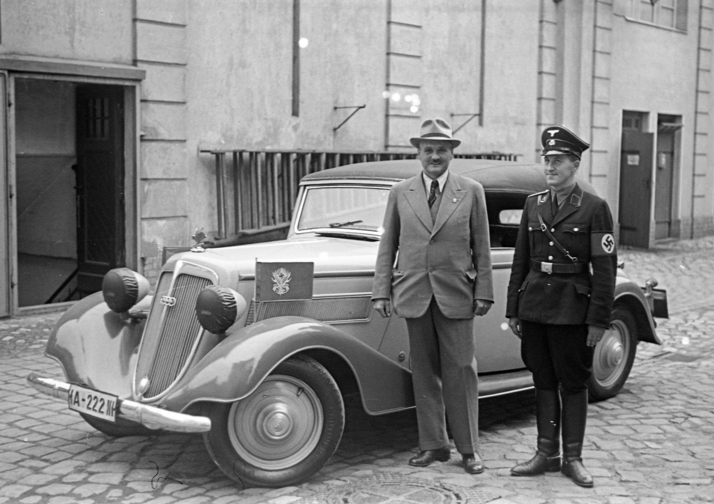

<figcaption>

_Lutz Heck (left) and probably his driver in front of the service vehicle of the Reichsjagdamt, or Reich Hunting Authority, 1939. (AZGB. All rights reserved.)_

</figcaption>

</figure>

Although the zoo was explicitly supposed to remain open, it was, like all other zoos in the Reich’s territory, affected by the conscription of employees to the Wehrmacht. To replace the workforce, the zoo exploited first Polish and French, and later probably also Soviet, prisoners of war and civilians as forced labourers from 1940 onwards.[^38] A speech given by the administrative director at a shareholders' meeting suggests that Lutz Heck himself had six young men deported to Berlin to serve as forced labourers during a visit to Białowieża in 1941.[^39] Evidence also indicates that an unknown number of so-called Ostarbeiter, workers from the east, were exploited at the zoo in the late summer of 1941. These were people lured or kidnapped from the occupied Soviet Union to Berlin under false pretences. At least one Dutch prisoner performed forced labour at the aquarium. In the last year of the war, 40 so-called Italian military internees – Italian soldiers interned after Italy’s surrender – were added to this. In 1943, plans were made to build a barracks at the zoo for approximately twelve forced labourers. Several hundred Soviet prisoners of war from the district of Berlin were also deployed at the zoo during the clean-up work after the bombing raids in the winter of 1943/44. **We know little about the living conditions of those who were forced to work at the zoo.** The use of forced labourers in other German zoos is also documented, but it seems likely the zoo in the Reich's capital city was particularly well-supported by the assignment of forced labour.[^40]

The zoo benefited variously from the networks of the director and supervisory board. which were cultivated throughout the war. As pictures in the zoo archives show, Hermann Göring visited the Berlin Zoo as late as 1942.

<figure>

<figcaption>

_Hermann Göring (centre, light coat) on a visit to the Berlin Zoo in 1942, speaking with Lutz Heck (centre, dark coat). (AZGB. All rights reserved.)_

</figcaption>

</figure>

The zoo was also supported by the regime in matters concerning animal feed. From his workplace at the Reichsforstamt in Berlin, Lutz Heck coordinated the supply of feed to zoos throughout the Reich. He was extremely successful in this endeavour: up until the last months of the war, ocean fish were still being supplied for rare seabirds and seals.[^41] 

## Destruction

On the night of 23 November 1943, an Allied bombing raid turned the zoo into a sea of flames, and killed 30 percent of the remaining animals.[^42]

<figure>

<figcaption>

_[[Liste der getöteten Tiere|material.list dead animals]], 1943. (AZGB. All rights reserved.)_

</figcaption>

</figure>

The aquarium was destroyed the following night. A bomb struck in the middle of the central crocodile hall. Through broken aquarium glass, large quantities of water washed the animals down to the street and the adjacent zoo grounds. The cold-blooded reptiles and snakes immediately froze in the cold November night. Some caimans could still be recovered alive on the first floor. Oskar Heinroth and the remaining staff tried to keep them alive in the boiler room, but failed in their efforts. In the zoo itself, animals had also escaped from their enclosures due to bomb damage. The prepared protective measures were put into effect. Capture teams picked up the animals or killed them.

<figure>

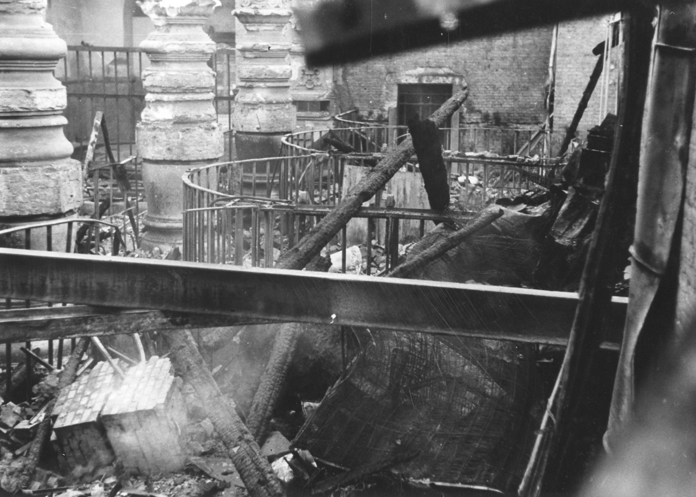

<figcaption>

_Interior of destroyed Elephant enclosure, in which seven elephants died, 1943. (AZGB. All rights reserved.)_

</figcaption>

</figure>

Hundreds of forced labourers cleared the zoo of debris.[^43] Six months later, the zoo reopened in time for its centennial on 25 July 1944. As many as 5.000 people were allowed into the zoo at any one time during opening hours in the summer and autumn of 1944. A total of 250.000 visitors came to marvel at what was still more than 1.500 animals.[^44] In the event of an air raid alert, visitors were to be evacuated to the enormous air defence tower on the northern edge of the zoo.[^45]

Nevertheless, on 22 April 1945, it all finally came to an end. All male employees were drafted into the Volkssturm national militia. They had to dig trenches through the zoo grounds. Shortly before Soviet troops reached the zoo, the senior management team surrounding Lutz Heck fled on 30 April.[^46] For 48 hours, the fierce battle for the neighbouring air defence tower also raged at the zoo. On 2 May, the battle for the city centre and the zoo ended. Corpses and animal carcasses  lay everywhere; between 80 and 90 animals had survived.[^47]

<figure>

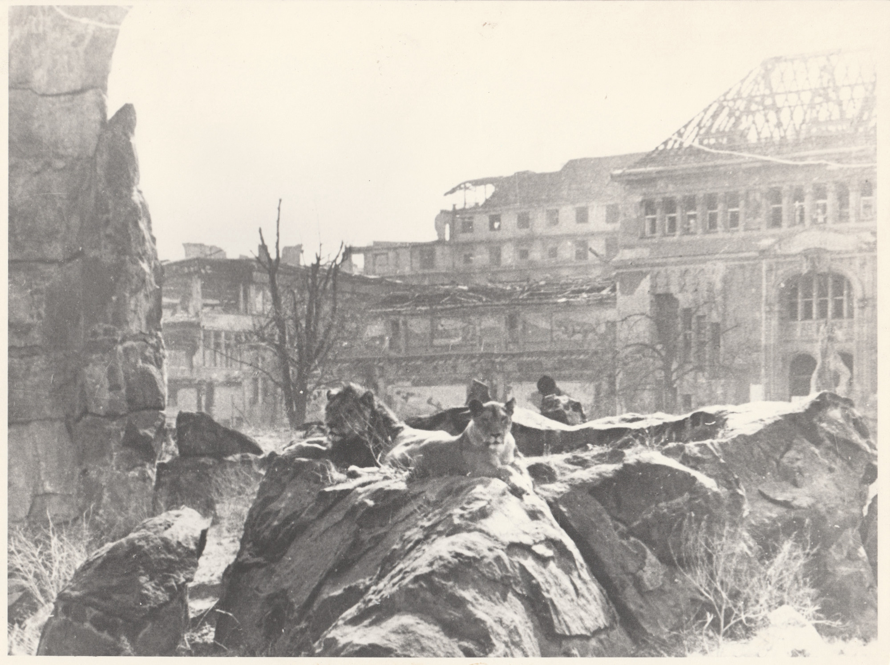

<figcaption>

_ The zoo's surviving lions lie in their outdoor enclosure against the backdrop of the destroyed aquarium, 1945. (AZGB. All rights reserved.)_

</figcaption>

</figure>

At the end of National Socialist rule, the zoo was no longer – materially, but also in its internal constitution – the zoo that had been in development from its origins until 1933. **The example of the Berlin Zoo under National Socialism shows how much the zoo as an institution can be shaped and instrumentalised under the pressures of political circumstance.** The exhibition of live animals at the Berlin Zoo provided ample material for the propaganda of the Nazi regime and served its aims in various ways.

Zoos certainly allow themselves to be adapted for other kinds of regimes and social forms - even if these adaptations have been and are more subtle and less pronounced. During the Cold War, the Berlin Tierpark served the East Berlin Magistrate and the SED-regime as an instrument of cultural diplomacy in the contested international recognition of the GDR, and as an internationally recognised demonstration of socialist educational and scientific policy. As in the days when zoos were founded in the 19th century, a zoo in itself served as a feature of a capital city – or in this case half of a capital city. The West Berlin zoo director could count on West German politics to be invested in the zoo's appeal to the enclosed western half of the city.[^48] Today, zoos position themselves as centres of species conservation in liberal societies increasingly concerned with biodiversity. However, the exploitation of the institution of the zoo exclusively for one's own political purposes, as achieved by the National Socialist regime, has never been attempted or attained to the same extent since.

[^1]: Cf., for instance, Heck, Ludwig. _Heiter-ernste Lebensbeichte. Erinnerungen eines alten Tiergärtners_. Berlin: Deutscher Verlag, 1938: 373; Heck, Lutz. _Der deutsche Edelhirsch. Ein Lebensbild mit photographischen Naturaufnahmen aus der Wildbahn_. Berlin: Paul Parey, 1935. Direct quotes have been translated into English for clarity’s sake.

[^2]: Curriculum Vitae Lutz Heck for the Reichsschrifttumskammer, Bundesarchiv Berlin (BArch), R 9361, V, 5953.

[^3]: Heck, Lutz. _Waidwerk mit bunter Strecke. Jagd in heimischen Revieren_. Hamburg, Berlin: Parey, 1968: 67.

[^4]: Cf. Maier-Wolthausen, Clemens. _Hauptstadt der Tiere. Die Geschichte des ältesten deutschen Zoos_. Ed. by Andreas Knieriem. Berlin: Ch. Links Verlag, 2019: 111-113.

[^5]: Cf. Lutz Heck. _Auf Urwild in Kanada_. Berlin: Paul Parey, 1937. Direct quotes have been translated into English for clarity’s sake.

[^6]: Cf., inter alia, Heck, Lutz. _Der deutsche Edelhirsch. Ein Lebensbild mit photographischen Naturaufnahmen aus der Wildbahn_. Berlin: Paul Parey, 1935.

[^7]: _Jahrbuch der Fachschaft Deutsche Bracken_, 1935/36.

[^8]: Zoological Garden Berlin, "Alte Tierkartei"; and list of Hermann Göring's lions with offspring, AZGB N 5/13. Direct quotes have been translated into English for clarity’s sake.

[^9]: Minutes of supervisory board meeting, 1933, AZGB O 0/2/2.

[^10]: Zoological Garden Berlin. _Geschäftsbericht des Aktien-Vereins des Zoologischen Gartens zu Berlin_ for the year 1933.

[^11]: Minutes of supervisory board meeting, 1933, AZGB O 0/2/2, and memo for Regierungspräsident Zachariae, GStA PK I. HA Rep. 151, Nr. 2496, Bl. 23; minutes of the general assembly 1934, AZGB O 0/3/2.

[^12]: Minutes of supervisory board meeting, 22.05.1933, AZGB O 0/2/2.

[^13]: Zoological Garden Berlin. _Geschäftsbericht des Aktien-Vereins des Zoologischen Gartens zu Berlin_ for the year 1933. Direct quotes have been translated into English for clarity’s sake.

[^14]: "Der Urwald ruft. Kolonialkunst-Ausstellung im Zoologischen Garten". _Berliner Lokalanzeiger_, 06.04.1933. Direct quotes have been translated into English for clarity’s sake.

[^15]: Press release 29.06.1934, AZGB O 0/1/15; "Sensation im Affenpalmenhaus". _Völkischer Beobachter_, 13.06.1937. Direct quotes have been translated into English for clarity’s sake.

[^16]: Annual reports for the years 1935 and 1936.

[^17]: Correspondence between all parties in GStA PK I. HA, Rep 151, 2500 and minutes of supervisory board meeting, 24.08.1935, GStA PK I. HA, Rep 151, 2496, Bl. 93-94.

[^18]: Reinert, Wiebke, and Mieke Roscher. "Der zoologische Garten als anderer Raum. Hamburger und Berliner Heterotopien". In _Urbane Tier-Räume_, ed. by Thomas E. Hauck, Stefanie Hennecke, André Krebber, Wiebke Reinert, and Mieke Roscher. Berlin: Dietrich Reimer Verlag, 2017: 112. Direct quotes have been translated into English for clarity’s sake.

[^19]: Press tour of domestic animal exhibition, Pentecost 1937, AZGB O 0/1/15. Direct quotes have been translated into English for clarity’s sake.

[^20]: Artinger, Kai. "Lutz Heck: Der 'Vater der Rominter Ure'. Einige Bemerkungen zum wissenschaftlichen Leiter des Berliner Zoos im Nationalsozialismus". _Der Bär von Berlin – Jahrbuch des Vereins für die Geschichte Berlins_ 23 (1994): 125-139. https://www.diegeschichteberlins.de/geschichteberlins/persoenlichkeiten/persoenlichkeitenhn/491-heck.html (24.06.2021). Direct quotes have been translated into English for clarity’s sake.

[^21]: Cf., inter alia. Heck, Lutz. "Über die Neuzüchtung des Ur oder Auerochs". _Berichte der Internationalen Gesellschaft zur Erhaltung des Wisents_ 3, Nr. 4 (1936): 224-294, 235.

[^22]: Heck, Lutz. _Auf Tiersuche in weiter Welt_. Berlin: Paul Parey, 1941: 195. Direct quotes have been translated into English for clarity’s sake.

[^23]: Heck, 1941: 195; and Heck, Lutz. "Letzte Urwaldtiere aus deutscher Vorzeit". _Atlantis. Länder, Völker, Reisen_ 4, Nr. 10 (1932): 577-583; Heck, Lutz. "Die Neuzüchtung des Auerochsen". _Wild und Hund_ 37 (15.12.1939): 535-537. A frieze with a verse of the epic also decorated the stand for the auroch at the international hunting exhibition of 1938. 

[^24]: Membership card at the Berlin document centre of the Bundesarchiv Berlin.

[^25]: Cf. Transcript of Ministerial Director Ebert's Reichsforstamt to Federal Director of the Reichsbund für Biologie, the Reich Association for Biology, Dr. W. Greite, 05.02.1941, BArch, NS 21/1543; minutes of supervisory board meeting, 19.07.1938, AZGB O 0/2/2.

[^26]: Monika Schmidt has collected the family histories and persecution stories of many Jewish zoo-shareholders. She repeatedly came across these traces of a bourgeois pride in the ownership of zoo shares. Schmidt, Monika. _Die jüdischen Aktionäre des Zoologischen Gartens zu Berlin: Namen und Schicksale_. Berlin: Metropol, 2014.

[^27]: Minutes of supervisory board meeting, 29.03.1938, AZGB, O 0/2/2. Direct quotes have been translated into English for clarity’s sake.

[^28]: Minutes of supervisory board meetings, 19.07.1938 and 16.12.1938, AZGB O 0/2/2. Direct quotes have been translated into English for clarity’s sake.

[^29]: Cession papers in the archive of the Zoological Garden Berlin.

[^30]: Minutes of supervisory board meeting, 08.11.1938, AZGB O 0/2/2. Direct quotes have been translated into English for clarity’s sake.

[^31]: Minutes of supervisory board meeting, 16.12.1939, AZGB O 0/2/2.

[^32]: Construction drawings and building petitions for air raid shelters, LAB, A Rep. 032-08, Nr. 293; cf. also Heck, Lutz. _Tiere – mein Abenteuer. Erlebnisse in Wildnis und Zoo_. Wien: Ullstein 1954: 97-102; Speech of L. Heck at general assembly, 1940, AZGB O 0/3/13; note on the annual report for the year 1941, AZGB O 0/3/12.

[^33]: Cf. Maier-Wolthausen, Clemens. _Hauptstadt der Tiere. Die Geschichte des ältesten deutschen Zoos_. Ed. by Andreas Knieriem. Berlin: Ch. Links Verlag, 2019: 118-129.

[^34]: Wöbse, Anna-Katharina, and Mieke Roscher. "Zootiere während des Zweiten Weltkrieges: London und Berlin 1939-1945". _WerkstattGeschichte_, Nr. 56 (2010): 44-62, 50.

[^35]: Bruce, Gary. _Through the Lion Gate. A History of the Berlin Zoo_. Oxford: Oxford University Press, 2017: 164, with reference to the memoirs of the zoo director’s wife, Antonina Zabinska.

[^36]: Minutes of supervisory board meeting, 30.07.1940, AZGB O 0/2/2.

[^37]: Cf. Gautschi, Andreas. _Der Reichsjägermeister. Fakten und Legenden um Hermann Göring_. Melsungen: Nimrod, 2010; Rubner, Heinrich. _Deutsche Forstgeschichte, 1933-1945. Forstwirtschaft, Jagd und Umwelt im NS-Staat_. St. Katharinen: Scripta Mercaturae, 1997; copy of the agreement between the headquarters of the Reichskommissar für die Festigung deutschen Volkstums, the Reich Commissioner for the consolidation of German nationalism, and the Reichsforstmeister as Oberster Naturschutzbehörde, head of the highest nature conservation authority, on the implementation of the discussion of 20 March 1942, 11.05.1942, BArch, R 49/2066; correspondence with the British Commandant Tiergarten Lt. Col. Nunn in December 1945, AZGB S 15/17; old animal index card, index card "Panjepferde".

[^38]: There is no evidence that women were also exploited as forced labourers at the zoo, so what follows speaks only to what is known of male forced labourers .

[^39]: Minutes of general assembly, 1942, AZGB O 0/3/12.

[^40]: Cf. Maier-Wolthausen, Clemens. _Hauptstadt der Tiere. Die Geschichte des ältesten deutschen Zoos_. Ed. by Andreas Knieriem. Berlin: Ch. Links Verlag, 2019: 126-127.

[^41]: Circular letter L. Heck to the zoological gardens, 22.02.1945; and Fisch-Grosshandel H. D. Petersen to L. Heck, 08.03.1945, AZGB O 0/1/88.

[^42]: List in AZGB O 0/1/54.

[^43]: Copy of Lutz Heck’s report to the supervisory board, January 1944, AZGB O 0/1/54.

[^44]: L. Heck: Memo concerning opening on 25.7.1944, AZGB O 0/1/50; recollections of Elisabeth Johst, AZGB S 15/27.

[^45]: Recollections of Elisabeth Johst, AZGB S 15/27; K. Heinroth to W. Keller, 18.09.1945, AZGB O 0/1/87; K. Heinroth to G. Freytag, 03.01.1946, AZGB O 0/1/86.

[^46]: Recollections of Elisabeth Johst, AZGB S 15/27; K. Heinroth to W. Keller, 18.09.1945, AZGB O 0/1/87; K. Heinroth to G. Freytag, 03.01.1946, AZGB O 0/1/86. 

[^47]: K. Heinroth: "Kriegszerstörungen und Aufbau von 1945 bis 1956 im Berliner Zoologischen Garten", typewritten manuscript, AZGB N 4/2.

[^48]: Cf. to this Maier-Wolthausen, Clemens. _Hauptstadt der Tiere. Die Geschichte des ältesten deutschen Zoos_. Ed. by Andreas Knieriem. Berlin: Ch. Links Verlag, 2019: 162-169, 206-211; Maier-Wolthausen, Clemens. "Ein Zoo für die Hauptstadt". _Aus Politik und Zeitgeschichte_ 71, Nr. 9 (2021): 11-17, 14-15; Mohnhaupt, Jan. _Der Zoo der anderen. Als die Stasi ihr Herz für Brillenbären entdeckte & Helmut Schmidt mit Pandas nachrüstete_. München: Carl Hanser, 2017; and Maier-Wolthausen, Clemens. _Alphamännchen und Herdentiere. Deutsch-deutsche Beziehungen in Tierpark und Zoo Berlin_. Vorauss. Berlin: Reimer, 2022.

:::DE:::

**Clemens Maier-Wolthausen**

Nachdem Adolf Hitler am 30. Januar 1933 zum Reichskanzler ernannt worden war, versuchte das neue Regime mit aller Macht sämtliche Gesellschaftsbereiche zu Durchdringen. Es ging ihm dabei um die Kontrolle im arbeitsrechtlichen, insbesondere aber im kulturellen und propagandistischen Sinn. Von dem Anspruch dieser umfassenden Kontrolle war auch der besucherstärkste Bildungs- und Freizeitbetrieb Berlins, der Zoologische Garten und sein Aquarium, nicht verschont. Die Anpassung an die Politik der Nationalsozialisten und ihrer lokalen Vertreter, des Gauleiters der Nationalsozialistischen Deutschen Arbeiterpartei (NSDAP) Joseph Göbbels und des nationalsozialistischen preußischen Ministerpräsidenten Hermann Göring ging im Zoo rasch voran. Das lag nicht zuletzt an der Zooleitung und Mitgliedern des Aufsichtsrats. Wie zu sehen sein wird hatte dieses Auswirkungen auf alle Bereiche des Zoobetriebs - die Leitungsebene und das Publikum wurde in die antisemitische Politik einbezogen, der deutsche Angriffs- und Vernichtungskrieg brachte neue Tierquellen, die Ausstellungspraxis und das 'Programm' der ausgestellten Tiere änderten sich, Arbeitsabläufe wurden durch den Krieg verändert. Die Ausbeutung von Zwangsarbeitern wurde auch im Zoo Alltag.

## Die Familie Heck

1932 wurde [[material.Lutz Heck]]  Direktor des Zoologischen Gartens Berlin. Er übernahm das Amt von seinem Vater [[material.Ludwig Heck]], der dieses seit 1888 innegehabt hatte (Siehe [[story.Short History Zoo]]) gewesen. Unter Ludwig Hecks Ägide wurde zwischen 1911 und 1913 unter der Leitung von [[material.Oskar Heinroth]] das Aquarium gebaut. Die Familie Heck war deutschnational und kolonialistisch ausgerichtet und pflegten enge Kontakte in das rechtskonservativ-nationalistische Milieu. Es scheint, als hätten Vater und Sohn die Machtübernahme der Nationalsozialisten begrüßt. Beide huldigten in ihren Publikationen dem "Führer", der den Staat "vollbewusst […] auf Blut und Boden abgestellt" habe.[^family1] Bereits im Juni 1933 wurde Lutz Heck ein Fördermitglied der Schutzstaffel (SS).[^family2] Fördermitglieder unterstützten die Parteiorganisation SS der NSDAP unter Heinrich Himmler mit regelmäßigen Spenden. Im Gegenzug bekamen sie Anstecknadeln für das Revers, mit dem sie ihre Loyalität zum Regime bekunden konnten.
Schon bald machte Lutz Heck zudem auf privater Ebene mit dem preußischen Ministerpräsidenten und Reichsluftfahrtminister, ab 1934 auch "Reichsforstmeister" und "Reichsjägermeister" [[material.Hermann Göring]] Bekanntschaft. Seit der ersten Begegnung 1933 im Staatsjagdgebiet Hubertusstock in der [[material.Schorfheide]] schmiedeten Göring und Heck Pläne für die Auswilderung von Wisenten, auch um den Jagddrang des neuen zweiten Mannes im Staate zu befriedigen.[^family3] Lutz Heck bot sich dem Regime in jeglicher Form an. Seine Bücher und Veröffentlichungen priesen die Gesetzesbeschlüsse des NS-Staates in Bezug auf den Wildschutz.[^family4] 1935 unternahm er "im Auftrage des Reichsforst- und Reichsjägermeister[s] Hermann Göring, der deutschen Jägerschaft und des Zoologischen Gartens" eine Expedition nach Kanada.[^family5] Göring wurde auf Hecks Betreiben zum Führer der 'Fachschaft Deutsche Bracken Olpe', eines Zuchtvereins für Jagdhunde, ernannt.[^family6] Sicherlich eine Randnotiz, aber dennoch geeignet, den passionierten Jäger Göring für sich einzunehmen. Zudem stellte Lutz Heck  Göring junge Löwen als Haustiere zur Verfügung, die er zurücknahm, wenn sie dem "Streichelalter" entwachsen waren.[^family7]

Etwa zur gleichen Zeit begann der Zoodirektor auf Wunsch Hermann Görings mit der Intensivierung der Wisentzucht. Göring hatte im Januar 1934 im Kreise einiger Forstbeamten seine Pläne für die Schorfheide vorgestellt. Hier wollte er ein großes Naturschutzgebiet einrichten, in dem er zugleich das größte Landsäugetier Europas jagen wollte. Lutz Heck entschied sich, mittels einer 'Verdrängungszucht' mit dem nächsten Verwandten des Wisents, dem nordamerikanischen Bison, seine Herde aus dem Zoo möglichst schnell zu vermehren, um Görings Pläne Wirklichkeit werden zu lassen.[^family8]

## Der Aufsichtsrat

Auch die judenfeindliche rassistische Politik der NSDAP wurde ab 1933 im Zoo umgesetzt. Bereits 1933 legten die zwei langjährigen Aufsichtsratsmitglieder Georg Siegmann und Walter Simon ihre Ämtern nieder.[^board1] Sie waren ihrer jüdischen Identität wegen, im Aufsichtsrat erniedrigenden Diskussionen ausgesetzt gewesen.[^board2] 

- [ ] Bild von Georg Siegmann gemalt durch Filippo
_Georg Siegmann wurde trotz seiner Verdienste aus dem Aufsichtsrat vertrieben und von den Nationalsozialisten ermordet. (Skizze nach einer Vorlage von Filippo Bertoni)

Freigewordene Plätze im Afsichtsrat wurden in diesen Jahren sogleich mit nationalsozialistischen Kandidaten wie dem  letzten Gouverneur der deutschen Kolonie Togo Adolf Friedrich zu Mecklenburg, SS-Brigadeführer Ewald von Massow oder dem 'Rassenhygieniker' Eugen Fischer besetzt.[^board3] Georg Siegmann und seine Frau Helene wurden über das Lager Theresienstadt nach Auschwitz verschleppt und ermordet. Walter Simon wurde mit seiner Frau nach Riga deportiert, wo beide ermordet wurden.

Der Aufsichtrat der Zoologischer Garten Berlin AG zu Besuch im Zoo, 1942. Lutz Heck (3. v. l.), Eugen Fischer (4. v. l.) und Oskar Heinroth (1. v. r.).

Auch die Belegschaft des Zoos war wie die vieler Großbetriebe in Berlin bald schon 'nazifiziert'. Betriebsräte wurden durch ernannte Obleute ersetzt und bald spielte die Musikkapelle der Angestellten vor Hitler-Portrait, Hakenkreuz und dem Symbol der 'Deutschen Arbeitsfront', jener nationalsozialistischen Organisation, die die freien Gewerkschaften ersetzen sollte.

Die 'Zoo-Musikkapelle', 1938. (AZGB, Foto Springer)

## Zoo und Propaganda

Der Zoo florierte aber auch finanziell nach der Machtübernahme der Nationalsozialisten. Dazu trug bei, dass er sich den zu erwartenden nationalsozialistischen Besucher\*innen und der regierenden nationalistischen Ideologie anbiederte. Ab Mai 1933 gab es substanzielle Ermäßigungen des Eintrittspreises für Mitglieder nationalsozialistischer Organisationen, wie der NSDAP, dem Nationalsozialistischen Kraftfahrerkorps, der Sturmabteilung (SA), der Schutzstaffel (SS) und der deutschnationalen Wehrorganisation "Der Stahlhelm" . Kurz zuvor hatte sich der Zooaufsichtsrat noch gegen Vorschläge, Preisnachlässe aus sozialen Gründen zu gewähren, gesperrt.  Nun ging er darauf ein. Weil man annahm, dass es sich lohnen würde und man sich bei den neuen Machthabern beliebt machen wollte - es Sympathien mit ihnen gab.[^propa1] Im folgenden Jahr senkte die Zooleitung dann die Preise für alle Besucher\*innen, "entsprechend den Zielen der nationalsozialistischen Staatsführung". (Zoologischer Garten Berlin, 1934, Geschäftsbericht für das Jahr 1933) 1935 konnte er wohl auch, dank einer Vereinbarung mit der NS-Freizeitorganisation 'Kraft durch Freude' einen großen Besucheransturm verbuchen

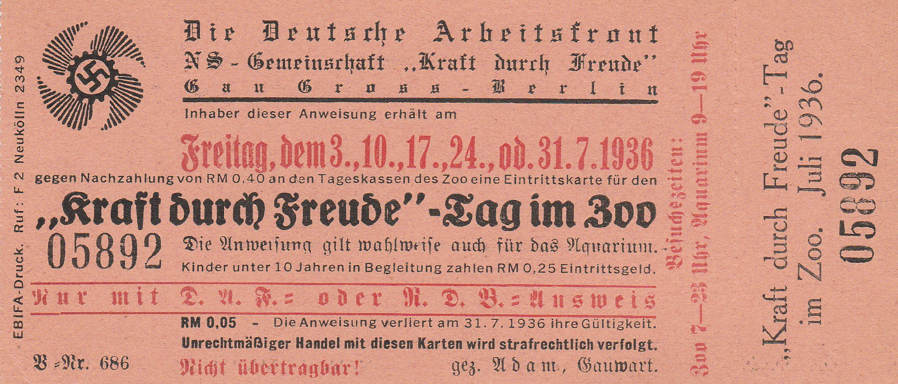
Eintrittskarte für den "Kraft durch Freude"- Tag im Zoo, 1936. (AZGB)

Lutz Heck nutzte seinerseits das politische Klima für seine kolonialen Ambitionen. Er unterstützte eine "Kolonial-Kunst-Ausstellung" in den Ausstellungshallen am Zoo 1933 wo er einen Nachbau des Zeltlagers seiner Fangexpeditionen nach Ostafrika zeigte.[^propa9] 1927/28 hatte er unter anderem Giraffen in der ehemaligen deutschen Kolonie 'Deutsch-Ostafrika', dem nun durch die Briten beherrschten 'Tanganyika-Territory' für den Zoo gefangen. Im Sommer 1934 veranstaltete der Zoo zum 'Kolonialgedenktag' einen "Kolonialen Volkstag". In einer Presseführung wurden die Reporter zu "Deutschen Kolonialtieren" geführt - also Tieren aus den eheamligen deutschen Kolonien, und 1937 feierte der Zoo Kolonialfest unter dem Motto "Jeder mal in Afrika".[^propa10]

Rechtzeitig zu den Olympischen Sommerspielen in Berlin, eröffnete der Zoo eine 2000 qm große Löwensteppe. Diese war an das große Raubtierhaus angebaut worden und bot den Tieren beheizte Liegeplätze und den Besucherinnen einen Blick wie auf eine Bühne mit einer großen Anzahl von Raubtieren - ein Publikumsmagnet. Hinzu kamen 1936 die vielen Berlintouristen, die zu den Olympischen Spielen jenes Jahres kamen. Sie bescherten dem Zoo einen Besucherrekord von mehr als zwei Millionen zahlenden Gästen.[^propa2] Der Zoo beteiligte sich an der aufwendigen Propaganda für die Spiele, indem er Tiere für das Olympische Dorf, in dem die Athletinnen und Athleten lebten zur Verfügung stellte. Rund um einen zentralen Teich tummelten sich einheimische Wasservögel und Damwild. Und größer war der Zoo auch noch geworden.

Im August 1935 wurde ihm auf Initiative des Preußischen Ministerpräsidenten Hermann Göring eine Grundstückserweiterung am Tiergartenrand zugewiesen. Zunächst hatten Polizei und Reiter-SA Einspruch dagegen erhoben, da es den Reitweg am Tiergartenrand einschränken würde. Aber gegen die Macht Görings hatten sie keine Mittel.[^propa3] Auf dem neuen Geländestreifen siedelte Heck in großen Gehegen "einheimische Tierarten" an. Neben "deutschen" Raubtieren wie dem Wolf und dem Bären wurden "deutsche Raubvögel" wie Adler und Bussard ausgestellt. Dass praktisch alle diese Tiere auch in Nachbarländern des Deutschen Reichs vorkamen, und einige, wie der Bär in Deutschland praktisch gar nicht mehr, spielte für den propagandistischen Effekt keine Rolle. (Siehe [[story.native and exotic]]) In einem 'niedersächsischen Bauernstall' wurden einheimische Nutztiere gezeigt. Auch diese wurden propagandistisch instrumentalisiert: die Präsentation sollte zeigen, dass Mensch und Tier auf den "älteren deutschen Gehöften miteinander" angeblich "inniglich" miteinander gelebt hätten.[^haustierhof] gelebt hätten. 

_"Niedersächsisches bauernhaus mit Stall" im 'deutschen Zoo', 1937. (AZGB)_

Im Zentrum des "Deutschen Zoos" stand das Gehege für eine besondere Rinderart - den "Auerochsen" oder "Ur". [[story.Reviving the Aurox]] Diese Art gilt als Stammvater aller europäischen Hausrinderrassen. Allerdings war das letzte Exemplar seiner Sorte im 17. Jahrhundert gestorben. Lutz Heck und sein Bruder [[material.Heinz Heck]], Direktor des Münchner Tierparks Hellabrunn, versuchten diese Tiere aus Kreuzungen verschiedener Rinderrassen wiedererstehen zu lassen.[^propa4]

_Eines der Rinder, die aus den Rückzüchtungen Lutz Hecks hervorgingen, um 1930. (AZGB)_

Lutz Heck ging es darum, ein deutsches Urtier zu erschaffen, das "als echtes Symbol deutscher Kraft und deutschen Mutes" gelten sollte.[^propa5] Er verwies in seinen Veröffentlichungen immer wieder auf das Nibelungenlied, in dem auch Siegfrieds Jagd auf Auerochsen besungen wird.[^propa6] Den Auerochsen aber haben die Brüder Heck nicht wieder zum Leben erwecken. Es fehlte ihnen an genetischem Material, so dass sie sich in einer sogenannten Abbildzüchtung versuchten, in der lediglich die äußerlichen Merkmale einer Tierart näherungsweise reproduziert werden. Der Versuch galt vielen Kollegen schon damals und gilt auch heute weithin als unwissenschaftlich. Propagandistisch nutzte Heck seine "Auerochsen" um sich auch mit Rindern den Nationalsozialisten anbiedern. Am 1. Mai 1937, gleich nach Aufhebung des Aufnahmestopps von 1933, wurde Lutz Heck Mitglied der NSDAP.[^propa7] Im Sommer 1938 ernannte ihn Reichsforstmeister Göring zum Leiter der Obersten Naturschutzbehörde.[^propa8]

Im bislang streng nach taxonomischen Gesichtspunkten (siehe dazu [[taxonmische Ordnungen|theme.taxonomical orders]]) geordneten Zoo entstand nun zum ersten mal im Grunde genommen ein Zooteil der der bis dahin abgelehnten Idee eines 'Geozoos' entsprach. Statt der Ordnung nach, auch äußerlich erkennbaren Verwandtschaftsbeziehungen wurden geografisch Gesichtspunkte hier zum ordnenden Prinzip erhoben. Diese bis dato nach den Panoramagehegen des Hamburger Zoos als "Hagenbeckereien" verschriehenen Sammlungen von Tieren eines Naturraums wurden im Zoo zugunsten der nationalsozialistischen Propaganda eingeführt.

## Jüdische Aktionär\*innen und Besucher\*innen

Die ab 1933 einsetzende und schnell zunehmende Entrechtung von Jüd\*innen zwang diese dazu, nach und nach ihre persönliche Habe zu verkaufen. Einkommensverluste, Berufsverbote, Enteignungen zwangen viele, zum nackten Überleben ihre Anlagen zu liquidieren. Die Flucht aus Deutschland war oft nur unter dem Einsatz großer Finanzmittel möglich. Auch die Zooaktien wurden verkauft.
Nun waren die Zooaktien nie Spekulationspapiere. Gewinnausschüttungen waren nicht vorgesehen. Der freie Eintritt für die Familienangehörigen war die 'Dividende' der Aktionäre. Aber natürlich schwankte der Preis einer Zooaktie über die Jahre durchaus und konnten bei einem Verkauf Gewinne oder Verluste entstehen. Für viele jüdische Berliner\*innen war die oft seit Jahrzehnten in Familienbesitz befindliche Zooaktie von hohem emotionalen Wert. Sie verbanden mit ihr die lange Tradition jüdischen Mäzenatentums in Berlin, die belegte, dass man 'dazu gehörte'. Manche jüdische Aktionär\*innen hatten bei frühen Verkäufen noch Interessenten zu einem realen Preis gefunden. Das erhöhte Angebot an zum Verkauf stehenden Aktien und die Zwangssituation der Verkäufer\*innen ließ die Preise aber stark verfallen.

Laut Statuten des Aktienvereins existierte weder eine rechtliche Kontrolle darüber, wer die Aktien kaufte, noch musste der Zoo einem Verkauf zustimmen. Zwar waren die Zooaktien sogenannte Namensaktien, da sie ja mit dem Eintrittsrecht verbunden waren, aber die Eintragung in das Aktienverzeichnis erfolgte stets nach dem Verkauf. Das war dem Aufsichtsrat ein Dorn im Auge. Im Frühjahr 1938 plante er daher, dem Zoo durch eine Statutenänderung ein Zustimmungsrecht für alle Verkäufe zu übertragen. Die Maßnahme zielte eindeutig auf jüdische Aktienkäufer ab. Aus rechtlichen Gründen sah der Aufsichtsrat letzten Endes davon ab, da die Statutenänderung auch die nichtjüdischen Aktionär\*innen betroffen hätte, die wiederum hätten zustimmen müssen.[^share2]

>Der Vorschlag des Vorstandes, den § 3 dahingehend zu verändern, dass die Umschreibung der Aktien von der Zustimmung der Gesellschaft abhängig gemacht wird, um auf diese Weise die Nichtarier unter den Aktionären allmählich auszuschalten, ist nach Ansicht unseres Rechtsbeistandes leider undurchführbar, weil [...] bei bereits bestehenden Gesellschaften die Zustimmung aller betroffenen Aktionäre erforderlich ist.

Der Aufsichtsrat beschloss im Juli 1938 aber, die gesetzlich erlaubten zehn Prozent der eigenen Aktien von jüdischen Aktionären zu erwerben.

Nach dem Novemberpogrom 1938 versuchten die letzten verbliebenen jüdischen Aktionäre, ihre Wertpapiere zu verkaufen. Etwa 100 Aktien von jüdischen Besitzer\*innen hat der Zoo erworben und an »arische Besitzer weitergegeben«.[^share1] Die wenigen dokumentierten Zwischenverkäufe aus jenen Monaten zeigen, dass der Zoo versucht hat, an diesen Transaktionen zu verdienen, indem er zu einem Niedrigpreis kaufte, die Aktie aber zu einem höheren Preis verkaufte.[^share3]

Am 8. November 1938 beschloss der Aufsichtsrat schließlich, dass zum kommenden Weihnachtsfest an der im Zoo aufgestellten Weihnachtskrippe Hinweise angebracht werden sollten, dass Juden dort unerwünscht seien. Jüdische Kinder sollten nach Anregung des Aufsichtsratsmitglieds SS-Brigadeführers Ewald von Massow nicht mehr auf dem allgemeinen Spielplatz spielen dürfen. Ab 1. Januar 1939 sollten solche Schilder auch an den Eingängen hängen.[^share4]

>[...] diese Schilder könne man dann am 1. Januar offiziell an alle Eingänge stellen.

In der folgenden Nacht ermordeten Nationalsozialisten in ganz Deutschland in einem organisierten Pogrom Hunderte jüdische Deutsche und zerstörten Existenzen und Synagogen. Die Schuld für die geplanten und zentral koordinierten Ausschreitungen gaben die Nationalsozialisten den deutschen Juden und Jüdinnen. Der Berliner Polizeipräsident verbot ihnen in den folgenden Tagen den Besuch von Vergnügungsstätten. Die von der Zooleitung geplanten Maßnahmen nahmen die offizielle Politik vorweg. Die Institution, die sich immer als eine volksbildnerische identifiziert hatte, schloss folglich, die durch rassistische Ideologie und Verfolgung aus dem 'Volk' herausdefinierte Besucher\*innengruppe aus.

## Der Zoo im Krieg

Die stetige Anpassung und Anbiederung an das nationalsozialistische Regime sollte sich für den Berliner Zoodirektor und seinen Zoo unter den Bedingungen des Krieges auszahlen. Nicht nur im Einsatz von Zwangsarbeitern als Ersatz für die zur Wehrmacht eingezogenen Mitarbeiter profitierte der Zoo von den Netzwerken seines Direktors und der Aufsichtsräte, auch in Sachen Futtermittel wurde der Zoo durch das Regime unterstützt.
Die Privilegierung des Zoos wurde dadurch deutlich, dass der Betrieb zu Beginn des Krieges als 'kriegswichtig' eingestuft wurde und somit einzelne Mitarbeiter vom Wehrdienst freigestellt werden konnten. Kurz nach dem deutschen Angriff aus Polen verfügte Hermann Göring am 14. September 1939, dass Zoologische Gärten auch im Krieg zur Erfüllung ihrer volksbildnerischen Aufgaben offen zu bleiben hätten.[^war1] Sie boten eine vom Regime gewünschte Möglichkeit der Zerstreuung für die Bevölkerung, ein Einfluss Lutz Hecks auf seinen Vorgesetzten im Reichsforstamt ist aber nicht auszuschließen.

Überall im Zoo wurden nun Luftschutzräume eingerichtet und Vorkehrungen gegen ausbrechende Tiere getroffen.[^war2] Für die Besucher\*innen und Mitarbeiter\*innen wurde am Eingang Elefantentor in der Mitte der Promenade ein Luftschutzraum unter den Rabatten angelegt. Nördlich des Zoos stand zudem ab Frühjahr 1941 der mächtige Flakturm 'Zoobunker' der mehreren Tausen Menschen Schutz bieten konnte.

_Lageplan des Zoos um 1940. Am südlichen Eingang 'Elefantentor' sowie nordwestlich des Zoos sind die Luftschutzanlagen zu sehen. (AZGB)_

Der 1938 fertiggestellte neue Steinbockfelsen war von vornherein so gebaut worden, dass das Innere als Luftschutzraum genutzt werden konnte. Allerdings wurde er als nicht gasdicht angesehen und daher nicht offiziell als solcher genutzt.

_Unter dem Steinbockfelsen von 1938 war ein Luftschutzraum für 150 Menschen geplant. (AZGB)_

Zudem wurden Notfallpläne erarbeitet, um im Fall eines Bombenangriffs ausbrechende Tiere einzufangen oder zu töten. Aus Mitarbeitern wurde eine Zoofeuerwehr aufgestellt und Beobachtungsposten in Erdbunkern sollten mit Netzen und Gewehren bewaffnet bei Bombenangriffen eingreifen. Diese Notfallpläne wurden später auch von anderen Zoos übernommen. In Berlin waren sie der Grund dafür, dass keine Raubtiere oder oder andere als gefährlich angesehene Tiere vorsorglich getötet wurden oder entkamen. Berichte über Zootiere, die über den Kurfürstendamm huschen sind getrost ins reich der Mythen zu verbannen.[^war3]

Andere Zoos wurden allerdings nicht geschützt. Laut den Erinnerungen Antonina Zabinskas der Ehefrau des Warschauer Zoodirektors Jan Zabinski, kam Lutz Heck direkt nach der Besetzung Warschaus in die Stadt und ordnete die Verlegung der schönsten Tiere in andere Zoos im Reichsgebiet an. Dann leitete er im Auftrag des nationalsozialistischen Regimes die Liquidation des Warschauer Zoologischen Gartens ein.[^war4] 

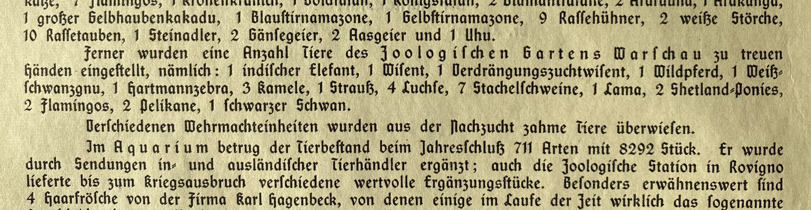
_Auszug aus dem Geschäftbericht für 1939. (AZGB)_

Auch aus anderen Quellen erhielt der Zoo ab 1939 Kriegsbeute. Von der Schutzstaffel (SS) kamen 1940 polnische "Panjepferde".  Lutz Heck versuchte sich zusammen mit seinem Bruder Heinz Heck, dem Zoodirektor in München, wie beim Auerochsen an Kreuzungsversuchen im Rahmen einer Rückzüchtung der ausgestorbenen Pferdegattung der Tarpane.[^war5]

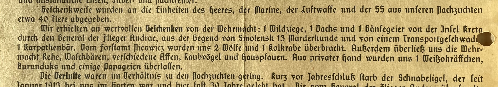
_Auszug aus dem Geschäftsbericht für 1942. (AZGB)_

Die Behörde des inzwischen zum Leiter der Naturschutzabteilung im Reichsforstamt aufgestiegenen Lutz Heck beteiligte sich koordinierend an der von Pogromen begleiteten Räumung des letzten verbliebenen europäischen Urwalds von Bialowieza. Reichsjägermeister Hermann Göring plante dort ein großes Jagdgebiet für den Wisent und die dort noch auszuwildernden 'Auerochsen'. Hunderte Juden und Jüdinnen wurden im Verlauf dieser Räumung ermordet, Tausende nichtjüdische Pol\*innen vertrieben. Auch dort ließ sich Lutz Heck vermutlich Pferde stehlen. Nach dem Kriegsende kamen polnische Wissenschaftler auf der Suche nach gestohlenen Pferden/ Koniks nach Berlin.[^war6]

_Lutz Heck und wahrscheinlich ein Fahrer und ein Dienstwagen des Reichsjagdamtes, 1939. (AZGB)_

Wie alle Zoos war auch der Zoologische Garten obwohl er ausdrücklich geöffnet bleiben sollte von den Einberufungen der Mitarbeiter zur Wehrmacht betroffen. Um die Arbeitskraft zu ersetzen, beutete der Zoo ab 1940 zunächst polnische und französische, dann wohl auch sowjetische Kriegsgefangene und Zivilisten als Zwangsarbeiter aus. Aktenfunde legen nah, dass Lutz Heck selbst bei einem einem Besuch in Bialowieza sechs junge Männer zur Zwangsarbeit nach Berlin verschleppen ließ.  Spätestens im Spätsommer 1941 wurde eine unbekannte Anzahl sogenannter Ostarbeiter im Zoo ausgebeutet. Es handelte sich dabei um mit falschen Versprechen aus der besetzten Sowjetunion nach Berlin gelockte oder entführte Menschen. Mindestens ein niederländischer Häftling leistete im Aquarium Zwangsarbeit. Und im letzten Kriegsjahr kamen dauerhaft 40 sogenannte Italienische Militärinternierte - nach der italienischen Kapitulation internierte italienische Soldaten - hinzu. Im Zoo selbst war der Bau einer Baracke für etwa zwölf Zwangsarbeiter geplant. Bei den Aufräumarbeiten nach den Bombenangriffen im Winter 1943/44 wurden wohl mehrere Hundert sowjetische Kriegsgefangene vom Gau Berlin im Zoo eingesetzt. Wir wissen wenig über die Lebensbedingungen der im Zoo zur Arbeit gezwungenen Menschen. Auch für andere deutsche Zoos ist der Einsatz von Zwangsarbeitern belegt. Es ist aber anzunehmen, dass der Zoo der Reichshauptstadt einen so hohen Stellenwert genoss, dass er auf zahlreiche Zwangsarbeiter zurückgreifen konnte.[^labour1]

Auch an anderer Stelle profitierte der Zoo von den Netzwerken des Direktors und Aufsichtrat, die den gesamten Krieg hindurch gepflegt wurden.

_Hermann Göring (Bildmitte mit hellem Mantel) besucht 1942 den Zoo und spricht mit Lutz Heck (Bildmitte mit dunklem Mantel). (AZGB)_

So koordiniert Lutz Heck von seinem Arbeitsplatz im Berliner Reichsforstamt die Versorgung der Zoos im gesamten Reichsgebiet mit Futtermitteln. Bis in die letzten Kriegsmonate hinein wurden noch Seefische für seltene Seevögel und Robben geliefert.[^war7]

## Zerstörung

In der Nacht auf den 23. November 1943 wurde der Zoo durch einen alliierten Bombenangriff in ein Flammenmeer verwandelt und 30 Prozent des noch vorhandenen Bestands an Tieren getötet.[^destruction1] 

Liste der getöteten Tiere, 1943. (AZGB)

In der folgenden Nacht wurde das Aquarium zerstört. Eine Bombe schlug mitten in die zentrale Krokodilhalle ein. Berstende Aquarienscheiben entließen große Wassermassen und schwemmten die Tiere bis auf die Straße und in den Zoo. Die wechselwarmen Reptilien und Schlangen erstarrten in der kalten Novembernacht sofort. Einige Kaimane konnten noch lebend im Erdgeschoss geborgen werden. Oskar Heinroth und die verbleibenden Mitarbeiter versuchten sie im Heizungskeller durchzubringen, scheiterten aber. Auch im Zoo selbst waren Tiere durch die Bombenschäden ihren Gehegen entwichen. Nun wirkten die vorbereiteten Schutzmaßnahmen. Fangtrupps fingen die Tiere schnell wieder ein oder töteten sie.

_Inneres des zerstörten Elefantenhauses in dem sieben Elefanten starben, 1943. (AZGB)_

Hunderte Zwangsarbeitern räumten den Zoo von Trümmern.[^destruction2] Ein halbes Jahr später öffnete der Zoo rechtzeitig zu seinem 100jährigen Jubiläum am 25. Juli 1944 wieder. Bis zu 5 000 Menschen wurden im Sommer und Herbst 1944 gleichzeitig zu den Öffnungszeiten in den Zoo gelassen. Insgesamt kamen 250 000 Besucher\*innen um immer noch mehr als 1 500 Tiere zu bestaunen.[^war8] Bei Luftalarm sollten sie in den riesigen Flakturm am nördlichen Zoorand evakuiert werden.[^war9]

Am 22. April 1945 war aber endgültig Schluss. Die noch verbliebenen männlichen Mitarbeiter wurden zum Volkssturm eingezogen. Sie mussten durch ihren Zoo Schützengräben ziehen. Kurz bevor Einbruch sowjetische Truppen das Zoogelände erreichten floh die Geschäftsleitung des Gartens um Lutz Heck am 30. April.[^war9] Für 48 Stunden tobte der erbitterte Kampf um den benachbarten Flakturm im Zoo. Am 2. Mai war die Schlacht um die Stadtmitte und den Zoo zu Ende. Überall lagen Leichen und Tierkadaver, zwischen 80 und 90 Tiere hatten überlebt.[^war10]

Die überlebenden Löwen des Zoos liegen vor der Kulisse des zerstörten Aquariums in ihrem Freigehege, 1945. (AZGB)

Der Zoo am Ende der nationalsozialistischen Herrschaft war materiell aber auch in seiner inneren Verfasstheit nicht mehr der Zoo, der sich bis 1933 aus seinen Ursprüngen entwickelt hat. Das Beispiel des Berliner Zoos zeigt, wie sehr sich die Institution Zoo unter dem Druck politischer Verhältnisse formen und instrumentalisieren lässt. 

---

## Footnotes

[^family1]: Beispielsweise: Heck, Ludwig. _Heiter-ernste Lebensbeichte. Erinnerungen eines alten Tiergärtners_. Berlin: Deutscher Verlag, 1938: 373; Heck, Lutz. _Der deutsche Edelhirsch. Ein Lebensbild mit photographischen Naturaufnahmen aus der Wildbahn_. Berlin: Paul Parey, 1935.

[^family2]: Lebenslauf Lutz Heck für die Reichsschriftumskammer, Bundesarchiv Berlin (BArch), R 9361, V, 5953.

[^family3]: Heck, Lutz. _Waidwerk mit bunter Strecke. Jagd in heimischen Revieren_. Hamburg, Berlin: Parey, 1968: 67.

[^family4]: Z. B. Heck, Lutz. _Der deutsche Edelhirsch. Ein Lebensbild mit photographischen Naturaufnahmen aus der Wildbahn_. Berlin: Paul Parey, 1935.

[^family5]: Vgl. Lutz Heck. _Auf Urwild in Kanada_. Berlin 1937.

[^family6]: Jahrbuch der Fachschaft Deutsche Bracken, 1935/36.

[^family7]: Zoologischer Garten Berlin, "Alte Tierkartei" sowie Liste der Löwen Hermann Görings mit Nachzuchten, AZGB N 5/13.

[^family8]: Vgl. Maier-Wolthausen, Clemens. _Hauptstadt der Tiere. Die Geschichte des ältesten deutschen Zoos_. Herausgegeben von Andreas Knieriem. Berlin: Ch. Links Verlag, 2019: 111-113.

[^board1]: Geschäftsbericht für das Jahr 1933.

[^board2]: Aufsichtsratsprotokolle 1933, AZGB O 0/2/2.

[^board3]: Aufsichtsratsprotokolle 1933, AZGB O 0/2/2 sowie Aktenvermerk für Regierungspräsident Zachariae, GStA PK I. HA Rep. 151, Nr. 2496, Bl. 23; Protokoll der Generalversammlung 1934, AZGB O 0/3/2.

[^propa1]: Aufsichtsratsprotokoll, 22.05.1933, AZGB O 0/2/2.

[^propa3]: Schriftwechsel zwischen allen Parteien in GStA PK I. HA, Rep 151, 2500 und Niederschrift der Aufsichtsratssitzung 24.08.1935, in: GStA PK I. HA, Rep 151, 2496, Bl. 93-94.

[^propa4]: Vgl. u. a. Heck, Lutz. „Über die Neuzüchtung des Ur oder Auerochs“. _Berichte der Internationalen Gesellschaft zur Erhaltung des Wisents_ 3, Nr. 4 (1936): 224–94: 224–294, 235.

[^propa5]: Heck, Lutz. _Auf Tiersuche in weiter Welt_. Berlin: Paul Parey, 1941: 195.

[^propa6]: Heck. 1941: 195, sowie Heck, Lutz. „Letzte Urwaldtiere aus deutscher Vorzeit“. _Atlantis. Länder, Völker, Reisen_ 4, Nr. 10 (1932): 577–83: 577–83; Heck, Lutz. „Die Neuzüchtung des Auerochsen“. _Wild und Hund_, Nr. 37 (15. Dezember 1939): 535–37. Auch auf der internationalen Jagdausstellung 1938 schmückte ein Fries mit einer Strophe des Epos den Stand zum Ur.

[^propa2]: Geschäftsberichte für die Jahre 1935 u. 1936.

[^labour1]: Vgl. Maier-Wolthausen, Clemens. _Hauptstadt der Tiere. Die Geschichte des ältesten deutschen Zoos_. Herausgegeben von Andreas Knieriem. Berlin: Ch. Links Verlag, 2019: 126-127.

[^destruction1]: Liste in AZGB O 0/1/54.

[^destruction2]: Kopie Bericht Lutz Heck an Aufsichtsrat, Januar 1944, AZGB O 0/1/54.

[^propa7]: Mitgliedskarte im Berlin Document Center des Bundesarchivs Berlin.

[^share1]: Aufsichtsratsprotokolle, 19.07.1938 u. 16.12.1938, AZGB O 0/2/2.

[^propa8]:Vgl. Abschrift Ministerialdirektor Eberts Reichsfortamt an Bundesleiter des Reichsbundes für Biologie Dr. W. Greite, 05.02.1941, BArch, NS 21/1543; Aufsichtsratsprotokoll, 19.07.1938, AZGB O 0/2/2.

[^propa9]: Der Urwald ruft Kolonialkunst-Ausstellung im Zoologischen Garten, in: Berliner Lokalanzeiger, 06.04.1933.

[^propa10]: Pressemitteilung 29.06.1934, AZGB O 0/1/15; Sensation im Affenpalmenhaus, in: Völkischer Beobachter, 13.06.1937.

[^share2]: Aufsichtsratsprotokoll 29.03.1938, AZGB, O 0/2/2.

[^share3]: Zessionspapiere im Archiv der Zoologischen Gärten Berlin.

[^share4]: Aufsichtsratsprotokoll, 08.11.1938, AZGB O 0/2/2.

[^war1]: Aufsichtsratsprotokoll, 16.12.1939, AZGB O 0/2/2.

[^war2]: Bauzeichnungen und -anträge in LAB, A Rep. 032-08, Nr. 293; vgl. auch Heck, Lutz. _Tiere - mein Abenteuer. Erlebnisse in Wildnis und Zoo_. Wien: Ullstein, 1954: 97-102; Rede L. Heck auf der Hauptversammlung 1940, AZGB O 0/3/13; Notiz zum Geschäftsbericht für das Jahr 1941, AZGB O 0/3/12.

[^war3]: Vgl. Maier-Wolthausen, Clemens. _Hauptstadt der Tiere. Die Geschichte des ältesten deutschen Zoos_. Herausgegeben von Andreas Knieriem. Berlin: Ch. Links Verlag, 2019: 118-129.

[^war4]: Bruce, Gary. _Through the Lion Gate. A History of the Berlin Zoo_. Oxford: Oxford University Press, 2017: 164 mit Berufung auf die Memoiren der Ehefrau des Zoodirektors Antonina Zabinska.

[^war5]: Aufsichtsratsprotokoll, 30.07.1940, AZGB O 0/2/2.

[^war6]: Vgl. Gautschi, Andreas. Der Reichsjägermeister. Fakten und Legenden um Hermann Göring. Melsungen: Nimrod, 2010; Rubner, Heinrich. Deutsche Forstgeschichte, 1933-1945. Forstwirtschaft, Jagd und Umwelt im NS-Staat. St. Katharinen: Scripta Mercaturae, 1997; Kopie Vereinbarung zwischen dem Reichskommissar für die Festigung deutschen Volkstums - Stabshauptamt und dem Reichsforstmeister als Oberster Naturschutzbehörde über die Ausführung der Besprechung vom 20. März 1942, 11.05.1942, BArch, R 49/2066; Schriftwechsel mit dem Britischen Kommandanten Tiergarten Lt. Col. Nunn im Dezember 1945, AZGB S 15/17; Alte Tierkartei, Karteikarte "Panjepferde". 

[^war7]: Rundschreiben L. Heck an die zoologischen Gärten, 22 02.1945, und Fisch-Grosshandel H. D. Petersen an L. Heck, 08.03.1945, AZGB O 0/1/88.

[^war8]: L. Heck: Aktennotiz betr. Eröffnung am 25.7.1944, AZGB O 0/1/50; Erinnerungen von Elisabeth Johst, AZGB S 15/27.

[^war9]: Erinnerungen von Elisabeth Johst, AZGB S 15/27; K. Heinroth an W. Keller, 18.09.1945, AZGB O 0/1/87; K. Heinroth an G. Freytag, 03.01.1946, AZGB O 0/1/86.

[^war10]: K. Heinroth: "Kriegszerstörungen und Aufbau von 1945 bis 1956 im Berliner Zoologischen Garten", maschinenschriftliches Manuskript, AZGB N 4/2.

[^haustierhof]: Presseführung Haustierhof Pfingsten 1937, AZGB O 0/1/15.
