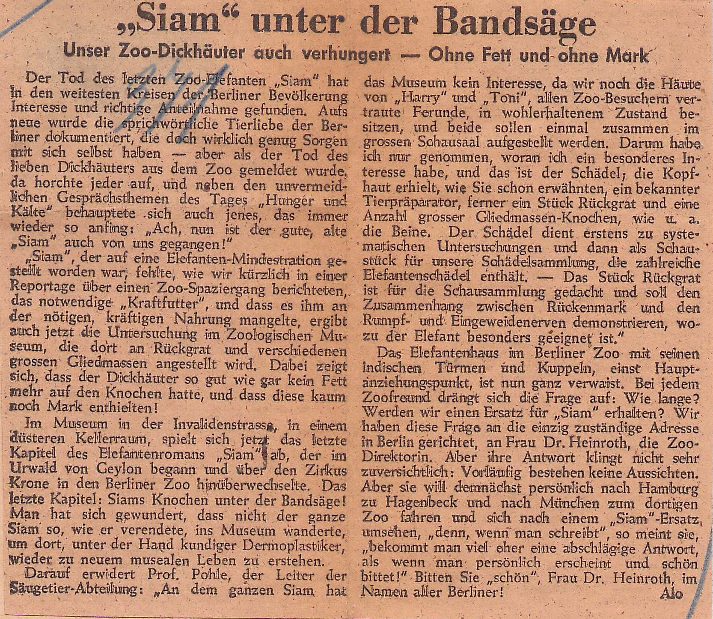
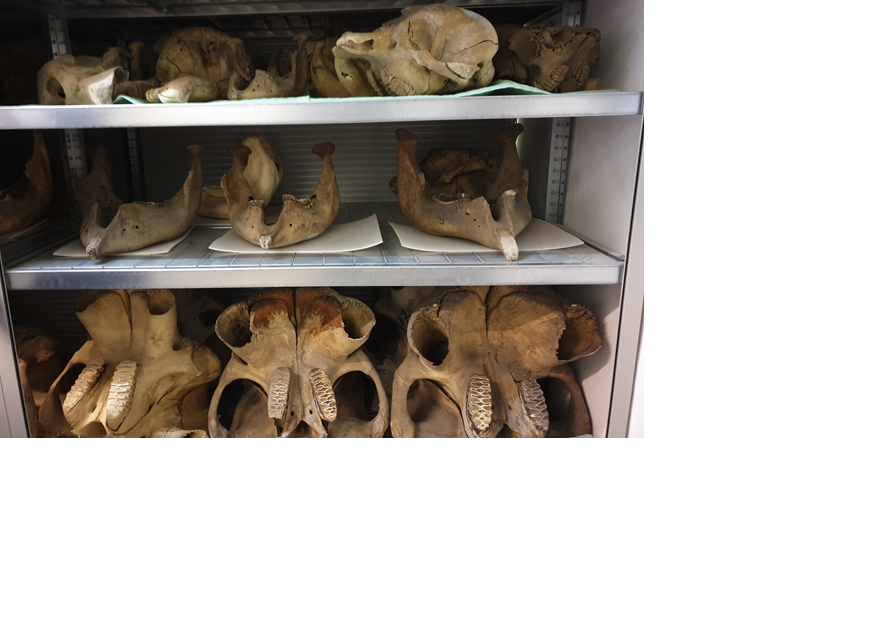
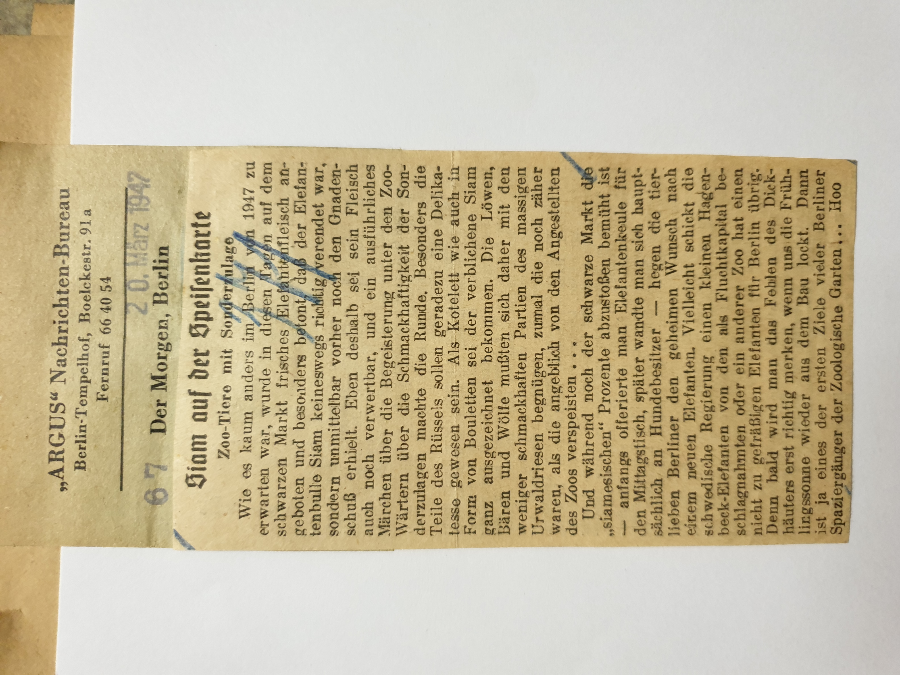

:::EN:::

<figure>

<figcaption>

_Newspaper article in the_ Telegraf _about "Siam's" utilisation , 21.03.1947._

</figcaption>

</figure>

In 1947, the Berlin daily newspaper _Telegraf_ reported on the death of "Siam". The article recounted the "last chapter" of the life of the Indian bull elephant at the Berlin Zoo: "Siam under the band saw". I was looking into the history of elephant shipments when I came across the eventful history of "Siam". **Shipped to Berlin in the early 1930s from the then British colony of Ceylon (now Sri Lanka), the elephant was actually intended for the Krone Circus.** However, as "Siam" showed behavioural problems and was not suited to being a circus animal, the circus gave him, in exchange for a giraffe, to the Berlin Zoological Garden, where "Siam" lived from 1933 until his death in 1947.

<figure>

![Newspaper clipping. Photograph: Man in white coat and hat holds the tip of the trunk of a standing elephant with a blanket on its back. Six other people with hats and walking sticks or whips stand by.] (/images/mv/animal-exchange-circus-and-zoo-Berlin-Neue-Berliner-12-Uhr-Zeitung.jpg)

<figcaption>

_The_ Neue Berliner 12 Uhr Zeitung _, and other newspapers, reported on the animal exchange between the circus and the zoo, and on "Siam's" arrival in his new enclosure, 25.10.1933._

</figcaption>

</figure>

The carcasses of zoo animals, especially large mammals, are usually not simply disposed of. In many cases – in the past as today – they are re-utilised as completely as possible. This also applies to "Siam". And as with all zoo animals that live an afterlife in this way after their death, his body did not remain intact. **To follow the trail of this elephant story therefore entails a search for individual body parts, and leads to different locations of utilisation and disposal.**

## Colonial Traces

One of the trails leads to the Zoological Museum Berlin, which was a part of the Museum of Natural History. According to the above-mentioned newspaper article, after the elephant's body had been cut up and dissected, the museum was to receive the skull for its scientific collection, and a piece of the backbone for exhibition.[^1] A private taxidermist named Kriegerowski, who regularly took over animal carcasses from the zoo for taxidermy purposes, was to receive the feet, which he used to make wastepaper baskets with foil, as is further detailed.[^2] This is where the trail runs cold, or at least where I reach a dead-end in my research. What ends up in private hands is rarely, or at least more rarely, retrievable than what is stored in public collections. **Some object histories seem only (still) to exist as the paper trail left by the animals in archives, correspondences, or newspaper reports.** At the same time, the search in the Natural History Museum has also proved difficult. My colleague  Clemens Maier-Wolthausen and I have searched many boxes, cupboards and shelves in the mammal collection for the skull – thus far, without success.[^3]

<figure>

![Open wooden box of lengthy bones lies on a table. A chair stands next to the table; antlers hang in the background.] (images/mv/box-with-bones-mammal-collection.png)

<figcaption>

_Searching the mammal collection of the Museum for Natural History Berlin, November 2020. (Photograph Mareike Vennen/MfN. All rights reserved.)_

</figcaption>

</figure>

Did the elephant bones not end up in the collection at all? Or are we just not able to find them because the Zoological Museum did not keep systematic or uniform records at the time, so that today it is not always clear where and how incoming objects were recorded? See also [[story.record keeping]].

In "Siam's" case, the trail leads – this much is clear – into European colonial history. The stations of his life draw attention to those animals that were brought to Europe from the colonies as trade and barter objects, or as [[Geschenke|story.Gifting Objects]][^4] – as "Siam" was brought from the British colony of Ceylon. [[Tierhändler|story.catching-animals]] such as John Hagenbeck regularly travelled through such regions to capture [[Tiere für Zoologische Gärten|theme|theme.how-do-animals-get-into-the-zoo]] and circuses, and to recruit people for so-called "Völkerschauen", the ethnological exhibitions of people also known as "human zoos."[^5] **Although we still know little about how "Siam" was captured in Ceylon and transported to Berlin, this is part of the long and problematic history of zoo and circus animals from colonial contexts.** Elephant feet as wastepaper baskets are surely among the iconic trophies which manifest modes of exploitation and stereotyped imperial images of appropriation and domination. Even though we do not know where "Siam's" feet actually landed up, the indication that they were made into wastepaper baskets makes them a part of this European history of appropriation. And they make me aware once more that the material cultures of colonialism emerge in collections as well as in living rooms, and are a part of the Berlin museum, as they are of everyday history. Today, one can encounter the material traces of colonialism in historical collections, in old photos of 19th and early 20th century furniture, and when strolling through flea markets. This makes me think about what kinds of traces an animal leaves behind, where they can be found and what this means for my own research and its sources.

## Feed and Consume

Meanwhile, another trail takes me to post-war Berlin, where those parts of the carcass of "Siam" that were not usable for taxidermy were reused in other ways. This was mainly due to the many shortages in the city during those years, see also [[story.futternot]]. When the _Neue Zeitung_ headlined: "'Siam' = 2.5 million calories"[^6], it was not only referring to the hundredweight of hay the elephant ate daily. **The meat of the 7 tonne elephant bull was now itself used as feed for the lions in the zoo – "for whom the demise of their large neighbour means a special calorie-rich meal allotment", as the _Neue Zeitung_ commented.**[^7]

Especially in the first years after the war, the zoo indeed did repeatedly have problems feeding its carnivores. Mainly horse meat was used for this purpose: sometimes "good meat", but mostly carcass meat, which was supplied by the health department through dealers.[^8] For carcass processing, a special knacker's room with a steam boiler was even set up next to the feed kitchen in the zoo in 1948.[^9] The Berlin Zoo had to pay comparatively high sums even for this non-high-quality meat, as Katharina Heinroth learned from an enquiry at other zoological gardens in Germany. Most zoos in West Germany no longer used carcass meat at all because of its inferior quality and the risk of infection for the zoo animals. They either received free-range or feed meat from slaughterhouses, or so-called free-range meat from the Freibank, an institution for the specialised sale of meat that came from animals that had had to be slaughtered due to necessity or accident. Their meat was classified as inferior, but not harmful, and thus conditionally fit for consumption – which meant that prices were accordingly lower.[^10] Most zoos paid a maximum of DM (West) 0.36 per kilogramme for free-range and feed meat (≈ € 0.93 in 2021.) The Berlin Zoo, by contrast, had to pay an average of DM (West) 0.70 even for a kilo of carcass meat with bones (≈ € 1.80 in 2021), Carcass meat with bones would have cost the equivalent of only DM (West) 0.20 in the eastern zone (≈ € 0.51 in 2021).[^11]

An additional problem for the zoo was that the carcass meat produced in the western sectors was far from sufficient for the zoo's needs. In the meantime, the number of horses slaughtered declined to such an extent that the zoo's need for horse meat could only barely be met by half.[^12] **The meat of zoo animals was therefore a welcome addition to the feeding plan** – a phenomenon that had already been known in earlier times. Food shortages are always an issue in times of crisis, which could even lead to "triage" among the zoo animals, such as in the Leipzig Zoo, where during the First World War "less valuable pieces had to be slaughtered in order to obtain feeding meat for the better animals."[^13]

The lions at the Berlin Zoo received some of the elephant meat. About 20 pounds also entered human supply circuits – or more precisely, it ended up on the illegitimate market, and from there allegedly on the menu of a Berlin restaurant. When zoo employee Karl Wolf Jr. reported that he had been offered elephant meat at a price of 65 Reichsmark per pound[^14], the police immediately began an investigation. Wolf was ordered to buy the meat and report to the zoo. He indeed turned up with five pounds of meat, which a resident of his building had given him in front of the Savarin restaurant for a price of 325 Reichsmark (≈ € 1040 in 2021). One of the zookeepers was accused of stealing the meat and selling it under the table.[^15] **The elephant had gone from being a display animal to a meat supply.** When the press got wind of the matter, they reported on "Elephant à la carte" and "Siam on the menu."[^16]

<figure>

<figcaption>

_The daily newspaper_ Der Morgen _reports on the illegal sale of the elephant meat, 20.03.1947._

</figcaption>

</figure>

While the newspapers speculated half-ironically about whether every zoo employee could "cut off a slice" and make themselves cutlets or meatballs, the re-utilisation of animals for food purposes was a thoroughly existential question in times of need. Two years earlier, the management of the Antwerp Zoo had decided to slaughter three fallow deer calves due to food scarcity. These were then offered for sale at the major Brussels market hall.[^17]

Just how great the need was among the people of Berlin in the first post-war years is also shown by a whole series of letters to the zoo shortly after "Siam's" death, inquiring about the possibilities of further utilising his remains. One wanted to know if the tusks could be sold and the skin used to mend clothes; another asked if the elephant meat was suitable for human consumption.[^18] In addition, theft at the zoo was on the rise at the time: Vegetables were secretly torn out of the flower beds, carp were fished out of the restaurant pond, and even live animals such as donkeys, sheep, deer, as well as dairy goats, rabbits and chickens were stolen.[^19] "These nocturnal thieves are not even particularly choosy; they take everything, from porcupines to rats," remarked the _Tägliche Rundschau_, and Katharina Heinroth was quoted as saying on this: "The porcupine probably went into the cooking pot."[^20] Here, too, the zoo was like a microcosm for greater Berlin, where in the neighbouring Tiergarten, and in the fields, the theft of vegetables and potatoes was increasing to such an extent that the police were concerned for the population’s food supply. Anyone caught was therefore threatened with a harsh prison sentence.[^21]

## An Elephant’s Paper Trail

The story of "Siam" is a story of various (re-)utilisations. At different times, zoo animals are involved in different cycles of use. [[story.knut]], probably the most famous polar bear of the Berlin Zoo, who was born in the zoo in 2006 and has been on display as a dermoplastic in the Berlin Museum of Natural History since his death in 2011, was (and still is) an attraction, a climate ambassador, and a licensed brand. **In the 1930s, the elephant had gone from being a wild animal to "Siam", the circus and zoo attraction, then possibly become part of a scientific collection, as well as – if the newspaper report is to be believed – a decorative object in the style of colonial trophies, and finally a source of meat for animal and human consumption .** The story of his life and afterlife, reconstructed from the paper trail, is a story that is at once local and global; a chapter of Berlin's post-war history and a part of a global history of colonialism.

At the same time, the afterlife of "Siam" reveals the gaps in the record, the literal empty spaces of material culture. They, in particular, raise many questions – about when zoo animals are fed or eaten; whether they are disposed of, mourned or reused after their death, and how they become scientific objects, exhibits, trophies and meat supplies. What forms of labour are involved, what forms of care, and what logics of (re)utilisation? This leads me back to the question of what traces an animal leaves behind, in what ways it is possible or impossible to reconstruct history or histories on the basis of a paper trail, and what this means for my research, its sources, and the limits of historical reconstruction.

[^1]: "'Siam' unter der Bandsäge", _Telegraf_, 21.03.1947.

[^2]: Cf. "'Siam' unter der Bandsäge"._Telegraf_, 21.03.1947; and "Tierausstopfer filmt als Eisbär. Ein Präparator, der nur lebende Tiere liebt". _Der Abend_ [Berlin], 29.07.1947.

[^3]: Sincere thanks to Frieder Maier, Christiane Funk and Katrin Spitzer for support in the search.

[^4]: Cf. Szczygielska, Marianna. "Elephant Empire: Zoos and Colonial Encounters in Eastern Europe". _Cultural Studies_(2020): 1-22. https://doi.org/10.1080/09502386.2020.1780280; see also [[story.catching-animals]].

[^5]: Cf. Hagenbeck, John. _John Hagenbecks abenteuerliche Flucht aus Ceylon_. Leipzig: Deutsche Buchwerkstätten, 1917. From the now extensive literature on the connection between zoological gardens and "Völkerschauen", see for example Maier-Wolthausen, Clemens. _Hauptstadt der Tiere: die Geschichte des ältesten deutschen Zoos_. Berlin: Ch. Links Verlag, 2019; Anhalt, Utz. "Tiere und Menschen als Exoten – Exotisierende Sichtweisen auf das 'Andere' in der Gründungs- und Entwicklungsphase der Zoos". Dissertation, Hannover: Gottfried Wilhelm Leibniz Universität, 2007; Diallo, Oumar and Joachim Zeller. "Zoologischer Garten, Hardenbergplatz 8". In _Berlin – Eine (post-)koloniale Metropole. Ein historisch-kritischer Stadtrundgang im Bezirk Mitte_, ed. by Farafina e. V. Berlin-Moabit. Berlin: Metropol-Verlag, 2021: 168-175; Dittrich, Lothar und Annelore Rieke-Müller. _Carl Hagenbeck (1844-1913) Tierhandel und Schaustellungen im Deutschen Kaiserreich_. Frankfurt/M., Berlin, Bern, New York, Paris, Wien: Peter Lang, 1998; Schmidt-Gross, Caroline. "Tropenzauber um die Ecke: Völkerschauen bei Hagenbeck". In _MenschenZoos. Schaufenster der Unmenschlichkeit_, ed. by Pascal Blanchard _et al_. Hamburg: Les éditions du Crieur Public, 2012: 172-178.

[^6]: "'Siam' = 2,5 Millionen Kalorien". _Die Neue Zeitung_, 22.03.1947. The lions then immediately had "their rations cut by the magistrate", claimed the _Tagesspiegel_. Cf. "Spinat oder Hirsche. Ein Frühlingsspaziergang durch den Berliner Zoo". _Der Tagesspiegel_, 03.04.1947.

[^7]: "'Siam' = 2,5 Millionen Kalorien". _Die Neue Zeitung_, 22.03.1947. Direct quotes have been translated into English for clarity’s sake.

[^8]: Cf. AZGB O 0/1/3.

[^9]: Cf. Zoological Garden Berlin. _Geschäftsbericht des Aktien-Vereins des Zoologischen Gartens zu Berlin_ for the year 1948.

[^10]: During times of scarcity, the Freibank served to utilise as many animal products as possible. However, the practice was abandoned in the 1990s at the latest.

[^11]: Cf. AZGB O 0/1/284. The equivalent amounts for 2021 were calculated with the record for 1948 in a conversion table of the German federal bank. Cf. "Kaufkraftäquivalente historischer Beträge in deutschen Währungen". Bundesbank 2021. https://www.bundesbank.de/resource/blob/615162/d55a20f8a4ecedd6d1b53e01b89f11c4/mL/kaufkraftaequivalente-historischer-betraege-in-deutschen-waehrungen-data.pdf (10.8.2021).

[^12]: Cf. Magistrate of the city of Berlin, Hauptamt Veterinärwesen, main veterinary office to the Zoological Garden Berlin, 06.09.1946, AZGB O 0/1/3. While an average of about 1.685 kg of carcass meat was available each month, the zoo’s monthly requirement according to its own calculations lay at 3.200 kg. The zoo therefore had to buy almost 1.400 kg of good slaughter meat per month at a price of DM (West) 1.40 per kg. Cf. K. Heinroth to Dr. Schönwetter, magistrate of greater Berlin, 24.01.1950, AZGB O 0/1/3. DM (West) 1.40 in 1950 are equivalent to € 3.88 today. Cf. "Kaufkraftäquivalente historischer Beträge in deutschen Währungen". Bundesbank 2021. https://www.bundesbank.de/resource/blob/615162/d55a20f8a4ecedd6d1b53e01b89f11c4/mL/kaufkraftaequivalente-historischer-betraege-in-deutschen-waehrungen-data.pdf (10.8.2021).

[^13]: Gebbing, Johannes (Ed.) _50 Jahre Leipziger Zoo, 1878-1928_. Leipzig: Selbstverlag des zoolog. Gartens, 1928: 36. On mass slaughtering, cf. Roerkohl, Anne. "Die Lebensmittelversorgung während des Ersten Weltkrieges im Spannungsfeld kommunaler und staatlicher Maßnahmen". In _Durchbruch zum modernen Massenkonsum. Lebensmittelmärkte und Lebensmittelqualität im Städtewachstum des Industriezeitalters_, ed. by Hans Jürgen Teuteberg. Münster: Coppenrath, 1987: 309-370. Direct quotes have been translated into English for clarity’s sake.

[^14]: The price quoted varied between 20 pounds for 400 Reichsmark (≈ € 1280 in 2021). Cf. "Auf den Spuren des Elefanten". _Der Kurier_, 07.02.1948; Zoological Garden Berlin to the Kriminal-Kommissariat Tiergarten, the criminal investigation department for Tiergarten, 10.05.1947, AZGB O 0/1/143.

[^15]: K. Heinroth to the criminal investigation department for Tiergarten, 10.05.1947, AZGB O 0/1/143. Cf. also AZGB O 0/1/44. The equivalent amount for 2021 was calculated with the record for 1947 in a conversion table of the German federal bank. Cf. "Kaufkraftäquivalente historischer Beträge in deutschen Währungen". Bundesbank 2021. https://www.bundesbank.de/resource/blob/615162/d55a20f8a4ecedd6d1b53e01b89f11c4/mL/kaufkraftaequivalente-historischer-betraege-in-deutschen-waehrungen-data.pdf (10.8.2021). For press coverage cf. for instance "Prozeß um Elefantenfleisch". _Tagesspiegel_, 07.02.1948; "Elefant à la carte". _Die Tagespost_, 10.02.1948. As early as 1945, the Berlin police, citing health risks, had issued a decree to "refrain from purchasing meat on the illegitimate market". Cf. "Unterlassung des Erwerbs von Fleisch am Schwarzen Markt, Berlin, den 17. Juli 1945". _Verordnungsblatt (VOBl.) der Stadt Berlin 1945_, No. 5., September 1945: 67.

[^16]: "Siam auf der Speisekarte. Zoo-Tiere mit Sonderzulage". _Der Morgen_, 20.03.1947. Direct quotes have been translated into English for clarity’s sake.

[^17]: Here, too, a court case followed. Cf. "Damhirsch-Prozeß". _Rhein-Zeitung_, 23.04.1947.

[^18]: Cf. H. Schäfer to the administration of the Zoological Garden Berlin, 11.03.1947, AZGB O 0/1/143; H. Mrozeck to the administration of the Zoological Garden Berlin, 08.03.1947, AZGB O 0/1/87; W. Gronau to the administration of the Zoological Garden Berlin, 10.03.1947, AZGB O 0/1/86.

[^19]: Cf. Zoological Garden Berlin to the command of the Schutzpolizei, 01.04.1947, AZGB O 0/1/143. Criminal investigations were unsuccessful in all cases. Cf. also Zoological Garden Berlin to the 31st Police Precinct, 13.02.1947, AZGB O 0/1/143; and AZGB O 0/1/274: "On the night from 12 to 13 February, an adult dairy goat was killed in a locked animal house on the grounds of the Zoological Gardens, butchered on the spot and stolen, leaving its entrails behind." Direct quotes have been translated into English for clarity’s sake.

[^20]: de Luce, Daniel. "Lebensmittelkarte 5 im Berliner Zoo". _Tägliche Rundschau_, 17.12.1946.

[^21]: "Gemüse- und Kartoffeldiebstähle". _Verordnungsblatt (VOBl.) der Stadt Berlin 1945_, No. 7, 20.9.1945: 93.

:::DE:::

<figure>

<figcaption>

_Zeitungsartikel im_ Telegraf _über "Siams" Verwertung, 21.03.1947._

</figcaption>

</figure>

1947 berichtete die Berliner Tageszeitung _Telegraf_ über den Tod "Siams". Der Artikel schildert das "letzte Kapitel" des indischen Elefantenbullen im Berliner Zoo: "Siam unter der Bandsäge". Ich beschäftigte mich gerade mit der Geschichte von Elefantentransporten, als ich auf die bewegte Geschichte von "Siam" stieß. **Anfang der 1930er Jahre aus der damaligen britischen Kolonie Ceylon (dem heutigen Sri Lanka) nach Berlin verschifft, war der Elefant eigentlich für den Zirkus Krone bestimmt.** Da "Siam" aber Verhaltensauffälligkeiten zeigte und sich nicht als Zirkustier eignete, gab der Zirkus ihn im Tausch für eine Giraffe an den Berliner Zoologischen Garten ab, wo das Tier von 1933 bis zu seinem Tod 1947 lebte.

<figure>

![Zeitungsausschnitt. Foto: Mann in weißem Kittel und mit Hut hält Rüsselspitze eines stehenden Elefanten mit Decke auf dem Rücken. Sechs weitere Personen mit Hüten und Gehstöcken oder Gerten stehen dabei.] (/images/mv/animal-exchange-circus-and-zoo-Berlin-Neue-Berliner-12-Uhr-Zeitung.jpg)

<figcaption>

_Über den Tiertausch zwischen Zirkus und Zoo und die Ankunft "Siams" in seinem neuen Gehege berichtete unter anderem die_ Neue Berliner 12 Uhr Zeitung, _25.10.1933._

</figcaption>

</figure>

Die Kadaver von Zootieren, zumal Großsäugern, werden meist nicht einfach entsorgt. Sie werden – damals wie heute – in vielen Fällen möglichst vollständig weiterverwertet. Das gilt auch für "Siam". Und wie bei allen Zootieren, die auf diese Weise nach ihrem Tod ein Nachleben führen, blieb sein Körper nicht unversehrt. **Sich auf die Spuren dieser Elefantengeschichte zu begeben, bedeutet also nach einzelnen Körperteilen zu suchen, was zu unterschiedlichen Orten der Verwertung und Entsorgung führt.**

## Koloniale Spuren

Eine der Spuren führt in das Zoologische Museum Berlin, das Teil des Naturkundemuseums war. Nachdem der Körper des Elefanten zerteilt und seziert worden war, sollte das Museum den Schädel für seine wissenschaftliche Sammlung und ein Stück Rückgrat für seine Ausstellung erhalten, wie es in besagtem Zeitungsartikel heißt.[^1] Ein privater Präparator namens Kriegerowski, der regelmäßig Tierkadaver zu Präparationszwecken vom Zoo übernahm, sollte die Füße erhalten, aus denen er Papierkörbe mit Staniolpapier fertigte, wie weiter zu lesen ist.[^2] Hier verliert sich die Spur, oder ich komme zumindest in der Recherche nicht weiter. Was in private Hände gelangte, ist selten oder zumindest seltener wieder auffindbar als das, was in öffentlichen Sammlungen lagert. **Manche Objektgeschichten scheinen nur (noch) als Papierspuren zu existieren, die die Tiere in Archiven, Korrespondenzen oder Zeitungsberichten hinterlassen haben.** Wobei sich auch die Suche im Naturkundemuseum als schwierig erweist. Mein Kollege Clemens Maier-Wolthausen und ich haben in der Säugetiersammlung viele Kisten, Schränke und Regale nach dem Schädel durchsucht, bislang ohne Erfolg.[^3]

<figure>

![Offene Holzkiste auf einem Tisch, in der längliche Knochen liegen. Neben dem Tisch steht ein Stuhl, im Hintergrund hängen Geweihe.] (images/mv/box-with-bones-mammal-collection.png)

<figcaption>

_Suche in der Säugetiersammlung des Museums für Naturkunde Berlin, November 2020. (Foto Mareike Vennen/MfN. Alle Rechte vorbehalten.)_

</figcaption>

</figure>

Sind die Elefantenknochen am Ende gar nicht in die Sammlung gekommen? Oder finden wir sie nur nicht, weil das Zoologische Museum zu jener Zeit nicht systematisch oder einheitlich Buch führte, so dass heute nicht für jedes damals eintreffende Objekt klar ist, wo und wie es verzeichnet ist? Siehe dazu auch [[story.record keeping]].

In "Siams" Fall führen die Spuren, soviel steht fest, in die europäische Kolonialgeschichte. Die Stationen seines Lebens lenken den Blick auf jene Tiere, die aus den Kolonien als Handels- und Tauschobjekte oder als [[Geschenke|story.Gifting Objects]] nach Europa gebracht wurden[^4] – wie bei "Siam" aus der britischen Kolonie Ceylon. Auch hier waren regelmäßig [[Tierhändler|story.catching-animals]] wie John Hagenbeck unterwegs, um [[Tiere für Zoologische Gärten|theme.how-do-animals-get-into-the-zoo]] und Zirkusse zu fangen und Menschen für "Völkerschauen" – zooähnliche Ausstellungen von Menschen – zu rekrutieren.[^5] **Obwohl wir darüber, wie "Siam" auf Ceylon gefangen und nach Berlin transportiert wurde, noch wenig wissen, ist dies Teil der langen und problematischen Geschichte der Zoo- und Zirkustiere aus kolonialen Kontexten.** Elefantenfüße als Papierkörbe gehören dabei zweifellos zu den ikonischen Trophäen, in denen sich Verwertungsweisen wie auch stereotypisierte imperiale Bilder von Aneignung und Beherrschung materialisieren. Auch wenn wir über den tatsächlichen Verbleib von "Siams" Füßen ebenfalls nichts wissen, macht der Hinweis, dass aus ihnen Papierkörbe gemacht wurden, sie zu einem Teil dieser europäischen Aneignungsgeschichte. Und sie machen mir wieder einmal bewusst, dass die materielle Kultur des Kolonialismus in Sammlungen ebenso wie in Wohnzimmern zu suchen ist. Sie ist sowohl Teil der Berliner   Museums- als auch der Alltagsgeschichte. Die materiellen Spuren des Kolonialismus begegnen einem heute beim Gang durch historische Sammlungen, auf alten Fotos mit Mobiliar des 19. und frühen 20. Jahrhunderts und beim Gang über Trödelmärkte. Das bringt mich zum Nachdenken darüber, was für Spuren ein Tier hinterlässt, wo diese zu finden sind und was das für meine eigene Forschung und ihre Quellen bedeutet.

## Verfüttern und Verspeisen

Eine weitere Spur führt mich unterdessen ins Berlin der Nachkriegszeit, wo jene Teile des Kadavers von "Siam", die nicht für die Präparation brauchbar waren, auf andere Weise weiterverwertet wurden. Das hing vor allem mit der schlechten Versorgungslage der Stadt in diesen Jahren zusammen, siehe auch [[story.futternot]]. Als die _Neue Zeitung_ titelte: "'Siam' = 2,5 Millionen Kalorien"[^6], war damit nicht nur der Zentner Heu gemeint, den der Elefant täglich gefressen hatte. **Das Fleisch des 70 Zentner schweren Bullen wurde nun selbst verfüttert, und zwar an die Löwen im Zoo, "für die das Ableben ihres großen Nachbarn eine kalorienreiche Sonderzuteilung bedeutet", wie die _Neue Zeitung_ vermerkte.**[^7]

In der Tat hatte der Zoo besonders in den ersten Jahren nach dem Krieg immer wieder Probleme, seine fleischfressenden Tiere zu ernähren. Hauptsächlich wurde Pferdefleisch verfüttert, manchmal "gutes Fleisch", meistens aber sogenanntes Kadaverfleisch, das ihm das Gesundheitsamt über Händler zuteilte.[^8] Zur Kadaververwertung wurde 1948 im Zoo sogar ein besonderer Abdeckerei-Raum mit einem Dampfkessel neben der Futterküche eingerichtet.[^9] Der Berliner Zoo musste selbst für dieses nicht hochwertige Fleisch vergleichsweise hohe Summen bezahlen, wie Katharina Heinroth aus einer Anfrage bei anderen zoologischen Gärten in Deutschland erfuhr. Die meisten Zoos in Westdeutschland verwendeten Kadaverfleisch wegen der Minderwertigkeit und Infektionsgefahr für die Zootiere überhaupt nicht mehr. Sie erhielten entweder Freiband- und Futterfleisch vom Schlachthof oder sogenanntes Freibandfleisch von der Freibank, eine Einrichtung zum gesonderten Verkauf von Fleisch, das von Tieren stammte, die aufgrund von Notschlachtungen oder Unfällen geschlachtet werden musste. Ihr Fleisch wurde als minderwertig, aber nicht gesundheitsschädlich und somit als bedingt tauglich eingestuft, wodurch die Preise entsprechend niedriger waren.[^10] Für das Freiband- und Futterfleisch zahlten die meisten Zoos maximal 0,36 DM (West) pro Kilogramm (≈ 0,93 € in 2021). Der Berliner Zoo musste dagegen selbst für ein Kilo Kadaverfleisch mit Knochen durchschnittlich 0,70 DM (West) zahlen (≈ 1,80 € in 2021). In der Ostzone kostete Kadaverfleisch mit Knochen hingegen nur umgerechnet 0,20 DM (West) (≈ 0,51 € in 2021).[^11] 

Ein zusätzliches Problem bestand für den Zoo darin, dass das in den Westsektoren anfallende Kadaverfleisch für den Bedarf des Zoologischen Gartens bei weitem nicht ausreichte. Zwischenzeitlich ging die Zahl der Pferdeschlachtungen so weit zurück, dass der Bedarf des Zoos an Pferdefleisch nur knapp zur Hälfte gedeckt werden konnte.[^12] **Das Fleisch von Zootieren war daher eine willkommene Ergänzung des Futterplans** – ein Phänomen, das sich bereits in früheren Zeiten findet. Nahrungsmittelmangel ist in Krisenzeiten stets ein Thema, das sogar zu einer "Triage" unter den Zootieren führen konnte wie etwa im Leipziger Zoo, wo während des Ersten Weltkriegs "[w]eniger wertvolle Stücke geschlachtet werden [mussten], um für die besseren Tiere Futterfleisch zu gewinnen".[^13]

Die Löwen im Berliner Zoo erhielten einen Teil des Elefantenfleisches. Rund 20 Pfund gelangten darüber hinaus in menschliche Versorgungskreisläufe, genauer gesagt landete es auf dem Schwarzmarkt und von dort angeblich auf der Speisekarte eines Berliner Restaurants. Als der Zoo-Angestellte Karl Wolf jun. berichtete, ihm sei Elefantenfleisch zum Preis von 65 Reichsmark pro Pfund angeboten worden[^14], nahm die Polizei umgehend Ermittlungen auf. Wolf wurde beauftragt, das Fleisch zu kaufen und dem Zoo zu berichten. Tatsächlich erschien er mit fünf Pfund Fleisch, das ihm eine Bewohnerin seines Hauses vor dem Restaurant Savarin für 325 Reichsmark (≈ 1.040 € in 2021) übergeben hatte. Eine\*r der Zoopfleger\*innen wurde angeklagt, das Fleisch entwendet und unter der Hand weiterverkauft zu haben.[^15] **Der Elefant war vom Schautier zum Fleischlieferanten geworden.** Als die Presse Wind von der Sache bekam, hieß es dort "Elefant à la carte" und "Siam auf der Speisekarte".[^16]

<figure>

<figcaption>

_Die Tageszeitung_ Der Morgen _berichtet über den illegalen Verkauf des Elefantenfleischs, 20.03.1947._

</figcaption>

</figure>

Während die Zeitungen halb ironisch darüber spekulierten, ob sich wohl alle Zooangestellten "eine Scheibe abschneiden" konnten, um diese zu Kotelett oder Buletten zu verarbeiteten, war die Weiterverwertung von Tieren zu Ernährungszwecken in Zeiten der Not eine durchaus existentielle Frage. Zwei Jahre zuvor hatte sich die Leitung des Antwerpener Tiergartens wegen Futtermangels zum Schlachten von drei Damhirschkälbern entschlossen, die dann in den Brüsseler Zentralhallen zum Verkauf angeboten wurden.[^17]

Wie groß die Not in der Berliner Bevölkerung in den ersten Nachkriegsjahren war, zeigt auch eine ganze Reihe von Zuschriften an den Zoo kurz nach "Siams" Tod, die sich nach Möglichkeiten der Weiterverwertung seiner Überreste erkundigten. Ob die Stoßzähne verkäuflich seien und die Haut für das Flicken von Kleidung verwendbar sei, wollten manche wissen; ob das Elefantenfleisch für den menschlichen Verzehr geeignet sei, fragten andere.[^18] Zudem häuften sich damals im Zoo die Diebstähle: Gemüse wurde heimlich aus den Beeten herausgerissen, Karpfen aus dem Restaurant-Teich gefischt und selbst lebende Tiere wie Esel, Schafe, Rehe sowie Milchziegen, Kaninchen und Hühner gestohlen.[^19] "Nicht einmal sehr wählerisch sind die nächtlichen Langfinger, nehmen sie doch alles, vom Stachelschwein bis zur Ratte", bemerkte die _Tägliche Rundschau_, und Katharina Heinroth wurde hierzu zitiert: "Das Stachelschwein wanderte vermutlich in den Kochtopf."[^20] Auch hier war der Zoo wie ein Miniaturbild von Groß-Berlin, wo nebenan im Tiergarten und auf den Feldern die Gemüse- und Kartoffeldiebstähle derart zunahmen, dass die Polizei die Versorgung der Bevölkerung in Gefahr sah. Wer gefasst wurde, dem drohten daher harte Gefängnisstrafen.[^21]

## Papierspuren eines Elefanten

Die Geschichte von "Siam" ist eine Geschichte unterschiedlicher Verwertungen. Zu unterschiedlichen Zeiten sind Zootiere in unterschiedliche Verwertungskreisläufe eingebunden. [[story.knut]], der wohl berühmteste Eisbär des Berliner Zoos, der 2006 im Zoo geboren wurde und seit seinem Tod 2011 als Dermoplastik im Berliner Naturkundemuseum zu sehen ist, war (und ist) Schauattraktion, Klimabotschafter und lizensierte Marke. **Der Elefant war in den 1930er Jahren vom Wildtier zu "Siam", der Zirkus- und Zooattraktion geworden, dann womöglich zum Teil einer wissenschaftlichen Sammlung und, laut Zeitungsberichten, zum Dekorationsobjekt im Stil kolonialer Trophäen und schließlich zum Fleischlieferanten für Tier und Mensch.** Die Geschichte seines Lebens und Nachlebens, rekonstruiert aus Papierspuren, ist eine zugleich lokale und globale Geschichte; ein Kapitel Berliner Nachkriegsgeschichte und Teil einer globalen Geschichte des Kolonialismus.

Gleichzeitig macht das Nachleben von "Siam" die Lücken in der Überlieferung sichtbar, die buchstäblichen Leerstellen der materiellen Kultur. Gerade sie stoßen viele Fragen an – darüber, wann Zootiere gefüttert oder gegessen werden; ob sie nach ihrem Tod entsorgt, betrauert oder weiterverwertet werden und wie sie zu wissenschaftlichen Objekten, zu Ausstellungsstücken, zu Trophäen und Fleischlieferanten werden. Welche Formen der Arbeit sind damit verbunden, welche Formen der Fürsorge und welche Verwertungslogiken? Das führt mich zurück zu der Frage, welche Spuren ein Tier hinterlässt, auf welche Weise es möglich oder unmöglich ist, Geschichte(n) anhand von Papierspuren zu rekonstruieren und was das für meine Forschung, ihre Quellen und die Grenzen historischer Rekonstruktion bedeutet.

[^1]: "'Siam' unter der Bandsäge", _Telegraf_, 21.03.1947.

[^2]: Vgl. "'Siam' unter der Bandsäge"._Telegraf_, 21.03.1947; sowie "Tierausstopfer filmt als Eisbär. Ein Präparator, der nur lebende Tiere liebt". _Der Abend_ [Berlin], 29.07.1947.

[^3]: Ein herzlicher Dank an Frieder Maier, Christiane Funk und Katrin Spitzer für die Unterstützung bei der Suche.

[^4]: Vgl. Szczygielska, Marianna. "Elephant Empire: Zoos and Colonial Encounters in Eastern Europe". _Cultural Studies_(2020): 1-22. https://doi.org/10.1080/09502386.2020.1780280; siehe auch [[story.Catching Animals]].

[^5]: Vgl. Hagenbeck, John. _John Hagenbecks abenteuerliche Flucht aus Ceylon_. Leipzig: Deutsche Buchwerkstätten, 1917. Aus der inzwischen umfangreichen Literatur zur Verbindung von zoologischen Gärten und Völkerschauen vgl. u.a. Maier-Wolthausen, Clemens. _Hauptstadt der Tiere: die Geschichte des ältesten deutschen Zoos_. Berlin: Ch. Links Verlag, 2019; Anhalt, Utz. "Tiere und Menschen als Exoten – Exotisierende Sichtweisen auf das 'Andere' in der Gründungs- und Entwicklungsphase der Zoos". Dissertation, Hannover: Gottfried Wilhelm Leibniz Universität, 2007; Diallo, Oumar und Joachim Zeller. "Zoologischer Garten, Hardenbergplatz 8". In _Berlin – Eine (post-)koloniale Metropole. Ein historisch-kritischer Stadtrundgang im Bezirk Mitte_, hg. von Farafina e. V. Berlin-Moabit. Berlin: Metropol-Verlag, 2021: 168-175; Dittrich, Lothar und Annelore Rieke-Müller. _Carl Hagenbeck (1844-1913) Tierhandel und Schaustellungen im Deutschen Kaiserreich_. Frankfurt/M., Berlin, Bern, New York, Paris, Wien: Peter Lang, 1998; Schmidt-Gross, Caroline. "Tropenzauber um die Ecke: Völkerschauen bei Hagenbeck". In _MenschenZoos. Schaufenster der Unmenschlichkeit_, hg. von Pascal Blanchard _et al_. Hamburg: Les éditions du Crieur Public, 2012: 172-178.

[^6]: "'Siam' = 2,5 Millionen Kalorien". _Die Neue Zeitung_, 22.03.1947. Den Löwen wurde daraufhin umgehend "ihre Ration vom Magistrat gekürzt", behauptete der _Tagesspiegel_. Vgl. "Spinat oder Hirsche. Ein Frühlingsspaziergang durch den Berliner Zoo". _Der Tagesspiegel_, 03.04.1947.

[^7]: "'Siam' = 2,5 Millionen Kalorien". _Die Neue Zeitung_, 22.03.1947.

[^8]: Vgl. AZGB O 0/1/3.

[^9]: Vgl. Zoologischer Garten Berlin. _Geschäftsbericht des Aktien-Vereins des Zoologischen Gartens zu Berlin_ für das Jahr 1948.

[^10]: Die Freibank diente insbesondere in einer Zeit des Mangels der Verwertung möglichst aller tierischen Produkte; die Praxis wurde jedoch spätestens in den 1990er Jahren aufgegeben.

[^11]: Vgl. AZGB O 0/1/284. Die entsprechenden Beträge in 2021 wurden mit dem Eintrag für 1948 in einer Umrechnungstabelle der Bundesbank errechnet. Vgl. "Kaufkraftäquivalente historischer Beträge in deutschen Währungen". Bundesbank 2021. https://www.bundesbank.de/resource/blob/615162/d55a20f8a4ecedd6d1b53e01b89f11c4/mL/kaufkraftaequivalente-historischer-betraege-in-deutschen-waehrungen-data.pdf (10.8.2021).

[^12]: Vgl. Magistrat der Stadt Berlin, Hauptamt Veterinärwesen an den Zoologischen Garten Berlin, 06.09.1946, AZGB O 0/1/3. Während durchschnittlich etwa 1.685 kg Kadaverfleisch monatlich zur Verfügung standen, hatte der Zoo nach eigenen Angaben einen Monatsbedarf von 3.200 kg. Fast 1400 kg pro Monat musste der Zoo daher an gutem Schlachtfleisch dazukaufen zum Preis von DM (West) 1,40 pro kg. Vgl. K. Heinroth an Dr. Schönwetter, Magistrat von Groß-Berlin, 24.01.1950, AZGB O 0/1/3. DM (West) 1,40 in 1950 entsprechen etwa 3,88 € in 2021. Vgl. "Kaufkraftäquivalente historischer Beträge in deutschen Währungen". Bundesbank 2021. https://www.bundesbank.de/resource/blob/615162/d55a20f8a4ecedd6d1b53e01b89f11c4/mL/kaufkraftaequivalente-historischer-betraege-in-deutschen-waehrungen-data.pdf (10.8.2021).

[^13]: Gebbing, Johannes (Hg.) _50 Jahre Leipziger Zoo, 1878-1928_. Leipzig: Selbstverlag des zoolog. Gartens, 1928: 36. Zur Massenschlachtung vgl. Roerkohl, Anne. "Die Lebensmittelversorgung während des Ersten Weltkrieges im Spannungsfeld kommunaler und staatlicher Maßnahmen". In _Durchbruch zum modernen Massenkonsum. Lebensmittelmärkte und Lebensmittelqualität im Städtewachstum des Industriezeitalters_, hg. von Hans Jürgen Teuteberg. Münster: Coppenrath, 1987: 309-370.

[^14]: Die Preisangaben variierten zwischen 20 Pfund für 400 Reichsmark (≈ 1.280 € in 2021). Vgl. "Auf den Spuren des Elefanten". _Der Kurier_, 07.02.1948; Zoologischer Garten Berlin an das Kriminal-Kommissariat Tiergarten, 10.05.1947, AZGB O 0/1/143.

[^15]: K. Heinroth an das Kriminal-Kommissariat Tiergarten, 10.05.1947, AZGB O 0/1/143. Vgl. auch AZGB O 0/1/44. Der entsprechende Betrag in 2021 wurden mit dem Eintrag für 1947 in einer Umrechnungstabelle der Bundesbank errechnet. Vgl. "Kaufkraftäquivalente historischer Beträge in deutschen Währungen". Bundesbank 2021. https://www.bundesbank.de/resource/blob/615162/d55a20f8a4ecedd6d1b53e01b89f11c4/mL/kaufkraftaequivalente-historischer-betraege-in-deutschen-waehrungen-data.pdf (10.8.2021). Zur Presseberichterstattung vgl. u.a. "Prozeß um Elefantenfleisch". _Tagesspiegel_, 07.02.1948; "Elefant à la carte". _Die Tagespost_, 10.02.1948. Bereits 1945 hatte die Polizei von Berlin mit dem Hinweis auf Gesundheitsrisiken eine Verordnung zur "Unterlassung des Erwerbs von Fleisch am Schwarzen Markt" erlassen. Vgl. "Unterlassung des Erwerbs von Fleisch am Schwarzen Markt, Berlin, den 17. Juli 1945". _Verordnungsblatt (VOBl.) der Stadt Berlin 1945_, Nr. 5., September 1945: 67. 

[^16]: "Siam auf der Speisekarte. Zoo-Tiere mit Sonderzulage". _Der Morgen_, 20.03.1947.

[^17]: Auch hier folgte ein Gerichtsprozess. Vgl. "Damhirsch-Prozeß". _Rhein-Zeitung_, 23.04.1947. 

[^18]: Vgl. H. Schäfer an die Verwaltung des Zoologischen Gartens Berlin, 11.03.1947, AZGB O 0/1/143; H. Mrozeck an die Verwaltung des Zoologischen Gartens Berlin, 08.03.1947, AZGB O 0/1/87; W. Gronau an die Verwaltung des Zoologischen Gartens Berlin, 10.03.1947, AZGB O 0/1/86. 

[^19]: Vgl. Zoologischer Garten Berlin an das Kommando der Schutzpolizei, 01.04.1947, AZGB O 0/1/143. Die kriminalpolizeilichen Ermittlungen blieben in allen Fällen ohne Erfolg. Vgl. auch Zoologischer Garten Berlin an das 31. Polizei-Revier, 13.02.1947, AZGB O 0/1/143; sowie AZGB O 0/1/274: "In der Nacht vom 12. zum 13. Februar wurde auf dem Gelände des Zoologischen Gartens in einem verschlossenen Tierhaus eine erwachsene Milchziege getötet, an Ort und Stelle ausgeschlachtet und unter Hinterlassung der Eingeweide gestohlen."

[^20]: de Luce, Daniel. "Lebensmittelkarte 5 im Berliner Zoo". _Tägliche Rundschau_, 17.12.1946.

[^21]: "Gemüse- und Kartoffeldiebstähle". _Verordnungsblatt (VOBl.) der Stadt Berlin 1945_, Nr. 7, 20.9.1945: 93.
