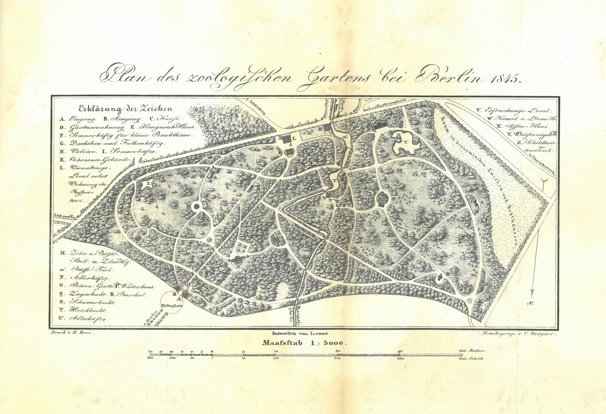

:::EN:::

English content goes here.

:::DE:::

**Clemens Maier-Wolthausen**

# Wie kommen die Tiere in Zoo und Museum?

*Summary*
>Lebende und tote Tiere für die Sammlungen des Zoologischen Gartens, Aquariums und Tierparks Berlin und des Museums für Naturkunde kamen und kommen aus unterschiedlichen Quellen. Diese haben ihre eigene Geschichte und kreieren unterschiedliche Herausforderungen für diese Einrichtungen - politische, logistische und moralische.

Bei jeder naturkundlichen Sammlung lebender oder präparierter Tiere stellt sich die Frage, mit welchen Mitteln sie gefüllt wird. Wie kommen die Tiere oder Spezimen in Zoos oder Naturkundemuseen? Daran schließen sich zwei wesentliche Fragen an:

* **Wer sammelt, fängt oder transportiert eigentlich die Spezimen, Felle, Gebeine, Präparate und lebenden Tiere in ein Museum oder einen Zoo?**

und

* **Wer entscheidet, was gesammelt wird?**

## Tierquellen

Eine Beantwortung dieser Fragen ist kompliziert. Sie betrifft Forschungszweige wie Wissensgeschichte, Institutionengeschichte der Zoos und Museen, die Wissenschaftsgeschichte der Taxonomie, der Ethologie, der Biologie und Zoologie sowie der Zoobiologie. Denn Präparate in Museen und Tiere in Zoos kommen aus unterschiedlichsten Quellen und sind mal durch Zufall, mal als Ergebnis langer Vorarbeit in die Institutionen gelangt. **Die Quellen der Tiere oder Tierobjekte unterlagen kontinuierlichen Änderungen und zu mancher Zeit waren die einen wichtiger, zu anderer eben andere.** Es gibt dennoch einige grundsätzliche Beobachtungen, die insbesondere im Abgleich der beiden Institutionen, Zoo und Museum, immer wieder auftauchen.

Da sind vor allem die beiden wichtigsten Quellen des Sammelns [[story.Collecting Specimen]] und Jagens [[story.Catching Animals]] im Feld, also in den Habitaten der Tiere. Museen und Zoos konnten sich zum Ende des 19. Jahrhunderts eines umfangreichen Netzwerks von professionellen Händlern ihrer Objekte aber auch engagierten Laiensammlern bedienen. Manchmal organisierten oder finanzierten sie sogar eigenen Expeditionen zur Beschaffung von Sammlungsobjekten - lebendig oder tot. [[story.Heck Expeditions]]

Hinzu kommt die über die Jahrhunderte konstant wichtige Quelle der Geschenke. [[story.Gifting Objects]] Insbesondere diese Quelle von Tieren hat in der Mehrheit der Fälle einen politischen Bezug oder ist in der einen oder anderen Form mit einer erwünschten Propagandawirkung verbunden. Auch die politische Geschichte - genauer die Geschichte der diplomatischen Beziehungen - kann daher die Fragen nach dem Ursprung der Tiere in Museen und Zoos beantworten. Denn die meisten Geschenke an Zoos und Naturkundemuseum waren nämlich diplomatische Geschenke fremder Herrscher und Regierungen. Hinzu kamen aber durchaus auch Geschenke von Bürgern des eigenen Landes, die selbst gefangene Tiere oder gesammelte Spezimen verschenkten.
Im Museum naturgemäß von geringer Bedeutung, im Zoo seit dem Verbot des Handels mit gefährdeten Tier- und Pflanzenarten durch das Washingtoner Artenschutzabkommen aber um so wichtiger: die Zucht [[story.Breeding Animals for the Zoo]] eigener Tiere. Weltweite durch Forschung gewonnene Erkenntnisse um die Bedrohung der irdischen Pflanzen- und Tiervielfalt wurden ergänzt durch immer größeres Wissen um die Fortpflanzungsbiologie und die Voraussetzungen für die Aufzucht von Jungtieren gefangen gehaltener Zootiere.

## Kosten und Logistik

Mit diesen unterschiedlichen Quellen an Tierobjekten hängen jeweils unterschiedliche Akquisestrategien und Handlungsanforderungen für die Institutionen zusammen. Das betrifft die Vorbereitung, die Logistik  rund um den Erwerb und die benötigten Arbeits- und Finanzmittel. Die Ausstattung einer eigenen Sammlungs- oder Fangexpedition benötigt neben den behördlichen Genehmigungen auch eine größere finanzielle Anfangsinvestition. Ein geschenktes Tierobjekt muss untergebracht und unterhalten werden. Für die Zucht in Zoos muss das notwendige biologische und tiermedizinische Wissen vorhanden sein und vor allem ausreichend Platz. Dieser wird nicht nur für die größere Gruppe benötigt, um mehr Tiere unterzubringen, auch vermehren sich Tiere in menschlicher Obhut seltener auf kleinem Raum. Werden Tierobjekte von Museen und lebende Tiere von Zoos gekauft, müssen die Geldmittel zur Verfügung stehen, es muss wiederum Platz vorhanden sein und das Tierobjekt muss in die eigene Ausstellungs- oder Forschungsstrategie passen. So sind die Objekte entweder interessant, weil sie neue Forschungen im Zusammenhang mit den bereits vorhandenen erlauben, einzigartig und neu sind oder aber großes Interesse seitens der Besucher\*innen erwarten lassen. [[Schauwert]] Klassische Beispiele für letzteres sind:

* große und möglichst vollständige Skelette von **Dinosauriern** oder **Walen** in Naturkundemuseen
* **Pandas** oder andere sehr **schauwertige Tiere** in Zoos.

*Ankunft von neuen Tieren für das Aquarium Berlin, um 1920. (AZGB)*

*Giraffentransport für den Zoo, 1928. (AZGB, Foto Wolter)*

## Geschenke von Herrschern und Gönnern

Die Fundamente des Berliner Naturkundemuseums [[story.Short History MfN]] und Zoologischen Gartens [[story.Short History Zoo]] waren Geschenke. Objekte aus dem "Naturalienkabinett" der Königlich Preußischen Akademie der Wissenschaften und der "Königlichen Kunstkammer" waren eine wichtige Sammlungsbasis des Museums, die später insbesondere durch Expeditionen ergänzt wurde. Aber nicht nur königliche Herrscher oder Adelige gaben, auch reiche Bürger übergaben ihre privaten Sammlungen dem Zoologischen Museum der 1810 gegründeten Berliner Universität.[^gifts1]

Die Basis für den 1844 gegründeten 'Zoologischen Garten bei Berlin' beruhte ausschließlich auf königlichen Geschenken. Sowohl das in Erbpacht für einen nominalen Preis überlassene Gelände im südlichen Teil des Tiergartens als auch Tiere und sogar Materialien für die Umzäunung des Geländes kamen aus königlichem Besitz. Friedrich Wilhelm IV. gestattete dem Gründungsdirektor und erstem Professor für Zoologie der Berliner Universität, Martin Hinrich Lichtenstein, aus den Tieren der königlichen Menagerie auf der Pfaueninsel diejenigen auszusuchen, die er auszustellen beabsichtigte. Die Tierhäuser der Pfaueninsel wurden abgebaut und im Zoo aufgestellt. Hinzu kamen mehrere großzügige zinslose Darlehen.[^gifts2]

*Plan des Zoologischen Gartens bei Berlin, 1845. (AZGB)*

In beiden Fällen wurden die königlichen Geschenke bald von Privatleuten, Gelehrten und Beamten ergänzt. Im Naturkundemuseum waren unter anderem Sammlungen des Entomologen Johann von Hoffmannsegg und Alexander von Huumboldt, die - möglicherweise auch durch finanzierung des Herrscherhauses - das Museum weiter bereicherten.[^gifts3] Auch der Zoo erhielt fortan Geschenke für seine Sammlung. So bat dessen Leitung Preußische Beamte udn Diplomaten in Übersee um Schenkungen.[^gifts4]

Heute schenken treue Freunde von Zoos aus Gründen des Artenschutzes keine lebenden Tiere mehr, Philanthropie spielt aber nach wie vor eine bedeutende Rolle, kamen doch zum Beispiel im letzten Geschäftsjahr vor der Pandemie 2019 fast 20 Prozent der Einnahmen des Berliner Zoos und etwa 10 Prozent der Einnahmen des Tierparks Berlin aus Spenden und Nachlässen. Zudem steigen die Zahlen an Patenschaften, die Besucher\*innen für Tiere eingehen. Damit unterstützen sie heute zwar nicht mehr den Erwerb, wohl aber den Erhalt der Tiere in den Einrichtungen.[^donations] Das gilt zum Beispiel auch, wenn indirekt durch Patenschaften für Jungtiere die Zucht einer Tierart in einem Zoo unterstützt wird.

### Koloniale Beute

Von der Expansion des europäischen Kolonialbesitzes profitierten schließlich beide Institutionen. Seit 1891 wurden in den Geschäftsberichten des Zoos regelmäßig Geschenke aus den Kolonialgebieten erwähnt. Mitglieder des kaiserlichen Haushaltes, Gouverneure, Kolonialgesellschaften und Kaufleute sandten dem Zoo seltene Tiere. 1907 hatte der Zoo elf Löwen und nur ein Tier war kein Geschenk aus den Kolonien.[^colonial1]

Jäger oder "Forschungsreisende" brachten lebendige Tiere für den Zoo und präparierte Kadaver für das Naturkundemuseum von ihren Reisen und Expeditionen zurück. Zumeist geschahen alle diese Expeditionen unter den Vorzeichen einer europäischen Dominanz, Selbsterhöhung und basierten auf demm Machtungleichgewicht zwischen den Kolonialländern und den zu erforschenden Regionen.
Das Naturkundemuseum erhielt in dieser Zeit auch vollständige Sammlungen von professionellen Naturkundlern und ambitionierten Laien. Bei diesen Geschenken war nicht immer eine vorherige Sammlungsabsicht abgesprochen oder das Geschenk planvoll angebahnt worden. Es sind opportunistische Sammlungszugänge, die mal mehr, mal weniger Zufällen unterlagen. Selten wurden die Geschenke auch zuvor aktiv gewünscht, was nicht heißt, dass sie nicht dennoch willkommen waren.

Geschenke blieben auch in den nächsten Jahren die wichtigste Quelle für Tiere für den Berliner Zoo. Von den ersten Elefanten des Zoos waren die meisten Geschenke, wie zum Beispiel die indischen Elefantenbullen "Rostom" und "Omar", die der Prinz von Wales seinem Cousin dem Kronprinzen aus dem indischen Kolonialreich vermachte, der sie wiederum an den Zoo gab.

*Die beiden asiatischen Elefantenbullen "Rostom" und "Omar", um 1885. "Rostom" hatte untypischerweise keine Stoßzähne. (AZGB)*

Auch später als der internationale Tierhandel [[story.Trading Animals]] bereits einen großen Teil der Tiere für die internationalen Tiergärten beschaffte, blieben Geschenke wertvolle Ergänzungen der Sammlungen. Zu den Geschenken deutscher 'Forschungsreisender' gehörte zum Beispiel das "Deutsch-Ostafrikanische Nashorn“ von Carl Georg Schillings, das dieser 1904 dem Zoo gab.

- [ ] Bild des Nashorns S 7/35

Auch als  Hans Schomburgk das als ausgestorben angesehene Zwergflusspferd wieder entdeckte, kam durch ihn ein Exemplar im Berliner Zoo. Er brachte auch die Schimpansin Susi in den Zoo, die viele Besucherinnen und Besucher anzog.

- [ ] Bild Susi?

Sogar die Deutsche Südpolarexpedition schenkte dem Zoo Tiere. In diesem Fall waren es Schlittenhunde, die die Expedition begleitet hatten.

Einen besonderen Platz nehmen ab etwa 1890 die direkt aus den neuen deutschen Kolonien verschickte Geschenke deutscher Kolonialbeamter, Kolonialgesellschaften oder anderer Reisender ein. Der Kolonialbeamte [[material.Hermann Wissmann]] brachte 1897 den sogenannten [[material.Wissmann-Lion]] aus Deutsch-Ost-Afrika in den Berliner Zoo.

- [ ] Materialhinweis oder aber Bild des Löwen? 

## Kulturelle Diplomatie - Auch heute noch Geschenke

Tiergeschenke bildeten seit jeher eine besondere Form der kulturellen Diplomatie. Schon Karl der Große unterhielt im 8. Jahrhundert auf seinen Pfalzen Menagerien, in denen die Geschenke anderer Fürsten untergebracht waren. Exotische Tiere waren Ausweis von Macht, sie zu fangen, zu besitzen und am Leben zu erhalten zu können zeigte die eigene Bedeutung. Sie zu verschenken potenzierte dieses Bild. So hatten Tiere als Geschenke neben ihrem reinen finanziellen auch einen kulturellen Wert.[^culturald1] Aber auch in den letzten Jahrzehnten des 20. Jahrhunderts wurden lebende Tiere als Objekte einer kulturellen Diplomatie verwendet. Die chinesischen Regierungen versandten seit etwa Mitte der 1970er Jahre Exemplare des stark bedrohten Großen Pandas in Zoos von Ländern, mit denen zu diesem Zeitpunkt besondere Beziehungen wünschten.
[hier mehr zu kolonialen Kontexten auch außerhalb der eigentlichen Geschenke und der deutschen Kolonien]
[hier mehr zu eben jenen Geschenken und geschenkten Sammlungen an das Museum]

Das nachweislich älteste Tiere des Berliner Zoos war 2021 der Flamingo „Ingo. Der Vogel aus der Gattung der Rosaflamingos kam wohl im Juli 1955 aus dem gerade eröffneten Tierpark in Berlin Friedrichsfelde. Ein Ring weist darauf hin, dass das männliche Tier 1948 im Zoo von Kairo geboren wurde.[^1]

## Tierhandel

- Ursprünge
- Monopole
- Professionalisierung
- Ausbeutung

## Eigene Expeditionen

Eine im Zoo seltener, im Naturkundemuseum häufiger genutzte Quelle von Tieren und Objekten waren selbst organisierte oder unterstützte Expeditionen.

- Schäfer Tibet Museum

Im Berliner Zoo wurden eigene Fangexpeditionen nur in einem sehr begrenzten Maß durchgeführt. [[material.Oskar Heinroth]], der selbst Expeditionserfahrung aus seiner früheren Karriere hatte, fuhr in der ersten Hälfte des 20. Jahrhunderts regelmäßig in die bei Rovigno an der Adria gelegene Zoologische Station der Kaiser-Wilhelm-Gesellschaft und brachte stets neue Tiere für das Berliner Aquarium [[story.Short History Aquarium]] mit. Noch 1942 stellte er einen Tiertransport dort zusammen.[^expeditions2] Auch im Naturkundemuseum gab es Pläne für eine Zusammenarbeit mit der Forschungsstation.[^expeditions1]

- Lutz Heck Zoo [[story.Heck Expeditions]]

## Zucht

[[story.Breeding Animals for the Zoo]]

* Orangs als frühes Beispiel für Schutz
* Steinbock und Wisent
* Artenschutzzentrum Zoo
* Leibniz Institut für Diversitätsforschung

in den Sitzungen des VDZ der 1960er ist der Schutz der Orangs immer wieder Thema und wird widersprüchlich diskutiert - es scheint als wollten einge Direktoren schlicht nicht auf Orangs verzichten.

*In diesen Becken züchtete das Berliner Aquarium Ende der 1990er Jahre erfolgreich Quallen. (AZGB)*

## Dublettenhandel und Tiertausch zwischen Zoos

Insbesondere das Naturkundemuseum
Eng mit der Zucht verbunden, nicht aber stets und immer der Grund dafür, ist der Tiertausch zwischen den Zoos. Spätestens seit der Gründung des Verbandes Deutscher Zoodirektoren haben Zoos im deutschen Sprachraum regelmäßig individuelle Tiere oder auch Tiergruppen getauscht. Der Hintergrund wird stets eine 

----
## Footnotes

[^gifts1]: Vgl. Giere, Peter, Peter Bartsch, und Christiane Quaisser. 2018. „Berlin: From Humboldt to HVac - The Zoological Collections of the Museum für Naturkunde Leibniz Institute for Evolution and Biodiversity Science in Berlin“. In Zoological Collections of Germany, herausgegeben von Lothar A. Beck, 89–122. Cham: Springer International Publishing und Damaschun, Ferdinand, und Hannelore Landsberg. 2010. „‚...so bleiben dem materiell Gesammelten und geographisch Geordnetem fast allein ein langdauernder Werth‘ - 200 Jahre Museum für Naturkunde“. In Art, Ordnung, Klasse: 200 Jahre Museum für Naturkunde, herausgegeben von Ferdinand Damaschun, Sabine Hackethal, Hannelore Landsberg, und Reinhold Leinfelder, 13–23. Rangsdorf: Basilisken-Presse.

[^gifts2]: Zur Gründungsgeschichte des Berliner Zoos vgl. Maier-Wolthausen, Clemens. 2019. Hauptstadt der Tiere. Die Geschichte des ältesten deutschen Zoos. Berlin: Ch. Links Verlag.

[^gifts3]: Bartsch, und Quaisser (2018): 94-99.

[^gifts4]: Maier-Wolthausen (2019): 33-38.

[^colonial1]: Geschäftsberichte über die Jahre 1891-1914, hier insb. Geschäftsbericht über das Jahr 1907.

[^expeditions1]: Eckert, Carsten. 2010. "Ein U-Boot für die Wissenschaft - Mäzenatentum im Kaiserreich, Aspekte aus dem Nachlass von Walther Arndt". In Art, Ordnung, Klasse: 200 Jahre Museum für Naturkunde, herausgegeben von Ferdinand Damaschun, Sabine Hackethal, Hannelore Landsberg, und Reinhold Leinfelder, 170–75. Rangsdorf: Basilisken-Presse.

[^expeditions2]: Heinroth, Katharina. 1971. Oskar Heinroth. Bd. 35. Große Naturforscher. Stuttgart: Wissenschaftliche Verlagsgesellschaft: 169.

[^culturald1]: Hier Dittrich oder Maier-Wolthausen

[^donations]: Zoologische Gärten Berlin: Geschäftsbericht 2019 (https://www.zoo-berlin.de/fileadmin/zoo-berlin/downloads/Investor_Relations/Geschaeftsberichte/Geschaeftsbericht_AG_2019.pdf)
