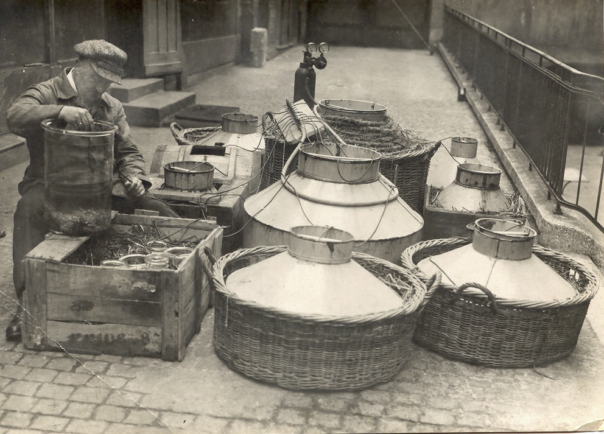
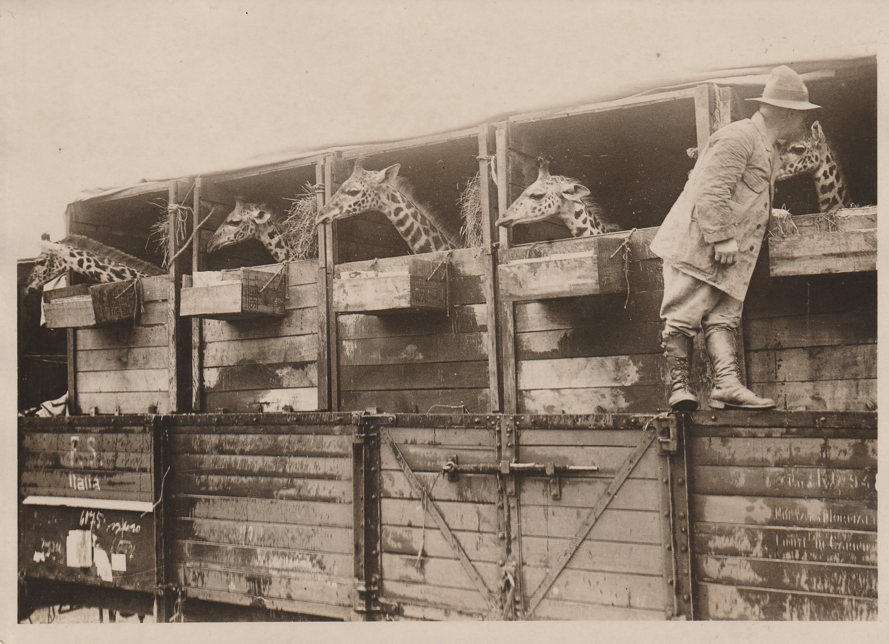

:::EN:::

English content goes here.

:::DE:::

Bei jeder Sammlung lebender Tiere, ob Tierpark, Wildgehege oder Zoologischer Garten, stellt sich die Frage, mit welchen Mitteln sie gefüllt wird. Die Beantwortung dieser Frage bündelt eine ganze Reihe wichtiger Themen rund um die Fragen von Wissenschaft, Haltungsbedingungen und Politik in allen Tiergärten und sie betrifft Forschungszweige wie Wissensgeschichte, Institutionengeschichte der Zoos, die Wissenschaftsgeschichte der Taxonomie, der Ethologie, der Biologie, Zoologie und der Zoobiologie aber auch die Geschichte des Umwelt- und Artenschutzes und des internationalen Rechts. Denn Tiere in Zoos kamen und kommen aus unterschiedlichsten Quellen und sind mal durch Zufall, mal als Ergebnis langer Vorarbeit in die Institutionen gelangt. Ihre Wege dahin spiegelten stets auch **geopolitische, ökonomische und wissenschaftliche Dynamiken** wider. Manche Formen des Tiererwerbs oder der Tierakquise kamen erst spät in der mehr als 250-jährigen Geschichte der 'modernen' Zoos hinzu. Es gibt aber auch einige grundsätzliche Tierquellen, die kontinuierlich eine wichtige Rolle einnehmen. Es geht also um **Veränderungen und Kontinuitäten**.

## Jagen und Schenken

Zur Zeit der Gründung der ersten - 'modern' oder 'wissenschaftlich' genannten - Zoologischen Gärten in Europa, um die Mitte des 19. Jahrhunderts, waren quasi **alle dort ausgestellten und nicht einheimischen Tiere sogenannte [[Wildfänge|material.animals caught in the wild]]**. Sie waren also in ihren natürlichen Lebensräumen gejagt, [[gefangen|story.Catching Animals]] und aus ihnen entfernt worden. Einheimische Tierarten stammten ebenso nicht selten aus den Wäldern, Steppen, Wiesenlandschaften, Auen oder von den Küsten des eigenen Territoriums und waren dort zuvor gefangen und entnommen worden. Oft aber dominierten hier bereits Zuchten aus den früher angelegten [[Menagerien|story.early zoo history]] der herrschaftlichen Anwesen oder frühen Tiersammlungen von Städten. Das betraf insbesondere Huftierarten, Fasane und einheimische Nagetiere.

Viele der nicht einhemischen Tiere waren [[Geschenke|story.Gifting Objects]] an die Zoos durch die jeweils herrschenden Territorialfürsten. Diese wiederum hatten sie von 'Entdeckunsgreisenden' oder ihren Kolonialbeamten übersandt bekommen oder Hofmitglieder sowie Adelige hatten sie selbst gefangen oder angeboten bekommen. Insbesondere diese Quelle von Tieren hat in der Mehrheit der Fälle einen politischen Bezug oder war in der einen oder anderen Form mit einer erwünschten Propagandawirkung verbunden. Hier kann die politische Geschichte – genauer die Geschichte der diplomatischen Beziehungen – daher helfen, die Fragen nach den Quellen der Tiere in Zoos zu beantworten. Dem Besitz dieser Tiere wurde ein diplomatischer Wert zugeschrieben. Je seltener, größer, schwerer, gefährlicher oder neuer ein Tier entdeckt war, desto größer war dieser. Das hing damit zusammen, dass die Beschaffung jener Tiere oft hohe Kosten verursachte und die Tiere daher auch einen finanziellen Marktwert hatten, der durch den Akt des Schenkens in einen diplomatischen Wert übersetzt wurde.

_Die beiden asiatischen Elefanten "Omar" und "Rostom" waren 1881 Geschenke des mit dem preußischen Königshaus verwandten britischen Hofs. (AZGB)_

Diese Geschenkpraxis setzte sich mit der Expansion der europäischen Kolonien fort, von der alle Zoos und auch der Berliner Zoologische Garten profitierten. Seit 1891 wurden in dessen Geschäftsberichten regelmäßig Geschenke aus den Kolonialgebieten erwähnt. Mitglieder des kaiserlichen Haushaltes, Gouverneure, Kolonialgesellschaften und Kaufleute sandten dem Zoo seltene Tiere. 1907 besaß er elf Löwen und nur ein einziges Tier war kein Geschenk aus den Kolonien.[^colonialDE1]

Geschenke waren in den ersten Jahrzehnten seiner Existenz die wichtigste Bezugsquelle für Tiere für den Berliner Zoo. Das galt auch für den [[Tierpark Berlin|story.Short History Tierpark]]. Dieser erhielt Unterstützung durch Geschenke an die junge DDR und ihren noch jüngeren 'Hauptstadt-Tierpark' aus sozialistischen Ländern.

Wie in [[story.Gifting Objects]] beschrieben wird, haben diese politischen Geschenke oder Leihgaben in Einzelfällen bis heute ein großes Gewicht in den Berliner Tiergärten. In den letzten drei Jahrzehnten des 19. Jahrhunderts kam aber bereits eine weitere wichtige Tierquelle, die ebenso weitgehend auf der Ausbeutung der in den natürlichen Lebensräumen lebenden Tierppopulationen beruhte, auf – der Tierhandel.[^entnahmeDE1]

## Internationaler Tierhandel

Ausführlich wird in [[story.Catching Animals]] über den wachsenden und immer professioneller organisierten Tierhandel berichtet. Von seinen Anfängen mit Gelegenheitskäufen kleinerer Tiere, die von Reisenden oder Matrosen an Bord der Schiffe aus den sich ausweitenden kolonialen Handelsstützpunkten in europäische Häfen kamen, entwickelten Tierhandelsfirmen ausgeprägte Netzwerke von Fängern und Agenten in den Kolonien. Das Geschäftsmodell beruhte auf dem System kolonialer Ausbeutung, das billige lokale Arbeitskraft und die Verfügungsgewalt von Europäern über die Umwelt anderer Erdregionen bedingte.

Zoos konnten sich zum Ende des 19. Jahrhunderts aus umfangreichen Angeboten mehrerer professioneller Händler bedienen. Auch den Museen boten berufsmäßige Händler naturwissenschaftlicher [[Spezimen|story.Collecting Specimen]] nun eine scheinbar unerschöpfliche und in Katalogen angebotene Vielfalt von Objekten an. Die großen Händler bündelten oft ihre Transporte im Ursprungsgebiet und versorgten dann mehrere Zoos aus den überlebenden Tieren eines Transports.

_Ankunft von neuen Tieren für das Aquarium Berlin, um 1920. (AZGB)_

Manchmal organisierten oder finanzierten Zoos sogar eigene Expeditionen zur Beschaffung von Tieren. Zunächst im Zoo von London und besonders in amerikanischen Zoos waren diese Expeditionen nicht nur eine Bezugsquelle neuer Tiere, sie boten vor allem eine 'Begleitmusik' aus Veröffentlichungen und Zeitungsberichten, die sich zur Werbung eigneten. Im Berliner Zoo wurden eigene Fangexpeditionen nur in einem sehr begrenzten Maß durchgeführt. Der spätere Zoodirektor [[material.Lutz Heck]] organisierte in den 1920er und 1930er Jahren mindestens drei [[Tierfangexpeditionen|story.Heck Expeditions]], die neben dem Tiernachschub vor allem der eigenen Werbung dienten.

*Giraffentransport für den Zoo, 1928. (AZGB, Foto Wolter)*

Die begleitenden Veröffentlichungen in Zeitungen, Büchern und als abendfüllende Kinofilme bedienten dabei die vorherrschenden Stereotypen über die Menschen in den Erdregionen, in denen die Tiere gefangen wurden, siehe auch [[story.Colonial Imagery]].

Nach dem Ende des Zweiten Weltkriegs blühte der durch das weltweite Morden unterbrochene Tierhandel kurzfristig wieder auf, aber es deutete sich bereits auch dessen baldiges Ende an. Immer mehr Regierungen der sich die Unabhängigkeit erkämpfenden Länder in Afrika und Asien und auch die verbleibenden Kolonialregierungen verhängten stärkere Kontrollen über die Entnahme lebender Tiere.

## Die Zucht von Zootieren und das Ende des Tierhandels

Bot die Zerstörung in Europa den Tierhändlern Ende der 1940er und in den 1950er Jahren noch einmal ein gutes Geschäft, da alle Zoos nun ihre Gehege reparierten und wieder besetzen wollten, so wurde zunehmend klar, dass immer mehr Regierungen oder Kolonialmächte nun die Ausfuhr von Tieren regulierten. Zwar hatten wohl nicht die Tierfänger sondern die gewerbliche Jagd und die Zerstörung der Lebenswelten für den massiven Rückgang vieler Tierarten überall auf der Welt gesorgt, von den zunehmenden Regulierungen waren sie aber auch betroffen.

Zoodirektoren gehörten zu den ersten, die in Deutschland beruflich das Ausmaß des Artenrückgangs spürten. Sie standen aber vor einem Dilemma. Auf die gefährdeten aber hoch schauwertigen Tiere zu verzichten bedeutete für einige, dass sie Angst hatten, ihnen würden die Besucher\*innen abhanden kommen, wenn sie diese 'exotischen' Tiere nicht mehr ausstellten, deren Schau bislang mit einem besonderen Prestige verbunden war. Den 'artenreichsten' Zoo Deutschlands, Europas oder gar der Welt zu haben, galt ihnen als Aushängeschild. Weder deutsche noch internationale Zoodirektoren waren sich über die zu treffenden Maßnahmen einig. Einige zögerten, sich selbst Restriktionen für die Einfuhr bedrohter Tierarten aufzuerlegen. Sie sahen ihre Tiergärten als mögliche Auffang- und Zuchtstationen für die gefährdeten Arten, andere sahen Zoos direkt in der Verantwortung und befürworteten strenge Regeln für die Einfuhr und Haltung von gefährdeten Spezies, siehe auch [[story.Zoos and Conservation]].

Letztlich setzte Mitte der 1970er Jahre das Übereinkommen über den internationalen Handel mit gefährdeten frei lebenden Tieren und Pflanzen ([[Convention on International Trade in Endangered Species of Wild Fauna and Flora|story.Cites]]) den allermeisten strenge Grenzen für den Kauf oder Tausch mit gefährdeten Tierarten. Das sogenannte Washingtoner Artenschutzabkommen war für Zoos daher auch ein Anlass die Zucht eigener Tiernachkommen zu intensivieren.

Zwar gab es seit dem ersten erfolgreichen Beispiel einer Erhaltungszucht durch Zoos, der des Wisents, weitere wie die Zucht und letztlich erfolgreiche Wiedereinbürgerung des Alpensteinbocks, die durch gemeinsame Anstrengungen internationaler Zoos zustande kamen. Die planvollen und von vielen Zoos getragenen Initiativen für gemeinsame Zuchtgruppen, die nun folgten, waren aber wesentlich durch die Restriktionen für den Handel durch das Washingtoner Abkommen bedingt. Zoos waren bei einigen der bei den Besucher\*innen begehrtesten Tierarten darauf angewiesen, die in menschlicher Obhut gehaltenen Populationen durch gemeinsame Zuchtanstrengungen – genetisch divers – zu erhalten. Mehr dazu und der Frage, ob diese Programme eine Säule in der Erhaltung gefährdeter Arten weltweit sein könnten in [[story.Breeding Animals for the Zoo]].

Mit dem wachsenden Erfolg von Zuchtprogrammen versuchten sich Zoos und Aquarien zunehmend an der Zucht bis dahin nur selten oder selten erfolgreich – also mit langer Lebensdauer und regelmäßigem Nachwuchs – gezüchteter Spezies. Im [[Berliner Aquarium|story.Short History Aquarium]] gelang es in den 1990er Jahren zum ersten Mal dauerhaft verschiedene Quallenspezies zu züchten und so den Besucher\*innen zu zeigen.

_In diesen Becken züchtete das Berliner Aquarium Ende der 1990er Jahre erfolgreich Quallen. (AZGB)_

## Zoos und Tierparks zwischen Pragmatik, Freizeitunternehmen und Artenschutzstrategien

Mit den erwähnten unterschiedlichen Bezugsquellen von Tieren hingen und hängen jeweils unterschiedliche Akquisestrategien und Handlungsanforderungen für die Institutionen zusammen. Das betrifft die Vorbereitung, die Logistik  rund um den Erwerb und die benötigten Arbeits- und Finanzmittel. Die Ausstattung einer eigenen Sammlungs- oder Fangexpedition benötigt neben den behördlichen Genehmigungen auch eine größere finanzielle Anfangsinvestition. Ein geschenktes Tierobjekt muss untergebracht und unterhalten werden. Für die Zucht in Zoos muss das notwendige biologische und tiermedizinische Wissen vorhanden sein und vor allem ausreichend Platz. Dieser wird vor allem für die größeren Sozialgruppen benötigt, um mehrere Tiere unterzubringen.

Wurden lebende Tiere von Zoos gekauft, mussten die Geldmittel zur Verfügung stehen und es musste ausreichend Platz vorhanden sein. Die gehaltenen Tierarten aber auch individuelle Gruppen einer Art sollten in die eigene Haltungs-, Bildungs-, Ausstellungs- oder Forschungsstrategie passen.

Ein Blick auf die Geschichte nicht nur der Berliner Tiergärten zeigt, dass diese Strategien zwar vorhanden sind, ein wesentlicher Anteil der Bemühungen um Tiere aber damit zusammenhing, dass diese einzigartig und neu waren oder aber großes Interesse seitens der Besucher\*innen erwarten ließen. Klassische Beispiele für letzteres sind **Pandas** oder die **'Big Five'** in Zoos:
- Menschenaffen
- Elefanten
- Raubtiere, insbesondere Raubkatzen
- 'niedliche Tiere' wie Pinguine oder Erdmännchen
- 'außergewöhnliche Tiere' wie Giraffen oder Tapire.

Ihre Anziehungskraft beruht darauf, dass sie uns ähnlich, riesig, gefährlich, 'süß' und aufrecht stehend sind oder besondere Merkmale aufweisen.[^bigDE1] Mehr zu diesen 'Schauwerttieren' auch in [[story.native and exotic]] und bei [[theme.Exhibiting]].

Letztlich scheint es, als seien Zoos – darunter auch der Berliner Zoo, sein Aquarium und der Tierpark – was die Bezugsquellen ihrer gehaltenen Tierarten aber auch einzelner Tiere angeht lange Zeit ihres Bestehens vor allem Pragmatiker gewesen. Tiere zu 'haben' und diese den Besucher\*innen zugänglich zu machen war ein wesentliches Ziel. Im Ost-Berliner Tierpark stand eine riesigen Fläche von mehr als 100 Hektar zur Verfügung, die mit Tiergehegen oder größeren Herden gefüllt werden sollte während sich der West-Berliner Zoo bemühte, seinen Ruf als artenreichster Zoo der Welt zu behaupten. Letzteres hing in der von Subventionen aus der Bundesrepublik abhängigen Stadt auch damit zusammen, dass alles in West-Berlin letztlich einem Legitimationszwang unterlag. Der artenreichste Zoo der Welt war ein Tourismusmagnet in der 'Frontstadt' des Kalten Kriegs.

Seit einigen Jahren lassen sich neue Tendenzen wahrnehmen, die international und auch in der Bundesrepublik und in Berlin Tiergärten verändern. Stärker als bislang treten strategische Überlegungen an die Stelle des Pragmatismus. Wachsende Kritik der Haltungsbedingungen in Zoos und Fragen nach ihrer zukünftigen Rolle in naturkundlicher Bildung und Artenschutz ex situ (also in den Zoos durch Zucht) und in situ (in den ursprünglichen Lebensräumen der Tiere) haben zu einer Umkehr von der 'pragmatischen Sammelleidenschaft' früherer Zoodirektoren geführt. Allenthalben sehen Beobachter\*innen nun eine zahlenmäßige Verkleinerung der gehaltenen Tierarten zugunsten größerer Gehege und die Konzentration auf sogenannte Flaggschiffarten – also "gefährdete Tierarten mit einem hohen Schauwert, über deren Schutz man gleichzeitig den Schutz vieler anderer Tierarten erreicht, die den Lebensraum mit ihnen teilen."[^flagshipDE1] Solch eine Strategie entspricht der 2015 vom Weltverband der Zoos und Aquarien verabschiedeten "Conservation Strategy".[^wazaDE1] Ob das eine wirksame Neuausrichtung der Zoos bedingen kann, ist umstritten.[^apuzDE1] Denn ganz hat der Pragmatismus noch keinen Zoo verlassen: Zuchtprogramme bleiben weiterhin wichtig, um die 'Lieblinge' der nach wie vor zahlreichen Besucher\*innen in den Zoos zu erhalten. Vielleicht erwirtschaften diese ja die Einnahmen zur Erzielung neuer strategischer Ziele?

## Footnotes

[^giftsDE1]: Vgl. Giere, Peter, Peter Bartsch, und Christiane Quaisser. „Berlin: From Humboldt to HVac - The Zoological Collections of the Museum für Naturkunde Leibniz Institute for Evolution and Biodiversity Science in Berlin“. In _Zoological Collections of Germany_, herausgegeben von Lothar A. Beck, 89–122. Cham: Springer International Publishing, 2018. https://doi.org/10.1007/978-3-319-44321-8_11 und Damaschun, Ferdinand, und Hannelore Landsberg. „‚...so bleiben dem materiell Gesammelten und geographisch Geordnetem fast allein ein langdauernder Werth‘ - 200 Jahre Museum für Naturkunde“. In _Klasse, Ordnung, Art: 200 Jahre Museum für Naturkunde_, herausgegeben von Ferdinand Damaschun, Sabine Hackethal, Hannelore Landsberg, und Reinhold Leinfelder, 13–23. Rangsdorf: Basilisken-Presse, 2010.

[^giftsDE2]: Zur Gründungsgeschichte des Berliner Zoos vgl. Maier-Wolthausen, Clemens. _Hauptstadt der Tiere. Die Geschichte des ältesten deutschen Zoos_. Herausgegeben von Andreas Knieriem. Berlin: Ch. Links Verlag, 2019.

[^giftsDE3]: Bartsch, und Quaisser (2018): 94-99.

[^giftsDE4]: Maier-Wolthausen (2019): 33-38.

[^colonialDE1]: Geschäftsberichte über die Jahre 1891-1914, hier insb. Geschäftsbericht über das Jahr 1907.

[^donationsDE1]: Zoologische Gärten Berlin: Geschäftsbericht 2019 (https://www.zoo-berlin.de/fileadmin/zoo-berlin/downloads/Investor_Relations/Geschaeftsberichte/Geschaeftsbericht_AG_2019.pdf)

[^entnahmeDE1]: Vgl. für eine Übersicht der Einfuhren nicht-heimischer Tierarten: Dittrich, Lothar. „Der Import von Wildtieren nach Europa - Einfuhren von der frühen Neuzeit bis zur Mitte des 20. Jahrhunderts“. In _Tiere unterwegs. Historisches und Aktuelles über Tiererwerb und Tiertransporte_, herausgegeben von Helmut Pechlaner, Dagmar Schratter, und Gerhard Heindl, 3:1–64. Tiergarten Schönbrunn - Geschichte. Wien: Braumüller, 2007.

[^bigDE1]: Meier, Jürg. _Handbuch Zoo: moderne Tiergartenbiologie_. 1. Auflage. Bern Stuttgart Wien: Haupt Verlag, 2009: 115-120.

[^flagshipDE1]: Meier (2009): 121.

[^wazaDE1]: Grajal, Alejandro, Jerry F. Luebke, und Lisa-Anne DeGregoria Kelly. „Why Zoos Have Animals: Exploring the Complex Pathway from Experiencing Animals to Pro-environmental Behaviors“. In _The ark and beyond: the evolution of zoo and aquarium conservation_, herausgegeben von Ben A. Minteer, Jane Maienschein, James P. Collins, und George B. Rabb, 192–203. Convening science: discovery at the marine biological laboratory. Chicago: The University of Chicago Press, 2018.

[^apuzDE1]: Vgl. Niekisch, Manfred, und Volker Sommer. „Artenschutz durch Zoos. Zwei Perspektiven“. _Aus Politik und Zeitgeschichte_ 71, Nr. 9 (2021): 31–38.
