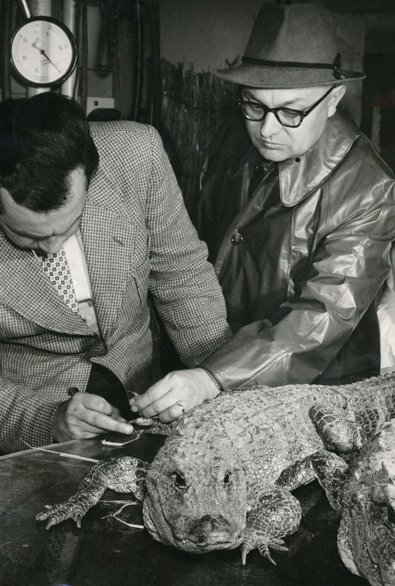
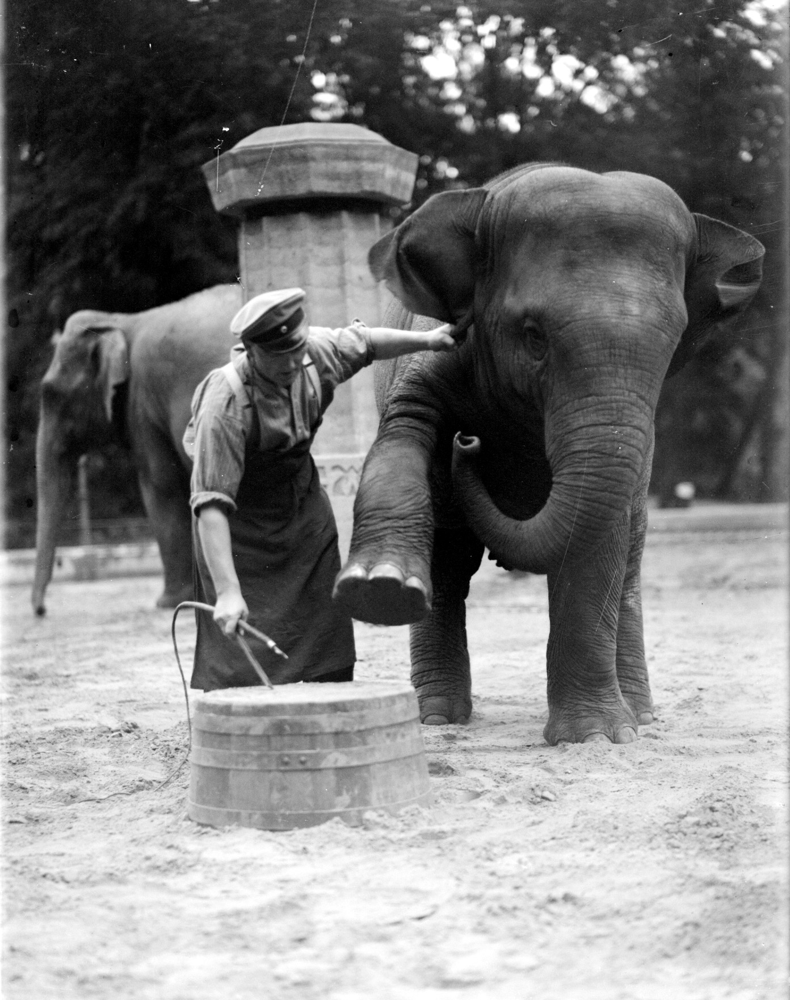

:::EN:::

English content goes here.

:::DE:::

## Zoos und Museen sind Tiersammlungen

Zoos, Tierparks, Aquarien, Naturkundemuseen - sie alle sind naturkundliche Sammlungen. Sie enthalten in eingezäunten oder von Gräben umschlossenen Gehegen,  Tierhäusern oder in Vitrinen und auf Podesten ausgestellte lebende Tiere aber auch 'ausgestopfte', in Alkohol aufbewahrte oder nach den neuesten Erkenntnissen der Präparierkunst konservierte Tierhäute, Knochen, Felle, Schädel oder auch Organe von tierischen Organismen.

**Das kunstvoll präparierte Schaupräparat, das in den Dioramen der Naturkundemuseen wie lebensecht dargestellte Tier, ist nicht die Regel. Zwar nehmen die Besucherinnen und Besucher dieses am meisten wahr, hinter den Kulissen der Museen aber befinden sich die oft um ein Vielfaches größeren 'wissenschaftlichen Sammlungen' der Häuser.** In diesen finden unzählige Objekte, die Forscher\*innen aus aller Welt als Quellen oder Vergleichsmaterial ihrer wissenschaftlichen Arbeiten dienen. Mal sind es vollständige Skelette, mal sind es gar nur fossile Knochenteile. Die wissenschaftlichen Sammlungen des Naturkundemuseums umfassten 2021 mehr als 30 Millionen Objekte. Davon bekommen die Besucherinnen und Besucher selbstverständlich nur einen kleinen Teil in den öffentlich zugänglichen Räumen des Museums zu sehen.
**Bei Zoos ist die Trennung in unterschiedliche Sammlungen nicht vorhanden.** Wohl aber gibt es Räumlichkeiten, in denen Tiere aus unterschiedlichen Gründen isoliert werden können, sei es, weil sie tragend sind oder gebären, oder weil sie krank sind und von den Artgenossen isoliert werden. Im Tierpark Berlin lebte der alte China-Alligator "Mao" die letzten Jahre seines langen Lebens von den Besuchern und kampflustigen jüngeren Artgenossen unbehelligt in einem Becken hinter den Kulissen. 

*China-Alligator "Mao" wird nach seiner Ankunft im Mai 1957 durch Tierparkdirektor Heinrich Dathe und den Oberassistenten untersucht. (AZGB)*

Manche Tierarten werden bei zu kaltem Wetter in den Tierhäusern eingesperrt oder aber haben die Möglichkeit sich selbst auszusuchen, wo sie sich aufhalten wollen. In der Regel aber sind die allermeisten Zootiere für die Besucher sichtbar, wenn sie sich nicht entscheiden, sich zu verstecken.

## Taxonomie oder Geozoo?

### Das Diorama und die Familiengruppe

Die Art und Weise wie Museen Tierobjekte ausstellten und austellen war in den letzten 200 Jahren großen Änderungen ausgesetzt. gesellschaftliche und wissenschaftliche Veränderungen spielten hier gleich große Rollen.
Zum Inbegriff friedvoller sozialer Beziehungen und somit zum eingängigen Identifikationsangebot wurde die Familie. Die Tierfamilie repräsentierte das Modell der bürgerlichen Kleinfamilie und stellte das Familien Leben als Hort der Verlässlichkeit und des Friedens dar. Wo darüber hinaus Einstiegsmöglichkeiten, um auch ‘Heimat’ und ‘Nation’ als geschützte Innenräume zu imaginieren (Naturschutz, Heimatschutz, Verteidigung der Nation). […] Der politische Raum wurde seinerseits neu artikuliert. Denn im Zuge der Reform naturkundlicher Schausammlungen ‘vernaturwissenschaftlichte’ sich die Darstellung politischer Gebiete. An die Stelle von ‘Vaterland’ und ‘Nation’ trat ‘Heimat’ im Sinne eines Naturraums. Das wissenschaftliche Rüstzeug dafür entstammte der Tiergeographie. Ihre erkenntnisleitenden Kategorien “tiergeografische Region” und “charakteristisches Tier” wurden zu Stützpfeilern biologisch-ökologischer Darstellungen von Heimat.[^1] Lorem ipsum

### Taxidermy

Jemand der auf der praktischen Seite der Naturkunde eine große Rolle für die Änderungen in den Ausstellungsformen hatte war [[material.Philipp Leopold Martin]]. Martin arbeitete zwischen 1852 und 1858 als Präparator für das [[material.Zoologisches Museum]]. Für ihn waren die traditionellen Präparate und ihre Ausstellung in immer gleichen Reihen von gleich dargestellten und starren Präparaten Ausdruck einer unglücklichen Vorrangstellung der Wissenschaftler, die sich ausschließlich mit Taxonomien ([[theme.taxonomical orders]]) befassten. Für ihn ignorierten diese die Charakteristiken, die Naturalisten im Feld aus dem bewegten, lebenden Objekt bezogen und die nur mit einer "natürlichen" und "lebendigen" Darstellung des einst lebenden Tieres im Präparat wiedergegeben werden konnten.
Für martin war ein 'Sammlungswahn' der Taxonomen mitverantwortlich für die endlose Monotonie in den Museen. Für diese war die Anzahl der ausgestellten Exemplare eines Taxons mit kleinsten äußerlich wahrnehmbaren Unterschieden wichtiger als das aussagekräftige lebensnahe Modell.

### Zoomonotonie

Hier gab es Überschneidungen mit den traditionellen Zoos. Besucher\*innen des Berliner Zoologischen Garten um die Jahrhundertwende des 19. zum 20. konnten durchaus auch hier, bei den lebenden Tieren eine solche Monotonie empfinden. [[material.Ludwig Heck]] war ein großer Sammler. Auch wenn es nie verwirklicht werden konnte, so stand für ihn doch zumindest theoretisch das Ziel, die Fauna der Welt komplett abzubilden. Wie seine Vorgänger nahm er an, dass sich die Besucher\*innen durch das Wandeln durch den Garten, vorbei an den verschiedenen Formen eines Taxons, die Unterschiede selbst erschließen und die richtigen wissenschaftlichen Erkenntnisse daraus gewinnen würden. Die frühern 'modernen' Zoos glichen einer Briefmarkensammlung auch in soweit, dass sie möglichste Vollständigkeit anstrebten und von jedem Typ ein Exemplar reichte.[^2] Der 'systematische Zoo' mit seinen Exemplaren einer Gattung aus unterschiedlichen geografischen Regionen nebeneinander bot aber weder den Tieren noch dem Publikum aus heutiger Sicht Vorteile. Sozial lebende Tiere wurden oft nur als Einzelexemplare in kleinen Gehegen oder Käfigen gehalten. Bei Tierarten, die einen Geschlechtsdimorphismus [[material.sexual dimorphism]] aufweisen wurden oft nur die als 'typischer' empfundenden männlichen Exemplare ausgestellt. Die Tiere konnten natürliches Verhalten nicht ausleben und die Besucher\*nnen konnten wenig lernen, zumal die Beschriftungen nur wenig aussagekräftig waren. Sie erfuhren oft nichts als den lateinischen Artnamen. Informationen über den Lebensraum, Ernährungsweise oder die Fortpflanzung fehlten. Es war die Zoo-Entsprechung des Museumslabels an den Präparaten. Anders als im Museum, wo eine Trennung in eine wissenschaftliche Sammlung und eine Schausammlung dieses Problem zumindest etwas auflöste, mussten Publikum und Tiere in den meisten Zoos noch eine Weile warten. Bis in das erste Jahrzehnt des 21. Jahrhunderts wiesen Zoo und Tierpark noch diesen Sammlungscharakter eines systematischen Zoos auf.

Hier gab es Überschneidungen mit den traditionellen Zoos. Besucher\*innen des Berliner Zoologischen Garten um die Jahrhundertwende des 19. zum 20. konnten durchaus auch hier, bei den lebenden Tieren eine solche Monotonie empfinden. [[material.Ludwig Heck]] war ein großer Sammler. Auch wenn es nie verwirklicht werden konnte, so stand für ihn doch zumindest theoretisch das Ziel, die Fauna der Welt komplett abzubilden. Wie seine Vorgänger nahm er an, dass sich die Besucher\*innen durch das wandeln durch den Garten, vorbei an den verschiedenen Formen eines Taxons, die Unterschiede selbst erschließen und die richtigen wissenschaftlichen Erkenntnisse daraus gewinnen würden. Der 'systematische Zoo' mit seinen Exemplaren einer Gattung aus unterschiedlichen geografischen Regionen nebeneinander bot aber weder den Tieren noch dem Publikum aus heutiger Sicht Vorteile. Sozial lebende Tiere wurden oft nur als Einzelexemplare in kleinen Gehegen oder Käfigen gehalten. Bei Tierarten, die einen Geschlechtsdimorphismus [[material.sexual dimorphism]] aufweisen wurden oft nur die als 'typischer' empfundenden männlichen Exemplare ausgestellt. Die Tiere konnten natürliches Verhalten nicht ausleben und die Besucher\*nnen konnten wenig lernen, zumal die Beschriftungen nur wenig aussagekräftig waren. Sie erfuhren oft nichts als den lateinischen Artnamen. Informationen über den Lebensraum, Ernährungsweise oder die Fortpflanzung fehlten. Es war die Zoo-Entsprechung des Museumslabels an den Präparaten. Anders als im Museum, wo eine Trennung in eine wissenschaftliche Sammlung und eine Schausammlung dieses Problem zumindest etwas auflöste, mussten Publikum und Tiere in den meisten Zoos noch eine Weile warten. Bis in das erste Jahrzehnt des 21. Jahrhunderts wiesen Zoo und Tierpark noch diesen Sammlungscharakter eines systematischen Zoos auf.

## Der gitterlose Zoo

[[story.Enclosure development]]

### Quagga

### Dinosauerier

### Restaurants und Konzerte und Sonderschauen

Bereits im Eröffnungsjahr beklagten sich Besucher\*innen darüber, dass es keine Restauration im Zoo gab. Der Gründungsdirektor Martin Lichtenstein beruhigte die Kritiker in einem Brief an die XXXXX Zeitung, dass sich Restaurationen im Bau befänden. Nun lag der Zoo damals noch weit vor den Toren der Stadt und kamen die Gäste möglicherweise durstig an, und dennoch zeigt diese Episode bereits, dass die Berliner\*innen mehr als nur Tiere erwarteten.

<!-- hier die Zeitung eintragen -->

Von Anfang an gehörten Restaurationen, die Möglichkeit, sich zu treffen und Geselligkeit dazu.

- Lästerallee
- Große Restauration
- Champagner vs. Bier

## Die Stars: "Bobby", "Knut" oder "Viktor"

[[story.Bobby life]]
[[story.Knut]]

## Kinderzoo

## Einen Ochsenfrosch ausstellen

"How to exhibit a bullfrog?" fragte der Direktor des Bronx Zoos 1968.[^3]

## Konkurrenz in einer Stadt - Zoo und Tierpark buhlen um Gäste

Muss-Arten

## Von der Dresssur zum Enrichment Training

Etwa 1930 (AZGB)

## Museen als Zentren der Diversitätsbildung

[^1]: Köstering, Susanne. 2003. Natur zum Anschauen: Das Naturkundemuseum des deutschen Kaiserreichs 1871-1914. Köln, Weimar, Wien: Böhlau Verlag; 278.
[^2]: Ritvo, Harriet. 2018. „The World as a Zoo: Acclimatisation in the Ninetenth Century“. In The ark and beyond: the evolution of zoo and aquarium conservation, herausgegeben von Ben A. Minteer, Jane Maienschein, James P. Collins, und George B. Rabb, 27–38. Convening science: discovery at the marine biological laboratory. Chicago: The University of Chicago Press; 27.
[^3]: Conway, William G. 1968. „How to Exhibit a Bullfrog: A Bed-Time Story for Zoo Men“. Curator: The Museum Journal 11 (4): 310–18.
